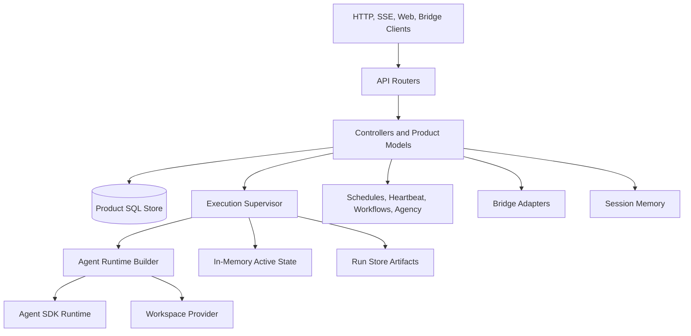

# Claw Reference Module Review

This document records the module-by-module review of `refs/ya-mono/packages/ya-claw` used to design `starweaver-claw` on top of `packages/starweaver-py`.

Reference snapshot:

- Repository: `refs/ya-mono`
- Branch: `main`
- Commit: `e4012ce72a617285ec6e58bbe820fd87f787033a`
- Package reviewed: `packages/ya-claw`

The review intentionally treats the reference package as a product-runtime baseline, not as a naming or layering target. The Starweaver implementation must expose Starweaver-native package names, configuration names, records, and observable IDs while preserving product behavior.

## Review Method

The implementation was reviewed through:

1. Package entry points and service lifecycle.
2. FastAPI routers and controller models.
3. SQLAlchemy records, Alembic migrations, and run-store artifacts.
4. Execution supervisor, runtime builder, restore/checkpoint path, and in-memory active state.
5. Workspace providers, Docker/local environment behavior, sandbox lifecycle, and shell sandbox policy.
6. Profile resolution, MCP/toolset assembly, HITL, bridge, schedules, heartbeat, workflows, memory, agency, async background tasks, notifications, and pruning.
7. Tests and specs that define expected parity.
8. Cross-review from subagents against the reference code and the Starweaver Python surface.

## Product Capability Map

## Module-by-Module Review

| Area                      | Reference files                                                                                   | Responsibilities                                                                                                                                                   | Parity-critical behavior                                                                                                                                                                                                                                                         |
| ------------------------- | ------------------------------------------------------------------------------------------------- | ------------------------------------------------------------------------------------------------------------------------------------------------------------------ | -------------------------------------------------------------------------------------------------------------------------------------------------------------------------------------------------------------------------------------------------------------------------------- |
| Service shell             | `ya_claw/app.py`, `cli.py`, `config.py`, `logging.py`, `notifications.py`                         | FastAPI app factory, bearer-token middleware, CORS, static frontend fallback, lifespan startup/shutdown, CLI commands, settings, notifications.                    | Startup order, required API token, runtime directory creation, DB engine/session factory, component wiring, recovery, dispatcher startup, graceful shutdown, `/healthz`, `/api/v1/claw/info`, notification stream.                                                               |
| API routers               | `ya_claw/api/*.py`                                                                                | Thin FastAPI routes under `/api/v1` plus `/healthz`.                                                                                                               | Endpoint paths, request/response models, SSE endpoints, interaction response endpoint, workspace/sandbox endpoints, bridge inbound endpoints, workflow agent-facing endpoints.                                                                                                   |
| Controller models         | `ya_claw/controller/models.py`                                                                    | Product API schema: run/session statuses, trigger types, input parts, dispatch modes, interactions, async tasks, memory, agency handoffs, session/run projections. | Input part compatibility, especially `type`-discriminated API parts; statuses: `queued`, `running`, `completed`, `failed`, `cancelled`; trigger types: `api`, `bridge`, `schedule`, `heartbeat`, `memory`, `agency`, `agency_handoff`, `async_task`, `workflow`.                 |
| Product persistence       | `ya_claw/orm/tables.py`, `ya_claw/alembic/**`, `ya_claw/db/engine.py`                             | Product SQL schema and migrations.                                                                                                                                 | Product DB remains orchestration truth: profiles, sessions, runs, async tasks, memory states, agency fires, schedules, schedule fires, heartbeat fires, workflow definitions/runs/node runs/events, bridge conversations/events, HITL records, runtime instances.                |
| Run artifacts             | `execution/store.py`, `checkpoint.py`, `restore.py`                                               | Filesystem run store and restore payloads.                                                                                                                         | Successful runs commit state/message payloads; failed/interrupted runs preserve recoverable checkpoints where possible; later runs restore from explicit restore run or session head success.                                                                                    |
| Active runtime state      | `runtime_state.py`                                                                                | Process-local active handles, event buffers, HITL state, steering, termination flags, background tasks, session locks, SSE live tail.                              | Live controls are process-local; SSE supports buffered replay and live wait; stream handles may be retained briefly after terminal events; background tasks and steering are tracked separately from durable DB records.                                                         |
| Execution supervisor      | `execution/coordinator.py`, `dispatcher.py`, `state_machine.py`                                   | Queue/run claiming, async task execution, recovery, run lifecycle, stream consumption, event adaptation, cleanup.                                                  | Queued recovery, orphaned running run cancellation on startup, atomic-ish claim to `running`, active handle registration, foreground stream dispatch, interrupt/cancel, terminal commit, session head pointer updates, memory/agency/async task hooks.                           |
| Runtime assembly          | `execution/runtime.py`, `context.py`, `profile.py`, `mcp.py`                                      | Profile resolution and SDK runtime construction.                                                                                                                   | Profile-driven model/settings/config, toolsets, subagents, MCP filtering, system prompt composition, memory/workspace/heartbeat/agency context injection, shell review policy, approval lists, stream resume config.                                                             |
| Workspace model           | `workspace/models.py`, `workspace/runtime_models.py`                                              | Workspace binding specs, mount bindings, sandbox state, runtime status models.                                                                                     | Multiple mounts, mount IDs, virtual paths, default mount, cwd validation, read-only enforcement, metadata snapshots, session/run sandbox scope.                                                                                                                                  |
| Local workspace provider  | `workspace/provider.py`                                                                           | Local filesystem/shell environment with virtual mounts and shell policy.                                                                                           | Bounded file and shell access, read-only virtual path enforcement, temp directory support, environment overrides, shell sandbox policy mapping.                                                                                                                                  |
| Docker workspace provider | `workspace/provider.py`, `execution/sandbox_ttl.py`                                               | Reusable Docker workspace container.                                                                                                                               | Service-to-Docker host path mapping, deterministic container reference, lazy prepare, prepare/stop/status APIs, extra mounts, UID/GID, exec user, env, cache file, retention policy, idle TTL cleanup.                                                                           |
| Shell sandbox             | `workspace/shell_sandbox.py`, `config.py`                                                         | Shell review and sandbox defaults.                                                                                                                                 | Backend/network/raw-host policy, unattended source policy, profile override, risk threshold, shell review action.                                                                                                                                                                |
| Profiles                  | `profiles.yaml`, `execution/profile.py`, `controller/profile.py`, `api/profiles.py`               | Profile CRUD and seed.                                                                                                                                             | Model, model settings/config presets and overrides, system prompt, builtin toolsets, subagents, builtin subagents, unified subagents, approval tool/MCP lists, enabled/disabled MCPs, MCP servers, workspace backend hints.                                                      |
| Built-in toolsets         | `toolsets/*.py`, `execution/runtime.py`                                                           | Product tools exposed to agents.                                                                                                                                   | Builtins: content, filesystem, shell, web, document, background, session, agency, schedule, workflow. `core` alias expands to content/filesystem/shell/background/session/schedule/workflow/agency. Tool names and schemas must remain compatible unless deliberately versioned. |
| HITL                      | `hitl.py`, `controller/hitl.py`, bridge HITL records                                              | Approval/deferred interaction persistence and response flow.                                                                                                       | Pending batch creation, active interactions, interaction responses, deferred inputs, bridge HITL messages, remaining interaction count, tool call ID mapping.                                                                                                                    |
| Streaming and AGUI        | `execution/coordinator.py`, tests `test_agui_adapter.py`, stream APIs                             | Agent stream to client event projection.                                                                                                                           | Canonical event buffering, AGUI projection, terminal/error events, `Last-Event-ID`-style cursor behavior, run and session event streams.                                                                                                                                         |
| Async/background tasks    | `controller/async_task.py`, `toolsets/async_subagent.py`, `toolsets/background.py`                | Product-managed child sessions/runs.                                                                                                                               | Spawn/list/get/steer/cancel background tasks, durable task records, task session/run linkage, wake policies, parent context injection, terminal hook updates.                                                                                                                    |
| Session tools             | `toolsets/session.py`                                                                             | Agent-visible access to session turns and run traces.                                                                                                              | Tool access must respect product IDs and stable response shapes.                                                                                                                                                                                                                 |
| Schedules                 | `controller/schedule.py`, `execution/schedule.py`, `toolsets/schedule.py`                         | Cron/once timers and agent tools.                                                                                                                                  | Trigger kinds `cron`/`once`, execution modes `continue_session`, `fork_session`, `isolate_session`, `workflow`, active policies `steer`/`queue`, fire records, manual trigger, pause/resume/delete.                                                                              |
| Heartbeat                 | `controller/heartbeat.py`, `execution/heartbeat.py`, `workspace/heartbeat.py`                     | Runtime-owned periodic operational run.                                                                                                                            | Guidance loading from `HEARTBEAT.md`, active policy `skip`/`queue`, isolated run creation, durable fire records.                                                                                                                                                                 |
| Workflows                 | `controller/workflow.py`, `execution/workflow.py`, `toolsets/workflow.py`, `spec/13-workflows.md` | Product orchestration graph.                                                                                                                                       | Definition CRUD/archive, workflow runs, node runs, events, schedule trigger mode, cancel, steer node, agent-facing workflow APIs and tools.                                                                                                                                      |
| Bridge/Lark               | `bridge/**`, `controller/bridge.py`, tests `test_bridge_*`, `test_lark_*`                         | External event ingestion and conversation mapping.                                                                                                                 | Inbound message/action normalization, dedupe, external conversation to session mapping, Lark event types, previous-message snapshots, HITL cards/recovery cards, reply identity.                                                                                                 |
| Memory                    | `memory/**`, `controller/memory.py`, `spec/09-session-memory.md`                                  | Workspace-native session memory.                                                                                                                                   | Memory files, extract/summary runs, memory session state, injection into prompt, manual endpoints, lifecycle hooks after committed runs.                                                                                                                                         |
| Agency                    | `agency/**`, `controller/agency.py`, `toolsets/agency.py`, `spec/11-session-agency.md`            | Autonomous product dispatcher.                                                                                                                                     | Fire creation/dedupe, source-session observation, memory completion hooks, timer dispatch, source-session handoff, agency action/memory context, agency-specific shell risk policy.                                                                                              |
| Session pruning           | `controller/session_prune.py`, `execution/session_prune.py`                                       | Safe retention management.                                                                                                                                         | Disk-only safe pruning, latest-run preservation, product DB consistency.                                                                                                                                                                                                         |
| Tests and specs           | `tests/*.py`, `spec/*.md`                                                                         | Parity acceptance evidence.                                                                                                                                        | Migration should port tests as behavioral gates, grouped by API/session/execution/workspace/profile/HITL/bridge/memory/timers/workflows/agency.                                                                                                                                  |

## Non-Negotiable Behavioral Contracts

1. `starweaver-claw` must keep a product orchestration store separate from Starweaver runtime evidence unless a future storage design explicitly merges them without losing product queryability.
2. Product session head pointers (`head_run_id`, `head_success_run_id`, `active_run_id`) remain product-owned continuation decisions.
3. Active run handles, live SSE tailing, and in-process HITL continuation are process-local. Durable recovery must not pretend to reattach arbitrary live Python objects.
4. API input compatibility should accept the reference `type` discriminator and normalize to Starweaver canonical `kind` input parts internally.
5. Provider-routing affinity must not be encoded as generic durable metadata. Provider-private routing belongs in typed Starweaver provider settings.
6. Agent-visible product tools must use durable, stable toolset IDs and stable tool names/schemas.
7. Canonical Starweaver stream records must be persisted before or alongside any client projection such as AGUI/display/SSE frames.
8. Docker workspace semantics are product-critical and require either a product-owned reusable Docker provider or a Starweaver reusable provider addition.

## High-Value Parity Test Groups

| Group                    | Representative reference tests                                                                                                                                                                                                  |
| ------------------------ | ------------------------------------------------------------------------------------------------------------------------------------------------------------------------------------------------------------------------------- |
| API/session/run/stream   | `test_session_api.py`, `test_run.py` equivalent through `test_execution_coordinator.py`, `test_stream_api.py`, `test_e2e_chat.py`                                                                                               |
| Runtime assembly         | `test_runtime_builder.py`, `test_profile_resolver.py`, `test_profile_api.py`, `test_config_env.py`                                                                                                                              |
| Workspace/sandbox        | `test_workspace_provider.py`, `test_workspace_mount_sets.py`, `test_workspace_runtime_api.py`, `test_workspace_runtime_reconcile.py`, `test_workspace_shell_sandbox.py`, `test_docker_workspace_integration.py`                 |
| HITL/stream projection   | `test_hitl_controller.py`, `test_agui_adapter.py`, `test_runtime_state.py`, `test_message_contract.py`                                                                                                                          |
| Extended product systems | `test_async_subagents.py`, `test_background.py`, `test_timers.py`, `test_workflows.py`, `test_workflow_api.py`, `test_workflow_toolset.py`, `test_session_toolset.py`, `test_memory.py`, `test_agency.py`, `test_agency_api.py` |
| Bridge/Lark              | `test_bridge_api.py`, `test_bridge_controller.py`, `test_lark_normalizer.py`, `test_lark_hitl.py`, `test_lark_bridge_snapshot.py`                                                                                               |
| Operations               | `test_cli.py`, `test_runtime_instance.py`, `test_recovery.py`, `test_session_prune.py`, `test_notifications.py`                                                                                                                 |

## Review Verdict

The reference package is a product runtime with substantial orchestration logic around an agent SDK. A feasible Starweaver implementation should not reduce it to a thin SDK wrapper. The correct migration boundary is:

- `starweaver-claw` owns HTTP API, product DB, run queue, live SSE state, workspace lifecycle, dispatchers, bridge, workflows, memory, agency, notifications, and operations.
- `starweaver-python` owns the agent loop, model/tool protocol, runtime state evidence, durable session/replay/stream records, Python tool injection, Starweaver environment abstraction, HITL primitives, and typed stream records.
