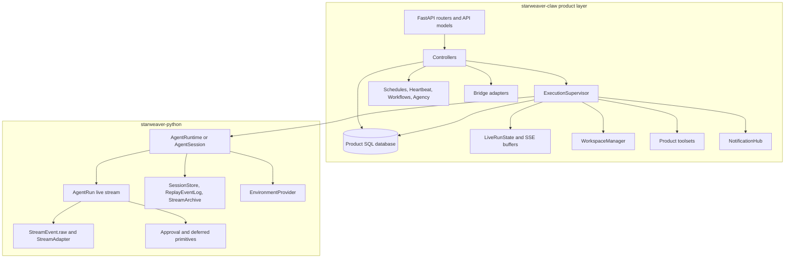
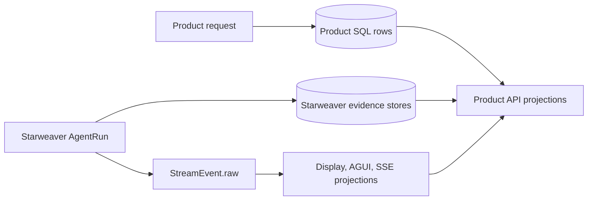
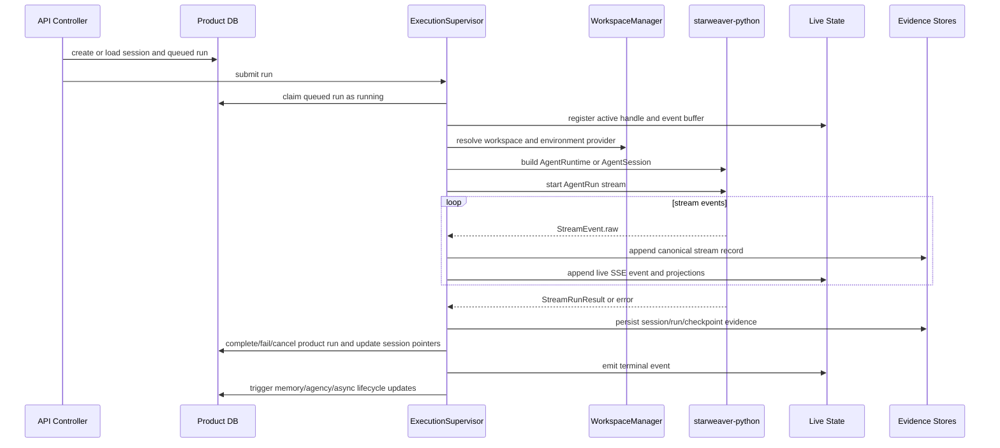

# Starweaver Claw Python Implementation Plan

This document proposes a feasible implementation of `starweaver-claw` on top of `packages/starweaver-py`, aligned with the behavior reviewed in `01-reference-module-review.md`.

The design goal is full product behavior parity while respecting Starweaver-native boundaries:

- Starweaver runtime crates and `starweaver-python` own agent execution, tools, model protocol, streaming records, HITL primitives, session evidence, environment abstraction, and replayable state.
- `starweaver-claw` owns the single-node product runtime: HTTP API, product storage, run queue, live SSE fanout, workspace lifecycle, schedules, workflows, bridge adapters, memory, agency, notifications, and operations.
- Starweaver-native public names, metadata keys, environment variables, docs, and observable IDs must be used for new implementation artifacts.
- Reference API compatibility can be preserved through explicit compatibility aliases and adapters where needed.

## Feasibility Verdict

The implementation is feasible with current `starweaver-python` if `starweaver-claw` remains a product runtime and does not try to outsource product orchestration to the SDK.

Current `starweaver-python` provides enough substrate for:

- Agent construction: `create_agent`, `create_agent_runtime`.
- Live run control: `AgentRun.recv`, `join`, `status`, `steer`, `send_message`, `interrupt`, `recoverable_state`.
- Stateful sessions: `AgentSession`, `SessionArchive`, session metadata, HITL resume helpers.
- Durable evidence: `SessionStore`, `SqliteSessionStore`, `SqliteReplayEventLog`, `SqliteStreamArchive`, `SessionResumeSnapshot` as an evidence wrapper, `RunRecord`, `StreamRecord`, approval/deferred records.
- Stream projections: canonical `StreamEvent.raw`, `StreamAdapter` for display/AGUI/SSE projections over collected or replayed records.
- Tools/toolsets: Python tools, `Toolset`, `FunctionToolset`, `PythonDynamicToolset`, `McpToolset`, `ToolProxyToolset`, `ToolSearchToolset`, durability validation.
- Environments: `EnvironmentProvider`, `LocalEnvironment`, `DockerEnvironmentProvider`, `EnvdEnvironment`, `VirtualEnvironment`, `WorkspaceBinding`, `VirtualMount`.
- Runtime config: `RuntimeConfig`, `SecurityConfig`, `ShellReviewConfig`, `ToolConfig`, model settings, request params, media uploader, skill registry.

Required Rust/Python SDK additions are listed separately in `../alignment/08-starweaver-claw-sdk-additions.md`. That document now uses split ownership: reusable execution, session, stream, environment, storage, and tool-bundle primitives should move into Rust/Starweaver when they are product-neutral, while `starweaver-claw` keeps product orchestration, reference API compatibility, business dispatchers, external adapters, and deployment policy. These additions improve long-term generality and exactness but do not block the first aligned product implementation.

## Target Architecture



## Layering Ownership Decision

`starweaver-claw` should be thin over Starweaver execution primitives, but not thin over product behavior. The best split is:

- Reusable execution contracts move down into Rust/Starweaver when they are generic, deterministic, and useful to CLI, SDK apps, service hosts, or future platform adapters.
- Python exposes those Rust contracts with ergonomic bindings, typed helpers, and product integration hooks.
- Claw owns reference-compatible product semantics even when the underlying primitive is shared.

| Capability area          | Preferred Starweaver/Rust owner                                                                                               | `starweaver-claw` owner                                                                                                           |
| ------------------------ | ----------------------------------------------------------------------------------------------------------------------------- | --------------------------------------------------------------------------------------------------------------------------------- |
| Live run control         | Runtime/session/stream records, terminal semantics, typed receipts, durable resume links, Python handle facade.               | HTTP control routes, active-run lookup, run queue merge/steer policy, product receipt shape, public status mapping.               |
| HITL                     | Approval/deferred runtime records, by-ID resume helpers, stable errors, idempotent resume primitives.                         | Interaction IDs, HITL batches, bridge cards, response API, deferred input dedupe, external action correlation.                    |
| Run/tool context         | Generic JSON-compatible attachments, provider-boundary redaction, tool-context access.                                        | Product metadata schema and values for profile, trigger, schedule, workflow, async task, workspace, and bridge context.           |
| Stream/replay/projection | Display messages, replay records, stream archive, replay cursors, AGUI-compatible projection helpers where generic.           | Live SSE endpoints, `Last-Event-ID` compatibility, reference event envelope, notification fanout, terminal retention policy.      |
| Environment/sandbox      | Provider descriptors, mount descriptors, lifecycle traits, environment snapshots, envd-backed reusable implementations.       | Workspace API, mount validation policy, Docker image/deployment policy, public sandbox status mapping, TTL cleanup scheduling.    |
| First-party tools        | Filesystem, shell, search, scrape, download, media, task, skill, MCP, proxy, and product-neutral session/evidence tools.      | Schedule, workflow, agency, bridge, product async task, and compatibility wrappers around built-ins.                              |
| Storage                  | `SessionStore`, `ReplayEventLog`, `StreamArchive`, SQLite/PostgreSQL evidence adapters, migration status for evidence stores. | Product SQL schema, migrations, query indexes, DB compatibility decisions, links from product rows to evidence IDs/cursors.       |
| Hooks                    | Stable runtime hook points with explicit mutability, retry, cancellation, and durability semantics.                           | Memory injection, agency observation, schedule/workflow side effects, bridge state updates, terminal product commit hooks.        |
| Child runs/tasks         | Parent-child session/run linkage, child stream linkage, generic result evidence references.                                   | Durable async task records, wake policies, task APIs, child-session lifecycle rules, unique task-name constraints.                |
| Host helpers             | Narrow replay buffers, cursor helpers, shutdown helpers, and protocol-neutral host primitives after validation.               | FastAPI app, auth, execution supervisor, run claiming, runtime instance heartbeat rows, startup recovery, notifications, pruning. |

The practical rule is: Starweaver owns reusable primitives and evidence; Claw owns public product behavior and compatibility. If a Claw implementation detail becomes useful to multiple products without carrying Claw-specific enums, routes, or deployment assumptions, promote that narrow primitive back into the relevant Starweaver crate.

## Package Shape

Proposed package under the workspace:

```text
packages/starweaver-claw/
  pyproject.toml
  README.md
  profiles.yaml
  .env.example
  src/starweaver_claw/
    __init__.py
    __main__.py
    app.py
    cli.py
    config.py
    api/
    controller/
    db/
    orm/
    execution/
    workspace/
    toolsets/
    bridge/
    memory/
    agency/
    notifications.py
    runtime_state.py
    json_types.py
  tests/
```

Public package, env vars, CLI, docs, and observable IDs should use `starweaver-claw` and `STARWEAVER_CLAW_*`. A migration bridge may accept `YA_CLAW_*` aliases for deployment compatibility, but aliases must be documented as compatibility inputs, not the canonical surface.

## Storage Design

### Two-store model

Use two stores deliberately:

1. Product SQL store: queryable orchestration truth.
2. Starweaver runtime evidence stores: canonical session/run/stream/checkpoint evidence.



### Product SQL records

Keep product-owned records equivalent to the reference schema, with Starweaver-native table names where possible:

- Profiles.
- Sessions and runs.
- Runtime instances.
- Async background tasks.
- Memory states.
- Agency fires.
- Schedules and schedule fires.
- Heartbeat fires.
- Workflow definitions, workflow runs, workflow node runs, workflow events.
- Bridge conversations and bridge events.
- HITL batches, interactions, deferred inputs, bridge HITL messages.

Product records should include explicit linkage fields for Starweaver evidence:

- `starweaver_session_id` or `durable_session_id`.
- `starweaver_run_id` or `durable_run_id`.
- `stream_archive_id` or cursor range.
- `latest_checkpoint_ref` when available.

Do not replace product run status with Starweaver run status. Product status is the public orchestration state; Starweaver records are execution evidence.

### Runtime evidence stores

For the first implementation:

- Use `SqliteSessionStore` for native session/run evidence.
- Use `SqliteReplayEventLog` for replay events where useful.
- Use `SqliteStreamArchive` for raw stream event retention.
- Keep product SQL database as SQLite or PostgreSQL, matching deployment requirements.

If a single PostgreSQL deployment database is required later, add a Starweaver storage backend proposal rather than blocking this design.

## API Compatibility Strategy

`starweaver-claw` should preserve the reference product API unless an explicit versioned API replacement is chosen.

Canonical new API prefix:

- `/api/v1/...` remains acceptable for product compatibility.
- `/healthz` remains.
- `GET /api/v1/claw/info` returns Starweaver Claw build metadata and feature flags.

Compatibility decisions:

- Accept reference `InputPart` payloads with `type` discriminator.
- Normalize internal durable input parts to Starweaver canonical `kind` via `starweaver.InputPart` or equivalent raw JSON.
- Keep public statuses compatible: `queued`, `running`, `completed`, `failed`, `cancelled`.
- Keep trigger types compatible: `api`, `bridge`, `schedule`, `heartbeat`, `memory`, `agency`, `agency_handoff`, `async_task`, `workflow`.
- Keep run/session event endpoints and cursor semantics product-owned.

## Exact Product Parity Requirements

These details are required for compatibility with the reviewed reference behavior. They should be snapshotted in tests and treated as product API contracts unless a versioned Starweaver Claw API intentionally changes them.

### Route inventory / route inventory coverage

The implementation plan must cover all reference routes, not only the top-level resource groups:

- `GET /healthz`.
- `GET /api/v1/claw/info`.
- `GET /api/v1/claw/notifications`.
- Profile CRUD and seed routes.
- Session routes: create, create stream, list, get, turns, submit, create run, create run stream, steer, interrupt, cancel, fork, events.
- Session memory routes: `memory:extract`, `memory:summarize`.
- Session async task routes: list, spawn, get, steer, cancel.
- Run routes: create, create stream, get, trace, steer, interaction respond, interrupt, cancel, events.
- Schedule routes: list, create, get, update, delete, pause, resume, trigger, fires.
- Heartbeat routes: config, status, fires, trigger.
- Agency routes: config, status, fires, bootstrap, source-session submit, clear.
- Bridge routes: inbound messages, inbound actions, conversations, events.
- Workspace routes: runtime, resolve, session workspace, session sandbox, sandbox prepare, sandbox stop.
- Workflow routes: definition CRUD/archive/trigger, workflow run list/get/events/cancel/node steer, agent-facing create/trigger.

### Public schema and enum snapshots

Snapshot these reference-compatible public values:

- `RunStatus`: `queued`, `running`, `completed`, `failed`, `cancelled`.
- `SessionStatusReason`: `idle`, `run_queued`, `run_running`, `hitl_pending`, `run_completed`, `run_failed`, `run_cancelled`.
- `TriggerType`: `api`, `bridge`, `schedule`, `heartbeat`, `memory`, `agency`, `agency_handoff`, `async_task`, `workflow`.
- `SessionType`: `conversation`, `memory`, `agency`, `async_task`.
- `TerminationReason`: `completed`, `error`, `cancel`, `interrupt`.
- `SessionSubmitResponse.delivery`: `steered`, `merged`, `submitted`, `queued`.
- Async task delivery values: `submitted`, `existing_active`, `resumed`, `recorded`, `steered`, `cancelled`, `idle`.
- `AgencyHandoffKind`: `context`, `exchange`, `reminder`, `task`, `risk`, `async_result`, `decision`, `conflict`.
- `AgencyFireKind`: `message_observed`, `run_output_observed`, `memory_session_completed`, `heartbeat`.
- `AgencyFireStatus`: `pending`, `submitted`, `steered`, `merged`, `consumed`, `failed`.
- Schedule status: `active`, `paused`, `completed`, `deleted`; fire status: `pending`, `submitted`, `steered`, `skipped`, `failed`.
- Workflow definition status: `draft`, `active`, `archived`; scope: `global`, `session`; run status: `queued`, `running`, `waiting`, `completed`, `failed`, `cancelled`; node status: `pending`, `ready`, `queued`, `running`, `waiting`, `completed`, `failed`, `cancelled`, `skipped`; node modes: `isolate`, `continue`, `fork`, `steer`; trigger kinds: `web`, `api`, `agent`, `schedule`, `bridge`, `system`.
- Bridge adapter/status values: adapter `lark`; dispatch mode `embedded`/`manual`; event status `received`, `queued`, `submitted`, `steered`, `deferred`, `duplicate`, `failed`.
- Sandbox public status values: `created`, `mounted`, `preparing`, `ready`, `failed`, `stopped`; ready state: `not_started`, `starting`, `ready`, `failed`.
- `InputPart` must accept `text`, `url`, `file`, `binary`, `mode`, and `command` variants with the reference `type` discriminator, then normalize to Starweaver canonical `kind` records internally.

### Session submit delivery state machine

`POST /sessions/{session_id}/submit` must preserve the reference delivery semantics:

- If the active run is `queued`, merge new input into that queued run and return `delivery=merged`.
- If the active run is `running`, steer the active run and return `delivery=steered`.
- If no active run exists, create and submit a new run or queue it according to dispatch mode, returning `submitted` or `queued`.

Bridge, schedule, heartbeat, agency, and async task dispatch must use the same product-level state machine where they target an existing session.

### Workspace and sandbox validation

Workspace binding compatibility requires:

- Maximum declared mounts: `8` by default.
- Duplicate mount IDs rejected.
- Duplicate virtual paths rejected.
- `default_mount_id` required when multiple mounts exist.
- `cwd` must be inside one declared virtual mount.
- Mount mode values are exactly `rw` and `ro` at the product API boundary.
- Each mount may include a `docker_host_path` for service-container to Docker-daemon path mapping.

Docker sandbox parity requires:

- Deferred shell context instructions visible to the agent, including shell type `docker-exec`, container reference, container workdir, optional exec user, ready status, and default timeout.
- Lazy prepare on first shell command.
- Deterministic container reference and cache/discovery/reuse by container cache path.
- Metadata updates for `last_used_at`, `last_started_at`, `container_id`, and `status`.
- Exec user resolution from UID/GID or `auto`.
- Explicit mapping between service-visible host paths, Docker-daemon-visible host paths, and container paths.

### Runtime assembly compatibility details

- The reference injected provider-facing `provider_session_id` and `provider_thread_id` through its context. Starweaver Claw must not reintroduce these as generic metadata. If an equivalent provider behavior is still required, it must be implemented through typed Starweaver provider settings or a clearly scoped provider compatibility adapter.
- Non-async-subagent runs must include a `skills` toolset equivalent, with stable toolset ID `skills` if preserving product-visible schema, and shared skill directory behavior.
- MCP servers should preserve the reference proxy shape where required: namespace prefixing, namespace descriptions, optional namespaces, and tool search strategy.
- Unattended shell review source kinds are exactly `schedule`, `workflow`, `heartbeat`, `agency`, and `agency_handoff`; `async_task` is a trigger type but is not automatically in that unattended set.

### HITL and bridge compatibility details

HITL parity requires product records and API behavior for:

- Interaction IDs shaped as `hitl_{run_id}_{index}` when preserving reference compatibility.
- Interaction kinds inferred as `shell_review`, `mcp_approval`, or `tool_approval`.
- Batch records with serialized deferred request payloads.
- Response fields: `approved`, `reason`, `user_input`, and `client_token`.
- Active interactions mirrored into run metadata where reference clients expect them.
- Bridge deferred input dedupe by `(adapter, tenant_key, external_event_id)` and `(adapter, tenant_key, external_message_id)`.
- Deferred inputs preserving sequence number and source metadata.

Bridge parity requires:

- Separate inbound message and inbound action schemas.
- Action flows for `hitl_respond` and `session_recovery`.
- Duplicate detection before dispatch.
- Active HITL runs enqueue deferred input instead of blindly steering or starting a run.
- Lark recovery token compatibility in the shape `recovery:{session_id}:{run_id}` if Lark card compatibility is preserved.

### Schedule, workflow, memory, agency, and async task details

- Schedule public create/update APIs expose facade booleans such as `continue_current_session`, `start_from_current_session`, and `steer_when_running`, which normalize internally to execution mode and active policy.
- Workflow trigger requests support `inherit_shell_env` and `shell_env`. If Starweaver Claw renames agent-facing headers, provide compatibility aliases for `X-YA-Claw-Session-Id`, `X-YA-Claw-Run-Id`, and `X-YA-Claw-Profile-Name` or document a versioned API break.
- Memory file layout must preserve `memory/MEMORY.md`, `memory/CHANGELOG.md`, dated `memory/YYYYMMDD-event.md` files, and agency memory/action files under `agency/` when workspace-compatible memory is enabled. Prompt injection must include the reference-style untrusted-data safety instruction, and public memory metadata should expose summaries rather than raw internal metadata.
- Agency parity must include exact handoff kinds, fire kinds, fire statuses, API routes, and prompt-visible behavior around bounded nudges, provenance, action logs, async result delivery, stale waits, and risk review.
- Async task parity must include task statuses, wake policies `steer_or_run` and `record_only`, spawn request fields, task detail fields (`child_session`, `latest_run`, `output_text`, `trace_ref`, `delivery`, `instruction`), and unique `(parent_session_id, name)` behavior.

### Runtime state and cursor semantics

Live state must preserve the reference process-local behavior:

- Active run handle with replay buffer, event list, terminal flags, steering inputs, and termination request.
- HITL run state with unresolved interactions and condition variables.
- `Last-Event-ID` cursor resolution for event streams.
- Closed stream-mode runs retained until terminal event consumption or cleanup delay; default cleanup delay should be snapshotted if kept at 30 seconds.

### Database compatibility decision

If strict database migration compatibility is required, preserve reference table names and constraints or provide views/migrations for them. If Starweaver-native table names are used, document that database-level compatibility is intentionally versioned while API-level compatibility remains preserved.

## Execution Lifecycle

### Startup

Startup order should match the reviewed behavior with Starweaver-native components:

01. Load settings and runtime environment.
02. Require API token during app creation and middleware registration for strict reference parity. Any local-development auth bypass must be documented as an intentional Starweaver Claw behavior change and disabled in parity tests.
03. Ensure runtime directories.
04. Create product DB engine/session factory and run migrations.
05. Create Starweaver evidence stores.
06. Create `LiveRuntimeState` and `NotificationHub`.
07. Create `WorkspaceManager` and environment factory.
08. Create profile resolver and optionally seed profiles.
09. Create runtime builder.
10. Register runtime instance heartbeat row.
11. Recover queued runs.
12. Mark orphaned running runs as interrupted/cancelled according to product state rules.
13. Recover stale async task records.
14. Start schedule, workflow, heartbeat, agency, session pruning, sandbox TTL, optional OAuth refresh, and bridge supervisors. OAuth refresh is product-owned or provider-helper dependent unless a stable Starweaver Python public helper is available.

### Run execution



### Restore and continuation

Product restore decision order:

1. Explicit `restore_from_run_id`.
2. Session `head_success_run_id`.
3. Optional failed/interrupted run only when explicitly requested.
4. Empty session state when `reset_state=true`.

Starweaver reattachment:

- Use `SessionArchive` for full or curated session restore when an archive is available.
- Use `SessionResumeSnapshot` as evidence for selecting and composing restore inputs; it is not itself the direct `state` argument to runtime construction.
- Pass JSON-compatible state from `archive.state`, `snapshot.state`, `AgentSession.export_state()`, `AgentSession.export_full_state()`, or equivalent stored payloads into Starweaver runtime/session construction.
- Use explicit ID-based helpers such as `AgentRuntime.resume_snapshot(...)` and `AgentRuntime.resume_after_hitl_by_id(...)` for durable by-ID resume flows where applicable.
- Reattach current process-local toolsets, environment providers, media uploader, skills, model, and runtime config at run start.
- Never serialize Python callables, live environment handles, or live Docker objects into durable session archives.

### Stream and live control

Product layer owns live transport:

- `AgentRun` is the live stream owner.
- `StreamEvent.raw` is persisted as canonical evidence.
- `StreamAdapter` may produce display/AGUI/SSE projections over collected/replayed records, but it is not the live SSE owner.
- `LiveRuntimeState` owns event IDs, cursor replay, condition variables, terminal retention, active run handles, steering queues, and termination flags.

Control mapping:

| Product operation         | Starweaver Python operation                                  | Product responsibility                                              |
| ------------------------- | ------------------------------------------------------------ | ------------------------------------------------------------------- |
| Steer active run          | `AgentRun.steer` or `AgentSession.steer`                     | Validate active run/session, record steering event, expose receipt. |
| Queue steering while idle | `MessageBus.steer(..., when_idle="queue")` where appropriate | Preserve product queue semantics.                                   |
| Interrupt                 | `AgentRun.interrupt`                                         | Set product termination flag and map terminal state.                |
| Cancel                    | `AgentRun.interrupt` plus product cancellation reason        | Preserve public `cancelled` status.                                 |
| HITL respond              | `ApprovalDecision`, `DeferredResult`, `resume_after_hitl*`   | Persist interaction records and bridge HITL state.                  |
| Recover partial state     | `AgentRun.recoverable_state`                                 | Write product checkpoint and Starweaver evidence.                   |

## Runtime Builder Design

`StarweaverClawRuntimeBuilder` should convert resolved product profile and run context into one of two supported runtime paths:

1. A fresh `starweaver.create_agent_runtime(...)` per product run when run-specific configuration must be injected at construction time, using stored state and durable IDs to preserve continuity.
2. A restored `AgentSession` or `Agent.run_stream(...)` path when per-run overrides such as `instructions`, `context_metadata`, `toolsets`, `security`, and environment are needed at stream start.

Do not assume `AgentRuntime.stream(prompt)` accepts per-run overrides; current Starweaver Python exposes those override parameters on `Agent` and `AgentSession` streaming paths, while `AgentRuntime` receives most configuration at construction time.

Inputs:

- Resolved profile.
- Product session/run IDs.
- Starweaver durable session/run IDs.
- Restore state/archive/snapshot.
- Workspace binding and environment provider.
- Source kind and source metadata.
- Product metadata for trace/context, excluding provider-private routing headers.
- Toolsets and approval policy.

Outputs:

- Starweaver runtime/session/run object ready for streaming.
- The selected runtime path (`fresh_runtime`, `agent_session`, or `agent_stream`) recorded in product run metadata.
- Toolset durability validation report.
- Runtime metadata stored on the product run.

Mapping:

| Reference builder feature                      | Starweaver mapping                                                                                                                                                                                   |
| ---------------------------------------------- | ---------------------------------------------------------------------------------------------------------------------------------------------------------------------------------------------------- |
| Model string and model settings/config presets | `ProviderModel`, `ModelSettings`, `RequestParams`, `RuntimeConfig`.                                                                                                                                  |
| Stream resume config                           | `RuntimeConfig(stream_resume=..., stream_resume_max_attempts=..., stream_resume_prompt=...)`.                                                                                                        |
| Shell review config                            | `SecurityConfig(shell_review=ShellReviewConfig(...))`.                                                                                                                                               |
| Builtin tools                                  | Starweaver first-party toolsets plus product-defined Python toolsets.                                                                                                                                |
| MCP servers and filters                        | `McpToolset` instances created from merged profile MCP config.                                                                                                                                       |
| Subagents                                      | `Subagent` records with Starweaver-native delegation mode; async background tasks remain product-managed.                                                                                            |
| Context metadata                               | Construction-time runtime/session metadata, `Agent`/`AgentSession.run_stream(..., context_metadata=...)` where that path is selected, and toolset context metadata; avoid provider-private metadata. |
| System prompt injection                        | Product prompt composer creates deterministic instruction list.                                                                                                                                      |
| Environment                                    | `EnvironmentProvider` from workspace manager.                                                                                                                                                        |
| HITL approvals                                 | `approval_required_tools` and product HITL controller.                                                                                                                                               |

Provider-routing rule:

- Product run/session IDs may be included as trace/query metadata keys such as `starweaver.claw.product_session_id` and `starweaver.claw.product_run_id`.
- Only `starweaver.durable_session_id` and `starweaver.durable_run_id` are durable runtime IDs; product IDs are trace/query metadata only and must never be translated into provider headers.
- Provider-private `session_id`, `thread_id`, `x-client-request-id`, and HTTP headers must only be set through typed provider settings where Starweaver model adapters explicitly support them.

## Workspace Design

### Workspace manager

Product workspace manager owns compatibility with the reviewed workspace behavior:

- Multiple named mounts.
- Virtual path model.
- Default mount and default shell mount.
- CWD validation.
- Read-only enforcement.
- Workspace snapshot metadata.
- Session-scoped and run-scoped sandbox decisions.
- Runtime/sandbox status APIs.

### Local backend

Implement via Starweaver `LocalEnvironment` or a product-defined `PythonEnvironmentProvider` wrapper if extra compatibility is needed.

Must enforce:

- Allowed host paths.
- Read-only mount restrictions.
- Temp directory boundaries.
- Environment variable policy.
- Shell sandbox/review policy.

### Docker backend

Two feasible options:

1. Product-owned reusable Docker provider in `starweaver-claw` using `PythonEnvironmentProvider` and Starweaver tool binding.
2. Later generalized Starweaver reusable Docker provider, proposed separately.

For first full parity, option 1 is safer because the reference requires detailed product behavior:

- Deterministic container reference.
- Lazy prepare on first shell command.
- Explicit `prepare` and `stop` endpoints.
- Session/run scope.
- Host-service-to-Docker-daemon path mapping.
- Extra mounts and read-only mount modes.
- UID/GID and exec-user selection.
- Environment injection.
- Retention policy and idle TTL cleanup.
- Status snapshots for API responses.

Starweaver `DockerEnvironmentProvider` can still be used as a lower-level helper for simpler cases, but exact parity should not depend on it having all product lifecycle controls.

## Product Toolsets

Product toolsets should be implemented as stable Starweaver Python toolsets with explicit IDs.

| Toolset    | Implementation owner                                                | Notes                                                               |
| ---------- | ------------------------------------------------------------------- | ------------------------------------------------------------------- |
| content    | Starweaver first-party if available, otherwise product Python tools | Preserve reference tool behavior.                                   |
| filesystem | Starweaver environment-backed toolset                               | Must respect workspace binding and read-only mounts.                |
| shell      | Starweaver shell toolset plus product security policy               | Must preserve review/defer behavior.                                |
| web        | Product or Starweaver first-party bundle                            | Keep schemas stable.                                                |
| document   | Product or Starweaver first-party bundle                            | Keep schemas stable.                                                |
| background | Product async task tools                                            | Product-managed child sessions/runs, not native blocking subagents. |
| session    | Product session trace/turn tools                                    | Reads product DB and stream/evidence store.                         |
| schedule   | Product schedule controller tools                                   | Create/update/delete/trigger schedules.                             |
| workflow   | Product workflow controller tools                                   | Create/archive/trigger/cancel/steer workflows.                      |
| agency     | Product agency tools                                                | Source-session turns/traces and handoff submission.                 |

Only filesystem, shell, and environment-backed toolsets are assumed from the current stable `starweaver-python` surface. Content, web, document, and media parity must be implemented in `starweaver-claw` unless a Starweaver first-party bundle is explicitly added and tested.

Durability rules:

- Every product dynamic toolset must have a stable ID.
- Validate with `validate_toolsets_for_durability` during profile resolution or runtime build.
- Persist required toolset IDs in product run metadata and Starweaver session archive metadata where appropriate.

## Product-Owned Responsibilities Not to Promote Prematurely

The following items should remain in the Claw implementation plan even when they use shared Starweaver primitives underneath:

- Reference-compatible HTTP route inventory, request/response schemas, enums, API tokens, and compatibility aliases.
- Product SQL records for profiles, sessions, public runs, schedules, heartbeat, workflows, memory, agency, bridge events, HITL batches, async tasks, runtime instances, and notifications.
- `ExecutionSupervisor`, product run claiming, queued-run merge policy, active-run selection, orphan recovery, cancellation semantics, and terminal product commit ordering.
- Live SSE ownership, notification hub behavior, reference cursor behavior, terminal run retention, and stream-mode cleanup delay.
- Workspace manager compatibility rules, public workspace/sandbox APIs, reference sandbox status names, Docker image policy, Docker daemon path compatibility, UID/GID policy, and TTL scheduling.
- Schedule, heartbeat, workflow, memory, agency, bridge/Lark, and async task dispatchers.
- Product tools that call product controllers: schedule, workflow, agency, bridge, background/async-task, and reference session tools.
- `STARWEAVER_CLAW_*` settings, field-specific `YA_CLAW_*` migration aliases, deployment defaults, and operation policies.

These are product semantics, not SDK primitives. They should be implemented in `packages/starweaver-claw` first and only extracted later as narrow Starweaver primitives if another host needs the same contract.

## Extended Subsystems

### Profiles

Keep profile CRUD and seed behavior. Resolver produces a `ResolvedProfile` with:

- Model and model settings.
- Runtime config.
- System prompt fragments.
- Toolset selection.
- MCP config.
- Subagents.
- Approval policy.
- Workspace backend hint.
- Shell review policy.

### HITL

Keep product HITL tables and APIs. Map Starweaver approvals/deferred records into product interactions:

- `PendingApproval` -> product active interaction.
- `ApprovalDecision` -> product interaction response.
- `PendingDeferred` -> product deferred input.
- `DeferredResult` -> resume payload.

Bridge HITL messages remain bridge-owned.

### Async background tasks

Do not map durable async tasks directly to Starweaver native blocking subagents. Implement as product-managed child sessions/runs:

- Parent session/run creates task record.
- Task session/run executes through normal supervisor path.
- Tools list/get/steer/cancel task records.
- Terminal hook updates task status and optionally hands result back to parent.

Native Starweaver subagents remain useful for blocking delegation inside a single run.

### Schedules and heartbeat

Keep product dispatchers and records. A due fire creates or steers normal product runs.

- `continue_session`: create run on existing session or steer active run according to active policy.
- `fork_session`: create child session restored from source.
- `isolate_session`: create independent session.
- `workflow`: trigger workflow executor.

Heartbeat reads workspace guidance and creates isolated operational runs.

### Workflows

Keep workflows product-owned:

- Definitions and run state in product DB.
- Node runs create normal product runs.
- Workflow events are separate from agent stream events but link to run IDs.
- Agent-facing workflow API and tools call product controllers.

### Bridge/Lark

Keep bridge product-owned:

- Normalize inbound events.
- Dedupe by external event ID.
- Map external conversation to product session.
- Submit or steer runs.
- Persist bridge event status.
- Manage Lark HITL cards and recovery.
- Let agents reply through workspace tools such as `lark-cli` or explicit bridge tools, depending on profile.

### Memory

Keep semantic memory product-owned:

- Workspace memory files.
- Memory state row per source session.
- Extract/summary jobs as normal product runs with `trigger_type=memory`.
- Prompt injection at runtime build.
- Lifecycle hook after successful committed source runs.

### Agency

Keep agency product-owned:

- Fire records and dedupe.
- Timer dispatch.
- Source-session observation.
- Memory completion hooks.
- Agency session lifecycle.
- Handoff submission.
- Agency-specific shell review policy.

## Configuration

Canonical environment prefix:

- `STARWEAVER_CLAW_*`.

Compatibility alias prefix:

- `YA_CLAW_*` accepted during migration only.

Migration compatibility must be field-specific, not only prefix-level. Build an env alias table from the reference settings, including legacy aliases such as memory context/summary aliases, and define deterministic precedence or conflict behavior when canonical `STARWEAVER_CLAW_*` and compatibility aliases are both set.

Important settings groups:

- Service: host, port, public URL, API token, CORS, frontend dist, logging, build metadata.
- Storage: product DB URL/pool/migrations, evidence store path(s), data dir, run artifact dir.
- Workspace: backend, workspace dir, Docker image, Docker host workspace dir, UID/GID, extra mounts, exec user, retention, TTL, env passthrough.
- Runtime: default profile, stream resume, optional OAuth refresh, shutdown timeout.
- Dispatchers: schedule, workflow, heartbeat, agency, pruning.
- Bridge: dispatch mode, enabled adapters, Lark settings.
- Security: shell sandbox/review defaults and unattended thresholds.

## Implementation Phases

### Phase 0: Package skeleton and compatibility contracts

- Add `packages/starweaver-claw` Python package.
- Add settings, CLI, app factory, health/info endpoints.
- Add product models and input normalization.
- Add migration-compatible env alias support.
- Add initial docs and smoke tests.

Acceptance:

- Service starts.
- `/healthz` and `/api/v1/claw/info` work.
- Settings parse canonical and compatibility env vars.

### Phase 1: Product storage and session/run API

- Implement product SQL schema and migrations.
- Implement session/run controllers and routers.
- Implement run queue, state machine, runtime instance registration.
- Bind Starweaver evidence stores.

Acceptance:

- Create/list/get sessions and runs.
- Queue/async dispatch transitions work.
- Startup recovery handles queued and orphaned running runs.

### Phase 2: Runtime builder and streaming execution

- Implement profile resolver/seed.
- Implement runtime builder on `starweaver-python`.
- Implement live state, stream event buffers, SSE endpoints.
- Persist canonical `StreamEvent.raw` and product terminal state.
- Implement steer/interrupt/cancel.

Acceptance:

- Stream and async run APIs work.
- Run/session event replay with cursor works.
- Session head pointers and restore work.
- Starweaver evidence stores contain raw stream/session/run records.

### Phase 3: Workspace and sandbox parity

- Implement workspace binding model.
- Implement local backend.
- Implement product-owned reusable Docker backend.
- Implement workspace/sandbox API endpoints.
- Implement sandbox TTL cleanup.

Acceptance:

- Multi-mount read/write and read-only behavior matches tests.
- Docker prepare/stop/status works.
- Run-scoped and session-scoped sandbox behavior is testable.

### Phase 4: HITL, product toolsets, MCP, subagents

- Implement HITL tables/controller mapping to Starweaver approvals/deferred.
- Implement product toolsets with stable IDs.
- Implement MCP profile filtering and approval policy.
- Implement native subagent config mapping and product async background tasks.

Acceptance:

- Approval/deferred interactions can be responded to through API.
- Background tools spawn/list/get/steer/cancel child tasks.
- Toolset durability validation passes.

### Phase 5: Extended product systems

- Implement schedules and heartbeat.
- Implement workflows.
- Implement memory lifecycle.
- Implement agency lifecycle.
- Implement bridge/Lark.
- Implement notifications and pruning.

Acceptance:

- Ported reference tests pass group by group.
- Dispatchers are startup/shutdown safe.
- Bridge events dedupe and map to sessions.

### Phase 6: Operations and release integration

- Dockerfile and workspace image.
- `.env.example`, profiles, operations docs.
- Makefile/CI package gates.
- Migration docs from reference env/config.

Acceptance:

- Local and Docker service smoke tests pass.
- Python package gate passes.
- Deployment docs cover SQLite and PostgreSQL product DB options.

## Validation Matrix

| Capability                     | Validation                                                                                                                                                                       |
| ------------------------------ | -------------------------------------------------------------------------------------------------------------------------------------------------------------------------------- |
| API compatibility              | Port reference API tests; snapshot response schemas.                                                                                                                             |
| Product state machine          | Unit tests for queued/running/completed/failed/cancelled, claim, recovery, cancel.                                                                                               |
| Starweaver runtime integration | Deterministic `FunctionModel` and `TestModel` tests; stream and restore tests.                                                                                                   |
| Streaming/SSE                  | Cursor replay, terminal retention, event ordering, raw record archive, evidence ordering where raw `StreamEvent.raw` is persisted before projection and terminal product commit. |
| HITL                           | Approval, denial, deferred input, bridge HITL message lifecycle, live in-process response, durable response by session/run ID, idempotent repeated response.                     |
| Workspace                      | Local mounts, read-only enforcement, Docker service path to daemon-visible host path to container path mapping, extra mounts, Docker lifecycle, session/run scope, TTL cleanup.  |
| Toolsets                       | Stable IDs, schemas, product controller integration, approval policy, explicit product-owned content/web/document parity unless first-party bundles are added and tested.        |
| Async tasks                    | Child session/run lifecycle, steer/cancel, terminal status update.                                                                                                               |
| Timers                         | Schedule/heartbeat due dispatch, active policy, fire records.                                                                                                                    |
| Workflows                      | Definition CRUD, node dependencies, cancellation, node steering.                                                                                                                 |
| Bridge                         | Normalization, dedupe, session mapping, action handling.                                                                                                                         |
| Memory/agency                  | Extract/summary triggers, memory injection, agency fires and handoffs.                                                                                                           |
| Operations                     | CLI, migration, startup recovery, pruning, notifications, Docker smoke, env alias precedence/conflict behavior for `STARWEAVER_CLAW_*` and migration aliases.                    |

## Main Risks and Mitigations

| Risk                                                 | Mitigation                                                                                                                                                                                               |
| ---------------------------------------------------- | -------------------------------------------------------------------------------------------------------------------------------------------------------------------------------------------------------- |
| Product DB and Starweaver evidence diverge           | Treat product DB as public orchestration truth; write evidence links; reconcile on startup; test terminal commit ordering.                                                                               |
| Live control API shape changes                       | Isolate `starweaver-python` live-control calls in a small adapter; keep product API stable; pin a tested `starweaver-python` version or commit range and rerun the live-control parity suite on upgrade. |
| `StreamAdapter` mistaken as live SSE owner           | Keep `LiveRuntimeState` product-owned; use `StreamAdapter` only for projections over collected/replayed records.                                                                                         |
| Docker lifecycle not covered by current SDK          | Implement product-owned reusable Docker provider first; propose generalized Starweaver provider separately.                                                                                              |
| Toolset schema drift                                 | Snapshot tool schemas; require stable toolset IDs; add compatibility tests.                                                                                                                              |
| Provider routing leakage through generic metadata    | Centralize model/provider config mapping; forbid provider-private keys in product metadata.                                                                                                              |
| HITL recovery confusion                              | Distinguish in-process live resume from durable resume; persist product interactions independently.                                                                                                      |
| Python process-local objects accidentally serialized | Persist IDs, metadata, archives, and state only; reattach tools/environments/resources at run start.                                                                                                     |

## Final Design Decision

Implement `starweaver-claw` as a Starweaver-native product service that uses `starweaver-python` as its execution substrate. This preserves all reference product features while aligning with Starweaver boundaries. Missing generalized SDK features are useful additions, but the product can achieve parity by owning orchestration, compatibility, and workspace lifecycle in the product layer.
