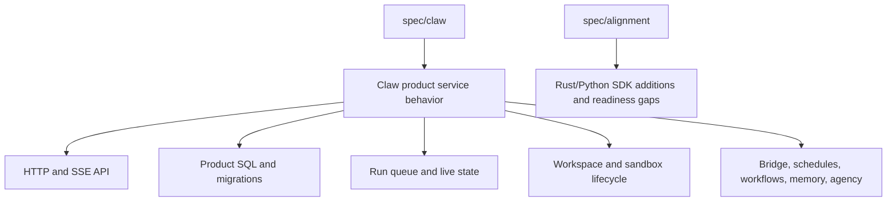

# Starweaver Claw Specs

This directory contains product specifications for `starweaver-claw`, the Starweaver-native single-node agent service designed on top of `starweaver-python`.

Product specs in this directory may describe HTTP APIs, product storage, service lifecycle, workspace behavior, bridge integrations, schedules, workflows, memory, agency, and compatibility with the reviewed Claw reference product.

The Starweaver Claw layering map and non-blocking Rust/Python SDK additions live in `../alignment/08-starweaver-claw-sdk-additions.md` instead of this directory.

## Source Snapshot

- Reference repository: `refs/ya-mono`
- Reference package: `packages/ya-claw`
- Branch: `main`
- Commit: `e4012ce72a617285ec6e58bbe820fd87f787033a`

## Documents

| File                               | Purpose                                                                       |
| ---------------------------------- | ----------------------------------------------------------------------------- |
| `01-reference-module-review.md`    | Module-by-module review of the reference product runtime.                     |
| `02-python-implementation-plan.md` | Feasible implementation plan for `starweaver-claw` using `starweaver-python`. |
| `03-parity-matrix.md`              | Capability-by-capability parity matrix and ownership split.                   |

## Boundary

Use this directory for product implementation details. Use `spec/alignment/` only when the Claw design exposes work that should be done in Starweaver Rust crates or the Python SDK surface.
