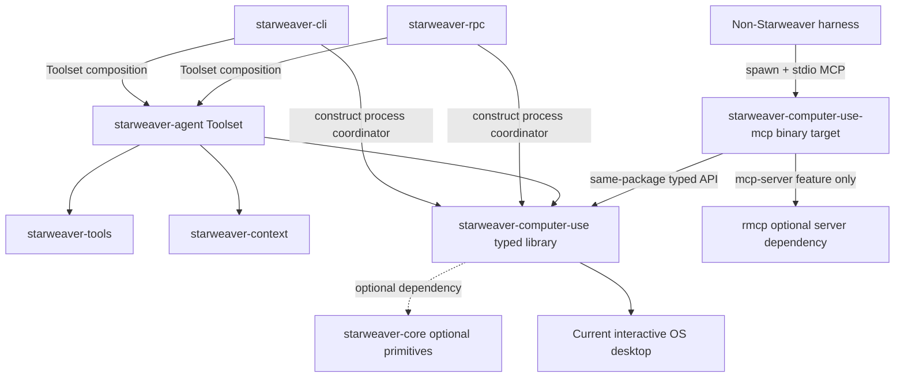
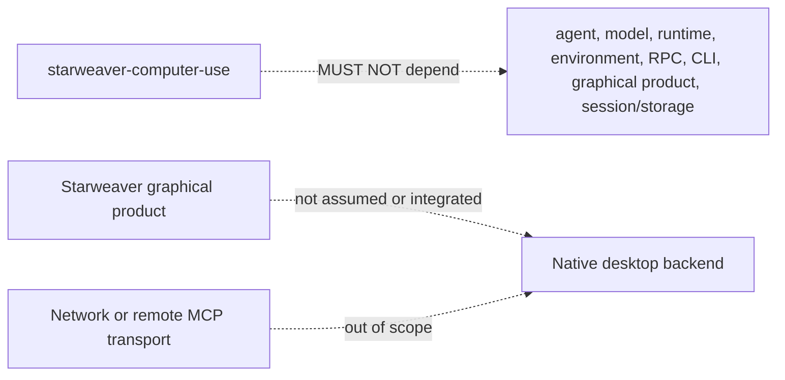
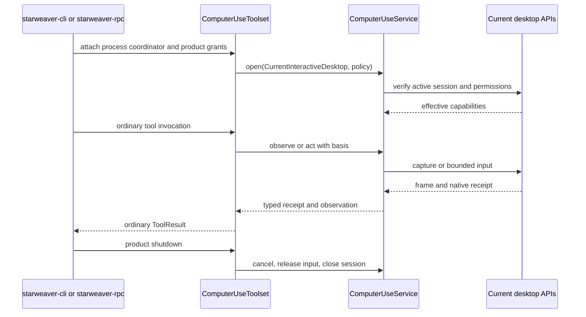
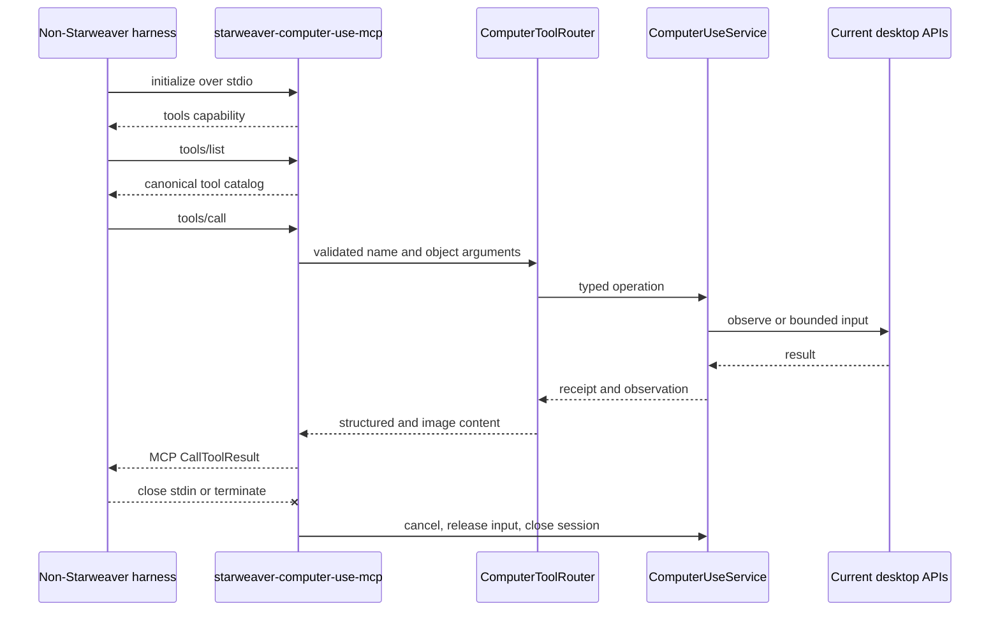

# Computer Use Product Boundaries and Ownership

Status: **Accepted normative architecture; macOS observation subset implemented**
Scope: **current active interactive desktop only**
Related specs: [`../sdk/03-first-party-tool-bundles.md`](../sdk/03-first-party-tool-bundles.md), [`../core/03-tools-output-capabilities.md`](../core/03-tools-output-capabilities.md), [`../core/04-context-state-executor.md`](../core/04-context-state-executor.md), [`../ops/00-product-boundaries.md`](../ops/00-product-boundaries.md)

## 1. Purpose

This spec defines a local Computer Use capability that lets a process observe and operate the current user's active interactive desktop through operating-system APIs.

The capability has two supported integration paths:

1. The maintained `starweaver-cli` and standalone `starweaver-rpc` products use the typed Rust library in-process through the first-party `starweaver-agent` Toolset adapter.
2. Harnesses outside the Starweaver ecosystem launch a local stdio MCP binary that exposes the same canonical tools over the Model Context Protocol.

No Starweaver graphical Desktop product is assumed by this architecture. CLI and RPC are the only Starweaver composition roots in scope.

The implementation MUST have one semantic core. The internal toolset and MCP server are adapters over the same typed service and canonical tool router; they MUST NOT develop separate action, geometry, permission, or error semantics.

## 2. Normative language

The terms **MUST**, **MUST NOT**, **SHOULD**, **SHOULD NOT**, and **MAY** are normative requirements.

A statement marked **Current evidence** describes the repository at the time it was written. A statement marked **Planned** describes required future behavior and is not an implementation claim. Current capability status is generated from `../capabilities.toml`; the implemented macOS observe-only subset is recorded in `../alignment/13-computer-use-macos-evidence.md`.

## 3. Product definition

### 3.1 Current interactive desktop

`CurrentInteractiveDesktop` means the graphical desktop session that is currently:

- owned by the operating-system user running the process;
- attached to that process's interactive login/session/seat;
- active and unlocked;
- visible to the attended user; and
- accepted by the platform backend as an ordinary input desktop rather than a secure, login, lock, elevation, or system desktop.

The process MUST operate only this desktop. The model or MCP client MUST NOT select an arbitrary PID, window handle, process, session, seat, display server socket, desktop name, remote endpoint, or user account.

A fixed host configuration MAY choose whether a multi-monitor desktop is captured as one normalized virtual surface or as an primary-display surface. That scope is host-owned and MUST NOT be widened by a tool argument.

### 3.2 Goals

The capability MUST provide:

- a typed asynchronous Rust service API;
- a canonical versioned tool protocol and router;
- screenshots of the configured current-desktop surface;
- model-visible geometry with an explicit transform to native coordinates;
- high-level bounded pointer and keyboard actions;
- an observation basis for every input action;
- a post-action observation and action receipt;
- platform capability and permission diagnostics;
- cancellation, idempotency, stale-state rejection, and held-input cleanup;
- a first-party Starweaver toolset adapter;
- a local stdio MCP server binary exposing the exact same tool catalog;
- macOS, Windows, and Linux current-session backend contracts; and
- deterministic fake backends and schema fixtures.

### 3.3 Non-goals

The following are explicitly outside this spec:

- OpenAI `computer_call`, Anthropic versioned computer tools, or any provider-native model protocol;
- changes to `starweaver-model` native-tool declarations, response parsing, replay, or runtime native-call execution;
- browser automation, Playwright, WebDriver, Chrome extensions, browser profiles, or CDP;
- replacement of `agent-browser` or any browser-focused tool;
- remote desktop, VNC, RDP, SSH forwarding, virtual machines, containers, hosted workers, or remote MCP transport;
- unattended operation;
- operation while the session is locked, switched away, logged out, disconnected, or on a secure desktop;
- login-window, lock-screen, UAC secure-desktop, authorization-dialog, or other protected-surface control;
- administrator/root elevation, UIAccess, kernel input, `/dev/uinput`, system services, or privileged helpers;
- control of a different user session or a background session;
- arbitrary target/window/process selection by a model;
- durable restoration of capture/input authority after process exit or restart;
- ownership by, integration with, or a renderer API for any Starweaver graphical Desktop product;
- semantic understanding of consequential UI effects; and
- OCR, browser DOM extraction, or application-specific automation protocols as baseline requirements.

The library MAY expose optional bounded accessibility metadata in an observation when a platform backend supports it. Semantic actions are not part of the baseline toolset and require a later spec.

## 4. Narrowing the earlier survey architecture

The preceding survey considered a broad Computer Use abstraction spanning browsers, disposable VMs, remote framebuffers, native desktops, and provider-native model protocols. That broad problem reasonably suggested an optional environment-associated provider family.

This spec intentionally narrows and supersedes that recommendation for the product defined here:

- there is no browser, VM, remote, or provider-native backend;
- the controlled resource is always the caller's current OS desktop;
- CLI and RPC must be able to use the library without an `EnvironmentProvider`;
- an external-harness MCP binary is an independent consumer of the same service; and
- native permission and process lifetime are intrinsic to the service rather than to a file/shell environment.

Therefore:

- `ComputerUseService` MUST NOT extend `EnvironmentProvider`;
- `starweaver-computer-use` MUST NOT depend on `starweaver-environment`;
- `starweaver-environment` MUST NOT become the owner of current-desktop authority; and
- the agent adapter MAY attach Computer Use alongside an environment, but the two capabilities remain independent.

The new library crate is justified now because there are two concrete adapter paths: the CLI/RPC in-process Toolset path and the non-Starweaver harness MCP path. It is not a speculative cross-backend abstraction.

## 5. Crate and product shape

### 5.1 `starweaver-computer-use`

Implemented package/crate: `crates/starweaver-computer-use`

The package has a normal library target and one optional binary target:

```toml
[features]
default = []
mcp-server = ["dep:rmcp"]

[[bin]]
name = "starweaver-computer-use-mcp"
path = "src/bin/starweaver-computer-use-mcp.rs"
required-features = ["mcp-server"]
```

The library's core modules own:

- the `ComputerUseService` typed API;
- current-interactive-desktop lifecycle and state-machine semantics;
- stable IDs, generations, coordinate transforms, observations, actions, receipts, and errors;
- host-owned `ComputerUsePolicy` and effective capabilities;
- the canonical typed tool input/output protocol;
- deterministic JSON Schema generation and catalog fixtures;
- `ComputerToolRouter`, which validates and dispatches canonical tool calls;
- the deterministic fake backend;
- cfg-gated macOS, Windows, and Linux local backends; and
- test support for backend conformance.

When `mcp-server` is enabled, the package also builds a thin MCP server adapter and the `starweaver-computer-use-mcp` binary. Core service, state-machine, router, and backend modules MUST NOT depend on `rmcp`; only feature-gated server/binary modules may import it. `starweaver-agent` MUST depend on the library with `default-features = false` and without `mcp-server`.

The crate MUST expose a useful typed library independent of any agent or MCP protocol so CLI, RPC, the sibling MCP adapter, and contract tests share one core. This does not establish a supported cross-ecosystem Rust embedding surface; non-Starweaver harnesses use stdio MCP.

It MUST NOT depend on:

- `starweaver-agent`;
- `starweaver-context`;
- `starweaver-runtime`;
- `starweaver-model`;
- `starweaver-environment`;
- `starweaver-rpc` or `starweaver-rpc-core`;
- `starweaver-cli`;
- `starweaver-session`, `starweaver-storage`, or `starweaver-stream`;
- any graphical Starweaver product; or
- an MCP client/server adapter in its default library build.

It MAY depend on `starweaver-core` for genuinely product-neutral identity, cancellation, metadata, or protocol-version primitives if doing so avoids duplicating an established contract. It SHOULD otherwise keep its service API independently testable.

### 5.2 `starweaver-agent`

`starweaver-agent` owns:

- method-limited `ComputerObserveHandle`, `ComputerPointerHandle`, and `ComputerKeyboardHandle` attachment to `AgentContext`;
- named, Filtered, deny-by-default host capabilities and per-tool grants;
- the first-party `computer_use` `Toolset`;
- mapping canonical tool definitions into Starweaver `ToolDefinition` and `Tool` values;
- mapping canonical image content into the existing tool-return media path;
- tool instructions, approval metadata, retry/timeout metadata, and lifecycle reports; and
- SDK-facing builder and preset ergonomics.

**Current evidence:** `crates/starweaver-agent/src/bundles/environment/handle.rs` demonstrates typed handle attachment and recovery through `HostCapabilities`. `crates/starweaver-tools/src/toolset.rs` provides `StaticToolset`, context-aware lifecycle hooks, and lifecycle evidence. `crates/starweaver-context/src/host_capabilities.rs` provides deny-by-default `ToolCapabilityGrant` and filtered typed dependencies.

`starweaver-agent` MUST remain a thin adapter. It MUST NOT implement native capture, input, coordinate conversion, permission probing, or duplicate canonical schemas.

### 5.3 `starweaver-computer-use-mcp` binary target

Implemented package: `crates/starweaver-computer-use`
Implemented feature: `mcp-server`
Implemented binary: `starweaver-computer-use-mcp`

The feature-gated binary/server modules own:

- a local stdio MCP server built with the workspace `rmcp` dependency;
- MCP initialization and static tool discovery;
- mapping canonical catalog schemas to MCP tool declarations;
- mapping MCP calls and cancellation to `ComputerToolRouter`;
- mapping canonical structured/image content to MCP `CallToolResult` content;
- process startup configuration, diagnostics, and exit behavior; and
- binary packaging and smoke tests.

The binary MUST call its sibling library API directly and MUST NOT route through an agent, model, runtime, RPC host, CLI product, graphical product, or `EnvironmentProvider`. CLI and RPC use their own in-process Toolset path; they MUST NOT launch this MCP binary to obtain Computer Use.

A feature-gated library module MAY hold the deterministic MCP server handler so it can be tested without spawning the binary. Product behavior remains the local MCP binary.

This single-package lib-plus-bin shape follows the existing `starweaver-envd` precedent and avoids creating a package solely for a thin transport adapter. A separate MCP package MAY be extracted only if future independent versioning, publishing, or dependency evidence demonstrates that the optional-feature boundary is insufficient.

### 5.4 No generic MCP-server framework requirement

**Current evidence:** `crates/starweaver-agent/src/mcp_rmcp.rs` is an MCP client adapter. It does not currently provide a generic server that exports arbitrary Starweaver `Toolset` values.

The first implementation SHOULD map `ComputerToolRouter` directly into an `rmcp` server handler. It MUST NOT introduce a workspace-wide generic MCP-server framework merely to deliver this binary. A reusable server adapter may be extracted later only after a second server product demonstrates a stable common contract.

## 6. Dependency direction



The arrows denote dependency or direct use, not authority delegation. CLI and RPC depend inward on the Toolset/library; the library has no reverse product dependency.

Forbidden directions include:



## 7. Process topology

### 7.1 CLI/RPC in-process mode

In maintained Starweaver mode, the CLI or RPC product process links `starweaver-computer-use` through the first-party Toolset and owns the native permission identity.



The CLI or RPC executable linking the library owns macOS TCC identity, Windows interactive-session identity, and Linux portal/D-Bus identity. A library cannot transfer another process's permission grant into the caller.

CLI owns one coordinator for its process lifetime. RPC owns one coordinator per RPC process and shares it across enabled agents/runs, with serialized operations and run-specific authorization/grants. An RPC invocation always affects the RPC host's current desktop, never the RPC client's machine. CLI/RPC configuration must explicitly enable the bundle; transport reachability or model selection never grants it.

### 7.2 External harness MCP mode

For a non-Starweaver harness, `starweaver-computer-use-mcp` is the permission-owning process. The harness owns the child process lifetime through stdio and does not link Starweaver's Rust Toolset/library ABI.



The MCP binary MUST be one process. The baseline MUST NOT install or launch a daemon, helper, privileged service, secondary native broker, or per-action subprocess.

### 7.3 Why no helper in the baseline

The scope is attended operation of the process's own current interactive session. The same process can own:

- screen-capture permission;
- accessibility/input permission where required;
- portal and PipeWire session ownership;
- action serialization;
- cancellation and input cleanup; and
- stdio MCP lifetime.

A separate helper would add IPC authentication, version skew, lifecycle, signing, and permission-identity complexity without solving a required product scenario. If a future requirement adds background launch, cross-session control, or graphical-product-managed permission identity, that requirement needs a new architecture decision and is not silently absorbed into this spec.

## 8. Authority model

### 8.1 Process-local authority

A live `ComputerSession` is process-local, non-serializable authority. It MUST contain or reference:

- the verified OS interactive-session identity;
- the effective capture/input capability set;
- process-local native handles;
- the current target/layout/frame generations and service-owned effect epoch;
- an operation-serialization fence; and
- cancellation and held-input cleanup state.

No session token, native handle, portal handle, PipeWire file descriptor, permission grant, screenshot buffer, or observation basis MAY be persisted as restorable authority.

### 8.2 Host-owned policy

`ComputerUsePolicy` is supplied when the service/session is created. Tool calls MUST NOT widen it.

Policy MUST bound at least:

- observe permission;
- pointer permission;
- keyboard/text permission;
- configured desktop surface scope;
- maximum screenshot dimensions and encoded bytes;
- allowed image formats;
- maximum text length, key count, drag path length, scroll magnitude, and operation timeout;
- post-action observation and settling behavior;
- optional accessibility capability, traversal budgets, and independently fixed prompt policy;
- user-presence requirements; and
- logging/redaction behavior.

The effective capability set is the intersection of build/platform support, current OS permission state, active-session state, and host policy.

### 8.3 No model-selected target authority

The canonical tools MUST NOT accept:

- window titles or handles;
- PIDs;
- application bundle IDs or executable paths;
- user/session/seat IDs;
- monitor device paths;
- display-server socket names;
- portal restore tokens;
- remote endpoints; or
- arbitrary native extension payloads.

A model can act only on the observation surface returned by this process.

## 9. Lifecycle

A service instance moves through these product-level phases:

1. `Created`: configuration parsed; no native authority acquired.
2. `Probing`: platform/session/permission state inspected.
3. `ReadyObserveOnly` or `ReadyControl`: effective capabilities established.
4. `Operating`: one serialized observe/action operation is active.
5. `Suspended`: lock, session switch, permission loss, portal closure, display reconfiguration, user takeover, or cancellation invalidated live state.
6. `Closing`: queued operations rejected; active operation cancelled at a safe boundary; input released.
7. `Closed`: native resources released; all previous IDs and bases invalid.

A suspended service MUST require successful re-probe and a new observation before accepting input. Unlock or session reactivation MUST NOT cause an old action to execute automatically.

Internal toolset lifecycle and MCP process lifecycle are adapters over this state machine; they MUST NOT add hidden authority states.

## 10. Supported product composition

- `starweaver-cli` and `starweaver-rpc` are the maintained Starweaver composition roots for Computer Use.
- Both products use the first-party Toolset and typed library in-process; neither launches or loops through the MCP binary.
- The library remains a lower layer and MUST NOT depend on CLI, RPC, their transports, durable host state, or product handlers.
- CLI and RPC each own explicit startup/profile policy, per-tool grants, process-lifetime coordination, shutdown, and permission diagnostics for their own executable identity.
- RPC adds no Computer-Use-specific wire method: enabled RPC-hosted agents receive ordinary tools after RPC-owned configuration and authorization. A remote RPC caller never changes the fact that effects occur on the RPC host's local active desktop.
- The MCP binary is the supported boundary for non-Starweaver harnesses and MUST be launchable by any conforming local MCP-capable harness.
- No Starweaver graphical Desktop product, renderer, sidecar, generated binding, packaging lane, or update channel is assumed or required.
- Python or another harness integration is not a baseline in-process binding; it uses stdio MCP unless a later explicit architecture decision changes the cross-ecosystem boundary.

## 11. Versioning

The library MUST define independent versions for:

- service contract/schema version;
- canonical tool catalog version; and
- backend implementation/build version.

MCP protocol negotiation remains owned by `rmcp` and MCP. The MCP server implementation MUST report its canonical tool catalog version in server metadata or diagnostic output without inventing a second MCP protocol version.

Breaking changes to tool names, required arguments, coordinate semantics, content mapping, or error codes require a catalog major-version decision. Adding optional structured fields or capabilities MAY be compatible when old clients can ignore them.

## 12. Implementation status

At the time of this spec:

- `starweaver-computer-use` does not exist;
- the `starweaver-computer-use-mcp` binary target does not exist;
- the first-party Computer Use toolset does not exist;
- Starweaver has an MCP client but no generic MCP server product for exporting toolsets;
- the current multimodal tool-return path can carry image content from an internal tool;
- typed dependency filtering and toolset lifecycle primitives are implemented; and
- native backend dependency choices still require platform spikes.

No section in this document claims implemented capability.

## 13. Decision log

| Decision                                                      | Rationale                                                                                                                                                                      |
| ------------------------------------------------------------- | ------------------------------------------------------------------------------------------------------------------------------------------------------------------------------ |
| Use normal Starweaver tools, not provider-native Computer Use | The product should work with any function-calling multimodal model and avoids provider-specific runtime work.                                                                  |
| Exclude browser/CDP                                           | `agent-browser` already owns browser automation; duplicating it would conflate browser and OS authority.                                                                       |
| Current active desktop only                                   | This is the requested attended product and avoids service/session/VM topology.                                                                                                 |
| One typed service core                                        | CLI, RPC, and external-harness adapters must not drift.                                                                                                                        |
| Add `starweaver-computer-use`                                 | The CLI/RPC in-process path, MCP harness path, and native platform ownership provide a concrete crate boundary.                                                                |
| Keep agent adapter in `starweaver-agent`                      | Shared CLI/RPC bundle ergonomics and context attachment belong there.                                                                                                          |
| Add an optional MCP binary target to the library package      | The binary remains a product/transport boundary while one package avoids over-engineering; `required-features = ["mcp-server"]` keeps normal library consumers free of `rmcp`. |
| Stdio MCP only                                                | The authority is local and attended; exposing it over a network transport is unnecessary and unsafe for this scope.                                                            |
| No helper/daemon baseline                                     | The permission-owning process is already the library host or MCP binary.                                                                                                       |
| No durable authority                                          | OS permission/session handles and stale observations cannot be safely restored.                                                                                                |
| High-level atomic actions only                                | Avoids leaked key/button state and reduces cancellation ambiguity.                                                                                                             |

## 14. Open decisions

The following require prototype evidence before implementation contracts graduate:

1. Whether the baseline capture-scope default remains the primary display or changes to the normalized visible desktop; the choice remains host-owned either way.
2. The exact production `UserPresenceGuard` implementation on each OS.
3. Whether later native features remain inside the implemented narrow same-process `objc2` FFI boundary or justify a separate wrapper package.
4. The exact field names and configuration syntax for future input-capable CLI/RPC maximum grants. RPC semantics are not open: generic `run` grants no Computer Use, dedicated default-denied observe/pointer/keyboard principal capabilities are intersected into an expiring/revocable run admission, and resume/continuation requires fresh derivation without adding a Computer-Use-specific host-protocol method.

Open decisions MUST NOT weaken the stated exclusions or dependency direction.

## 15. Acceptance gates

Before code implementation is considered architecture-ready:

- CLI and RPC in-process composition, direct typed service fixtures, and the external-harness MCP server path are represented in compile-time or fixture-level design tests;
- RPC negative admission fixtures prove generic `run`, profile selection, cross-principal runs, revoked/expired grants, and durable resume cannot acquire or preserve ungranted observe/pointer/keyboard authority;
- `cargo metadata` proves the core library has no forbidden dependency path;
- the canonical catalog has checked-in deterministic JSON Schema fixtures;
- toolset and MCP declarations are byte-equivalent after canonical JSON normalization;
- the state machine has transition and stale-authority fixtures;
- platform spikes prove capture and bounded input from one process in the current active session;
- lock/session-switch/secure-desktop behavior fails closed;
- process exit and cancellation release all held input;
- stdio stdout contains only MCP framing;
- no network listener, daemon, helper, service, or browser backend is introduced; and
- repository architecture, capability, formatting, lint, test, and release gates are identified before implementation lands.
