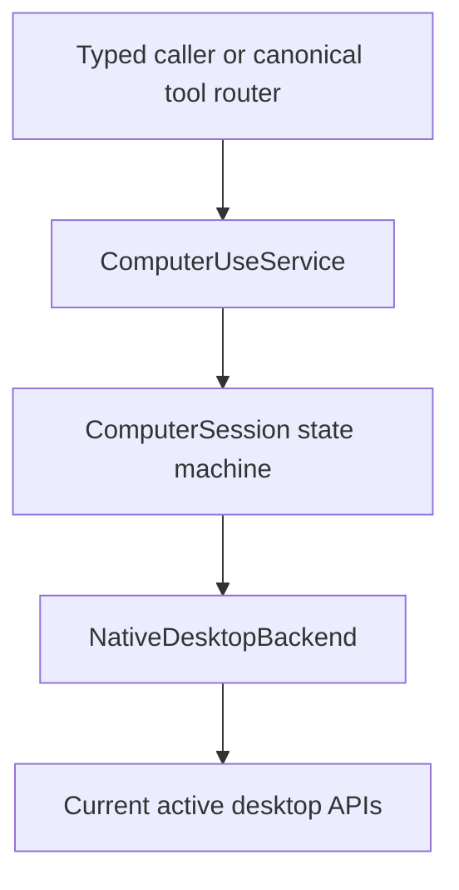
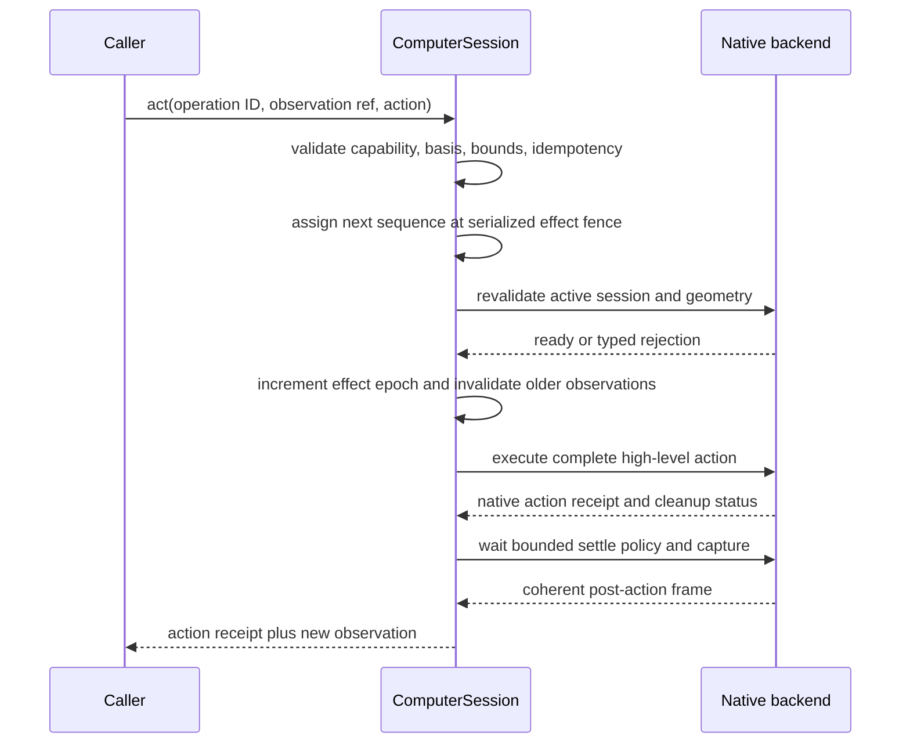
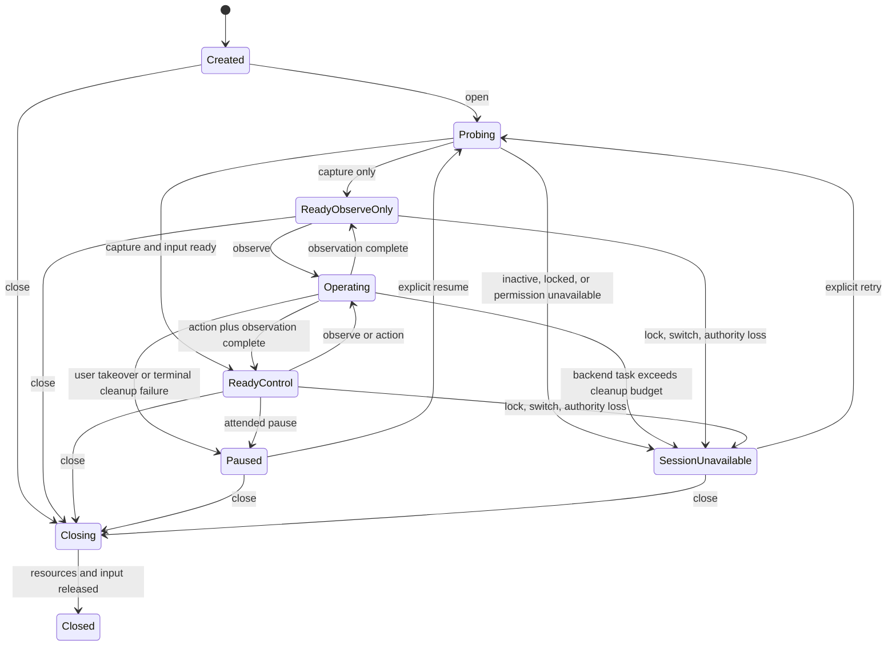

# Computer Use Service Contract and State Machine

Status: **Accepted normative architecture; core contract implemented**
Scope: **typed Rust library for the current active interactive desktop**
Depends on: [`README.md`](README.md), [`01-product-boundaries-and-ownership.md`](01-product-boundaries-and-ownership.md)
Platform mapping: [`04-native-active-desktop-backends.md`](04-native-active-desktop-backends.md)

## 1. Purpose

This spec defines the protocol-independent library contract owned by `starweaver-computer-use`. It is the semantic authority for the CLI/RPC in-process first-party Toolset path and the feature-gated MCP binary used by non-Starweaver harnesses.

The service controls only the current process's active, unlocked, local interactive desktop. It MUST NOT contain model-provider, browser, remote-desktop, environment, RPC product, CLI product, graphical-product, or durable-session concepts.

The terms **MUST**, **MUST NOT**, **SHOULD**, **SHOULD NOT**, and **MAY** are normative.

## 2. Contract layers

The library has four internal layers:



- `ComputerUseService` owns configuration, probing, session creation, and global shutdown.
- `ComputerSession` owns one process-local current-desktop authority lifetime.
- The session state machine owns serialization, basis validation, idempotency, cancellation, and result classification.
- `NativeDesktopBackend` owns private OS handles and native operations as defined in `04-native-active-desktop-backends.md`.

Adapters MUST call this contract. They MUST NOT call native backends directly.

## 3. Proposed typed API

The following Rust-like declarations define required semantics. Exact field visibility and ergonomic constructors remain implementation details.

```rust
pub type DynComputerUseService = Arc<dyn ComputerUseService>;
pub type DynComputerSession = Arc<dyn ComputerSession>;

#[async_trait]
pub trait ComputerUseService: Send + Sync {
    fn contract_version(&self) -> ComputerUseContractVersion;
    fn process_instance_id(&self) -> ProcessInstanceId;
    fn policy(&self) -> &ComputerUsePolicy;

    async fn status(
        &self,
        cancel: CancellationToken,
    ) -> Result<ComputerStatus, ComputerUseError>;

    async fn request_permissions(
        &self,
        request: PermissionRequest,
        cancel: CancellationToken,
    ) -> Result<PermissionRequestOutcome, ComputerUseError>;

    async fn open_current_desktop(
        &self,
        cancel: CancellationToken,
    ) -> Result<DynComputerSession, ComputerUseError>;

    async fn shutdown(
        &self,
        reason: CloseReason,
    ) -> Result<ShutdownReceipt, ComputerUseError>;
}

#[async_trait]
pub trait ComputerSession: Send + Sync {
    fn id(&self) -> ComputerSessionId;
    fn process_instance_id(&self) -> ProcessInstanceId;
    fn capabilities(&self) -> EffectiveComputerCapabilities;

    async fn status(
        &self,
        cancel: CancellationToken,
    ) -> Result<ComputerStatus, ComputerUseError>;

    async fn observe(
        &self,
        request: ObserveRequest,
        cancel: CancellationToken,
    ) -> Result<ComputerObservation, ComputerUseError>;

    async fn act(
        &self,
        request: ComputerActionRequest,
        cancel: CancellationToken,
    ) -> Result<ComputerActionResult, ComputerUseFailure>;

    async fn pause(
        &self,
        reason: PauseReason,
    ) -> Result<PauseReceipt, ComputerUseError>;

    async fn close(
        &self,
        reason: CloseReason,
    ) -> Result<CloseReceipt, ComputerUseError>;
}
```

`request_permissions` is a trusted-host onboarding operation and is deliberately absent from the model-visible tool catalog. `PermissionRequestOutcome` reports the immediate authoritative permission probe after invoking the requested native APIs; prompt presentation is not a grant.

`ComputerSession` is process-local authority. It MUST NOT implement `Serialize`, `Deserialize`, checkpoint, restore, clone-to-process, or a durable token export API. An `Arc` clone within one process is only a reference to the same state machine; it does not create another controller. `capabilities()` returns a point-in-time value; callers must not cache it as authority, and every operation re-evaluates volatile readiness.

Calling `open_current_desktop` while an existing control session is active MUST either return the existing compatible session or fail with `session_already_open`, according to fixed service configuration. It MUST NOT create competing input controllers.

## 4. Configuration and policy

`ComputerUsePolicy` is created from trusted CLI/RPC host configuration or MCP process launch configuration before model/tool input is accepted.

```rust
struct ComputerUsePolicy {
    desktop_scope: DesktopSurfaceScope,
    allowed_capabilities: ComputerCapabilityGrant,
    permission_prompts: PermissionPromptPolicy,
    screenshot: ScreenshotPolicy,
    pointer: PointerPolicy,
    keyboard: KeyboardPolicy,
    queue_wait_timeout: Duration,
    operation_timeout: Duration,
    cancellation_cleanup_timeout: Duration,
    post_action_settle: SettlePolicy,
    accessibility: AccessibilityPolicy,
    user_presence: UserPresencePolicy,
    idempotency: IdempotencyPolicy,
    diagnostics: DiagnosticsPolicy,
}

enum DesktopSurfaceScope {
    PrimaryDisplay,
    VisibleDesktop,
}

struct ComputerCapabilityGrant {
    observe: bool,
    pointer: bool,
    keyboard: bool,
    accessibility_snapshot: bool,
}

struct PermissionPromptPolicy {
    capture_on_open: bool,
    accessibility_on_observe: bool,
}

struct AccessibilityPolicy {
    max_nodes: usize,
    max_depth: usize,
    max_children_per_node: usize,
    max_string_bytes: usize,
    max_total_string_bytes: usize,
    capture_timeout: Duration,
    messaging_timeout: Duration,
}
```

The effective capabilities are the intersection of:

1. compile-time backend support;
2. native runtime availability;
3. current OS permission state;
4. active interactive-session eligibility;
5. attended user-presence readiness; and
6. host policy.

Tool or MCP arguments MUST NOT widen this intersection. Backend fallback MUST NOT broaden the configured desktop scope, permission model, or session authority.

Policy MUST bound at least:

- maximum encoded image bytes and model-visible dimensions;
- accepted image MIME types;
- maximum accessibility nodes, depth, children per node, per-string bytes, total string bytes, capture duration, and native messaging timeout;
- point, path, click-count, scroll, text, key-count, and action-duration bounds;
- queue-wait, operation, and cancellation-cleanup timeouts;
- post-action settle behavior;
- idempotency ledger entries and retention time; and
- diagnostics redaction.

## 5. Identity and generation model

The service MUST separate process, session, target, layout, frame, and effect-order identity. One integer generation MUST NOT stand in for all lifecycles.

```rust
#[serde(transparent)] struct ProcessInstanceId(Uuid);
#[serde(transparent)] struct ComputerSessionId(Uuid);
#[serde(transparent)] struct ObservationId(Uuid);
#[serde(transparent)] struct OperationId(Uuid);
#[serde(transparent)] struct TargetGeneration(u64);
#[serde(transparent)] struct LayoutGeneration(u64);
#[serde(transparent)] struct FrameGeneration(u64);
#[serde(transparent)] struct AccessibilityGeneration(u64);
#[serde(transparent)] struct EffectEpoch(u64);
#[serde(transparent)] struct OperationSequence(u64);
#[serde(transparent)] struct TakeoverEpoch(u64);
```

### 5.1 Process instance

`ProcessInstanceId` is random per process start. Every observation basis includes it. A basis from another process instance is invalid even if OS permissions and pixels appear unchanged.

### 5.2 Computer session

`ComputerSessionId` is random per opened session. Closing, suspending beyond recoverable policy, or reopening creates a new ID. It is never a permission bearer outside the process.

### 5.3 Target generation

`TargetGeneration` identifies the current interactive desktop/seat/input-desktop identity. It increments when:

- the OS interactive-session fingerprint changes;
- the active desktop/seat is replaced;
- the process changes session attachment;
- portal or capture authority is recreated as a different target; or
- the service closes and opens another native session.

It does not increment merely because pixels change.

### 5.4 Layout generation

`LayoutGeneration` identifies the model-visible surface and transform. It increments whenever any of the following changes:

- display topology, order, origin, rotation, scale, or primary-display choice;
- desktop surface scope;
- native crop/content rectangle;
- model image resize, padding, letterboxing, or crop policy;
- portal logical stream geometry;
- capture stream recreation that changes coordinate mapping.

A stable target generation does not make stale coordinates safe.

### 5.5 Frame generation

`FrameGeneration` advances for each accepted visual frame. It binds actions to the exact pixels used for planning. Animation, scrolling, focus change, cursor movement, or normal application updates can advance it without changing target or layout.

### 5.6 Effect epoch

`EffectEpoch` is a service-owned session counter that orders possible native effects independently from repaint/frame generation. It starts at zero for a new session. At the serialized fence, immediately before handing an accepted action to a backend that may submit native input, the service increments it atomically. Every observation records the current value.

An action basis is valid only when its recorded effect epoch equals the session's current effect epoch. Therefore, after any action may have executed, every observation captured before that action becomes invalid—even if target/layout remain unchanged and even when another RPC run produced the action. Natural repaint does not advance this counter. If native handoff reports `NotExecuted` after the counter advanced, the counter is not rolled back; conservative re-observation is required.

### 5.7 Accessibility generation

When accessibility metadata is present, `AccessibilityGeneration` identifies that bounded snapshot independently from the visual frame. A V1 coordinate action does not target an accessibility node; this generation exists only to prevent consumers from treating stale semantic metadata as current.

## 6. Coordinate and image contract

### 6.1 Model-visible coordinate space

All public action coordinates use `ModelPixelSpace`:

- origin `(0, 0)` is the top-left of the exact returned image;
- `x` increases right;
- `y` increases down;
- coordinates are finite integer pixels;
- valid points satisfy `0 <= x < width` and `0 <= y < height`.

A backend MUST reject, not clamp, an out-of-range point.

```rust
struct PixelSize {
    width: u32,
    height: u32,
}

struct ModelPoint {
    x: u32,
    y: u32,
}

struct AffineTransform2D {
    // Row-major 3x3 affine matrix with a checked inverse.
    values: [f64; 9],
}

struct GeometrySnapshot {
    target_generation: TargetGeneration,
    layout_generation: LayoutGeneration,
    model_size_px: PixelSize,
    native_desktop_rect: NativeRect,
    model_to_native: AffineTransform2D,
    native_to_model: AffineTransform2D,
    displays: Vec<DisplayGeometry>,
    cursor_embedded: bool,
}
```

Transforms MUST be finite and invertible within a documented tolerance. The service MUST validate geometry before capture, after capture metadata arrives, and immediately before an action. An action is rejected if the resolved observation record's image size or layout generation differs from current geometry.

### 6.2 Encoded image

```rust
struct EncodedDesktopImage {
    mime_type: DesktopImageMime, // image/png required; image/jpeg optional
    bytes: Bytes,
    size_px: PixelSize,
    encoded_bytes: u64,
    sha256: [u8; 32],
    color_space: Option<BoundedString>,
    redaction: FrameRedactionStatus,
}
```

The image bytes are process memory, not a file reference. The library MUST NOT write them to disk, clipboard, logs, durable state, or a cache outside the bounded in-memory session policy.

`image/png` is the required deterministic fixture format. A production backend MAY emit policy-approved JPEG when needed for size limits, but the chosen MIME and dimensions are part of the observation basis.

A blank, protected, redacted, or uncertain frame MUST be identified through `FrameRedactionStatus` or a typed error. It MUST NOT be silently represented as a normal complete observation.

## 7. Observation contract

```rust
struct ObserveRequest {
    operation_id: OperationId,
    include_accessibility: bool,
}

struct ComputerObservation {
    schema_version: ObservationSchemaVersion,
    process_instance_id: ProcessInstanceId,
    session_id: ComputerSessionId,
    observation_id: ObservationId,
    target_generation: TargetGeneration,
    layout_generation: LayoutGeneration,
    frame_generation: FrameGeneration,
    effect_epoch: EffectEpoch,
    captured_at_monotonic: MonotonicTimestamp,
    geometry: GeometrySnapshot,
    image: EncodedDesktopImage,
    accessibility: Option<AccessibilitySnapshot>,
    capabilities: EffectiveComputerCapabilities,
    session_state: ComputerSessionState,
}
```

`computer_observe` and every successful action return this same observation shape. The service MUST create an observation only after capture pixels, geometry, and frame metadata pass consistency validation.

### 7.1 Optional accessibility metadata

```rust
struct AccessibilitySnapshot {
    generation: AccessibilityGeneration,
    captured_at_monotonic_ms: u64,
    nodes: Vec<AccessibilityNode>,
    truncated: bool,
    truncation_reasons: Vec<AccessibilityTruncationReason>,
}

struct AccessibilityNode {
    local_id: u64,
    parent_local_id: Option<u64>,
    role: BoundedString,
    name: Option<BoundedString>,
    value_summary: Option<BoundedString>,
    state: AccessibilityState,
    model_bounds: Option<ModelRect>,
}

struct AccessibilityState {
    enabled: Option<bool>,
    focused: Option<bool>,
    selected: Option<bool>,
    protected: Option<bool>,
}
```

The snapshot is untrusted desktop content. Strings MUST be bounded and treated as prompt-injection-capable data. Native handles, PIDs, HWNDs, AX references, D-Bus paths, application paths, and unrestricted attributes MUST NOT be exposed.

In the implemented strict policy, a requested snapshot either returns `Some(AccessibilitySnapshot)` or fails with a typed permission/backend error. It never silently substitutes `None` or fabricates an empty complete tree. The service independently validates node, parent/depth, child, string, total-string, truncation, and model-bounds invariants before exposing backend data. V1 provides no semantic action that consumes `local_id`.

## 8. Mandatory observation reference and internal basis

Every input action MUST cite one opaque observation created by the same live session. The caller supplies only the identifier:

```rust
struct ObservationRef {
    observation_id: ObservationId,
}
```

The session's bounded in-memory ledger owns the full immutable basis:

```rust
struct ObservationRecord {
    process_instance_id: ProcessInstanceId,
    session_id: ComputerSessionId,
    observation_id: ObservationId,
    target_generation: TargetGeneration,
    layout_generation: LayoutGeneration,
    frame_generation: FrameGeneration,
    effect_epoch: EffectEpoch,
    presence_epoch: TakeoverEpoch,
    geometry: GeometrySnapshot,
    image_sha256: [u8; 32],
    captured_at_monotonic: MonotonicTimestamp,
}
```

Before an effect, the service resolves `observation_id` and MUST verify:

- the record exists in the current session ledger;
- its process and session IDs match the live session;
- target and layout generations still match;
- its effect epoch exactly equals the session's current effect epoch;
- its immutable geometry, recorded dimensions, and digest match the observation result;
- its age does not exceed host policy;
- the session remains active, unlocked, and attended;
- its capture-time presence epoch exactly matches the current armed epoch; and
- the relevant capability remains effective.

The service MUST NOT accept a basis-free pointer or keyboard action. `type_text` and `press_keys` require `observation_id` because focus and input destination are visual state. The model/MCP caller MUST NOT be required to echo process/session IDs, generations, dimensions, hashes, or maximum-age policy that the service already owns.

A frame may naturally advance after observation due to animation. The service does not require the live frame counter to remain numerically equal before every action; instead it validates the ledger record, target/layout, current effect epoch, policy age, session/user-presence state, and policy. Backends MAY add a stricter visual-stability check. The receipt records whether a stricter check was performed. This distinction permits ordinary repaint but never permits an observation to survive an intervening accepted input effect.

## 9. High-level action model

V1 exposes only complete, high-level actions. It has no public persistent mouse-down, mouse-up, key-down, key-up, clipboard, native-extension, shell, application-launch, or target-selection operation.

```rust
struct ComputerActionRequest {
    operation_id: OperationId,
    observation: ObservationRef,
    action: ComputerAction,
}

enum ComputerAction {
    Click(ClickAction),
    MovePointer(MovePointerAction),
    Drag(DragAction),
    Scroll(ScrollAction),
    TypeText(TypeTextAction),
    PressKeys(PressKeysAction),
}

struct ClickAction {
    point: ModelPoint,
    button: PointerButton,
    click_count: u8, // policy-bounded, normally 1..=3
    modifiers: Vec<ModifierKey>,
}

struct MovePointerAction {
    point: ModelPoint,
    duration_ms: u32,
}

struct DragAction {
    path: Vec<ModelPoint>, // at least two points
    button: PointerButton,
    duration_ms: u32,
    modifiers: Vec<ModifierKey>,
}

struct ScrollAction {
    anchor: ModelPoint,
    delta_x_model_px: i32,
    delta_y_model_px: i32,
    modifiers: Vec<ModifierKey>,
}

struct TypeTextAction {
    text: String,
}

struct PressKeysAction {
    keys: Vec<CanonicalKey>,
    mode: KeyMode, // Chord or Sequence
}
```

The canonical key vocabulary MUST be closed and versioned. Platform adapters map canonical keys to native events and return `unsupported_key` rather than guess. `type_text` MUST NOT silently use the clipboard. If the backend cannot synthesize a character without clipboard or semantic insertion outside the baseline, it returns `unsupported_text` before emitting any character when preflight is possible.

Scroll deltas use model-visible pixel direction: positive `x` means right and positive `y` means down. Native wheel/tick conversion is backend-owned and appears in the receipt.

## 10. Action execution and post-action observation

Every action uses this state machine:



The service MUST serialize all observe and effect operations through one session operation fence unless a later backend proof permits safe parallel status probing. Effect tools MUST never execute concurrently. Incrementing the effect epoch logically invalidates every older ledger entry before native handoff; implementations SHOULD evict those entries immediately. A successful post-action observation records the incremented epoch. If execution or post-capture fails after increment, the next action still requires a new observation at the current epoch.

A normal successful result is:

```rust
struct ComputerActionResult {
    receipt: ComputerActionReceipt,
    observation: ComputerObservation,
}

struct ComputerActionReceipt {
    operation_id: OperationId,
    sequence: OperationSequence,
    request_digest: [u8; 32],
    effect_status: EffectStatus, // Executed for normal success
    action_kind: ComputerActionKind,
    process_instance_id: ProcessInstanceId,
    session_id: ComputerSessionId,
    target_generation: TargetGeneration,
    basis_observation_id: ObservationId,
    basis_layout_generation: LayoutGeneration,
    basis_effect_epoch: EffectEpoch,
    resulting_effect_epoch: EffectEpoch,
    native_event_count: u32,
    transformed_points: Vec<RedactedNativePoint>,
    cleanup: InputCleanupStatus,
    stability_check: StabilityCheckStatus,
    started_at_monotonic: MonotonicTimestamp,
    completed_at_monotonic: MonotonicTimestamp,
}
```

`RedactedNativePoint` may contain numeric coordinates needed for diagnostics but MUST NOT expose native handles or application identity.

### 10.1 Effect ambiguity

An action can execute while the mandatory post-action capture fails. That condition MUST NOT be returned as an ordinary retryable error.

```rust
enum EffectStatus {
    NotExecuted,
    Executed,
    PartiallyExecuted,
    DeliveryUncertain,
}

struct ComputerUseFailure {
    error: ComputerUseError,
    effect_status: EffectStatus,
    receipt: Option<ComputerActionReceipt>,
}
```

`ComputerUseFailure` is the error type of `ComputerSession::act`; `ComputerUseError` remains the cause used by status, observation, open, and close operations. `receipt = None` is valid only for `NotExecuted` rejection before sequence assignment. Once a sequence is assigned, every action failure carries that sequence through its receipt. Native failures are converted without losing effect, partial-delivery, or cleanup state.

The public error projection MUST distinguish:

- `NotExecuted`: safe for a caller to reconsider/retry with a new operation ID subject to policy;
- `Executed`: the effect occurred but post-observation failed; do not retry blindly;
- `PartiallyExecuted`: a bounded multi-event action stopped after an explicit prefix; do not retry blindly;
- `DeliveryUncertain`: the OS could not prove whether events took effect; do not retry blindly.

Adapters MUST preserve this status in structured errors. They MUST NOT convert an executed or uncertain effect into a generic retryable failure.

## 11. Idempotency and service-assigned ordering

Every direct typed observe/action call carries an `OperationId` supplied by the trusted library caller. Canonical tool adapters derive it from their out-of-band invocation identity as defined in `03-toolset-and-library-integration.md`; a model or MCP tool argument never supplies it.

`OperationSequence` is service-owned. For the first accepted execution of an effect operation ID, the session assigns the next monotonically increasing sequence only after the call reaches the serialized effect fence and passes the pre-effect checks. Callers cannot submit, reserve, skip, or replay a sequence. The assigned value appears in receipts and deterministic evidence; it is not action authority. `EffectEpoch` is separate: sequence identifies a unique accepted operation, while the epoch invalidates every observation predating any possible native effect.

The session keeps a bounded in-memory effect-idempotency ledger:

```rust
struct IdempotencyEntry {
    operation_id: OperationId,
    request_digest: [u8; 32],
    sequence: OperationSequence,
    terminal_effect_status: EffectStatus,
    retained_evidence: RetainedEffectEvidence,
}
```

Rules:

- exact operation-ID lookup and digest comparison occur before rejecting its old basis epoch, so a duplicate returns original evidence rather than becoming a new effect;
- first use records the canonical request digest and assigned sequence before native execution;
- reuse with a different digest returns `idempotency_conflict` and performs no effect;
- an exact concurrent duplicate MAY join the same in-flight completion while its bounded result buffer still exists;
- after completion, the ledger retains only a redacted receipt/effect classification, never screenshot bytes, accessibility content, typed text, or key values;
- if a duplicate cannot reproduce the mandatory image result from the retained evidence, the service returns `duplicate_result_evicted` with the original sequence and terminal effect status and MUST NOT execute again;
- sequence assignment follows serialized first-use effect order and is strictly increasing within the session;
- immediately before possible native delivery, first use increments the effect epoch and invalidates every observation from an earlier epoch; and
- process/session restart empties the ledger and invalidates all old IDs through the process/session basis.

Observe calls use operation IDs for correlation but do not require effect deduplication; a trusted caller may request a fresh capture according to policy. The ledger is not durable and exists only to prevent duplicate input effects within one live process/session.

## 12. Cancellation and held-input cleanup

The service accepts a cooperative cancellation token independent of Starweaver runtime. A Starweaver adapter maps `ToolContext::cancellation_token`; the MCP adapter maps request cancellation and process shutdown into the same token.

Cancellation rules:

- queued operations cancelled before acquisition return `NotExecuted`;
- active capture cancels and discards incomplete frames;
- pointer/key actions check cancellation before the first event and at safe internal boundaries;
- once a press event has occurred, cleanup release events take precedence over normal cancellation completion;
- drag and chord actions report `PartiallyExecuted` if cancelled after a visible prefix;
- cleanup has a separate bounded timeout and best-effort fallback;
- a terminal cleanup failure suspends control capability and returns `input_cleanup_failed`;
- every backend call runs in an owned task under one shared serialized backend gate;
- public router/service/session fence acquisition observes cancellation immediately and shares one absolute `queue_wait_timeout` across lazy-session caching, service slots, and session state; queued calls do not accumulate an unbounded multiple of backend operation timeouts;
- after request cancellation or operation timeout, the service signals cooperative cancellation and waits only `cancellation_cleanup_timeout` for terminal completion;
- direct abandonment, task abort, or drop of a polled service operation atomically publishes the terminal poisoned lifecycle before waking waiters or signalling operation cancellation, so a cancellation-cooperative backend cannot release exclusivity into a healthy-looking lifecycle;
- terminal completion within that cleanup budget preserves the original `cancelled` or `timed_out` result and leaves the lifecycle reusable when cleanup succeeded;
- if the owned task does not terminate within the cleanup budget, the service permanently poisons the shared backend lifecycle before releasing its gate, clears effective capabilities and observations, and enters `SessionUnavailable`;
- a poisoned lifecycle rejects every later probe, open, observe, action, and close without calling the backend; recovery requires a new host process, not an in-process session retry;
- every action reserves an idempotent `DeliveryUncertain`/cleanup-failed receipt before native handoff, so cancellation, timeout, direct future abandonment, and task abort cannot erase effect uncertainty; policy construction normalizes the ledger capacity to at least one entry;
- an action that exceeds the cleanup budget retains that receipt; its still-owned task may finish only in quarantine and can never overlap a later admitted backend call;
- only `NotRequired` and `Complete` confirm held-input cleanup; `BestEffort` and `Failed` both retain the receipt, return `input_cleanup_failed`, clear observations, and pause control;
- backend close itself is owned and operation-timeout-bounded; error, timeout, `BestEffort`, or `Failed` poisons the lifecycle, and shutdown reports that mandatory cleanup was not confirmed;
- confirmed service shutdown is idempotent: later or concurrent teardown returns `Closed` with cleanup `NotRequired` without re-entering the backend; and
- process shutdown invokes the same bounded cleanup path.

The backend/session tracks synthetic held state privately:

```rust
struct HeldInputState {
    pointer_buttons: BTreeSet<PointerButton>,
    modifier_keys: BTreeSet<ModifierKey>,
    ordinary_keys: BTreeSet<CanonicalKey>,
}
```

It MUST be empty before a normal action returns. The public API never lets a caller retain this state across calls.

## 13. Session state machine

```rust
enum ComputerSessionState {
    Created,
    Probing,
    ReadyObserveOnly,
    ReadyControl,
    Operating,
    Paused,
    SessionUnavailable,
    Closing,
    Closed,
}
```



Requirements:

- entering `Paused` or `SessionUnavailable` atomically invalidates queued actions and clears the observation ledger;
- a status probe or capture that observes lock, inactive/session change, capture-permission loss, secure-desktop loss, target/topology change, or revoked user presence enters `SessionUnavailable`, clears effective capabilities and geometry basis, and requires a new session plus fresh observation after recovery;
- every physical takeover increments `TakeoverEpoch`, so an action racing ledger cleanup still fails its capture-time epoch check;
- recoverable pause/session changes require explicit caller action, successful probe, and a fresh observation;
- `SessionUnavailable` caused by a poisoned backend lifecycle is process-terminal: in-process probe, reopen, and backend close are forbidden;
- old observations never become valid again after target or layout generation changes;
- unlock or session reactivation MUST NOT resume a queued action;
- `Closed` is terminal;
- panic/drop cleanup SHOULD invoke best-effort close, but callers MUST use explicit shutdown for a success receipt.

## 14. Status and permission contract

```rust
struct ComputerStatus {
    contract_version: ComputerUseContractVersion,
    process_instance_id: ProcessInstanceId,
    session_id: Option<ComputerSessionId>,
    state: ComputerSessionState,
    platform: NativeDesktopPlatform,
    backend: NativeBackendKind,
    desktop_scope: DesktopSurfaceScope,
    active_session: ActiveSessionStatus,
    permissions: PermissionReport,
    effective_capabilities: EffectiveComputerCapabilities,
    target_generation: Option<TargetGeneration>,
    layout_generation: Option<LayoutGeneration>,
    effect_epoch: Option<EffectEpoch>,
    user_presence: UserPresenceStatus,
    diagnostics_code: DiagnosticsCode,
}
```

`status` MUST NOT trigger an input effect or an OS permission prompt. `PermissionPromptPolicy` defaults both prompt paths to false. A trusted CLI/RPC composition may enable a one-time attended capture prompt on `open_current_desktop` and a one-time attended Accessibility prompt when an authorized observation first requests accessibility. MCP stdio keeps both implicit prompt paths false and uses only the explicit host-side `request_permissions` operation. Wayland portal authority that inherently requires interactive negotiation is established by open/observe according to the platform spec, not falsely reported as a persistent grant by status.

Status and errors MUST NOT include screenshot pixels, window titles, typed text, accessibility content, portal tokens, raw native handles, user names, or stable cross-run fingerprints.

## 15. Error taxonomy

```rust
enum ComputerUseErrorCode {
    InvalidRequest,
    PolicyDenied,
    UnsupportedPlatform,
    UnsupportedCapability,
    PermissionRequired,
    PermissionDenied,
    PermissionRestartRequired,
    SessionInactive,
    SessionLocked,
    SessionChanged,
    SecureDesktopUnavailable,
    UserPresenceRequired,
    UserPresenceRevoked,
    SessionAlreadyOpen,
    SessionClosed,
    StaleProcess,
    StaleSession,
    StaleTarget,
    StaleLayout,
    StaleObservation,
    ObservationExpired,
    InvalidCoordinate,
    InvalidTransform,
    DisplayTopologyChanged,
    ProtectedOrRedactedFrame,
    CaptureInterrupted,
    ImageLimitExceeded,
    UnsupportedKey,
    UnsupportedText,
    InputRejected,
    InputDeliveryUncertain,
    InputCleanupFailed,
    IdempotencyConflict,
    DuplicateResultEvicted,
    Cancelled,
    TimedOut,
    BackendUnavailable,
    Internal,
}

struct ComputerUseError {
    code: ComputerUseErrorCode,
    message: BoundedString,
    retry: RetryClassification,
    remediation: Vec<RemediationStep>,
    diagnostics_id: Option<DiagnosticsId>,
}

enum RetryClassification {
    Never,
    AfterFreshObservation,
    AfterPermissionChange,
    AfterExplicitResume,
    NewSessionRequired,
    EffectStatusDependent,
}
```

Errors MUST use stable codes. Human text may improve without changing protocol semantics. Backend-specific errors map into this taxonomy while preserving a bounded diagnostics code; raw OS error text is not automatically model-visible.

## 16. Privacy and persistence

The library defaults to zero persistence:

- no screenshot files;
- no accessibility snapshot files;
- no action argument history;
- no typed-text logs;
- no clipboard use;
- no durable observation or idempotency ledger;
- no portal/session token export;
- no native handle serialization.

Callers may record bounded redacted receipts according to their own policy, but the library MUST separate such evidence from live authority. A serialized receipt can prove an event classification; it cannot reconstruct a session or authorize another action.

Image and semantic buffers MUST be released promptly after adapter mapping. They MAY be shared only with concurrent waiters on the same in-flight operation and MUST NOT remain in the completed idempotency ledger. Debug logging MUST log dimensions, byte counts, generations, error codes, and timing rather than content.

## 17. Deterministic fake contract

The crate MUST ship `FakeComputerUseService` and `FakeNativeDesktopBackend` without OS dependencies. The fake supports:

- scripted status and permission transitions;
- deterministic PNG frames and geometry;
- independent target, layout, frame, effect, takeover, and accessibility generations;
- action recording and configured post-action frames;
- stale-basis, lock, session-switch, permission, user-presence, cancellation, and cleanup faults;
- idempotency duplicates/conflicts/result eviction;
- effect-executed/post-observation-failed outcomes;
- bounded timing through an injectable monotonic clock.

The fake is the contract authority for toolset and MCP parity tests; it is not evidence that a native backend is complete.

## 18. Required conformance tests

Every backend and adapter MUST pass shared tests for:

### Identity and lifecycle

- process restart invalidates all bases;
- close/reopen creates a new session and target generation;
- lock, switch, seat loss, portal loss, secure desktop, and physical takeover invalidate queued actions and observation-ledger entries;
- recovery requires explicit probe/resume plus fresh observation;
- observe → takeover → resume → old-observation reuse fails under adversarial race scheduling; and
- no old action runs after recovery.

### Geometry and basis

- affine round trips across scale, crop, rotation, negative native origins, and mixed displays;
- target, layout, frame, and effect generations advance independently;
- stale target/layout/session/process IDs fail closed;
- unknown/evicted observation IDs, corrupted ledger records, expired observations, takeover-epoch mismatches, and out-of-range coordinates are rejected;
- the immutable ledger geometry is the only transform used for the cited observation; and
- no coordinate clamping or guessed transform occurs.

### Actions and cleanup

- every action returns a fresh post-action observation on normal success;
- press/release balance survives success, cancellation, timeout, and injected backend faults;
- post-observation failure reports executed/uncertain status and is not classified as safely retryable;
- unsupported key/text fails before partial input when possible;
- no action kind can select an arbitrary native target.

### Concurrency and idempotency

- effects are serialized under concurrent callers;
- run A observe → run B effect → run A action with the old observation fails on effect-epoch mismatch and requires a fresh observation;
- any possibly executed effect invalidates every older observation even when focus/layout identifiers appear unchanged;
- status probing cannot mutate action order;
- exact duplicate operation IDs do not repeat effects;
- mismatched duplicate IDs fail closed;
- service-assigned receipt sequences follow serialized first-use effect order; and
- result eviction never causes re-execution.

### Bounds and privacy

- all image, tree, path, text, key, timeout, and ledger limits are enforced;
- logs and structured diagnostics contain no pixels, desktop text, typed text, native handles, or authority tokens;
- no library path writes screenshots or live authority to disk.

## 19. Acceptance gates

This contract is ready for implementation only when:

01. Rust API prototypes compile with fake and one native backend behind the same trait.
02. JSON Schema derives for tool-facing DTOs are deterministic and contain no native implementation types.
03. The error/effect-status model prevents blind retry after ambiguous effects.
04. Independent generation/property tests pass.
05. Cancellation and held-input cleanup have race and fault-injection fixtures.
06. `cargo metadata` confirms no forbidden dependency from the default library.
07. No API can express provider-native calls, browser/CDP targets, remote sessions, locked operation, helpers, elevation, or arbitrary native selectors.
08. CLI/RPC Toolset and external-harness MCP adapters consume this contract without bypassing `ComputerSession` validation.
09. Operation IDs are adapter-owned control metadata for tool calls, and receipt sequences are assigned only by the serialized service fence; neither appears in model/MCP input schemas.
10. A service-owned effect epoch prevents any CLI/RPC run or MCP request from acting on an observation that predates another accepted input effect.
