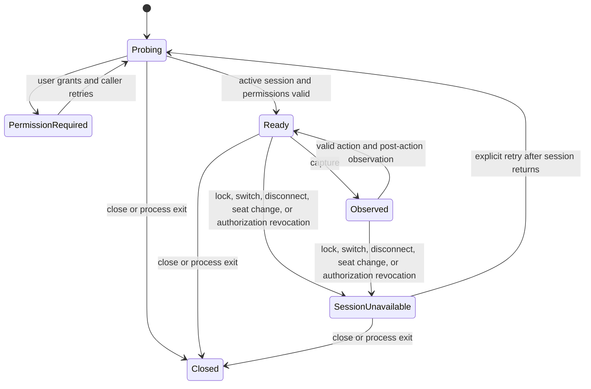
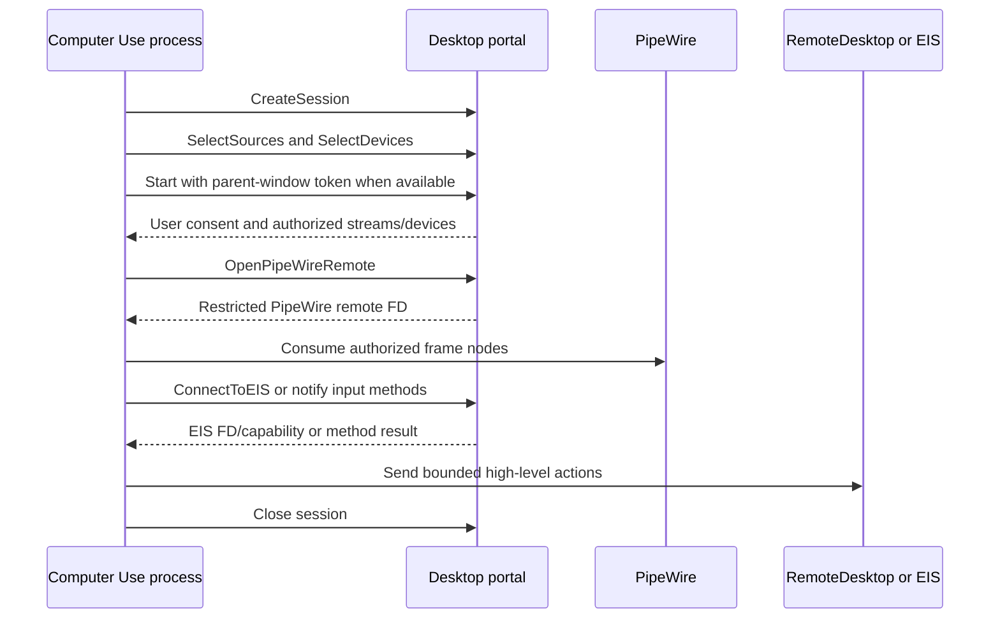

# Native Active-Desktop Backends

Status: **Accepted normative architecture; macOS observation implemented, other backends planned**
Scope: macOS, Windows, and Linux control of the current active interactive desktop
Depends on: `01-product-boundaries-and-ownership.md`, `02-service-contract-and-state-machine.md`
Consumed by: `03-toolset-and-library-integration.md`, `05-mcp-binary-and-process-lifecycle.md`

## 1. Purpose

This document defines how the platform-neutral Computer Use service maps onto native operating-system APIs.

The V1 implementation controls only the desktop that is currently visible to and attended by the logged-in user. It is not a remote-desktop, virtual-desktop, browser, VM, service-session, lock-screen, or unattended automation subsystem.

Normative terms use **MUST**, **MUST NOT**, **SHOULD**, and **MAY** as described by RFC 2119/8174.

## 2. Fixed product boundary

V1 has exactly two integration topologies:

1. `starweaver-cli` or `starweaver-rpc` links the Rust library through the first-party Toolset. The CLI/RPC product process owns capture, input, permission, session, and cleanup state.
2. A non-Starweaver harness starts `starweaver-computer-use-mcp` over stdio. That binary process owns the same state.

The native backend:

- MUST run in the current user's active interactive session;
- MUST use public user-session APIs;
- MUST remain in the process that exposes the library or MCP service;
- MUST NOT install or contact a daemon, helper, launch agent, Windows service, privileged service, kernel input component, or graphical product process;
- MUST NOT elevate, request `uiAccess`, use root, use `/dev/uinput`, or cross an integrity/secure-desktop boundary;
- MUST NOT operate while the session is locked, switched away, disconnected from its active seat, or replaced;
- MUST NOT silently select another desktop, display, seat, user, process, window, or session when the authorized current-desktop scope becomes unavailable.

Browser/CDP, provider-native `computer_call`, RDP/VNC, virtual displays, containers, remote hosts, and unattended operation are outside this spec set.

## 3. Backend boundary

The canonical service types live in `starweaver-computer-use`; `02-service-contract-and-state-machine.md` is their semantic authority. Platform modules implement the backend boundary rather than defining tool or MCP schemas.

The following Rust-like shape is illustrative of the required boundary:

```rust
#[async_trait]
pub trait NativeDesktopBackend: Send + Sync {
    fn platform(&self) -> NativeDesktopPlatform;

    async fn probe(
        &self,
        request: ProbeRequest,
        cancel: CancellationToken,
    ) -> Result<BackendProbe, ComputerUseError>;

    async fn open(
        &self,
        request: OpenDesktopRequest,
        cancel: CancellationToken,
    ) -> Result<NativeDesktopSession, ComputerUseError>;

    async fn observe(
        &self,
        session: &NativeDesktopSession,
        request: NativeObserveRequest,
        cancel: CancellationToken,
    ) -> Result<NativeObservation, ComputerUseError>;

    async fn execute(
        &self,
        session: &NativeDesktopSession,
        request: NativeActionRequest,
        cancel: CancellationToken,
    ) -> Result<NativeActionReceipt, NativeActionFailure>;

    async fn permission_report(
        &self,
        session: Option<&NativeDesktopSession>,
    ) -> Result<PermissionReport, ComputerUseError>;

    async fn close(
        &self,
        session: NativeDesktopSession,
        reason: CloseReason,
    ) -> Result<CloseReceipt, ComputerUseError>;
}
```

Native effect failures use an exhaustive evidence-bearing type rather than a bare error:

```rust
struct NativeActionFailure {
    error: ComputerUseError,
    effect_status: EffectStatus,
    receipt: Option<NativeActionReceipt>,
    cleanup: InputCleanupStatus,
}
```

A `NotExecuted` preflight rejection may omit the native receipt. Once any native event may have been submitted, the failure MUST carry the available native receipt, partial-event count, delivery classification, and cleanup state. `ComputerSession` wraps this evidence with its adapter-owned operation ID and service-assigned sequence into `ComputerUseFailure`. Failure of the mandatory post-action capture after successful native execution is likewise an `Executed` service failure with a receipt, never a bare capture error.

The backend MUST NOT expose raw platform handles through public service, tool, or MCP results. Types such as `SCStream`, `IOSurfaceRef`, `CGEventRef`, `HWND`, `IDXGIOutputDuplication`, `GraphicsCaptureItem`, portal session object paths, PipeWire file descriptors, EIS file descriptors, and X11 connections remain private implementation details.

### 3.1 Process-owned state

A `NativeDesktopSession` is runtime-ephemeral and process-bound. It contains, directly or indirectly:

```rust
struct NativeDesktopSession {
    process_instance_id: ProcessInstanceId,
    interactive_session: InteractiveSessionFingerprint,
    backend_kind: NativeBackendKind,
    backend_generation: BackendGeneration,
    geometry_generation: GeometryGeneration,
    capture_state: CaptureState,
    input_state: InputState,
    permission_state: PermissionState,
    user_presence_state: UserPresenceState,
}
```

`user_presence_state` is a compatibility diagnostic for backends that can report such state; it is not a required guard or input gate. The session MUST NOT be serialized, checkpointed, restored, copied to another process, or treated as durable authority. Restarting the process creates a new session, new generations, and invalidates every observation and action basis from the old process.

### 3.2 Active-session validation

Before opening capture and immediately before every input action, the backend MUST validate all of the following:

- the process still belongs to the same logged-in user;
- the interactive session/seat fingerprint still matches;
- the session is active and unlocked;
- the process can access the current input desktop/compositor session;
- the display topology and coordinate transform still match the cited generation;
- the required permission grant remains usable;
- product/run authorization and cancellation have not been revoked.

A failed validation MUST invalidate queued actions. The backend MUST return a typed failure and MUST require a fresh observation after recovery.



The implementation MUST NOT automatically execute a previously queued action after `Paused` or `SessionUnavailable` returns to `Ready`.

### 3.3 Safe Rust and native FFI gate

**Current evidence:** the workspace lint policy forbids unsafe Rust. The implemented `starweaver-computer-use` package inherits that policy; this spec does not silently authorize local `unsafe` blocks for CoreGraphics/Objective-C, Win32/COM/D3D, PipeWire/libei, or X11 bindings.

Each platform spike MUST inventory every required native call and prove one of the following before implementation:

1. maintained, provenance-reviewed Rust dependencies expose the required operation through a sound safe API; or
2. an already accepted same-process safe wrapper boundary can be reused without weakening workspace lints.

A C/Swift shim does not by itself make the Rust FFI call safe. The implemented macOS Accessibility path uses the narrow documented `macos_accessibility` module to own `objc2`/Core Foundation retain-and-cast invariants and expose only owned Starweaver values. The narrow documented `macos_input` module owns the sole unsafe `CGEventKeyboardSetUnicodeString` call, with an immutable live UTF-16 slice and exact length. The narrow `macos_session` module owns the property-list-safe typed cast of `CGSessionCopyCurrentDictionary` plus checked numeric conversion for continuous lock/console transition sampling. Unsafe Rust remains denied outside these reviewed macOS modules. New native behavior must stay within a reviewed boundary or require an explicit architecture and security decision; scattered undocumented unsafe blocks remain forbidden.

## 4. Common capability profile

The required V1 baseline is pixel observation plus high-level pointer and keyboard actions. Optional accessibility semantics MUST be advertised, bounded, and independently permissioned.

| Capability                         |  V1 requirement | Notes                                                                          |
| ---------------------------------- | --------------: | ------------------------------------------------------------------------------ |
| Current desktop observation        |        Required | Returns one model-visible image and exact geometry metadata.                   |
| Pointer move/click/drag/scroll     |        Required | High-level operations release held input before return.                        |
| Text and key/chord input           |        Required | No public raw persistent key-down API.                                         |
| Active-session validation          |        Required | Fail closed on lock/switch/secure desktop/seat loss.                           |
| Display topology changes           |        Required | Increment geometry generation and reject stale bases.                          |
| Permission diagnostics             |        Required | Stable typed status, no guessed success.                                       |
| Accessibility snapshot             |        Optional | AX/UIA/AT-SPI subset with hard node/depth/time limits.                         |
| Semantic action                    | Not V1 baseline | Requires a later contract and parity review.                                   |
| Protected-content bypass           |       Forbidden | Redaction/blank/protected frames are explicit failures or marked observations. |
| Arbitrary window/process targeting |       Forbidden | The model cannot provide PID/HWND/title/application selectors.                 |

The canonical catalog is filtered by compiled backend support and trusted launch policy before it reaches a Toolset or MCP `tools/list`. Transient OS readiness—permission not yet granted, portal chooser not yet completed, lock, or session loss—MUST be reported by `computer_status` and typed call errors rather than silently changing schemas during one connection. A capability permanently unsupported by the selected backend MUST be omitted; a configured but temporarily unready capability MAY remain discoverable only when its calls fail explicitly and provide remediation.

## 5. Observation and geometry mapping

The public coordinate system has origin `(0, 0)` at the top-left of the model-visible composite image. Platform desktop coordinates may be negative, logical, physical, scaled, rotated, or stream-relative. Each observation therefore MUST include an immutable transform snapshot:

```rust
struct NativeGeometrySnapshot {
    geometry_generation: GeometryGeneration,
    platform_desktop_rect: PlatformRect,
    model_image_size_px: PixelSize,
    model_to_platform: AffineTransform2D,
    displays: Vec<DisplayGeometry>,
    cursor_embedded: bool,
    capture_scale: Scale2D,
}
```

The backend MUST:

1. capture pixels and geometry from one coherent backend generation;
2. normalize the image without discarding the inverse transform;
3. validate a requested point/region in model-visible space;
4. transform it exactly once at the native boundary;
5. validate the transformed value against the current platform geometry;
6. reject the action if any generation, size, crop, rotation, scale, or display layout changed.

Clamping an out-of-range point is forbidden. Guessing a transform after display change is forbidden.

## 6. macOS backend

### 6.1 Required API family

The macOS V1 backend SHOULD use:

- ScreenCaptureKit (`SCShareableContent`, `SCContentFilter`, `SCStream`, and frame metadata) for desktop capture;
- CoreGraphics for coordinate conversion, display topology, cursor/event construction, and image fallback utilities;
- Accessibility (`AXUIElement`) only for optional bounded semantic observation and permission diagnostics;
- `CGEvent` for pointer and keyboard synthesis;
- public session/lock state APIs to determine whether the console session remains active.

Private SkyLight, WindowServer, or undocumented capture/input APIs MUST NOT be required by the supported baseline.

### 6.2 Capture scope

The backend MUST derive the current visible display set itself. The model and MCP caller MUST NOT supply an application, window, process, bundle identifier, or display identifier.

A host startup policy MAY choose one of these fixed scopes:

- `primary_display`: the display marked primary by the operating system; this does not imply focused-window or pointer tracking;
- `visible_desktop`: the composite of all currently visible displays.

The scope is process configuration, not a tool argument. Scope changes invalidate all observations and increment the backend and geometry generations.

ScreenCaptureKit frame metadata, content rectangle, point/pixel scale, and backing scale MUST be recorded before normalization. IOSurface-backed frames MUST be copied or safely retained only for the bounded lifetime needed to encode the tool result. Public results MUST not expose IOSurface identifiers.

### 6.3 Input and Accessibility

Pointer and keyboard input MUST use high-level service operations that construct and post complete `CGEvent` sequences. Drag and chord operations MUST release every pressed button/modifier on success, cancellation, error, panic boundary, and process shutdown. The implemented backend atomically reserves active input in backend state, rejects overlapping direct `execute` calls, and refuses `close` while an action owns input. It retains any unconfirmed held state outside an abandoned action future, probes post-event permission before and after release delivery, retries unresolved state during checked close, and does not report `NotRequired` while a release remains unconfirmed.

The process MUST run as the logged-in user. It MUST NOT request root, a privileged helper, a system extension, or authorization plug-in.

Accessibility is optional for V1 pixel control. The implemented macOS collector:

- uses `AXIsProcessTrusted` and `CGPreflightPostEventAccess` for passive probes, and invokes `AXIsProcessTrustedWithOptions` plus `CGRequestPostEventAccess` independently only on an authorized attended request;
- treats each immediate trust/preflight result as authoritative; showing a prompt does not imply permission was granted;
- starts from the system-wide `AXFocusedApplication` and walks that application's tree breadth-first;
- enforces immutable node, depth, children-per-node, per-string, total-string, capture-deadline, and per-message timeout limits, fetches child arrays only up to the configured limit, and converts native strings into pre-bounded buffers;
- emits only bounded role, name, value summary, state, and optional CGRect-derived model-space bounds;
- uses the public `AXContainsProtectedContent` attribute and secure-text subrole, inherits protection through descendants, omits every protected value, and requires the service validator to reject malformed protected-value output;
- treats `DesktopSurfaceScope` as a pixel boundary while explicitly projecting the whole focused application's AX semantics; nodes outside model geometry carry no model-space bounds;
- exposes no PID, AX handle, application path, or unrestricted native attribute;
- fails a requested semantic snapshot on permission/backend failure rather than silently falsifying a complete tree; and
- does not request or use Apple Events automation.

`status` is passive. CLI/RPC trusted composition may authorize a one-time Screen Recording request on first open and one Accessibility/post-event onboarding attempt on the first accessibility-enabled observation. The backend re-establishes the foreground-session fence before each independent native request and re-probes both grants afterward. MCP stdio authorizes neither implicit prompt; its attended top-level `--request-permissions` command explicitly invokes the Screen Recording, post-event, and AX trust request paths.

The implemented input path fingerprints the active console session UUID, audit identity, and available lock marker, and combines that snapshot with an epoch maintained by a dedicated worker that samples `CGSessionCopyCurrentDictionary` every 10 milliseconds. The worker retains lock, on-console, login, user, audit, and lock-time history, so `TargetGeneration` advances across a lock/unlock or switch-away/return round trip even when no business operation sampled the intermediate state. Every capture/input fence also requests a synchronous sample. Pre/post observation fences and a periodic fence during long actions reject session-epoch, Screen Recording, post-event, or display-generation changes and release any held input before returning. Text synthesis isolates line-feed, carriage-return, and tab controls as canonical key events, splits the remaining UTF-16 without breaking surrogate pairs, and uses bounded inter-part pacing so CoreGraphics does not silently drop leading controls or large back-to-back text.

### 6.4 TCC identity and packaging

Screen Recording and Accessibility grants attach to the effective code identity and execution topology. `starweaver-cli`, `starweaver-rpc`, and `starweaver-computer-use-mcp` therefore each own TCC onboarding for their own executable identity. A permission granted to one does not grant either of the other processes.

Stable signing and notarization SHOULD be used for predictable TCC identity continuity and fewer OS warnings, but are not prerequisites for exposing input when the current executable has the required native grants. For the MCP artifact, packaging may use either:

1. a signed `.app` bundle whose `Contents/MacOS/starweaver-computer-use-mcp` executable is launched directly as the stdio server; or
2. a signed standalone executable whose TCC behavior is proven across install path, update, restart, and signature changes.

A thin launcher that transfers capture/input authority to another process is not permitted in V1. If a Swift or Objective-C implementation shim is necessary, it MUST be linked into the same process as a static/dynamic library with a narrow Rust-owned C ABI; it MUST NOT become an XPC service or helper process.

A signed package SHOULD use a stable bundle identifier/designated requirement and test permission continuity across an in-place update. Ad-hoc or unsigned builds may require renewed permission grants and may trigger OS warnings, but retain the same canonical tool availability once permission is granted.

### 6.5 macOS failure contract

The backend MUST distinguish at least:

- `screen_recording_permission_required`;
- `accessibility_permission_required`;
- `input_permission_required` when separately observable;
- `permission_restart_required`;
- `console_session_inactive`;
- `session_locked`;
- `display_topology_changed`;
- `protected_or_redacted_frame`;
- `capture_stream_interrupted`;
- `input_event_rejected`;
- `run_authorization_revoked`.

Returning wallpaper, a blank frame, or a redacted frame as if it were a valid observation is forbidden. The backend SHOULD detect known redaction/blank-frame signals and MUST mark uncertainty when reliable detection is unavailable.

## 7. Windows backend

### 7.1 Required API family

The Windows V1 backend SHOULD use:

- Windows.Graphics.Capture (WGC) or DXGI Desktop Duplication for pixel capture, selected through the decision gate below;
- Windows Display Configuration and per-monitor DPI APIs for topology and coordinate conversion;
- `SendInput` for pointer and keyboard synthesis;
- Windows Terminal Services/session APIs and input-desktop checks for active-session validation;
- UI Automation (UIA) only for optional bounded semantic observation.

The process MUST be per-user, interactive, medium-integrity, and non-elevated. It MUST NOT run as a service or attempt to control Session 0.

### 7.2 Capture decision gate

Implementation MUST begin with a measured spike comparing WGC and Desktop Duplication for the exact current-desktop scope.

| Criterion                   | WGC                                                     | Desktop Duplication                                  |
| --------------------------- | ------------------------------------------------------- | ---------------------------------------------------- |
| User-visible consent/picker | Standard flows may use secure picker and capture border | No equivalent picker in the core duplication path    |
| Frame representation        | D3D11 capture frames                                    | DXGI desktop surfaces and move/dirty metadata        |
| Multi-monitor composition   | Requires one or more capture items and composition      | Requires output duplication and composition          |
| Protected content           | May redact/protect content                              | May return protected/redacted content or access loss |
| Session/display changes     | Item/session closure and frame-pool recreation          | `DXGI_ERROR_ACCESS_LOST` and output recreation       |
| Rust/Win32 integration cost | WinRT plus D3D interop                                  | DXGI/D3D11 interop and recovery                      |

The selected baseline MUST be documented with prototype evidence for Windows 10/11 versions in the support matrix. A fallback MUST NOT silently widen scope or bypass a user-visible consent property. If both backends are retained, selection is launch-time policy and the active backend kind appears in status/evidence.

The process MUST set an explicit DPI-awareness context, preferably Per-Monitor V2, before creating capture, UIA, or window/display state. Logical, physical, D3D surface, and model-visible coordinates MUST not be conflated.

### 7.3 Interactive session and secure desktop

Before opening and before every action, the backend MUST verify:

- its process session is the active local console session selected at launch; an RDP/remote session is unsupported in V1;
- the input desktop is the expected ordinary user desktop;
- the workstation is not locked;
- the process has not moved into or out of another session;
- the capture source has not been replaced;
- the current process integrity does not exceed or fall below the policy assumed at session creation.

V1 does not follow the user into another session. Fast User Switching, RDP attach/detach, console/RDP transitions, and input-desktop replacement invalidate the native session and all observations.

The backend MUST return `secure_desktop_unavailable` for UAC consent UI, Winlogon, credential UI, or another protected desktop. It MUST NOT switch desktops, elevate, use `uiAccess`, inject into another process, or retry through a broader mechanism.

### 7.4 SendInput and UIPI

`SendInput` is subject to focus, desktop, and User Interface Privilege Isolation constraints. The backend MUST:

- report partial/zero insertion using typed receipts rather than assume success;
- distinguish known integrity/UIPI boundaries when possible;
- treat inability to prove delivery as `input_delivery_uncertain` or `input_rejected`, not success;
- construct complete press/release sequences and perform best-effort cleanup;
- avoid global hooks or injection techniques that require elevation.

Optional UIA MUST be cache/budget bounded. A UIA pattern action is not part of the V1 public tool surface; the semantic snapshot capability MUST not cause pointer/keyboard actions to target an arbitrary HWND supplied by the caller.

### 7.5 Windows packaging and diagnostics

The MCP executable SHOULD be Authenticode-signed for production distribution. Unsigned development artifacts MUST expose `development_identity` in diagnostics and MUST NOT claim permission/publisher continuity.

Diagnostics MUST include process session ID, active session comparison, input desktop classification, integrity level category, capture backend, DPI awareness, display generation, WGC/DXGI state, UIA availability, and effective input capability. They MUST NOT include window titles, typed text, screenshot pixels, or user identifiers beyond a non-reversible session-local fingerprint.

Every failure after possible `SendInput` submission MUST use `NativeActionFailure` and preserve inserted-event count, uncertainty, and cleanup evidence for the service receipt.

The backend MUST distinguish at least:

- `interactive_session_mismatch`;
- `session_locked`;
- `secure_desktop_unavailable`;
- `integrity_boundary`;
- `capture_consent_required`;
- `capture_source_closed`;
- `capture_access_lost`;
- `display_topology_changed`;
- `input_rejected`;
- `input_delivery_uncertain`;
- `run_authorization_revoked`.

## 8. Linux Wayland backend

### 8.1 Required API family

Wayland V1 MUST be consentful and session-scoped. The baseline SHOULD use:

- `org.freedesktop.portal.ScreenCast` for authorized capture selection;
- PipeWire for frame transport;
- `org.freedesktop.portal.RemoteDesktop` for authorized pointer/keyboard capability;
- portal notification methods or an EIS connection (`ConnectToEIS` plus libei), according to portal/backend support;
- the session D-Bus connection as the authority/lifetime owner;
- AT-SPI only for optional bounded semantic observation.

The process MUST NOT use compositor-private protocols as a universal fallback and MUST NOT use `/dev/uinput`.

### 8.2 Portal lifecycle

The same process that exposes the Rust library or MCP server MUST own the D-Bus sender and portal session objects. The required lifecycle is conceptually:



If the D-Bus connection vanishes, the portal session closes. The backend MUST treat this as authority revocation, cancel queued actions, release held input, and invalidate all observations.

V1 MUST NOT durably store portal restore tokens. A portal MAY remember user choice according to its own UI and policy, but process restart creates a new authority negotiation. No restore token may be treated as unattended permission.

### 8.3 PipeWire and coordinate mapping

Portal stream logical `position`/`size`, compositor coordinates, PipeWire buffer pixels, and model-visible pixels may differ. The backend MUST retain both logical stream geometry and pixel dimensions and MUST identify streams with the stable metadata supported by the negotiated portal version. Reused PipeWire node IDs MUST NOT be treated as durable identity.

Absolute input through RemoteDesktop/EIS MUST target the exact authorized stream/logical coordinate space. When only relative pointer motion is available, the backend MUST advertise that limitation; it MUST NOT emulate absolute positioning from an unverified cursor origin.

Portal chooser results can authorize monitor, window, or virtual sources. V1 requests the configured current-desktop scope, but the user/portal remains authoritative. If the granted source does not match the required scope, the backend MUST report `portal_scope_mismatch`; it MUST NOT silently combine unauthorized sources.

### 8.4 Wayland permission and lifecycle

Permission is explicit portal consent, not a persistent global grant. Diagnostics MUST distinguish:

- portal service unavailable;
- portal method/version unsupported;
- user cancelled chooser;
- capture granted but input denied;
- requested device class unavailable;
- portal session closed/revoked;
- PipeWire negotiation/frame failure;
- EIS connection unavailable;
- compositor/session inactive.

A production Wayland backend is not release-ready until active same-user unlocked-seat validation, portal/EIS revocation, serialization, cancellation, and held-input cleanup are proven for every supported desktop family.

### 8.5 Optional AT-SPI

AT-SPI is independent of portal pixel/input authority. If exposed, the backend MUST bind its snapshot to the same active seat and observation generation, enforce hard traversal/string/time limits, and report bus/application failures explicitly. It MUST NOT use AT-SPI to bypass portal denial or to target another user's/session's application.

## 9. Linux X11 compatibility mode

X11 is an explicit compatibility backend, not a fallback from Wayland portal denial.

The X11 backend MAY use:

- XShm/XGetImage-equivalent capture for the current X server;
- XTest for pointer/keyboard synthesis;
- RandR for display topology;
- AT-SPI for optional semantic observation.

It MUST run only when launch-time policy explicitly enables X11 and the process is attached to the current active user's X server. Automatic fallback from a refused/unavailable Wayland portal to X11 is forbidden, including through XWayland.

The backend MUST disclose that X11 generally provides broader same-session capture/input authority than Wayland portals. It MUST NOT copy or discover another user's `XAUTHORITY`, scan displays, or connect to an arbitrary model-supplied `DISPLAY`.

No V1 Linux mode may use `/dev/uinput`, evdev device reads, setuid binaries, root, input-group elevation, or a privileged helper.

X11 input support additionally requires a declared desktop/session-manager contract that can reliably identify active session, lock, logout, and user-switch transitions for every supported target, using bounded public same-user APIs such as the target's screen-saver/session D-Bus interface plus logind where applicable. X11 capture/XTest/XInput APIs alone are not proof that the session is unlocked. If no reliable lock/session signal exists for a target, that target is unsupported; an environment-variable or successful X connection check MUST NOT enable input.

## 10. Cross-platform backend selection

Backend selection occurs once at process/session startup from trusted launch configuration and detected session type. It is not a tool or MCP argument.

| Platform/session             | Allowed V1 backend                              | Forbidden fallback                                       |
| ---------------------------- | ----------------------------------------------- | -------------------------------------------------------- |
| macOS console session        | ScreenCaptureKit/CoreGraphics/CGEvent           | Private APIs, helper, root, remote/locked session        |
| Windows active user session  | Selected WGC or Desktop Duplication + SendInput | Service/Session 0, `uiAccess`, secure desktop, elevation |
| Linux Wayland active session | Portal + PipeWire + RemoteDesktop/EIS           | X11/XWayland after portal denial, uinput                 |
| Linux X11 active session     | Explicit X11 compatibility mode                 | Another display/user, uinput                             |

`auto` MAY choose only among backends that preserve the configured authority semantics. It MUST surface the selected backend before any input capability is enabled.

## 11. Permission diagnostics contract

`PermissionReport` MUST be structured and stable enough for CLI/RPC diagnostics, MCP `--doctor` and tool errors, and tests:

```rust
struct PermissionReport {
    platform: NativeDesktopPlatform,
    backend: NativeBackendKind,
    process_identity: ProcessIdentityStatus,
    interactive_session: InteractiveSessionStatus,
    capture: PermissionCapabilityStatus,
    pointer_input: PermissionCapabilityStatus,
    keyboard_input: PermissionCapabilityStatus,
    accessibility: PermissionCapabilityStatus,
    user_presence: PermissionCapabilityStatus, // compatibility diagnostic; not a required gate
    restart_required: bool,
    remediation: Vec<RemediationStep>,
    diagnostics_code: DiagnosticsCode,
}
```

Remediation text MUST be platform-specific and actionable. It MUST NOT claim that opening a system prompt granted permission. It MUST NOT expose screenshot content, text typed by the user, window titles, application contents, portal tokens, D-Bus paths containing random authority, or raw native handles.

## 12. Packaging invariants

All packages MUST preserve one-process authority:

- macOS: one executable identity (with a stable signed identity when signing is used); optional same-process Swift/Objective-C library is allowed; no XPC/helper.
- Windows: one user-session executable; no service, scheduled task, elevated broker, or injected component.
- Linux: one user-session executable linked to/using portal, PipeWire, and input client libraries; no daemon or privileged device helper.

Platform-specific shared libraries bundled beside the executable MUST be integrity-covered by the package/update mechanism and loaded from a controlled application directory. Search-path hijacking protections are mandatory.

CLI, RPC, and MCP release lanes are each responsible for packaging and signing the executable that owns native permission. The library MUST expose shared diagnostics but cannot transfer permissions among those processes. Computer Use delivery does not depend on a graphical Starweaver product or its packaging/update pipeline.

## 13. Implementation spikes

No native backend graduates to implementation commitment before the following spikes produce checked-in evidence.

### 13.1 macOS spike

- Compare pure Rust `objc2`/framework bindings with a same-process Swift static-library C ABI in the CLI, RPC, and MCP executable identities.
- Capture all displays and one active display with correct Retina/mixed-scale transforms.
- Verify TCC behavior for signed app-bundle executable and signed standalone executable.
- Verify first grant, denial, restart-required behavior, update continuity, and path/signature change.
- Exercise CGEvent pointer, scroll, text/key chords, cancellation cleanup, lock, Fast User Switching, and protected content.
- Measure optional AX snapshot limits and input posting/cleanup behavior.

### 13.2 Windows spike

- Compare WGC and Desktop Duplication on supported Windows 10/11 versions.
- Verify picker/border requirements, multi-monitor capture, HDR/rotation/DPI, topology changes, lock, console/RDP transition, and protected content.
- Verify SendInput receipts, low/medium/high-integrity targets, UIPI failure, secure desktop, focus change, and held-input cleanup.
- Measure optional UIA snapshot budgets.
- Validate signed portable/MSIX/installer layouts according to the selected distribution plan.

### 13.3 Linux spike

- Test portal + PipeWire + RemoteDesktop/EIS on the declared GNOME, KDE, and other support targets.
- Record portal versions, chooser behavior, logical/pixel transforms, multi-monitor streams, cancellation, lock/switch, D-Bus loss, and portal revocation.
- Validate portal/EIS lifecycle revocation and held-input cleanup per desktop family.
- Validate explicit X11 session-manager/lock-state detection and XShm/XTest behavior without becoming a Wayland fallback.
- Confirm package/library discovery under supported distribution formats.

## 14. Backend acceptance gates

A backend is release-eligible only when:

01. active-session and lock/switch tests fail closed;
02. stale observation/geometry actions are rejected before native input;
03. every high-level action releases held input across success, cancellation, exception, session loss, and process shutdown;
04. permission diagnostics match the installed signed/package identity;
05. protected/redacted/blank capture is not reported as an ordinary successful observation;
06. no test path uses a helper, service, elevation, private API baseline, uinput, arbitrary target selector, browser, remote desktop, or unattended session;
07. model-visible pixels and coordinates pass mixed-scale, multi-monitor, rotation, resize, and topology-change property/integration fixtures;
08. cancellation, lock/session change, and run/lifecycle revocation invalidate queued input and release held synthetic state within bounded latency;
09. package tests execute the actual shipped artifact, not only a development binary;
10. unsupported platform/version/compositor combinations return a stable typed `unsupported_backend` or `unsupported_session` failure.

## 15. Open decisions

These decisions require spike evidence before the implementation spec can be promoted from planned to accepted:

- macOS pure Rust bindings versus a same-process Swift bridge;
- macOS app-bundle versus signed standalone MCP executable for stable TCC onboarding;
- Windows WGC versus Desktop Duplication baseline and whether both remain supported;
- Wayland desktop/compositor support matrix and EIS versus portal notification paths;
- primary-display versus visible-desktop default capture scope;
- minimum OS versions and package formats.
