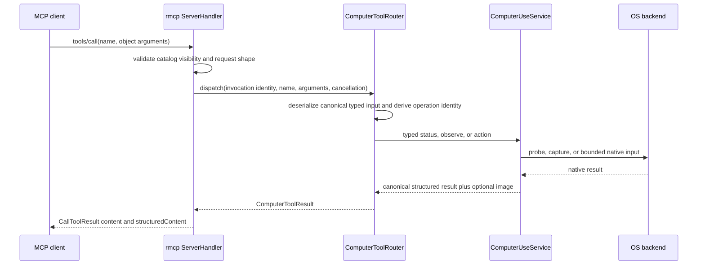

# Computer Use MCP Binary and Process Lifecycle

Status: **Accepted normative architecture; observe-only stdio binary implemented**
Scope: local stdio MCP exposure of the current active interactive desktop
Depends on: [`01-product-boundaries-and-ownership.md`](01-product-boundaries-and-ownership.md), [`02-service-contract-and-state-machine.md`](02-service-contract-and-state-machine.md), [`03-toolset-and-library-integration.md`](03-toolset-and-library-integration.md), [`04-native-active-desktop-backends.md`](04-native-active-desktop-backends.md)

## 1. Purpose

This document defines the `starweaver-computer-use-mcp` executable. It is a feature-gated binary target in the single `starweaver-computer-use` Cargo package, not a separate crate and not a generic Starweaver host.

The binary is the supported Computer Use boundary for non-Starweaver harnesses. A local MCP-capable harness spawns it without linking Starweaver's agent SDK, CLI, RPC, Toolset, or Rust library ABI. The binary owns one ordinary user-session process, one MCP stdio connection, and at most one live `CurrentInteractiveDesktop` session.

`starweaver-cli` and `starweaver-rpc` do not consume this binary; they use the sibling library in-process through the first-party Toolset.

The terms **MUST**, **MUST NOT**, **SHOULD**, **SHOULD NOT**, and **MAY** are normative.

## 2. Fixed boundary

The binary MUST:

- use the same `ComputerToolCatalog`, typed request/output DTOs, `ComputerToolRouter`, service state machine, policy, and native backends as the CLI/RPC in-process Toolset path;
- use the workspace-resolved `rmcp` server APIs behind the `mcp-server` feature;
- expose MCP over stdio only;
- run as the current local interactive user;
- own its native capture, input, permission, portal, cancellation, and cleanup state in the same process;
- default to observation authority only; and
- fail closed when current-session, permission, policy, or user-presence requirements are not satisfied.

It MUST NOT:

- depend on `starweaver-agent`, `starweaver-runtime`, `starweaver-model`, `starweaver-environment`, `starweaver-rpc`, `starweaver-cli`, session/storage crates, or any graphical Starweaver product;
- start an HTTP, SSE, WebSocket, Unix-socket, named-pipe, or other network/listening transport;
- install or contact a helper, daemon, service, launch agent, broker, or privileged component;
- expose browser/CDP, provider-native computer tools, remote desktops, VMs, locked sessions, or unattended execution;
- expose MCP resources, prompts, sampling, roots, subscriptions, or task-augmented execution in V1; or
- treat MCP client identity as an OS sandbox or proof of user intent.

## 3. Cargo and binary shape

The implemented package shape is:

```toml
[features]
default = []
mcp-server = ["dep:base64", "dep:clap", "dep:rmcp", "tokio/signal"]

[[bin]]
name = "starweaver-computer-use-mcp"
path = "src/bin/starweaver-computer-use-mcp.rs"
required-features = ["mcp-server"]
```

The exact optional dependency list may also include feature-gated logging and signal-handling dependencies. The normal library build MUST NOT compile `rmcp`, `clap`, or MCP server modules merely because the package defines the binary.

Recommended module ownership:

```text
src/
  lib.rs                         typed service, router, policy, backends
  mcp_server.rs                  feature-gated rmcp ServerHandler adapter
  bin/
    starweaver-computer-use-mcp.rs  clap/process composition only
```

This layout is illustrative. The invariant is that the server handler is testable independently while all action semantics stay in the ordinary library.

## 4. Command surface

The executable has four mutually exclusive top-level modes:

```text
starweaver-computer-use-mcp --stdio [server options]
starweaver-computer-use-mcp --doctor [diagnostic options]
starweaver-computer-use-mcp --request-permissions [platform options]
starweaver-computer-use-mcp --version
```

No default mode is implied. Invoking the executable without one of these modes MUST return a usage error on stderr and a non-zero exit status without acquiring desktop authority.

### 4.1 `--stdio`

`--stdio` starts the MCP server. Server options are host-owned process configuration. The implemented observe-only release accepts `--desktop-scope`, `--allow-pointer`, `--allow-keyboard`, and `--json`; unsupported input flags cannot widen the compiled capability ceiling. Stdio policy permits optional bounded accessibility snapshots but fixes both implicit permission-prompt switches to false. The broader target surface includes:

```text
--desktop-scope primary-display|visible-desktop
--allow-pointer
--allow-keyboard
--permission-prompts never|interactive
--image-format png|jpeg
--max-image-width <u32>
--max-image-height <u32>
--max-image-bytes <u64>
--operation-timeout-ms <u64>
--post-action-settle-ms <u64>
--user-presence required|development-terminal-only
--x11 explicit|disabled
--log-level error|warn|info|debug
```

Options not present in the implemented command remain planned. The following semantics are fixed:

- observe is the default and minimum capability;
- pointer and keyboard are denied unless explicitly enabled by launch policy;
- enabling keyboard does not implicitly enable pointer, or vice versa;
- pointer/keyboard require observe because every successful action returns a post-action observation;
- tool arguments cannot change launch policy;
- `permission-prompts=never` is the default;
- an attended Wayland deployment that requires an in-process portal chooser must explicitly select `interactive`;
- `development-terminal-only` is forbidden in release artifacts as defined by `06-security-testing-and-delivery.md`; and
- X11 is never an automatic fallback from a denied or unavailable Wayland portal.

A future config file MAY replace or complement flags, but it MUST have a strict schema, reject unknown fields, and be selected explicitly by the launching user or harness. The binary MUST NOT scan Starweaver CLI/RPC, editor, graphical-product, or browser configuration.

### 4.2 `--doctor`

`--doctor` performs non-destructive diagnostics and emits one bounded report. It MUST NOT synthesize input or trigger OS permission prompts.

The report includes:

- build, catalog, and backend versions;
- selected platform/backend and desktop scope;
- process permission/signing identity classification;
- active-session/seat eligibility;
- capture, pointer, keyboard, optional accessibility, and user-presence status;
- whether restart, portal interaction, or native onboarding is required;
- effective launch-policy capabilities; and
- stable remediation codes and human-readable instructions.

Machine-readable JSON SHOULD be available through an explicit option. Reports MUST redact native handles, portal tokens, paths containing authority, screenshot data, user text, window titles, and raw user identifiers.

### 4.3 `--request-permissions`

`--request-permissions` is attended onboarding outside the MCP tool surface. On macOS, the implemented command invokes the native request paths for both Screen Recording and Accessibility, then emits the immediate `PermissionRequestOutcome`. It may present platform UI and MUST clearly describe which process identity is requesting authority.

Platform semantics differ:

- macOS requests Screen Recording and Accessibility for the MCP executable identity and reports the immediate preflight/trust result; showing a prompt is not success, and a later grant requires retry/restart as reported;
- Windows MAY perform capture-consent onboarding required by the selected backend but MUST NOT request elevation or `uiAccess`;
- Wayland portal authority is bound to the live D-Bus client/session, so a separate onboarding invocation cannot promise reusable authority to a later server process. It MUST explain that `--stdio --permission-prompts=interactive` will perform consent in the actual MCP process;
- X11 diagnostics MAY explain broad same-session authority but MUST NOT modify X authorization.

The command MUST exit after reporting the result. JSON mode serializes the typed immediate outcome; text mode reports each permission, effective capabilities, diagnostic code, and remediation. It MUST NOT leave a daemon or permission broker running. MCP initialization, `tools/list`, `computer_status`, and ordinary stdio tool calls cannot invoke this host-only operation.

### 4.4 `--version`

`--version` prints the package version, canonical tool catalog version, enabled feature profile, and target triple. It MUST NOT probe or acquire desktop authority.

## 5. MCP capability contract

### 5.1 Server information

The `rmcp::ServerHandler` implementation MUST advertise:

- a stable server name such as `starweaver-computer-use`;
- package version;
- instructions that state the current-active-desktop, attended, observation-basis, and no-arbitrary-target rules;
- MCP tools capability with a launch-policy-stable V1 catalog;
- no tool-list-change notification support in V1; and
- no resources, prompts, sampling, completions, roots, subscriptions, or MCP task capability.

MCP protocol negotiation remains owned by `rmcp`. The binary MUST NOT invent a competing MCP version. The canonical Computer Use catalog version is application metadata, not an MCP protocol number.

### 5.2 Required method behavior

V1 supports the following MCP lifecycle and request groups through `rmcp`:

| MCP operation             | Required behavior                                                                                                                    |
| ------------------------- | ------------------------------------------------------------------------------------------------------------------------------------ |
| initialize                | Validate protocol compatibility, publish server/tool capability, create no native input authority, and trigger no permission prompt. |
| initialized notification  | Mark the connection ready; do not open a desktop session merely because initialization completed.                                    |
| tools/list                | Return the capability-filtered projection of the canonical catalog in deterministic order.                                           |
| tools/call                | Validate name and object arguments, derive a cancellation token, dispatch through `ComputerToolRouter`, and map its result.          |
| cancellation notification | Cancel only the correlated request, fence native effects at the next safe boundary, and release held synthetic input.                |
| ping                      | MAY be supported through `rmcp`; it MUST not touch desktop state.                                                                    |
| shutdown/connection close | Reject new work, cancel queued/current work, clean up native input/session state, and exit within the shutdown budget.               |

Unknown protocol methods use normal MCP/JSON-RPC method errors. Unknown tool names and malformed argument objects are request/tool errors and MUST NOT reach a native backend.

The server MUST NOT implement arbitrary JSON-RPC methods beside the negotiated MCP surface.

## 6. One process, one connection, one desktop session

The stdio transport defines one client connection for the process lifetime. The binary MUST NOT multiplex multiple clients or accept a second transport.

```mermaid
stateDiagram-v2
    [*] --> Starting
    Starting --> AwaitingInitialize: stdio opened
    AwaitingInitialize --> Initialized: MCP initialize completes
    Initialized --> Idle: initialized notification
    Idle --> OpeningDesktop: first operation needing native session
    OpeningDesktop --> Idle: probe or open fails safely
    OpeningDesktop --> Ready: native session established
    Ready --> Operating: accepted tools/call
    Operating --> Ready: result and cleanup complete
    Operating --> Cancelling: correlated cancellation, EOF, signal, or timeout
    Cancelling --> Ready: backend terminates within cleanup budget
    Cancelling --> Unavailable: backend exceeds cleanup budget; lifecycle poisoned
    Ready --> Suspended: lock, switch, permission loss, portal close, or user takeover
    Suspended --> OpeningDesktop: explicit new call after attended recovery
    Idle --> Closing: EOF, shutdown, or signal
    Ready --> Closing: EOF, shutdown, or signal
    Suspended --> Closing: EOF, shutdown, or signal
    Unavailable --> Closing: shutdown reports cleanup unconfirmed without backend reentry
    Closing --> Closed: input released and native state closed
    Closed --> [*]
```



The process MUST NOT recreate a previous observation, session, portal, or input lease after restart. Every process start mints a new process instance and invalidates prior bases.

### 6.1 Lazy acquisition

MCP initialization and `tools/list` MUST NOT trigger Screen Recording prompts, portal choosers, or input acquisition.

- `computer_status` performs a non-effectful probe where platform APIs allow it.
- `computer_observe` MAY lazily open capture and MAY show a permission/portal prompt only when launch policy explicitly permits interactive prompts.
- the first pointer or keyboard call MUST NOT bypass the required fresh observation and MUST NOT silently prompt for broader authority.
- portal/capture handles MAY remain open for subsequent calls in the same process while the session remains active and policy permits.

### 6.2 Serialization and queueing

The server MAY receive concurrent MCP requests, but `ComputerToolRouter` and the service MUST preserve the ordering contract in `02-service-contract-and-state-machine.md`.

- status-only probes MAY run concurrently only if the backend proves they cannot mutate or race session state;
- observations and all effect calls MUST pass through the service operation fence;
- pointer and keyboard actions MUST never execute concurrently;
- queue length and wait time MUST be bounded;
- a queued request retains no authority if its cited observation becomes stale;
- cancellation of a queued request removes it without opening native authority; and
- a timed-out request first receives cooperative cancellation and a bounded cleanup grace; a non-terminating owned backend task may continue only after the service permanently poisons that lifecycle, making every later backend call and close impossible until process exit.

MCP request order alone is not an action-authority guarantee. Every action is still checked against its typed observation/geometry basis immediately before native input.

### 6.3 Implemented stdio resource envelope

The implemented binary wraps `rmcp`'s server service with a bounded newline-delimited JSON transport. One inbound frame is limited to **256 KiB** and **32 object/array nesting levels** before typed deserialization. An over-limit line is discarded incrementally rather than accumulated, receives a JSON-RPC parse error with stable `error.data.code` `mcp_input_frame_too_large` or `mcp_json_depth_exceeded`, and does not poison the following frame. Malformed in-limit JSON uses `mcp_json_parse_error`.

The adapter admits at most **2 executing** `tools/call` requests plus **8 queued** calls by default. Additional calls return a structured tool error with code `mcp_overloaded`; an admitted request waiting longer than **5 seconds** returns `mcp_queue_timeout`. The service fence independently applies the same default five-second absolute queue-wait ceiling and observes cancellation while waiting. Queue cancellation returns `cancelled`, transport shutdown returns `shutdown_in_progress`, and timed-out/cancelled/abandoned work cannot remain admitted or permit backend reuse. If cooperative cleanup itself wedges, only its owned task is quarantined while the process-local backend lifecycle is permanently unavailable. Cheap protocol operations such as `ping` and the immutable `tools/list` projection do not consume tool-call slots.

EOF or a terminal transport error cancels a shared transport-lifetime token before `rmcp` waits for request handlers, so queued and active router calls observe shutdown cancellation promptly. Unix SIGINT and SIGTERM are registered through Tokio and converge with EOF, transport failure, and normal MCP close on the same single `shutdown_checked` path. The executable applies one total **20-second** handler-plus-service shutdown deadline and explicitly gives the Tokio runtime **1 second** to drain; deadline expiry, signal-registration failure, or unconfirmed mandatory cleanup is a redacted stderr error and a non-zero process exit. Per-stage deadline renewal is forbidden.

## 7. Canonical catalog projection

The server MUST obtain tool names, descriptions, input schemas, structured-output schemas, mutability/capability annotations, and catalog version from the shared `ComputerToolCatalog`. It MUST NOT maintain handwritten MCP copies.

The canonical V1 names are:

- `computer_status`;
- `computer_observe`;
- `computer_click`;
- `computer_move_pointer`;
- `computer_drag`;
- `computer_scroll`;
- `computer_type_text`; and
- `computer_press_keys`.

### 7.1 Capability filtering

The visible catalog is the intersection of:

1. canonical catalog membership;
2. the selected compiled backend's static support; and
3. launch-policy grants.

Transient permission/session readiness is status, not schema authority. It MUST NOT be queried through an interactive prompt merely to construct `tools/list`.

Capability groups are:

| Capability | Tools                                                                         |
| ---------- | ----------------------------------------------------------------------------- |
| observe    | `computer_status`, `computer_observe`                                         |
| pointer    | `computer_click`, `computer_move_pointer`, `computer_drag`, `computer_scroll` |
| keyboard   | `computer_type_text`, `computer_press_keys`                                   |

`computer_status` MUST always be present after successful MCP initialization because it is the safe diagnostic path. `computer_observe` is present when observation is allowed by launch policy and the build has a candidate backend. Pointer and keyboard tools appear only when their explicit launch grants are present. Because effect tools return a post-action image, they also require observe.

`tools/list` MUST NOT initiate a permission prompt merely to decide inventory. V1 keeps the catalog stable for the connection: later permission denial, lock, revocation, or recovery is reported through `computer_status` and typed call errors rather than tool removal/addition. The server therefore MUST NOT advertise tool-list-change support in V1. A capability becoming newly available can never add input tools beyond launch policy.

### 7.2 Determinism

For equal catalog version, backend capability class, and launch policy, repeated `tools/list` responses MUST have stable ordering and canonicalized schemas. Adapter tests MUST compare normalized MCP input schemas with the Starweaver Toolset projection from the same catalog fixture.

## 8. Tool-call mapping



The MCP adapter owns only protocol conversion. It MUST NOT:

- transform coordinates independently;
- invent observation IDs or generations;
- retry input effects;
- turn a failed action into success because a post-failure screenshot exists;
- persist image content;
- log typed text or pixels; or
- reinterpret domain error codes.

### 8.1 Arguments

`tools/call` arguments MUST be a JSON object. The router performs the authoritative typed deserialization and unknown-field/limit checks. MCP-level validation MAY reject obvious non-object input early but MUST use the canonical error mapping.

The client cannot pass launch configuration, a target selector, a native handle, a path, an environment variable, or a provider-specific extension through a tool argument.

### 8.2 Successful structured content

Each success returns canonical structured content containing the fields defined by `03-toolset-and-library-integration.md`, including as applicable:

- catalog/service version;
- operation/receipt correlation and the opaque observation ID where applicable;
- target, geometry, frame, and service-owned effect generations;
- model-visible dimensions and coordinate-space identifier;
- effective capability/permission summary;
- action status and post-action observation metadata; and
- bounded diagnostics safe for the caller.

Native handles, screenshot bytes, portal tokens, library-internal process/session IDs, OS usernames, window titles, text contents, and permission-bearing paths MUST NOT appear in structured content.

### 8.3 Image content

Observation and successful effect results return one screenshot as MCP image content plus the structured metadata that describes it.

- The image MUST use the exact MIME type and bytes produced by the canonical result.
- Encoded bytes MUST be base64-mapped only at the MCP content boundary.
- The bytes MUST NOT also be duplicated into structured JSON.
- The model-visible image size MUST match the structured coordinate basis.
- Truncation or recompression after geometry creation is forbidden unless the canonical service creates a new image and transform generation.
- Zero-length, over-limit, protected, redacted-as-success, or MIME-mismatched images are errors.
- The adapter MUST release its image buffer after the result is written and MUST not save it to disk.

A bounded text content item MAY summarize the result for clients that render text, but it MUST not duplicate sensitive screen text or replace the structured/image authority.

### 8.4 Domain errors

Malformed MCP framing, unsupported protocol methods, and invalid request envelopes use MCP/JSON-RPC errors. A valid `tools/call` that reaches the canonical router but fails domain validation returns an MCP tool error (`isError = true`) with:

- a stable, non-secret error code;
- a safe summary;
- retryability and fresh-observation requirements;
- current safe generation/capability metadata where useful; and
- no screenshot unless the canonical error contract explicitly marks a safe post-failure observation.

The following classes MUST remain distinguishable:

- invalid arguments;
- tool hidden/not granted;
- permission required or denied;
- user cancelled permission UI;
- unsupported backend/session/capability;
- inactive, locked, switched, or secure desktop;
- stale observation or geometry;
- out-of-bounds action;
- input rejected or delivery uncertain;
- user-presence pause/revocation;
- cancellation/timeout;
- protected/redacted capture;
- image/encoding limit;
- internal backend failure; and
- shutdown in progress.

Stack traces, native error objects, environment contents, command lines, and sensitive platform identifiers are stderr-only diagnostics at most and MUST be redacted there as well.

## 9. Cancellation and shutdown

### 9.1 Request cancellation

Every accepted `tools/call` receives a process-local cancellation token correlated to its MCP request ID. The correlation map is ephemeral and bounded.

When `rmcp` reports MCP cancellation:

1. the server cancels the correlated token;
2. queued work is removed;
3. active high-level input stops at the next backend-defined safe boundary;
4. the backend performs best-effort release of every synthetic button/key/modifier it may hold;
5. no automatic post-cancellation retry occurs;
6. the router returns a canonical cancellation receipt/error if the transport remains open; and
7. the request entry is removed after cleanup reaches a terminal state or after the bounded cleanup grace expires and the shared backend lifecycle has been permanently poisoned; direct handler abort/drop triggers the same synchronous poison-on-abandon guard.

Unknown or already-finished cancellation IDs are ignored or acknowledged according to MCP semantics but MUST NOT affect another call.

The implementation spike against the resolved workspace `rmcp` version MUST prove the exact `ServerHandler` cancellation callback/notification path. It MUST also prove that transport termination/stdio EOF drives one server-global shutdown token which immediately cancels queued and active router calls before waiting for handler/service drop. Request cancellation alone is insufficient. If the SDK cannot expose stable request identity, request-correlated cancellation, and a transport-lifetime cancellation bridge without patching or wrapping the service, input-capable MCP release is blocked.

### 9.2 EOF, signals, and normal close

EOF on stdin is authoritative client disconnect. SIGINT/SIGTERM or platform-equivalent process shutdown follows the same cleanup path.

Shutdown MUST:

- stop accepting new calls;
- cancel queued and active calls;
- release held input;
- close portal, capture, PipeWire/EIS, event-tap/hook, and accessibility resources;
- invalidate every observation and generation;
- flush only already-complete MCP responses within the budget;
- avoid writing non-protocol text to stdout; and
- treat only `NotRequired` or `Complete` as confirmed cleanup; `BestEffort` and `Failed` remain unconfirmed; and
- exit non-zero if mandatory cleanup cannot be confirmed, while still attempting best effort.

A hard-kill cannot guarantee async cleanup. High-level actions therefore MUST minimize held-state intervals, use RAII cleanup guards where possible, and avoid exposing raw down/up tools.

### 9.3 Shutdown budget

The process has one configured bounded shutdown budget covering handler completion, service cleanup, and native close; individual stages MUST NOT renew that deadline. It MUST not hang indefinitely waiting for an OS stream, client read, native task, or blocking-pool drain. The implemented stdio process uses a 20-second total handler/service deadline followed by an explicit 1-second Tokio runtime shutdown timeout. Expiry records a redacted stderr diagnostic, returns non-zero when mandatory cleanup is unconfirmed, and exits without calling a poisoned backend concurrently.

## 10. Standard-stream discipline

In `--stdio` mode:

- stdout is reserved exclusively for MCP transport bytes;
- no banner, tracing subscriber, panic report, permission instructions, progress text, or native library log may write to stdout;
- stderr carries human diagnostics and local logs;
- MCP logging notifications MAY carry redacted structured diagnostics after initialization;
- logging failure MUST not affect protocol framing; and
- inherited subprocess/native library stdout MUST be redirected or disabled.

Tests MUST inject warnings, panics at safe boundaries, permission failures, and shutdown paths and prove every stdout byte remains valid MCP framing.

The process SHOULD install a panic hook that emits a redacted stderr diagnostic and triggers best-effort input cleanup without attempting to continue the session.

## 11. Logging and observability

The binary SHOULD emit structured stderr logs with:

- timestamp and level;
- process-instance-safe correlation;
- MCP request correlation hash, not raw request body;
- canonical tool name;
- operation phase and duration;
- backend and safe error code;
- capability class; and
- cleanup outcome.

It MUST NOT log:

- screenshot bytes or hashes usable as cross-run fingerprints by default;
- tool text arguments or key sequences;
- window/application titles or accessibility text;
- usernames, home paths, portal tokens, D-Bus authority paths, native handles, environment variables, or MCP client command lines; or
- raw structured tool output.

Metrics MAY count calls, errors, cancellation, permission classes, and bounded latency histograms without content labels. Telemetry/export is off by default and requires a later explicit policy; local logs do not imply network export.

## 12. Permission-prompt and user-presence behavior

The MCP client is untrusted tool-call input. Launching the process configures maximum authority but does not waive attended-control requirements.

- No tool may change `permission-prompts` policy.
- Interactive OS permission UI is user-owned; the server reports cancellation/denial without retry loops.
- Input tools remain unavailable unless launch policy grants their capability and the required `UserPresenceGuard` is production-ready.
- Physical user takeover pauses/revokes queued input as defined in `06-security-testing-and-delivery.md`.
- A client cannot resume after takeover by replaying the old call; an explicit attended resume plus fresh observation is required.
- Protected/elevated/secure surfaces are failures, never a reason to widen mechanism.

The binary MUST expose its current input-enabled state through the platform-required visible indicator/guard. A hidden MCP client window is not a user-presence surface.

## 13. Packaging and identity

Release packaging MUST build the actual feature-gated binary explicitly, for example:

```text
cargo build --release -p starweaver-computer-use \
  --features mcp-server \
  --bin starweaver-computer-use-mcp
```

The exact release command may vary by target, but release automation MUST not assume the binary exists in a default library-only build.

Platform packages MUST preserve the identity requirements in `04-native-active-desktop-backends.md`:

- macOS signed app/standalone identity and TCC continuity decision;
- Windows publisher signing and controlled DLL search path;
- Linux package provenance and controlled native-library loading.

Release artifacts MUST include checksums and provenance according to repository release policy. Native publisher signing remains a release gate where the platform permission/user-trust model depends on it; a checksum is not a substitute.

The binary MUST NOT self-update, download code, install permissions, edit MCP client configuration, or modify shell startup files. Installation/configuration belongs to packaging or the user/client product.

## 14. MCP conformance fixtures

The feature-gated server module MUST have in-process and subprocess tests.

### 14.1 In-process server tests

Using the deterministic fake backend, tests cover:

- server information and exact capability advertisement;
- deterministic `tools/list` order;
- launch-policy capability filtering;
- canonical JSON Schema parity;
- every successful canonical tool mapping;
- structured plus image content mapping;
- every domain error class;
- non-object/unknown-field/over-limit arguments;
- concurrent request serialization;
- request-correlated cancellation;
- stable inventory across permission/session readiness changes;
- no resources/prompts/sampling/tasks; and
- shutdown cleanup.

### 14.2 Subprocess stdio tests

Tests spawn the built binary and cover:

- initialize/initialized/ping/tools/list/tools/call lifecycle;
- malformed JSON-RPC and unknown methods;
- stdout framing under every log level;
- stderr diagnostics separation;
- stdin EOF, graceful shutdown, SIGINT/SIGTERM where portable, and forced timeout;
- cancellation during queue wait, capture, drag, key chord, image encoding, and post-action observation;
- no orphan process or listener;
- default observation-only inventory;
- input inventory only with explicit launch flags; and
- actual release artifact smoke execution.

### 14.3 Negative surface tests

Automated checks MUST prove the binary has no:

- listening socket;
- HTTP/SSE transport option;
- daemonize/install-service option;
- provider/model configuration;
- browser/CDP option;
- remote/VM/session selector;
- helper executable launch;
- root/elevation request;
- screenshot output directory; or
- unrestricted extension/tool passthrough.

## 15. Failure and exit codes

The process uses stable coarse exit classes without encoding sensitive state:

| Exit class            | Meaning                                                                             |
| --------------------- | ----------------------------------------------------------------------------------- |
| success               | Requested non-server command completed or stdio server shut down normally.          |
| usage/configuration   | Invalid command, option, or strict config.                                          |
| unsupported           | Build/platform/session backend cannot support requested mode.                       |
| permission/onboarding | A non-server diagnostic/onboarding command could not establish required permission. |
| protocol              | MCP initialization/framing failed before normal service.                            |
| native initialization | Backend/session initialization failed.                                              |
| cleanup               | Mandatory cleanup could not be confirmed before exit.                               |
| internal              | Unexpected invariant failure after redaction.                                       |

Exact numeric values require a command-line compatibility review. Tool-call failures do not normally terminate the server unless they invalidate process safety or session integrity.

## 16. Implementation order

The MCP binary MUST be implemented only after:

1. canonical typed tool catalog/router fixtures exist;
2. deterministic fake service conformance passes;
3. one platform backend can prove same-process observation and cleanup;
4. server and cancellation spikes pass against the resolved workspace `rmcp` version; and
5. security policy defines launch grants and user-presence behavior.

Implementation then proceeds:

1. feature-gated in-process `ServerHandler` over the fake router;
2. subprocess stdio conformance binary over the fake backend;
3. native backend composition and lazy permission/session acquisition;
4. packaging identity and actual-artifact tests; and
5. input-capable release only after all security gates in `06-security-testing-and-delivery.md`.

## 17. Acceptance gates

The MCP binary is architecture-complete only when:

- it is a binary target in the single `starweaver-computer-use` package;
- the default library feature graph contains no `rmcp` server dependency;
- it serves stdio and no other transport;
- initialization triggers no OS authority prompt;
- default launch exposes no pointer/keyboard tools;
- canonical catalog and MCP schemas match normalized fixtures;
- image and structured result mapping is lossless and bounded;
- cancellation is request-correlated and releases held input;
- EOF/signal shutdown closes native sessions within budget;
- stdout purity passes fault-injection tests;
- no sensitive content is logged or retained;
- packaged signed/provenance-covered artifacts pass platform smoke tests;
- no helper, daemon, service, network listener, Starweaver product dependency, graphical-product assumption, browser backend, provider-native tool, or unattended path exists; and
- every enabled input mode has a production `UserPresenceGuard` accepted by `06-security-testing-and-delivery.md`.

## 18. Open decisions

The following remain implementation-gated:

1. Exact cancellation hooks in the resolved workspace `rmcp` version and whether a small upstream contribution is required.
2. Final clap option names and whether a strict explicit config file is needed in addition to flags.
3. How macOS packaging exposes a stable signed executable path while retaining stdio behavior.
4. Which MCP image-content annotations are consistently supported by target clients.
5. The shutdown budget per platform after native integration measurements.
6. Whether release automation publishes the binary with core assets or a dedicated Computer Use artifact lane.

None of these decisions may introduce a separate MCP crate, network transport, helper process, elevated path, browser backend, unattended mode, or provider-native model protocol without a new spec decision.
