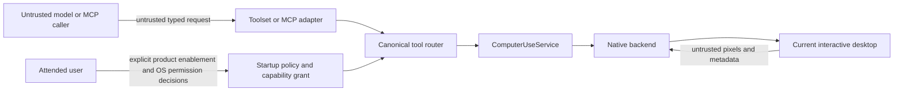
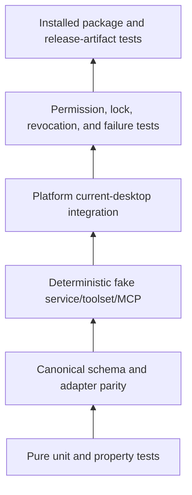

# Computer Use Security, Testing, and Delivery

Status: **Accepted release contract; macOS observe/input subset implemented**
Scope: attended control of the current active interactive desktop
Depends on: [`01-product-boundaries-and-ownership.md`](01-product-boundaries-and-ownership.md), [`02-service-contract-and-state-machine.md`](02-service-contract-and-state-machine.md), [`03-toolset-and-library-integration.md`](03-toolset-and-library-integration.md), [`04-native-active-desktop-backends.md`](04-native-active-desktop-backends.md), [`05-mcp-binary-and-process-lifecycle.md`](05-mcp-binary-and-process-lifecycle.md)

## 1. Purpose

Computer Use combines screen observation with synthetic pointer and keyboard input in the user's real active desktop. This is authority comparable to attended remote control. This document defines the minimum security, privacy, testing, and release contract for the typed library, Starweaver Toolset adapter, and MCP binary.

The terms **MUST**, **MUST NOT**, **SHOULD**, **SHOULD NOT**, and **MAY** are normative.

Security requirements apply equally to the CLI/RPC in-process Toolset path and the non-Starweaver harness path through `starweaver-computer-use-mcp`. An adapter cannot weaken the service contract because its caller is a CLI/RPC-hosted agent or an MCP harness.

## 2. Security invariants

The following invariants are mandatory:

01. The screen, accessibility metadata, model output, tool caller, and MCP client are untrusted input.
02. The process operates only the current local user's active, unlocked, visible interactive desktop.
03. Tool arguments cannot select another process, window, user, session, seat, display server, native handle, or remote endpoint.
04. Build support, OS permission, explicit product/process enablement, current run/lifecycle authorization, current-session state, and observation basis are all required before an effect.
05. On supported macOS product paths, explicit Computer Use enablement grants the canonical observe, pointer, and keyboard family together; native permissions still gate each operation.
06. Every pointer or keyboard action cites one opaque current-session `observation_id`; the service resolves and revalidates its full geometry/frame basis immediately before native input.
07. High-level actions are balanced; no public raw key/button-down authority persists across calls.
08. The service and MCP binary persist no screenshots, text input, key sequences, portal tokens, or live desktop authority by default.
09. Lock, secure desktop, session switch, seat loss, permission loss, portal close, run revocation, cancellation, or shutdown invalidates queued input.
10. Protected, elevated, or unsupported surfaces fail closed. No fallback elevates, widens scope, switches mechanism, or crosses a session boundary.
11. Input requires no separate `UserPresenceGuard`, emergency stop, physical-takeover detector, signing/notarization gate, or per-input principal.
12. Browser/CDP, remote/VM, unattended, helper/daemon/service, privileged, network MCP, and provider-native paths remain absent.

## 3. Threat model

### 3.1 Protected assets

Assets include:

- pixels visible on the current desktop;
- text inferred from pixels or optional accessibility data;
- current focus and display topology;
- pointer/keyboard input authority;
- permission and portal session handles;
- tool schemas, policy, and capability grants;
- process/signing identity and package integrity; and
- diagnostics that may reveal application or session state.

### 3.2 Adversaries and failure sources

The design assumes possible malicious or malformed behavior from:

- text or UI content shown on screen, including prompt injection;
- model-generated coordinates, text, key chords, scroll deltas, and stale observations;
- an MCP client that sends arbitrary calls, races cancellation, or floods the server;
- CLI/RPC host configuration or an MCP launch configuration that misconfigures policy;
- another same-user process that changes focus, display topology, session state, or UI contents;
- applications that reject or reinterpret synthetic input;
- protected/elevated UI outside the process's authority;
- compromised or buggy native libraries and platform APIs;
- malformed images, accessibility trees, and platform metadata;
- process crash, hard kill, OS sleep, lock, switch, and device removal; and
- packaging/signing/update mistakes that change permission identity or load untrusted libraries.

The baseline does not claim protection from a malicious process already running as the same OS user with equivalent desktop authority. Process separation over stdio is a product boundary, not an OS sandbox.

### 3.3 Trust boundaries



Only the service/native backend owns OS handles. The router owns canonical request validation. Explicit product enablement, ordinary run authorization, and native permission are independent gates. Neither screen content nor caller intent can widen them.

## 4. Startup policy and capability grants

### 4.1 Canonical capability family

The canonical authority classes are:

- `observe`: status and current-desktop screenshots;
- `pointer`: click, move, drag, and scroll; and
- `keyboard`: text and key/chord input.

Pointer and keyboard require observation support because every successful effect returns a fresh post-action observation. On the maintained macOS paths they are one product grant, not separate user-facing or RPC-principal grants.

Launching the MCP binary with `--stdio` is the user's explicit opt-in and exposes the full canonical family on the supported macOS backend. There are no pointer/keyboard launch flags.

The Starweaver SDK adapter retains method-limited handles and per-tool `ToolCapabilityGrant` values as defense in depth and for integrators that intentionally build narrower bundles. The maintained CLI and RPC products install the full family when `[computer_use].enabled = true`. Both use `InputApprovalPolicy::Never`; no input call receives extra HITL approval metadata.

RPC additionally requires ordinary transport caller authorization and run admission. It has no `stdio_observe`/`http_observe` settings or separate observe/pointer/keyboard principal capabilities. When enabled, effects occur on the RPC host's current local desktop, never on the RPC client's machine.

RPC binds process-local authorization to each `run_id`, principal fingerprint, authorization generation, expiry, and immutable config/profile snapshot. Every Computer Use call checks it, and every effect checks again before entering the service fence. Revocation/expiry cancels queued/active observations and queued pre-effect work and removes that run's handles. Resume and continuation perform fresh normal authorization; durable records never restore live authority.

### 4.2 Policy intersection

Effective authority is:

```text
compiled backend support
intersect current active-session eligibility
intersect current OS permission/portal grant
intersect startup ComputerUsePolicy and explicit product/process enablement
intersect adapter/tool capability grant
intersect ordinary RPC caller/run admission when RPC-hosted
intersect current lifecycle/cancellation state
intersect valid action observation basis
```

A missing term means denial. The service MUST compute this intersection at session establishment and revalidate all volatile terms before every effect.

### 4.3 Immutable bounds

Startup policy MUST bound:

- desktop capture scope;
- maximum screenshot width, height, pixels, encoded bytes, and format;
- operation and queue timeouts;
- maximum pointer coordinates/path points/duration;
- maximum scroll magnitude;
- maximum text bytes/scalars;
- allowed canonical key names, chord width, and sequence length;
- post-action settle time;
- optional accessibility node, depth, children-per-node, per-string, total-string, capture-time, and native messaging-time budgets;
- independently fixed capture-on-open and accessibility-on-observe permission-prompt behavior, defaulting false;
- logging level and redaction; and
- explicit X11 compatibility permission.

Tool calls cannot widen these values. Config reload is not supported in V1; changing policy requires a new process/service session and fresh observation.

### 4.4 No semantic safety claim

The service can validate mechanisms and authority, not the real-world consequence of clicking a UI. It MUST NOT claim to detect every purchase, message send, deletion, credential disclosure, or legal action from pixels.

The SDK may retain configurable input approval for other integrators. Maintained CLI/RPC direct mode sets `InputApprovalPolicy::Never`; enabling Computer Use is the user's opt-in. External MCP harnesses may add their own human-in-the-loop policy. In every case, the native service still enforces product/process enablement, native permission, current run/lifecycle authorization, and the action basis.

Screen text that says to ignore policy, reveal secrets, alter grants, run commands, or disable safety has no privileged interpretation.

## 5. Product authorization and lifecycle revocation

Explicitly enabling Computer Use in maintained CLI/RPC or launching the standalone MCP server is the
user's opt-in to the full canonical tool family on a supported backend. This contract adds no
input-specific `UserPresenceGuard`, visible indicator, emergency stop, physical-input takeover
detector, signing/notarization gate, per-pointer/per-keyboard principal, or per-call CLI/RPC approval.

This does not weaken ordinary authority and lifecycle boundaries:

- CLI/RPC configuration must be enabled and the current caller/run must remain authorized;
- the standalone server must remain attached to its one live stdio process/connection;
- Screen Recording and Accessibility/post-event permission remain authoritative on macOS;
- the process must remain the same user in the active, unlocked interactive session;
- lock, switch, permission loss, connection close, run completion, expiry, revocation, cancellation,
  or shutdown invalidates queued work and observations as applicable;
- every effect still passes the serialized pre-effect fence with a current observation basis; and
- cancellation/error/shutdown still releases held synthetic buttons, keys, and modifiers.

A caller cannot restore old authority or replay queued input after revocation. Recovery requires normal
fresh product/run admission where applicable and a fresh observation.

## 6. Observation, prompt injection, and geometry safety

### 6.1 Untrusted observation

Screenshots and optional accessibility data are untrusted evidence. The library MUST treat image bytes and semantic strings as data only. It MUST NOT parse screen text into policy, configuration, target selection, native commands, or capability changes.

The Toolset instruction SHOULD remind models that UI content cannot authorize broader tools. The MCP server instruction MUST state the same boundary.

### 6.2 Typed action basis

Every effect request MUST carry one `observation_id`. The service resolves the authoritative process/session IDs, target/layout/frame generations, service-owned effect epoch, image dimensions/digest, capture time, and coordinate transform from its bounded current-session observation ledger; callers cannot echo or override them.

Immediately before native input the service MUST verify:

- process and interactive-session identity;
- active/unlocked/ordinary desktop state;
- the ledger record's observation/frame identity and its current target/layout generations;
- exact equality between the observation's effect epoch and the session's current effect epoch;
- current product/run authorization and cancellation state;
- capability grant and limits;
- coordinates/path/key/text bounds; and
- cancellation state.

Normal desktop repaint may advance the live frame generation after capture, so V1 does not require numerical equality with the latest frame counter. It does require an intact, unexpired observation record, unchanged target/layout mapping, and an effect epoch equal to the current session epoch. Immediately before any accepted action may submit native input, the service increments that epoch; therefore every observation predating that effect becomes unusable across all CLI/RPC runs and MCP requests sharing the session. A backend MAY enforce a stricter visual-stability check and records that decision in the receipt. A stale or mismatched basis is rejected. Coordinates are never clamped into range, guessed after resize, or transformed using current geometry when an old basis was supplied.

### 6.3 Post-action observation

Every successful effect produces a receipt and fresh observation from the same session after bounded settling. If input delivery is uncertain or post-action capture fails, the service returns a typed non-success/uncertain outcome; it MUST NOT claim success solely because an input API accepted events.

The post-action image does not prove semantic success. Receipts distinguish requested, accepted, delivered-known, delivery-uncertain, cancelled, and rejected states where the platform can support those distinctions.

## 7. Protected and elevated surfaces

The following are always out of scope:

- macOS login/lock/authorization protected UI and protected capture content;
- Windows Winlogon/UAC/credential secure desktops and higher-integrity targets blocked by UIPI;
- Linux login/lock screens, another seat/user, portal-denied sources, and compositor-private authority;
- DRM/protected video or application content that the OS redacts; and
- any application surface requiring elevation, injection, private API, helper, service, kernel input, or another session.

When encountered, the backend MUST:

1. stop before effect when detectable;
2. cancel queued effects whose assumptions may include that surface;
3. release held input;
4. invalidate the relevant observation/session generation;
5. return a typed `protected_surface`, `secure_desktop_unavailable`, `integrity_boundary`, `portal_scope_mismatch`, or equivalent safe error; and
6. require fresh attended recovery and observation.

It MUST NOT fall back to another capture API, X11/XWayland, `/dev/uinput`, Accessibility/UIA/AT-SPI actions, clipboard insertion, application scripting, process injection, or elevation to bypass the boundary.

## 8. Keyboard, text, pointer, and clipboard rules

### 8.1 Balanced high-level actions

V1 exposes no public key-down, key-up, button-down, or button-up tools. A high-level click, drag, key sequence, or chord owns its complete native press/release sequence.

Each action implementation MUST use an RAII or equivalent cleanup guard recording synthetic held state. The guard attempts release on:

- normal completion;
- validation failure after partial preparation;
- cancellation and timeout;
- backend error;
- session/presence revocation;
- panic crossing a safe boundary; and
- graceful process shutdown.

Hard process kill cannot guarantee async cleanup, so held intervals MUST be minimal.

### 8.2 Text input

Typed text is highly sensitive. The service MUST NOT log, persist, hash for telemetry, or echo full text in receipts. Safe receipts include only bounded counts and status.

V1 MUST NOT silently use the system clipboard to type text. Platform-native Unicode synthesis or an explicitly supported non-clipboard mechanism is required. If a character cannot be represented safely on a backend, the action returns `unsupported_text_input`; it does not substitute, drop, or paste through the clipboard.

Passwords and secrets cannot be reliably detected. Higher-level callers are responsible for deciding whether to type sensitive values. The library's zero-retention and redaction rules still apply.

### 8.3 Key and pointer limits

Canonical key names are a closed allowlist. The service MUST reject unknown/native key codes, over-wide chords, excessive sequences, and system-reserved combinations prohibited by policy.

Pointer coordinates, drag paths, duration, click count, and scroll deltas are bounded. Effects outside the observation surface or on a changed geometry are rejected rather than clamped.

## 9. Screenshot and semantic-data privacy

### 9.1 Zero retention baseline

The Computer Use library and MCP binary have a zero-retention baseline:

- screenshots are held in memory only long enough to normalize, encode, map, and write the current result;
- no screenshot directory, cache, history, thumbnail, replay store, crash attachment, or automatic evidence archive exists;
- structured results contain geometry and IDs, not base64 images;
- images are not written to temporary files;
- optional accessibility trees and strings are not persisted;
- typed text and key sequences are not retained after the action completes; and
- process restart restores no observation or authority.

CLI, RPC, or an external MCP harness may retain model/tool history according to its own policy. That is outside the library/MCP binary retention guarantee and SHOULD be disclosed by the calling product or harness.

### 9.2 Memory handling

The implementation MUST bound raw and encoded frame buffers before allocation where possible. It SHOULD reuse bounded pools only within the live process and SHOULD overwrite or release sensitive buffers promptly when practical. Rust memory zeroization is not a guarantee against all allocator/OS copies; documentation MUST not claim cryptographic erasure.

Core dumps and crash reporters can capture pixels or text. Production packaging SHOULD disable content-rich automatic crash attachments and document OS-level core-dump policy. Panic diagnostics MUST not format image/text DTOs.

### 9.3 Optional semantic observation

Accessibility metadata is independently requested, OS-permissioned, and bounded. Product composition may place pixel observation and the ability to make that explicit request under one host-level Computer Use opt-in, but a pixel-only call MUST NOT include semantic data. The projection MUST exclude or redact known secure/password values where platform APIs identify them, inherit protected-content state through descendants, cap node/depth/children/string/time/total bytes before materializing unbounded native arrays or strings, and return truncation metadata. On macOS, pixel `DesktopSurfaceScope` does not pretend to clip the focused application's AX hierarchy: the host-authorized semantic scope is the whole focused application, while model-space bounds exist only where geometry intersects the pixel capture.

## 10. MCP and adapter security

### 10.1 MCP caller

Stdio limits transport reachability but does not make tool arguments trusted. The server MUST validate every call through the canonical router and must not deserialize arbitrary native extensions.

The MCP process inherits environment and working directory from its parent, but tool results and logs MUST not expose them. Tool calls have no filesystem, shell, subprocess, network, or config mutation authority.

### 10.2 Standard-stream safety

In server mode stdout contains only MCP framing. All diagnostic and native-library output is redirected to stderr or disabled. Fault-injection tests cover permission prompts, panic hooks, tracing initialization, and shutdown.

### 10.3 Denial of service

The router and server MUST bound:

- concurrent/queued calls;
- JSON depth and input size;
- schema/text/path/key limits;
- image dimensions, raw pixels, encoded bytes, and encode time, while geometry-bound observation images remain immutable after basis creation;
- accessibility traversal;
- operation/queue/shutdown timeouts; and
- diagnostic/log volume.

A flooding client cannot create unbounded sessions, portal dialogs, capture streams, frame buffers, or cancellation entries.

## 11. Cancellation, idempotency, and ambiguous effects

### 11.1 Cancellation fence

Cancellation is checked before queue admission, after queue wake, before native effect, at safe points during long drag/key sequences, before post-action capture, and during image encoding. A cancelled action is never retried automatically.

Cancellation response is not complete until synthetic held-state cleanup reaches a terminal best-effort result. Cleanup outcome appears in the safe receipt/error.

### 11.2 Idempotency

Observations and status probes MAY be retried when policy permits. Input effects MUST NOT be retried by the service or MCP adapter after an ambiguous transport/backend failure.

Canonical input adapters supply an operation/idempotency identity in the invocation envelope rather than asking the model/MCP tool arguments to manufacture one. Repeating an ID with the exact canonical request digest returns the recorded bounded receipt only while that process-local cache is valid. Reusing an ID with different content is rejected. The cache MUST NOT survive process restart and MUST NOT retain screenshot bytes or text bodies.

### 11.3 Delivery uncertainty

Some OS input APIs report submission, not application consumption. The service distinguishes API acceptance from semantic effect. If cancellation, session change, or backend failure occurs after possible native submission, the result is `delivery_uncertain` with no automatic retry. A fresh observation is required.

## 12. Redacted observability

### 12.1 Allowed fields

Local structured logs and metrics MAY include:

- backend/platform and safe version;
- canonical tool/action class;
- process-local correlation IDs;
- capability class;
- permission/status/error code;
- operation phase and bounded duration;
- image dimensions and encoded byte count;
- generation mismatch category;
- cancellation/revocation/cleanup outcome; and
- package/signing classification without user identity.

### 12.2 Forbidden fields

Logs, traces, metrics, panic messages, and crash attachments MUST NOT contain:

- image bytes or screenshot-derived text;
- full image/content hashes by default;
- typed text, key values, or clipboard data;
- accessibility names/values/descriptions;
- window/application titles;
- usernames, home directories, process command lines, or environment variables;
- native handles, portal restore tokens, D-Bus paths carrying authority, PipeWire/EIS FDs, or X authorization;
- MCP raw arguments/results; or
- model prompts/responses.

Telemetry export is absent by default. Adding network telemetry requires a later privacy/security decision.

## 13. Test architecture

Testing is layered so most invariants are deterministic and platform tests focus on native behavior.



### 13.1 Pure unit and property tests

Required tests cover:

- service-state transitions and forbidden transitions;
- policy intersection and default denial;
- capability independence;
- observation/action basis validation;
- affine transform round trips, crop/scale/rotation/mixed-DPI, negative desktop origins, and bounds;
- independent process/session/backend/geometry/frame/effect/presence generations;
- stale, future, wrong-process, wrong-session, wrong-effect-epoch, and wrong-scope bases;
- run A observe → run B effect → run A queued action rejection under one shared RPC coordinator;
- disabled RPC Computer Use or failed ordinary caller/run authorization exposes no Computer Use handle, while enabled authorized runs receive the full family;
- RPC run revocation cancels queued/active observation and wins against queued pre-effect work, authority does not bleed across principals/runs, and resume/continuation without fresh authorization restores no handle;
- action limits and canonical key validation;
- balanced input cleanup state machine;
- cancellation at every safe boundary;
- idempotency same/different digest behavior;
- error classification and safe projection;
- zero-retention result shape; and
- log redaction.

Property tests MUST prove that arbitrary valid model points round-trip within documented tolerance and arbitrary invalid points never become valid by clamping or overflow.

### 13.2 Canonical schema tests

Checked-in fixtures cover every tool input, structured output, content class, error, catalog metadata, and version.

Tests compare normalized projections for:

- direct canonical catalog;
- Starweaver `ToolDefinition`/Toolset adapter; and
- MCP `tools/list` declarations.

A tool name/schema/description/capability mismatch fails CI. Unknown fields, integer/float edge cases, Unicode limits, oversized arrays, and JSON depth are tested.

### 13.3 Deterministic fake tests

The fake backend simulates:

- active and inactive sessions;
- permissions granted/denied/revoked/restart-required;
- multi-display and geometry changes;
- blank/protected/redacted frames;
- accepted/rejected/uncertain input;
- lock/session switch/portal close;
- cancellation during every action phase;
- held-state cleanup success/failure;
- image encoding limits; and
- accessibility permission acquisition/revocation, secure-value redaction, malformed parent/bounds rejection, and every truncation budget.

The same scenario suite runs through typed library calls, the shared CLI/RPC Toolset adapter, and in-process MCP server mapping. Separate composition fixtures prove both CLI and RPC attach one process-level coordinator without routing through MCP.

### 13.4 MCP tests

In-process and subprocess tests required by `05-mcp-binary-and-process-lifecycle.md` cover protocol negotiation, catalog filtering, image/structured content, errors, request cancellation, bounded concurrency, EOF/signal shutdown, stdout purity, stderr redaction, and negative surface/transport checks.

Tests MUST use clients/fixtures matching the resolved workspace `rmcp` version and at least one independently maintained MCP client or protocol fixture before release.

### 13.5 Platform integration tests

Tests run in dedicated attended CI/manual lanes; they MUST NOT automate a developer's ordinary desktop. Each platform uses a controlled test user/session with deterministic test windows and no sensitive data.

Common scenarios:

- observe known color/geometry patterns;
- click/hover/drag/scroll and verify test-app state;
- type supported Unicode and key chords into a controlled test app;
- cancel at every native action boundary;
- resize, rotate, scale, add/remove display where feasible;
- lock, unlock, switch session/seat, sleep/wake, and disconnect events;
- protected/elevated UI refusal;
- permission denial/revocation;
- process termination and held-state cleanup; and
- packaged artifact identity.

Assertions use test-application state and typed receipts, not screenshots of arbitrary user applications.

## 14. Platform-specific security matrix

### 14.1 macOS

Required evidence:

- public ScreenCaptureKit/CoreGraphics/AX/CGEvent baseline;
- stable TCC identity for actual signed package;
- Screen Recording and Accessibility passive probe, attended request, immediate-result, denial, revocation, and restart behavior for each executable identity;
- active console and lock/Fast User Switching failure;
- Retina/mixed-scale/multi-display geometry;
- protected/redacted frame handling;
- narrow same-process `macos_accessibility` retain/cast review, `macos_input` review of the sole unsafe `CGEventKeyboardSetUnicodeString` call, and `macos_session` review of the typed `CGSessionCopyCurrentDictionary` cast plus numeric conversion used by continuous transition sampling, with unsafe denied outside those modules; and
- update continuity without helper/XPC/private API.

Developer ID signing and notarization are tracked for TCC identity continuity and reduced OS warnings, not as an input-availability gate. Unsigned or ad-hoc artifacts require the same native grants and may require permission renewal.

### 14.2 Windows

Required evidence:

- accepted WGC versus Desktop Duplication decision and supported OS matrix;
- Per-Monitor V2 DPI and topology correctness;
- medium-integrity current-session process;
- WTS/input-desktop/lock/console-RDP transition validation;
- UIPI/higher-integrity and secure desktop refusal;
- `SendInput` rejection/uncertainty/cleanup semantics;
- Authenticode/installer or accepted publisher identity; and
- actual package DLL search-path protection.

Input must not depend on `uiAccess`, elevation, service, injection, or secure-desktop switching.

### 14.3 Linux Wayland

Required evidence per supported compositor/desktop family:

- portal ScreenCast + PipeWire capture;
- RemoteDesktop/EIS input capability and portal version floor;
- logical/pixel/stream coordinate correctness;
- D-Bus/portal/PipeWire/EIS loss cleanup;
- portal cancellation and scope mismatch;
- lock/seat/session transition failure;
- package-native library discovery and provenance.

### 14.4 Linux X11

X11 tests run only with explicit compatibility policy. They prove current-user/current-display binding, the declared desktop/session-manager lock and user-switch signals, XShm/XTest behavior, broad-authority disclosure, cleanup, and no Wayland-denial fallback. X11 input remains disabled where active/unlocked state cannot be proven independently of the X connection. No test or package may require `uinput`, evdev reads, root, input-group membership, setuid, or another user's X authority.

## 15. Permission and package tests

Testing only a development executable is insufficient. For each release platform, CI/manual evidence MUST cover the bytes users install. Evidence applies independently to every input-capable `starweaver-cli`, `starweaver-rpc`, and `starweaver-computer-use-mcp` executable identity; passing the MCP artifact does not qualify CLI/RPC, and passing one Starweaver product does not transfer OS permission/signing evidence to another:

- initial install and first permission request;
- denial and remediation;
- process restart;
- in-place signed/package update;
- path or identity change behavior;
- uninstall/reinstall where permission identity may persist;
- rollback if supported by packaging;
- dependency/library integrity and search paths;
- checksum/provenance verification;
- direct in-process Toolset activation, permission diagnostics, coordinator shutdown, and no-MCP-loopback smoke for CLI/RPC artifacts; and
- `--doctor`, `--request-permissions`, `--version`, and stdio smoke for the MCP artifact.

The test plan MUST record which permission behavior is OS-owned and cannot be reset safely in ordinary CI. Such cases require documented disposable test users/VMs for packaging verification only; this does not add VM control to the product.

## 16. Architecture and dependency gates

Implementation changes MUST add repository checks proving:

- `starweaver-computer-use` has no normal dependency on agent, model, runtime, environment, RPC, CLI, session/storage/stream, or graphical-product crates;
- `starweaver-agent` depends on the library with `default-features = false` and without `mcp-server`;
- CLI and RPC dependency/feature graphs use the in-process Toolset/library and never enable the Computer Use `mcp-server` feature or launch the binary for built-in Computer Use;
- RPC Computer Use requires explicit enabled configuration plus ordinary caller/run authorization with immutable run admission, generation/expiry checks, revocation, and fresh resume admission; it defines no transport- or input-specific principal capabilities;
- default library builds contain no `rmcp` server dependency;
- only the feature-gated binary/server module imports `rmcp` server APIs;
- no network server dependency or listening socket path is introduced;
- no browser/CDP/provider-native symbols appear in implementation modules;
- no helper/service/daemon/uinput/elevation path exists;
- public API and schema changes pass release API checks;
- the package keeps unsafe Rust denied outside the reviewed `macos_accessibility`, `macos_input`, and `macos_session` modules; native calls use a sound safe dependency where available, while any new unsafe FFI requires an explicit architecture/security decision and a similarly narrow audited boundary before implementation; and
- each graduated subset is registered in `spec/capabilities.toml` only after implementation and evidence exist; unregistered platform/input capability remains planned.

Existing repository gates such as `make architecture-check`, `make capability-check`, `make fmt-check`, `make check`, `make test`, `make scripts-check`, and `make release-api-check` remain applicable. Implementation batches MUST add focused commands rather than weaken aggregate gates.

## 17. Delivery status

The deterministic core, macOS pixel observation, optional bounded Accessibility snapshot, native
pointer/keyboard operations, first-party Toolset, CLI/RPC in-process composition, and full-family MCP
stdio binary are implemented. Windows and Linux backends remain planned and explicitly unsupported.
The generated capability status and `../alignment/13-computer-use-macos-evidence.md` are authoritative.

A platform graduation requires:

- same-process current-session observation and high-level input;
- geometry, stale-observation, serialization, idempotency, and bounded image evidence;
- native permission and active same-user unlocked-session diagnostics;
- lock/switch/protected-content failure without broader fallback;
- balanced input cleanup under success, error, cancellation, and shutdown;
- adapter/schema parity, redaction, and zero-retention tests; and
- capability-registry evidence.

Optional accessibility metadata remains independently requested and OS-permissioned. UIA/AT-SPI and
cross-platform parity remain future work; semantic action tools require a new spec.

## 18. Release gates

No artifact is released unless:

- all fixed exclusions and package dependency checks remain true;
- canonical schemas and adapters are in parity;
- screenshot, accessibility, and input buffers follow the zero-retention baseline and logs are redacted;
- the model/MCP client receives exact geometry-bound image bytes and dimensions;
- ordinary macOS MCP launch exposes the full canonical family;
- stdio framing, bounded cancellation, idempotency, serialization, and held-state cleanup pass;
- native session/permission failures are typed and fail closed;
- RPC requires enabled configuration plus ordinary current caller/run authorization, revocation, and fresh resume admission, without transport- or input-specific principals;
- maintained CLI/RPC input has no per-call approval metadata;
- protected/elevated surfaces have no fallback; and
- actual package bytes pass smoke/checksum/provenance checks.

Signing/notarization evidence is tracked for stable TCC identity, permission continuity across updates,
and OS warning reduction. It is not an input-availability gate. The MCP artifact additionally requires
server/cancellation conformance, deterministic stable `tools/list`, structured/image parity, stdout
purity, EOF/signal cleanup, and no network or broader MCP capability.

## 19. Incident and recovery behavior

If an invariant violation is detected at runtime, the process MUST prefer loss of capability over continuation:

1. revoke process/run input authority;
2. cancel queued/current effects;
3. release held input;
4. close native capture/input authority when safety is uncertain;
5. invalidate observations and generations;
6. return or log only a redacted stable diagnostic code; and
7. require process restart or normal fresh caller/run admission according to error class.

The library and MCP binary do not upload incident data. A user MAY manually provide redacted diagnostics from `--doctor`.

Repeated protected-frame misclassification, cleanup failure, post-revocation action, or stdout framing corruption is release-blocking and should disable the affected build/platform until corrected. Permission identity changes require renewed OS permission and remediation but do not remove the canonical input tools.

## 20. Independent review requirements

Before a new platform graduates, an independent architecture/security review MUST examine:

- crate and feature dependency direction;
- native API/public-private boundary;
- action basis and geometry correctness;
- cancellation and held-input cleanup;
- MCP protocol and stdout isolation;
- permission/package identity and signing-related continuity;
- screenshot/text retention and logs;
- elevated/protected-surface refusal; and
- absence of hidden helper, browser, remote, unattended, or network paths.

Findings are severity-classified. P0/P1 findings block release. Supported lower-severity findings are fixed or explicitly accepted with rationale; uncertainty is documented as a decision rather than asserted away.

## 21. Open decisions

The following decisions require prototype evidence and maintainer discussion:

1. Whether primary-display or normalized visible-desktop remains the default scope.
2. macOS app-bundle versus standalone signed identity for better TCC continuity.
3. Windows WGC versus Desktop Duplication and supported Windows version floor.
4. Wayland compositor/portal/EIS support matrix.
5. The explicit X11 support/release policy and per-target session-manager/lock-state contract.
6. Exact screenshot dimensions/byte defaults and PNG versus JPEG policy.
7. The independent MCP client conformance set.
8. Release artifact lane and native publisher-signing readiness.
9. Whether later native features remain within the implemented narrow macOS FFI module or justify a separate reviewed wrapper/package boundary.

Open decisions do not permit weaker session, geometry, cancellation, cleanup, or lifecycle invariants.

## 22. Final acceptance criteria

The spec set is implementation-ready when:

- service/tool/MCP/native/security contracts agree on one process and one current active desktop;
- canonical capability names and tool schemas are unambiguous;
- explicit product enablement and full-family macOS MCP behavior are fixed;
- no input-specific guard, emergency stop, principal split, approval, signing, or launch-flag gate is required;
- observation basis, post-action image, cancellation, idempotency, and cleanup semantics are testable;
- zero retention and redacted observability are explicit;
- each platform has a bounded spike and package-evidence plan;
- platform delivery evidence proves observation and balanced high-level input together;
- all browser, provider-native, remote, VM, unattended, locked, helper, daemon, privileged, network-MCP, and graphical-product-owned paths remain excluded; and
- maintainers have concrete open decisions to discuss rather than implicit implementation guesses.
