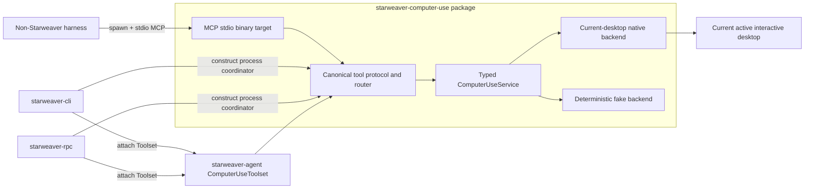

# Computer Use Architecture

Status: accepted architecture; macOS observation subset implemented.

This spec set defines Starweaver Computer Use as a local, OS-native capability for observing and controlling the **current active interactive desktop**. One typed Rust library owns the implementation. The maintained Starweaver CLI and standalone RPC products consume it in-process through a first-party function-tool toolset. Harnesses outside the Starweaver ecosystem consume the same canonical tools by spawning a local stdio MCP binary.

The normative current implementation status is generated from [`../capabilities.toml`](../capabilities.toml). The broader contracts remain release gates for platform and input capability that has not graduated.

## Implementation status

The implemented provisional subset is:

- one published `starweaver-computer-use` library with typed service/state-machine contracts, canonical schemas/router, deterministic fake, and explicit target selection;
- a macOS same-process native backend for current-desktop observation with Screen Recording permission;
- explicit unsupported backends on Windows and Linux that expose no Computer Use tools;
- an opt-in `starweaver-agent` Toolset with grant-intersected dependencies and immutable geometry-bound media;
- default-off CLI and RPC in-process composition, including RPC principal-bound, expiring, revocable run admission;
- a feature-gated, observe-only stdio MCP binary for non-Starweaver harnesses; and
- separate checksum-covered macOS MCP release archives plus crates.io publication of the library package.

Production pointer and keyboard input remain statically unavailable on every platform. They cannot be enabled by config or launch flags and remain blocked on the input-specific user-presence, emergency-stop, signing, review, and release gates. Windows/Linux observation and optional accessibility metadata also remain planned. See [`../alignment/13-computer-use-macos-evidence.md`](../alignment/13-computer-use-macos-evidence.md).

## Fixed decisions

The following decisions define the scope of this spec set:

01. Starweaver does not depend on OpenAI, Anthropic, or another model vendor's native computer-call protocol.
02. Computer Use is exposed as ordinary, provider-neutral function tools.
03. Browser automation is not a Computer Use backend. Browser and CDP automation remain the responsibility of `agent-browser` or another dedicated browser tool.
04. V1 controls only the current local user's active, unlocked, interactive desktop.
05. Remote desktops, VMs, hidden desktops, service sessions, locked sessions, and unattended execution are out of scope.
06. V1 is one ordinary user-session process. There is no daemon, helper, privileged service, kernel input component, or graphical-product-owned broker.
07. `starweaver-cli` and `starweaver-rpc` are the only assumed Starweaver composition roots. Each links the library through the `starweaver-agent` Toolset; the product process owns OS permissions and native session state.
08. CLI and RPC MUST NOT loop back through MCP to use this capability. MCP is the external harness boundary.
09. Non-Starweaver harnesses spawn `starweaver-computer-use-mcp` and communicate over MCP stdio. That child process owns OS permissions and native session state.
10. The Rust library, CLI/RPC Toolset path, and MCP binary use one canonical typed tool protocol and one execution router. They do not maintain parallel action implementations or divergent schemas.
11. No Starweaver graphical Desktop product is assumed. It is not a consumer, prerequisite, broker, permission identity, packaging host, or delivery gate for Computer Use.

These decisions intentionally narrow the broader feasibility space considered during research. Once browser, remote-environment, provider-native, and unattended paths are removed, an environment-associated multi-backend abstraction is unnecessary for V1. The CLI/RPC Toolset path and external-harness MCP path provide two concrete adapters over one focused reusable library package.

## Package and adapter shape

V1 adds one Cargo package:

- `starweaver-computer-use`
  - library target: typed service, canonical tool protocol/router, policies, current-desktop state machine, deterministic fake, and target-gated native backends;
  - binary target: `starweaver-computer-use-mcp`, enabled only by the optional `mcp-server` feature;
  - the default library build does not compile or expose MCP server dependencies.

Existing crates retain their current ownership:

- `starweaver-agent` owns the thin first-party `ComputerUseToolset`, context attachment, filtered host-capability lookup, tool instructions, approval metadata, and Starweaver media-result projection.
- `starweaver-tools` retains generic `Tool`/`Toolset`/schema/execution primitives and gains no OS-specific code.
- `starweaver-context` remains a generic typed dependency and grant carrier; it gains no dependency on the Computer Use library.
- `starweaver-runtime` executes the tools through the existing ordinary tool loop and gains no Computer Use state machine.
- `starweaver-model` gains no Computer Use declarations or response parts.
- `starweaver-environment` remains file/shell/resource oriented and gains no GUI methods.
- `starweaver-cli` and `starweaver-rpc` are maintained in-process composition roots. They depend on the Toolset/library directionally; the library has no reverse dependency on either product.
- No Starweaver graphical Desktop composition is assumed or required.

A separate MCP package is not justified initially. The feature-gated lib-plus-bin layout follows the workspace's existing preference for keeping a thin product executable with its owning service implementation when no independent client/protocol crate is required. A separate package requires later evidence that release cadence, dependency isolation, or non-MCP consumers cannot be handled by the feature boundary.

The arrows are dependency/call directions. Neither the MCP binary nor the Starweaver adapter contains native capture or input logic.

## Reading order

1. `01-product-boundaries-and-ownership.md`
   - normative scope, product/process boundaries, dependency direction, crate ownership, and lifecycle.
2. `02-service-contract-and-state-machine.md`
   - typed library API, active-desktop session, observation geometry, actions, receipts, cancellation, errors, and invariants.
3. `03-toolset-and-library-integration.md`
   - canonical tool catalog/router, exact tool schemas, Starweaver Toolset adapter, filtered capabilities, media results, and deterministic tests.
4. `04-native-active-desktop-backends.md`
   - macOS, Windows, Wayland, and explicit X11 backend paths, permissions, active-session checks, packaging, and implementation spikes.
5. `05-mcp-binary-and-process-lifecycle.md`
   - MCP stdio server contract, process lifecycle, configuration, protocol mapping, cancellation, diagnostics, and packaging commands.
6. `06-security-testing-and-delivery.md`
   - threat model, attended user-presence control, privacy, failure rules, test matrix, staged delivery, release gates, and open decisions.

## Normative language

The terms **MUST**, **MUST NOT**, **SHOULD**, **SHOULD NOT**, and **MAY** are normative requirements within this spec set.

Repository facts describe the current workspace. Planned symbols and paths are proposals rather than current implementation evidence.

## Active desktop definition

`CurrentInteractiveDesktop` means the desktop attached to the process's current local interactive user session or seat:

- the session is active and unlocked;
- the process has the required OS capture/input permission;
- the desktop is visible to the attended user;
- actions are injected only into that session;
- the process does not select or create another session, desktop, seat, VM, or remote endpoint.

The host fixes the capture scope at startup. The model or MCP caller MUST NOT provide a PID, HWND, application identifier, display server socket, portal handle, monitor handle, or native target selector. Multi-display capture and coordinate policy are library configuration, not per-tool authority.

Lock, secure-desktop transition, fast-user switch, seat loss, portal revocation, or process/session mismatch immediately invalidates observations and action authority. V1 fails closed rather than reconnecting into another session.

## Process topology

### CLI/RPC in-process use

`starweaver-cli` and `starweaver-rpc` create the service/router through the first-party Toolset in their own product process. That process is the OS permission identity and owns every capture stream, portal session, input state, observation, and cancellation fence. Library state is ephemeral and MUST NOT be checkpointed as authority.

CLI has one process-local coordinator that retains the native service handle for the CLI process lifetime; a one-shot headless process naturally has one run, while a TUI process reuses that coordinator across multiple authorized runs. Normal returns, command errors, and TUI exits all invoke one bounded coordinated shutdown. Mandatory cleanup failure is propagated through the command result when possible and otherwise reported on stderr. Enabling CLI Computer Use automatically attaches the Toolset to every effective profile. RPC has one process-local coordinator shared by all enabled agents/runs in that RPC process; enabling the server also automatically attaches the Toolset to every effective profile, while each run still requires its own initiating-principal authorization and per-tool grants. An RPC client controls the RPC host machine's current desktop, never the client's desktop. Reachability of an RPC transport does not grant observe/pointer/keyboard authority.

### External harness MCP use

A non-Starweaver harness spawns `starweaver-computer-use-mcp --stdio`. The child process is the OS permission identity and owns one current-desktop session for the lifetime of the MCP connection. Standard output is reserved for MCP framing. Diagnostics go to standard error or MCP logging notifications. Disconnect and shutdown cancel queued work, release held input, close native sessions, and invalidate every observation.

MCP is the supported cross-ecosystem boundary. External harnesses do not depend on Starweaver's internal Rust Toolset, context, CLI, RPC, or library ABI.

### Explicitly absent topology

V1 has no resident daemon, permission bridge, XPC service, Windows service, LaunchAgent, systemd user service, HTTP listener, privileged helper, graphical renderer, or renderer-owned transport. If foreground-process reliability proves insufficient on a platform, that is a new architecture decision and spec revision rather than an implicit fallback.

## Baseline tool surface

The canonical V1 catalog contains:

- `computer_status`
- `computer_observe`
- `computer_click`
- `computer_move_pointer`
- `computer_drag`
- `computer_scroll`
- `computer_type_text`
- `computer_press_keys`

The exact schemas and capability requirements are defined in `03-toolset-and-library-integration.md`. Effect tools are high-level and balanced: V1 exposes no raw mouse-down, mouse-up, key-down, key-up, clipboard mutation, shell, application launch, window selection, or arbitrary native extension tool.

## Required behavioral summary

- `computer_observe` returns an encoded screenshot plus structured observation, geometry, permission, and generation metadata.
- Every input action cites the exact observation and geometry basis on which it was planned.
- Every successful input action returns a receipt and a fresh post-action observation.
- The backend serializes action execution and revalidates the active interactive session immediately before each effect.
- The service increments an effect epoch before any accepted native input; every observation from an earlier epoch becomes invalid across all runs sharing the process coordinator.
- Cancellation and failure always attempt to release synthetic held input before returning.
- Screenshots are in-memory outputs by default and are not persisted by the Computer Use library or MCP binary.
- Accessibility metadata MAY enrich an observation when available, but coordinate screenshot/input behavior is the V1 portable baseline. Semantic action tools are not part of V1.
- Unsupported permission, platform, text, key, protected-surface, or session behavior returns a typed error. It never silently broadens authority or uses a hidden fallback.

## Source-of-truth rule

The canonical Rust request/output types and their generated JSON Schema fixtures are the implementation source for both adapters:

- the Starweaver adapter maps them to normal `ToolDefinition`/`ToolResult` values used in-process by CLI and RPC;
- the MCP server maps them to MCP tools and MCP content for non-Starweaver harnesses.

Adapters MUST pass byte-normalized schema parity fixtures. A change to a tool name, input schema, structured output, image semantics, or error code is one versioned protocol change, not two adapter-local edits.

## Discussion anchors

The specs deliberately leave the following decisions gated on prototypes or maintainer review:

- the exact product-neutral API for grant-intersected Filtered dependency assembly and stable `(run_id, tool_call_id)` propagation;
- the exact explicit CLI/RPC configuration and profile fields for process coordination, maximum capability grants, and RPC initiating-caller authorization;
- whether all required native calls can remain behind sound safe dependencies under the workspace unsafe-Rust prohibition, or require an explicit wrapper/package-boundary revision;
- macOS Rust/Objective-C bindings versus an in-process Swift static shim;
- Windows Graphics Capture versus Desktop Duplication for the required baseline;
- exact Linux Wayland RemoteDesktop/libei support floor and compositor matrix;
- primary-display versus normalized virtual-desktop default for multi-monitor systems;
- the production native user-presence indicator and emergency-stop mechanism on each OS;
- whether optional accessibility snapshots can reach cross-platform parity without destabilizing the baseline;
- final package/release feature defaults and publisher-signing policy.

No open item permits browser, unattended, elevated, locked-session, remote-session, or provider-native behavior to enter V1 implicitly.
