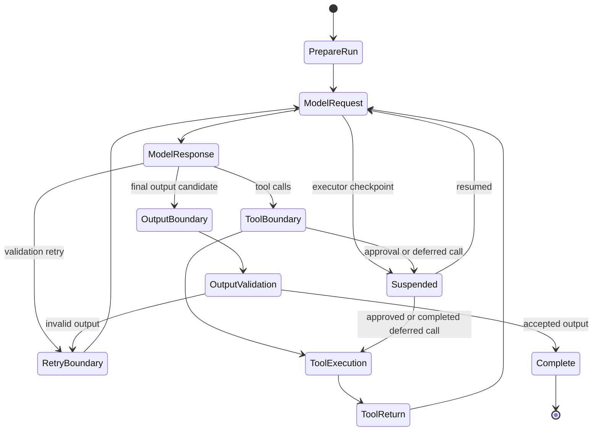
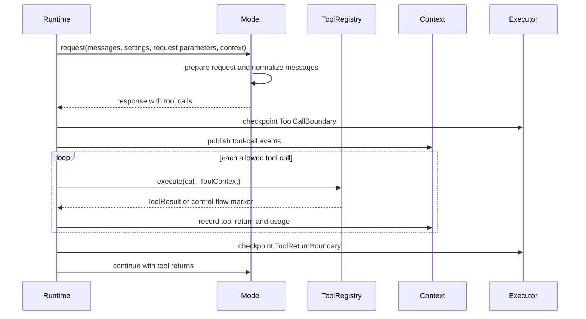
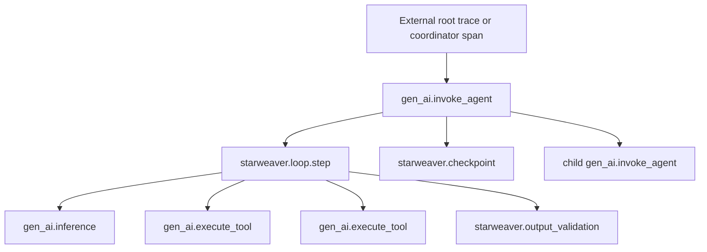
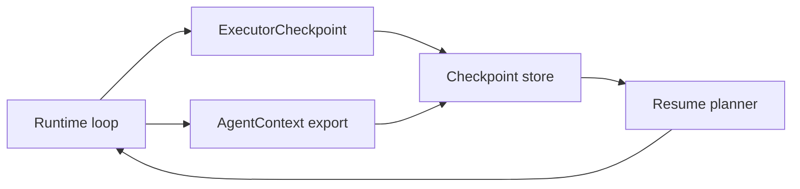
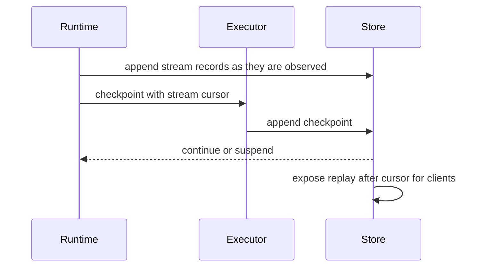

# Agent Loop and Runtime Kernel

The runtime kernel turns a prompt, context, model adapter, tool registry, output policy, and capability bundle into a deterministic run. It is the Rust equivalent of the core Starweaver agent loop, with explicit graph states and checkpoint seams for durable execution.

## Responsibilities

- Build model requests from prompt, instructions, message history, tools, output schema, settings, and request parameters.
- Execute model calls through `starweaver-model` adapters.
- Detect final output, tool calls, output function calls, deferred calls, and approval-required calls.
- Execute function tools and toolsets through `starweaver-tools`.
- Retry model output and tool calls according to semantic retry budgets.
- Emit typed stream records and executor checkpoints.
- Update `AgentContext` with messages, events, usage, notes, and state changes.

## Loop States

## Request Assembly

The runtime assembles each model request in this order:

1. Restore message history from `AgentContext` or caller-provided history.
2. Add static and dynamic instructions.
3. Apply history processors, compaction, filters, and system prompt reinjection.
4. Collect tools from registry, toolsets, capabilities, and prepare-tools hooks.
5. Add output schema or output functions.
6. Merge model defaults, agent settings, scoped overrides, and per-run settings.
7. Attach request parameters: tools, native tools, output schema, output mode, instruction parts, thinking, HTTP overrides, extra body, and replay/audit metadata.
8. Hand canonical messages, settings, request parameters, and `ModelRequestContext` to `starweaver-model` for profile-driven preparation and message normalization.
9. Emit pre-request events, prepared request evidence, and checkpoint records.

## Tool Boundary

Tool execution rules:

- Tool calls are counted after successful execution.
- Per-tool retry budgets are independent.
- Approval and deferred tool returns are represented as structured control-flow metadata.
- Prepare-tools hooks may annotate, hide, or reorder tool definitions before each model call.
- Capabilities may contribute tools and observe lifecycle events.

## Output Boundary

Output handling has four supported modes:

- text output
- structured JSON output
- typed structured parsing
- output function calls

Validation runs after the model response and before completion. A validator may accept the output, request a retry with feedback, or fail the run after retry budget exhaustion. Output functions can end the run and return their result directly to the application.

## Streaming Contract

Runtime streaming exposes stable records for:

- run start and completion
- model request and response boundaries
- response part start, typed delta, and end
- text, thinking, tool-call name, tool-call argument, native payload, and file metadata deltas
- tool call and tool result events
- output retry events
- checkpoint and suspend events

Streaming APIs should support both collected streams and externally handled streams. The service runtime can replay persisted events as SSE from stored runtime evidence, and platform adapters can translate the same event records into external UI protocols.

## Observability Seam

The runtime should create or receive a trace context through `AgentContext` and emit spans that follow OpenTelemetry GenAI semantics. One trace contains the full agent loop. The agent run span is the parent for loop-step spans, each loop-step span groups its model request, sibling tool executions, output validation, and retry events, and subagent spans recurse under the parent agent span. Service runtimes may create an outer coordinator span and pass it to the SDK as the parent context.

The runtime should depend on a small trace recorder contract. The first implementation should include an in-memory recorder for deterministic span-tree snapshot tests, followed by feature-gated `tracing`, OpenTelemetry, OTLP, and Langfuse-friendly adapters. Span records should carry run id, conversation id, agent id, checkpoint id, model provider, model name, tool name, tool call id, usage, finish reason, retry metadata, and error type when available. Content attributes are controlled by a redaction policy.

## Durable Executor Seam

The runtime owns checkpoint emission; the durable service owns persistence and resume orchestration.

A checkpoint includes:

- run id and conversation id
- graph state
- message cursor
- pending tool calls or output validation state
- usage snapshot
- environment state reference when an environment provider participates
- suspend reason when approval, deferral, cancellation, or external resource wait occurs

## Streaming Checkpoints

A streaming run has two durable cursors: canonical message cursor and stream cursor. The runtime emits ordered `AgentStreamRecord` values for run start, model request, model deltas, tool calls, tool returns, checkpoints, suspensions, retries, and completion. A service runtime persists stream records incrementally and stores the latest persisted sequence in checkpoint resume evidence.

Resume uses this lifecycle:

This keeps checkpoint reload independent from UI/SSE replay. The checkpoint captures safe execution state, while stream replay captures delivery state for clients that reconnect during service-managed runs.

## Acceptance Gates

- graph transition tests cover final text, tool call, retry, idle redirect, and max-step paths
- runtime tests cover settings forwarding, tool boundaries, output retries, usage limits, capability hooks, stream events, history processors, and checkpoints
- replay tests cover provider response shapes and prepared request snapshots that drive tool/output branches
- model tests cover typed message parts, request preparation, malformed tool-call argument preservation, and stream final assembly
- durable resume tests cover restored context and checkpoint continuation before service runtime graduation
