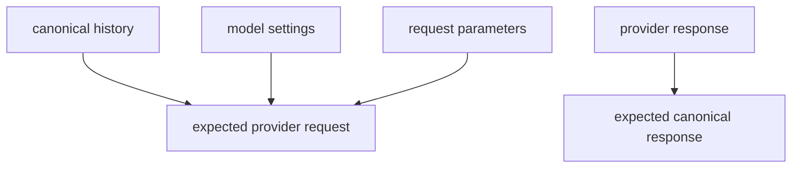

# Model Providers, Transport, and Replay

The model layer is the compatibility boundary between Starweaver's canonical agent protocol and provider APIs. It mirrors Pydantic AI's provider discipline: provider-specific request shaping, response normalization, settings/profile behavior, deterministic test models, production request guards, and replay-driven compatibility tests.

## Model Layer Responsibilities

- Define canonical messages, request parts, response parts, usage, finish reasons, and provider metadata.
- Define `ModelSettings`, `ModelRequestParameters`, `ModelProfile`, and protocol families.
- Translate canonical history into provider wire requests.
- Parse provider responses into canonical `ModelResponse` values.
- Support injectable HTTP clients, endpoint overrides, headers, extra body fields, retry policy, and gateway routing.
- Provide deterministic `TestModel` and `FunctionModel` for application and runtime tests.
- Block production model calls in tests through a request guard.
- Maintain replay fixtures as provider compatibility contracts.

## Provider Families

| Provider family    | Current protocol target | Replay requirement                                                                   |
| ------------------ | ----------------------- | ------------------------------------------------------------------------------------ |
| OpenAI Chat        | Chat Completions        | text, tool call, tool return, structured output, finish reason, usage                |
| OpenAI Responses   | Responses API           | text, function call, native tools, native MCP, structured output, usage              |
| Anthropic Messages | Messages API            | text, tool use, tool result, thinking, stop reason, usage                            |
| Gemini             | generateContent         | text, function call, function response, system instruction, generation config, usage |
| Bedrock            | Converse                | text, tool use, tool result, system field, inference config, usage                   |

## Replay Fixture Contract

Every replay fixture stores the full compatibility surface in JSON:



Required fixture fields:

- `model`
- `history`
- `settings`
- `tools`
- `native_tools`
- `request_parameters`
- `expected_provider_request`
- `provider_response`
- `expected_response`

Request-only fixtures omit provider response and expected canonical response.

## Replay Matrix

Current fixture-driven coverage includes:

| Area                                       | Covered                               |
| ------------------------------------------ | ------------------------------------- |
| OpenAI Chat text                           | yes                                   |
| OpenAI Chat tool call                      | yes                                   |
| OpenAI Chat tool return history            | yes                                   |
| OpenAI Responses text                      | yes                                   |
| OpenAI Responses function call             | yes                                   |
| OpenAI Responses native web search request | yes                                   |
| OpenAI Responses native MCP request        | yes                                   |
| Anthropic text                             | yes                                   |
| Anthropic tool use                         | yes                                   |
| Anthropic tool result history              | yes                                   |
| Gemini text                                | yes                                   |
| Gemini function call                       | yes                                   |
| Gemini function response history           | yes                                   |
| Bedrock text                               | yes                                   |
| Bedrock tool use                           | yes                                   |
| Bedrock tool result history                | yes                                   |
| Request parameters serialization           | yes                                   |
| Settings merge precedence                  | yes                                   |
| Profile capability contracts               | yes                                   |
| Structured output request mapping          | OpenAI Chat, OpenAI Responses, Gemini |

## CI Gate

`make replay-check` is the focused provider compatibility gate. CI runs it before the full test suite.

```bash
make replay-check
```

The target runs:

```bash
cargo test -p starweaver-model --test replay --test request_parameters --locked
```

## Migration Rules

- Add a fixture before changing a provider mapper.
- Keep canonical history and expected provider JSON in the same fixture.
- Compare canonicalized JSON to avoid map ordering noise.
- Assert usage, provider metadata, finish reason, and tool call parts in every response replay.
- Store provider quirks in mapper tests first, then promote stable behavior into docs/spec.
- Record unsupported Pydantic AI replay categories in `memos/implementation-todo.md`.

## Bug Fix Policy

Replay failures are handled in this order:

1. Verify fixture shape against provider documentation or captured cassette evidence.
2. Fix mapper request generation or response parsing.
3. Add regression assertions for the exact canonical field that failed.
4. Run `make replay-check` and `make check`.
5. Update the TODO matrix when a provider behavior needs a new canonical type.

## Remaining Replay Families

Remaining replay families are tracked in `memos/implementation-todo.md`:

- streaming chunk and delta fixtures
- provider status and malformed response fixtures
- refusal/content-filter fixtures
- Anthropic thinking block fixtures
- OpenAI Responses reasoning item fixtures
- Gemini safety block fixtures
- Bedrock strict tool-choice and Converse edge cases
- multimodal input and tool return fixtures
- provider-specific model setting aliases
- cassette import/scrub utility for real recordings
