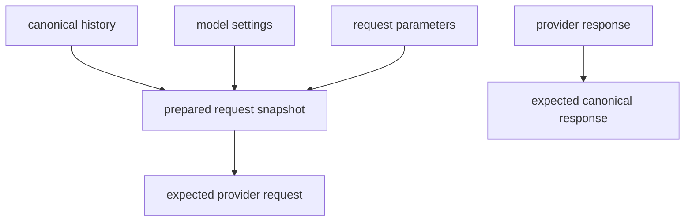

# Model Providers, Transport, and Replay

The model layer is the contract boundary between Starweaver's canonical agent protocol and provider APIs. It mirrors provider-neutral agent framework discipline: provider-specific request shaping, response normalization, settings/profile behavior, deterministic test models, production request guards, and replay-driven contract tests.

## Model Layer Responsibilities

- Define canonical messages, request parts, response parts, content parts, tool-call arguments, usage, finish reasons, response lifecycle state, and provider metadata.
- Define `ModelSettings`, typed nested provider settings, `ModelRequestParameters`, `ModelRequestContext`, `ModelProfile`, protocol families, and built-in model presets.
- Prepare requests by merging settings, resolving profile-driven output/thinking/native-tool behavior, applying provider/profile request policy, normalizing messages, and producing prepared request snapshots.
- Translate canonical history into provider wire requests, including typed provider settings and raw escape hatches.
- Parse provider responses into canonical `ModelResponse` values.
- Support injectable HTTP clients, endpoint overrides, headers, extra body fields, retry policy, and gateway routing.
- Provide deterministic `TestModel` and `FunctionModel` for application and runtime tests.
- Block production model calls in tests through a request guard.
- Maintain replay fixtures as provider request/response contracts.

## Built-in Presets

The model layer owns provider-neutral preset data so SDK apps and service profiles can share one mapping. Presets include:

- model settings presets for reasoning/thinking effort, token limits, provider-specific extra body fields, beta headers, and service tier routing
- model config presets for context window, media limits, and `ModelProfile` capability flags
- runtime preset assembly that combines a model id, provider/model names, settings preset, config preset, and HTTP config into a `ProviderAlias`

Provider mappers consume these presets through the same `ModelSettings`, `ModelProfile`, `HttpModelConfig`, and `ProviderAlias` contracts used by handwritten configuration.

## Typed Provider Settings and Routing

`ModelSettings` keeps generic settings provider-neutral while exposing typed nested provider settings for official provider-specific fields:

| Provider settings struct  | Purpose                                                                                                                                                                    |
| ------------------------- | -------------------------------------------------------------------------------------------------------------------------------------------------------------------------- |
| `OpenAiChatSettings`      | Chat-specific `user`, `store`, logprobs, prediction, and prompt-cache controls                                                                                             |
| `OpenAiResponsesSettings` | Responses-specific `store`, `user`, truncation, text verbosity, context management, include list, and prompt-cache controls                                                |
| `AnthropicSettings`       | Messages metadata, `anthropic-beta` betas, context management, container, and service tier                                                                                 |
| `GoogleSettings`          | Gemini safety settings, cached content, labels, logprobs, Gemini API service tier, and Google Cloud routing tier                                                           |
| `BedrockSettings`         | Converse guardrails, performance config, request metadata, additional response paths, prompt variables, additional request fields, and inference profile `modelId` routing |
| `CodexSettings`           | Codex OAuth session/thread routing IDs                                                                                                                                     |
| `GatewaySettings`         | Gateway sticky `x-session-id` and gateway-scoped extra headers                                                                                                             |

Provider-specific typed settings should be the primary alignment surface. `provider_options`, `extra_body`, and `extra_headers` remain raw escape hatches; final raw body/header overlays intentionally win over typed settings.

Session-affinity routing uses `AgentContext.session_id` as a logical affinity source. Runtime request building converts that value into a low-priority typed `ModelSettings` overlay for OpenAI prompt-cache keys, Codex OAuth session/thread IDs, or opt-in Gateway sticky routing. Durable local session IDs remain trace/session metadata and are not generic model HTTP headers. `starweaver.durable_session_id` is the canonical durable local session metadata key.

## Provider Families

| Provider family    | Current protocol target | Replay requirement                                                                   |
| ------------------ | ----------------------- | ------------------------------------------------------------------------------------ |
| OpenAI Chat        | Chat Completions        | text, tool call, tool return, structured output, finish reason, usage                |
| OpenAI Responses   | Responses API           | text, function call, native tools, native MCP, structured output, usage              |
| Anthropic Messages | Messages API            | text, tool use, tool result, thinking, stop reason, usage                            |
| Gemini             | generateContent         | text, function call, function response, system instruction, generation config, usage |
| Bedrock            | Converse                | text, tool use, tool result, system field, inference config, usage                   |

## Message and Request Abstraction Contract

The model protocol uses a typed conversation AST defined in `06-message-request-abstractions.md`:

- `ModelMessage` separates request history from response history.
- `ModelRequestPart` owns system prompts, structured instructions, user prompts, tool returns, and retry prompts.
- `ModelResponsePart` owns text, thinking, function tool calls, native tool calls/returns, generated files, and compaction summaries.
- `ContentPart` owns text, URL media, inline binary media, data URLs, and resource references.
- `ToolCallPart` should evolve from raw `serde_json::Value` arguments toward a typed argument state that preserves parsed objects, raw JSON strings, and invalid-marker evidence.

`ModelRequestParameters` is the single per-call negotiation object for function tools, native tools, output mode/schema, instruction parts, thinking, HTTP overrides, provider extra body fields, and replay/audit metadata. Provider adapters receive prepared parameters after model profile capability resolution.

## Request Preparation and Normalization

Before provider wire mapping, the model layer should:

1. merge low-priority runtime routing overlays, model defaults, agent settings, scoped overrides, and run settings
2. customize tool and output schemas through profile-specific schema transforms
3. resolve default output mode and validate output/media support
4. resolve thinking/reasoning settings from unified model settings into provider-specific request shapes
5. apply profile/provider request policy, including dropping sampling parameters only when reasoning profiles require it and reasoning is active
6. deduplicate native tools and resolve native-tool/function-tool fallback policy
7. append prompted-output instructions to instruction parts when the selected output mode requires them
8. normalize message history according to the active `ModelProfile`
9. emit a prepared request snapshot for traces and replay fixtures

Normalization policies include preserving canonical items, merging adjacent provider roles, lifting system prompts into a top-level system field or system instruction object, and wrapping later system fragments as tagged user content for providers with top-level-only system support.

## Trace and Replay Evidence

Model calls produce three evidence layers:

1. Canonical model evidence from the runtime: provider-neutral messages, settings, request parameters, canonical stream events, canonical response, usage, finish reason, provider metadata, run id, conversation id, and trace context. This is info-level telemetry and is enabled by default.
2. Prepared request evidence from the model layer: normalized messages, prepared request parameters, selected output mode, resolved thinking/native-tool behavior, profile id, and schema transformations. This is info-level telemetry with content redaction applied by policy.
3. Provider request audit evidence from the protocol client: exact HTTP method and URL, optional merged headers/body/options, request metadata, model name, provider name, and streaming flag. This is outside the redacted span tree and is enabled only when an application installs a provider request audit recorder.

Replay fixtures continue to use canonical history plus prepared request evidence plus expected provider request/response. `ProviderRequestAuditSnapshot` provides a direct capture path for generating or auditing fixtures. Sensitive headers and prompt content pass through the explicit audit policy before exporter delivery; local fixture import keeps scrub rules in the replay tooling.

## Replay Fixture Contract

Every replay fixture stores the full provider contract surface in JSON:



Current required fixture fields:

- `model`
- `history`
- `expected_provider_request`

Optional fixture fields supported by current tests or target schema:

- `settings`
- `tools`
- `native_tools`
- `request_parameters`
- `provider_response`
- `expected_response`
- `expected_error`

Target fixture field after the next replay-schema migration:

- `prepared_request`

Request-only fixtures omit provider response and expected canonical response. The `prepared_request` snapshot type and preparation tests are landed, while provider fixture JSON entries should adopt `prepared_request` provider-by-provider before this field becomes required.

## Replay Matrix

Current fixture-driven coverage includes:

| Area                                       | Covered                                                                                                                                   |
| ------------------------------------------ | ----------------------------------------------------------------------------------------------------------------------------------------- |
| OpenAI Chat text                           | yes                                                                                                                                       |
| OpenAI Chat tool call                      | yes                                                                                                                                       |
| OpenAI Chat tool return history            | yes                                                                                                                                       |
| OpenAI Responses text                      | yes                                                                                                                                       |
| OpenAI Responses function call             | yes                                                                                                                                       |
| OpenAI Responses native web search request | yes                                                                                                                                       |
| OpenAI Responses native MCP request        | yes                                                                                                                                       |
| Anthropic text                             | yes                                                                                                                                       |
| Anthropic tool use                         | yes                                                                                                                                       |
| Anthropic tool result history              | yes                                                                                                                                       |
| Gemini text                                | yes                                                                                                                                       |
| Gemini function call                       | yes                                                                                                                                       |
| Gemini function response history           | yes                                                                                                                                       |
| Bedrock text                               | yes                                                                                                                                       |
| Bedrock tool use                           | yes                                                                                                                                       |
| Bedrock tool result history                | yes                                                                                                                                       |
| Request parameters serialization           | yes                                                                                                                                       |
| Prepared request snapshots                 | model-layer snapshot type and preparation tests landed; per-provider fixture fields remain follow-up                                      |
| Typed tool-argument preservation           | yes                                                                                                                                       |
| Settings merge precedence                  | yes, including nested typed provider settings                                                                                             |
| Profile capability contracts               | yes, including native-tool mapper consistency and active-reasoning sampling-drop policy                                                   |
| OpenAI typed parameter mapping             | Chat/Responses prompt cache, official/OpenAI-protocol max-token variants, seed, user/store/logprobs/truncation/includes                   |
| Anthropic typed parameter mapping          | tool choice, parallel-tool disable, native JSON schema output, betas, metadata/context/container/service tier                             |
| Gemini typed parameter mapping             | seed, safety settings, cached content, labels, logprobs, service tier                                                                     |
| Bedrock typed parameter mapping            | `ToolChoice::None`, top-k/thinking passthrough, service tier, guardrail/performance/request metadata, inference-profile `modelId` routing |
| Session-affinity routing                   | OpenAI prompt cache, Codex OAuth headers, opt-in Gateway `x-session-id`                                                                   |
| Structured output request mapping          | OpenAI Chat, OpenAI Responses, Gemini, Anthropic JSON schema; Bedrock native output remains follow-up                                     |

## CI Gate

`make replay-check` is the focused provider contract gate. CI runs it before the full test suite.

```bash
make replay-check
```

The target runs:

```bash
cargo test -p starweaver-model --test replay --test request_parameters --locked
```

## Migration Rules

- Add a fixture before changing a provider mapper.
- Keep canonical history and expected provider JSON in the same fixture; add prepared request snapshots to fixtures as the replay-schema migration progresses.
- Compare canonicalized JSON for map-order-independent assertions.
- Assert usage, provider metadata, finish reason, and tool call parts in every response replay.
- Store provider quirks in mapper tests first, then promote stable behavior into docs/spec.
- Record unsupported provider replay categories in `spec/alignment/05-models-output-provider-alignment.md`.
- Add typed stream-delta fixtures before widening model stream event variants.

## Provider Mapper Boundaries

Provider protocol support should move toward explicit mapper boundaries after replay fixtures lock behavior:

- request mapping from canonical `ModelRequest` and prepared parameters to provider wire JSON
- response parsing from provider wire JSON into canonical `ModelResponse`
- stream parsing from provider chunks into typed part start/delta/end events
- common content, tool, usage, settings, and error helpers shared across providers
- transport concerns for auth, retry, headers, endpoint overrides, reqwest execution, and SSE parsing

The transport layer should remain provider-neutral. Provider-specific response parsing should stay independent from reqwest and HTTP retry internals. Refactors should preserve replay fixture request JSON, canonical response fields, usage mapping, finish reason mapping, OpenAI Responses incremental stream events, and `STARWEAVER_ALLOW_REAL_MODEL_REQUESTS` guard behavior.

## Bug Fix Policy

Replay failures are handled in this order:

1. Verify fixture shape against provider documentation or captured cassette evidence.
2. Fix mapper request generation or response parsing.
3. Add regression assertions for the exact canonical field that failed.
4. Run `make replay-check` and `make check`.
5. Update `spec/alignment/05-models-output-provider-alignment.md` when a provider behavior needs a new canonical type.

## Remaining Replay Families

Remaining replay families are tracked in `spec/alignment/05-models-output-provider-alignment.md`:

- per-provider prepared request snapshot fixture fields
- streaming chunk and delta fixtures
- provider status and malformed response fixtures
- refusal/content-filter fixtures
- additional Anthropic thinking/signature block fixtures beyond current request-parameter coverage
- OpenAI Responses reasoning item fixtures beyond current request mapping tests
- Gemini safety response block fixtures beyond typed request-parameter coverage
- Bedrock strict tool-choice, Nova-family variants, and Converse edge cases beyond current Anthropic-family request mapping
- multimodal input and tool return fixtures
- broader provider-specific model setting alias coverage
- cassette import/scrub utility for real recordings
