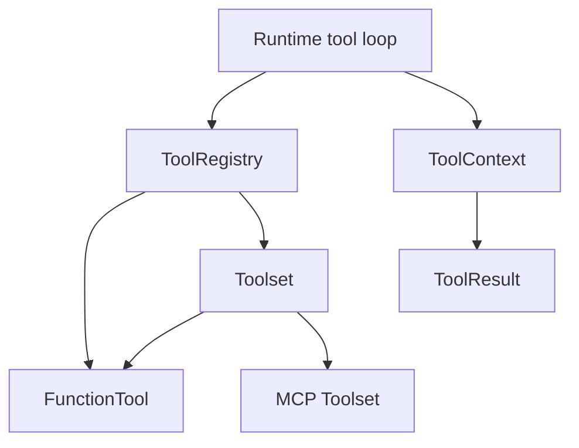
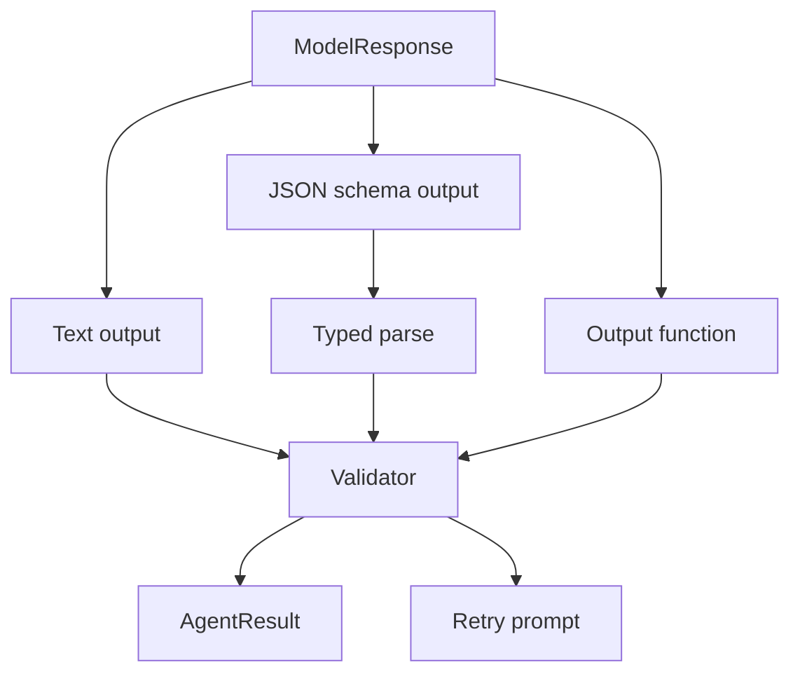

# Tools, Output, and Capabilities

Tools, output policies, and capabilities form the core extension system. This layer separates function tools, toolsets, structured output, output functions, validators, hooks, and reusable capability bundles.

## Responsibilities

- Represent provider-neutral tool schemas and runtime tool metadata.
- Execute dynamic tools with `ToolContext` access to execution metadata and typed dependencies, including the active `AgentContext` when running inside an agent.
- Compose tools through registries, toolsets, prefixed toolsets, and MCP-backed toolsets.
- Support tool retry budgets, approval-required markers, and deferred execution markers.
- Represent final output through text, JSON schema, typed parsing, validators, and output functions.
- Package tools, instructions, validators, model settings, history processors, and hooks into capabilities.

## Tool Model

A tool definition includes:

- name
- description
- JSON schema parameters
- retry metadata
- approval/deferred metadata
- provider adaptation metadata
- capability and audit metadata

A tool result includes:

- JSON content
- status
- metadata
- control-flow markers for approval or deferral

## Toolset Composition

Toolsets solve reusable bundles and dynamic surfaces:

- static groups of related tools
- prefixed tools to prevent naming collisions
- MCP-discovered tools
- environment-backed tools
- search-indexed tools
- skills-generated tools
- proxy/remote tools

Toolset instructions are grouped and deduplicated before injection into model prompts.

## Output Policy

Output modes:

- text output accepted from text parts
- structured output parsed from text JSON or provider-native structured output
- typed output parsed into an application type
- output functions that finish a run through a tool-like call
- validators that accept, transform, or request retry

When a response contains both output function calls and ordinary tool calls, the
runtime `AgentEndStrategy` controls completion:

- `early`: complete with the first valid output function and skip ordinary tools.
- `graceful`: execute ordinary tools from the same response, append their returns
  to history, and complete with the first valid output.
- `exhaustive`: execute ordinary tools from the same response, append their
  returns to history, and complete with the first valid output.

SDK ergonomics should expose output policy builders, while runtime semantics remain in `starweaver-runtime`.

## Capability Bundles

A capability bundle can contribute:

- tools and toolsets
- static instructions
- dynamic instructions
- model settings
- request parameters
- native tools
- output schemas
- output validators
- output functions
- prepare-tools hooks
- history processors
- lifecycle hooks
- usage limits
- stream observers

Capabilities are the integration point for product features. A feature that injects environment instructions, handles media uploads, normalizes reasoning, or switches models becomes a capability with explicit context access and tests.

## Hook Points

Core hook families:

- before run
- before model request
- after model response
- before tool execution
- after tool result
- before output validation
- after output validation
- on retry
- on stream event
- on checkpoint

Hook design should preserve deterministic ordering and make side effects visible through `AgentContext` events.

## Acceptance Gates

- Tool schema serialization tests.
- Function tool execution tests.
- Toolset registration and prefix tests.
- Tool retry precedence tests.
- Approval/deferred metadata tests.
- Structured output and typed output tests.
- Output validator retry tests.
- Output function tests.
- Capability bundle contribution tests.
- Prepare-tools hook tests.
