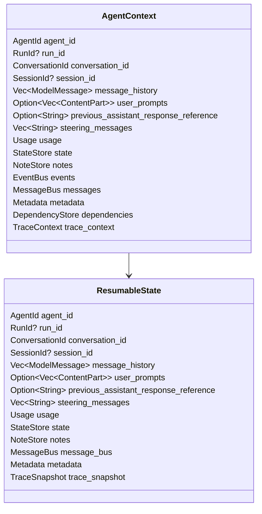
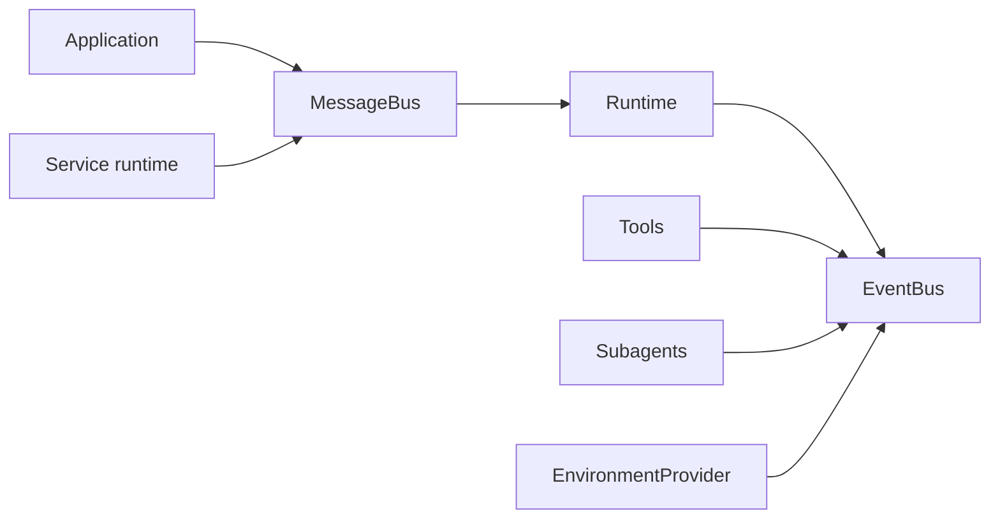
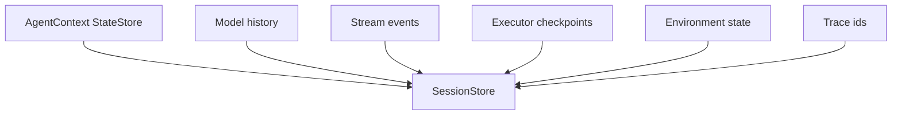
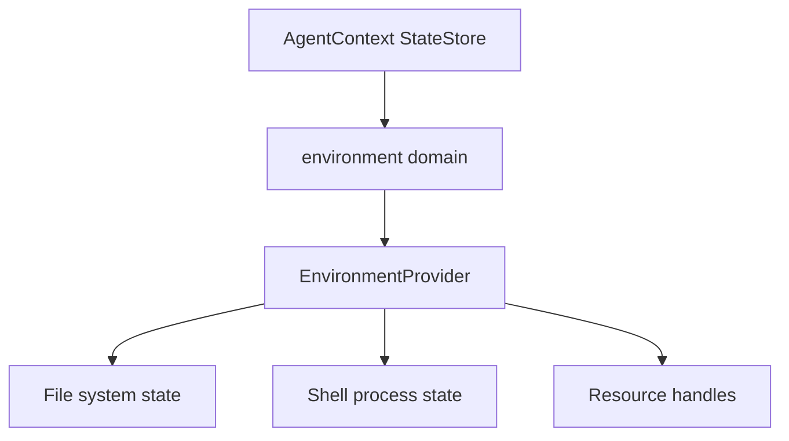

# Context, State, and Executor Evidence

`AgentContext` is the run-local and session-local evidence carrier. It is the shared substrate for dependencies, state, events, messages, notes, usage, environment bindings, trace context, and durable execution records.

## Context Responsibilities

- Identify the active agent, run, conversation, and optional logical session-affinity id.
- Store canonical model history.
- Store explicit compact-restore inputs for the current run: user prompt content, previous assistant reference text, and user steering messages.
- Track usage across runs and subagent delegation.
- Carry typed and named dependencies for tools, hooks, validators, and dynamic instructions.
- Persist `StateStore` domains for application state.
- Persist `NoteStore` entries for lightweight session memory.
- Publish typed events through `EventBus`.
- Queue steering, coordination, and sideband messages through `MessageBus`.
- Export and restore `ResumableState`.
- Carry trace parent context and span correlation identifiers.
- Derive child contexts for subagents and absorb durable child state after completion.

## Context Shape

Compact restore uses these explicit fields instead of reconstructing intent from history. The runtime records the effective current prompt in `user_prompts`, captures visible text from the assistant response immediately before the prompt in `previous_assistant_response_reference`, and appends drained sideband steering text to `steering_messages`. The compact and handoff filters share restored-request builders that emit blocks in this order: `<context-restored>`, `<previous-assistant-reference>`, `<original-request>`, then `<user-steering>`.

## Session Affinity Boundary

`AgentContext.session_id` is an optional logical affinity id that can survive resumable state export/import. It is not a provider wire-format field. Runtime request building may convert it into a low-priority typed `ModelSettings` overlay, and provider mappers then translate typed settings into protocol-specific bodies or headers.

Durable local session ids remain `SessionStore`/CLI concerns. CLI metadata uses `starweaver.durable_session_id` and `starweaver.durable_run_id` as canonical durable identifiers, with `cli.session_id` / `cli.run_id` aliases for CLI consumers. `starweaver.session_id` is retained only as a compatibility fallback for older routing/trace consumers.

Provider-specific routing headers are not generic context metadata. Codex OAuth owns `session_id`, `session-id`, `thread_id`, `thread-id`, and `x-client-request-id` headers through typed `CodexSettings`; Gateway sticky routing owns `x-session-id` through typed `GatewaySettings` or explicit raw headers.

## State Domains

`StateStore` stores JSON values under stable domain keys. Domains should be used for state that can survive process boundaries:

- session preferences
- tool bundle state
- environment state references
- task manager records
- skill registry state
- durable executor cursors
- service runtime metadata
- trace correlation ids

Typed dependencies remain process-local and are rehydrated by the application or service runtime after restore.

## Notes and Context Instructions

`NoteStore` is serializable session memory. Model-facing context instructions expose note keys and metadata while keeping note values available to tools and application code through context APIs.

This shape supports persistent notes and future user-controlled memory tools.

## Event and Message Buses

Events are append-only run evidence. Messages are queued sideband inputs that may steer or coordinate future work.

## Subagent Context Policy

A child context receives:

- parent conversation id
- inherited usage baseline
- state snapshot
- notes snapshot
- typed dependencies
- parent metadata references

A child context starts with:

- empty model history
- empty event bus
- empty message bus
- a fresh run id assigned when the child run starts

After successful delegation, the parent absorbs child usage and notes. Additional state absorption should be policy-driven when subagents begin modifying shared domains.

## Native Environment and Context Boundary

`AgentContext` is the short-lived run/session evidence carrier. `EnvironmentProvider` is the long-lived resource owner. The SDK should bind an environment into context through typed dependencies and persist only serializable environment references in `StateStore`.

This keeps the core context native to the runtime while allowing SDK apps, service runtimes, and downstream products to restore local, Docker, sandbox, or remote environments with application-specific factories. The context should expose small helpers for environment state snapshots, trace parents, messages, notes, and durable cursors; concrete filesystem, shell, media, and resource behavior belongs to environment providers and tool bundles.

## Executor Evidence

The runtime should produce checkpoint records that can be persisted alongside context state.

Checkpoint fields:

- checkpoint id
- run id
- conversation id
- graph state
- model request attempt index
- tool call batch id
- output validation attempt index
- pending approval or deferred call metadata
- usage snapshot
- context state hash or revision
- environment provider state reference
- stream cursor

## SessionStore Fit

A durable `SessionStore` should be an upper-layer consumer of `AgentContext`, `StateStore`, event records, executor checkpoints, environment state, and trace ids. The core contract supports this shape by keeping serializable state separate from process-local dependencies and by assigning stable run, conversation, checkpoint, and stream cursor identifiers.

The store should be able to project compact run traces for tools and UI, while full nested spans live in an OpenTelemetry backend. Store adapters can add indexes for session id, run id, parent run id, conversation id, checkpoint id, trace id, and span id.

## Environment State Reference

Environment-backed tools should store durable handles in context state:

The environment provider owns concrete restoration semantics. The context stores serializable identifiers, policies, and resource references.

## Agent Loop Refactor Invariants

Runtime loop decomposition should preserve the observable evidence produced by `AgentContext`, checkpoints, traces, and stream records. Before splitting `run_loop.rs` or `runtime_helpers.rs`, add golden tests for:

- checkpoint node ordering and checkpoint identifiers
- stream record ordering across model request, model stream, model response, tool call, tool return, output retry, steering guard, and run completion
- trace span names, parent/child relationships, and correlation metadata
- retry counters for model requests, output validation, and per-tool execution
- tool usage accounting and parent/subagent usage absorption
- context event flushing and message bus consumption semantics
- approval/deferred pending state and resume metadata
- graph transition alignment between the imperative loop and `graph.rs`

These tests are the acceptance boundary for splitting request preparation, model invocation, tool execution, output flow, streaming, checkpointing, and trace event modules.

## Acceptance Gates

- context export/restore tests, including `AgentContext.session_id`
- note export/restore tests
- dependency access tests
- message bus tests
- event bus tests
- subagent context derivation tests
- usage absorption tests
- executor checkpoint serialization tests
- environment state reference tests before `starweaver-environment` graduation
- trace context export/restore tests
- SessionStore contract tests before service-host graduation
