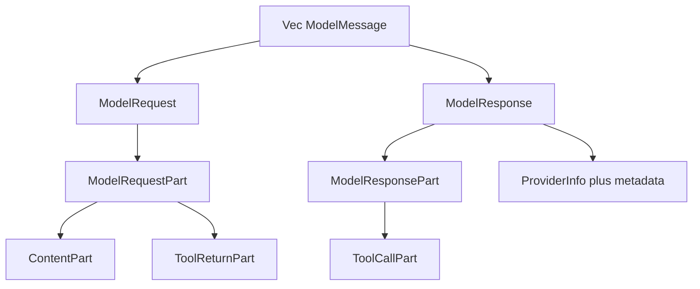
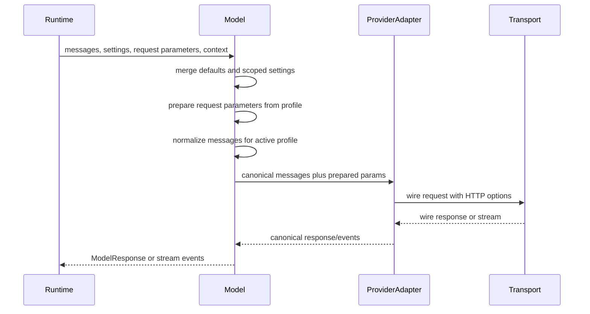
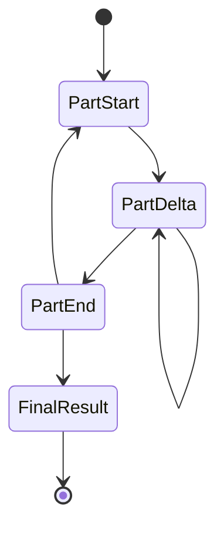

# Message and Model Request Abstractions

This spec captures the message and model-request design lessons from the Pydantic AI reference review. The goal is a compact Rust-native conversation AST and a request-preparation contract that remain durable, replayable, and provider-neutral.

## Reference Findings

Pydantic AI uses a typed part-based message tree centered on `ModelRequest`, `ModelResponse`, request parts, response parts, content parts, tool-call parts, provider metadata, model profiles, and structured stream events. The most useful concepts for Starweaver are:

- conversation history as typed request and response items
- separate request-side and response-side part unions
- tool calls and tool returns as first-class durable history elements
- retry prompts as first-class model input evidence
- provider-neutral metadata plus provider-specific detail bags
- structured model stream events with part start, part delta, part end, and final result
- a single `ModelRequestParameters` object for tools, native tools, output mode, instructions, media/output permissions, HTTP overrides, and provider extra body
- model profiles that resolve capability-sensitive request shaping before provider mapping
- provider-owned client/auth/lifecycle boundaries

Starweaver already has the core substrate in `starweaver-model`: `ModelMessage`, `ModelRequest`, `ModelResponse`, `ModelRequestPart`, `ModelResponsePart`, `ContentPart`, `ToolCallPart`, `ToolReturnPart`, `ModelRequestParameters`, `ModelRequestContext`, `ModelProfile`, and `ModelResponseStreamEvent`. This spec defines the next refinements and acceptance rules.

## Canonical Conversation AST



The AST owns provider-neutral conversation evidence. Provider adapters may transform the AST into wire roles, system fields, tool result blocks, native tool envelopes, and media payloads while preserving enough metadata to reconstruct canonical history.

### Request Parts

`ModelRequestPart` should cover these stable request-side concepts:

| Part           | Purpose                           | Durability evidence                                             |
| -------------- | --------------------------------- | --------------------------------------------------------------- |
| `SystemPrompt` | developer/system guidance         | timestamp, static/dynamic origin, cache boundary metadata       |
| `Instruction`  | structured instruction fragment   | source id, static/dynamic marker, capability/toolset origin     |
| `UserPrompt`   | user content and media            | speaker name, content ids, media/resource metadata              |
| `ToolReturn`   | function-tool result              | tool call id, tool name, result payload, error/control metadata |
| `RetryPrompt`  | validator or tool repair feedback | target tool call id or output attempt id, retry reason          |

Instruction provenance is important for cache placement, handoff, compaction, and system-prompt reinjection. The initial Rust surface can keep provenance in metadata, with typed fields added after cache-control and handoff call sites stabilize.

### Response Parts

`ModelResponsePart` should cover these stable response-side concepts:

| Part               | Purpose                              | Durability evidence                                              |
| ------------------ | ------------------------------------ | ---------------------------------------------------------------- |
| `Text`             | final or intermediate assistant text | part id, content metadata                                        |
| `Thinking`         | provider reasoning/thinking text     | signature/provider details where available                       |
| `ToolCall`         | function-tool invocation             | stable call id, tool name, raw arguments, parsed arguments state |
| `NativeToolCall`   | provider-executed tool call          | native tool type, provider payload                               |
| `NativeToolReturn` | provider-executed tool result        | native tool type, provider payload                               |
| `File`             | provider-generated file/media        | URL or resource ref, media type, provider details                |
| `Compaction`       | summary or model-driven compaction   | summary text, input cursor range metadata                        |

Provider-sticky data such as thinking signatures, native tool payloads, uploaded file ids, and response ids belongs in provider metadata and should carry a provider identity marker.

## Tool Call Arguments

Pydantic AI preserves malformed tool-call JSON so retry flows can show the model the exact issue. Starweaver should represent tool arguments with three states:

| State           | Shape                                                 | Use                                                            |
| --------------- | ----------------------------------------------------- | -------------------------------------------------------------- |
| parsed object   | JSON object                                           | normal tool execution                                          |
| raw JSON string | string                                                | provider emitted deltas or malformed JSON that must round-trip |
| invalid marker  | structured marker with original text and parser error | validator feedback and replay regression evidence              |

This is implemented as `ToolArguments` in `starweaver-model`: parsed values execute locally, raw strings preserve provider wire text, and invalid markers retain parser errors for retry and replay evidence.

## Content Parts and Media Identity

`ContentPart` should keep media references typed and stable across tools, model requests, and replay fixtures:

- `Text`
- `ImageUrl`
- `FileUrl`
- `Binary`
- `ResourceRef`
- `DataUrl`

Future typed variants can split audio, video, document, uploaded-provider-file, and cache-point behavior. Each media value should expose a short stable identifier derived from the URL, resource URI, or content hash so model-visible instructions and tool returns can reference the same artifact.

Remote URL downloads should flow through SDK/environment media preflight with SSRF-safe policy, size limits, MIME detection, and resource-store routing. Provider mappers receive already-approved canonical content.

## Model Request Envelope

Runtime model calls should use this boundary:



`ModelRequestParameters` should be the single per-request negotiation object. It should group:

- function tools
- native tools
- output schema or output object
- output mode: text, native JSON schema, JSON object, tool output, prompted output
- text/image output allowances
- instruction parts with provenance metadata
- thinking/reasoning request level
- HTTP request overrides
- provider extra body fields
- request metadata for replay, tracing, and audit

`ModelRequestContext` should carry run id, conversation id, trace context, deployment metadata, redaction policy reference, and debug capture policy. Direct provider clients can use the same context for raw LLM-request evidence.

## Request Preparation Rules

Model implementations should expose a small preparation pipeline before provider-specific mapping:

1. merge model defaults, agent settings, scoped overrides, and per-run settings
2. resolve profile defaults for output mode, thinking, media support, and native tool behavior
3. customize tool and output schemas through profile-specific JSON-schema transforms
4. deduplicate native tools by stable id
5. resolve native-tool/function-tool fallback policy
6. attach prompted-output instructions as instruction parts when prompted or provider-required native output needs schema instructions
7. normalize message history for the target profile
8. produce a prepared request snapshot for trace and replay evidence

This keeps provider adapters focused on wire JSON mapping while the model layer owns capability negotiation.

## Message Normalization

Profiles should select a normalization policy:

| Policy                  | Behavior                                                                                            |
| ----------------------- | --------------------------------------------------------------------------------------------------- |
| `PreserveItems`         | keep canonical message boundaries                                                                   |
| `MergeAdjacentSameRole` | merge adjacent compatible provider roles                                                            |
| `SystemField`           | lift leading system/developer instructions into a top-level system field                            |
| `SystemInstruction`     | lift instructions into provider-specific system instruction objects                                 |
| `WrapInlineSystem`      | wrap later system fragments into tagged user content for profiles with top-level-only system fields |

Normalization should emit replay-visible evidence when it changes part boundaries. History processors and model mappers should share the same canonical request snapshot so compaction, trace, and fixture generation agree.

## Streaming Contract

Model streaming should use structured events:



Part delta events should carry typed deltas for text, thinking, tool-call name, tool-call arguments, native payload fragments, and file metadata. A stream builder should maintain the response lifecycle:

- `incomplete` while events are still arriving
- `complete` after final response assembly
- `interrupted` after explicit stream cancellation

Runtime, CLI display projection, and service replay can consume the same part lifecycle and derive user-facing display messages from canonical model evidence.

## Provider Boundary

The provider abstraction should own:

- provider name and base URL
- authentication configuration
- injected HTTP client and retry policy
- async lifecycle for clients it owns
- model profile lookup by model name
- gateway and audit routing metadata

The model client should consume a provider handle and a model profile, then apply request preparation and provider mapping. This separation supports custom gateways, replay clients, test clients, and hosted service policies.

## Replay and Testing Requirements

Add or maintain focused tests for:

```bash
cargo test -p starweaver-model --test message_ast --locked
cargo test -p starweaver-model --test request_preparation --locked
cargo test -p starweaver-model --test stream_replay --locked
cargo test -p starweaver-runtime --test history_processors --locked
make replay-check
```

Replay fixtures should capture:

- canonical input history before normalization
- prepared request snapshot after normalization
- `ModelRequestParameters` before and after profile preparation
- expected provider request JSON
- provider response JSON or stream events
- expected canonical response

## Implementation Status

Landed in the model-layer implementation slice:

1. typed `ToolArguments` with parsed, raw-string, and invalid-marker states
2. `ModelRequestParameters` fields for output mode, prepared instructions, thinking, output allowances, and replay/audit metadata
3. `PreparedModelRequest` snapshots with canonical history, normalized history, prepared params, selected profile, selected output mode, thinking, and preparation metadata
4. profile-driven `prepare_model_request` and `prepare_messages` helper APIs in `starweaver-model`
5. typed stream deltas and `ModelStreamState` lifecycle state
6. `ProtocolModelClient` integration with prepared request snapshots before provider wire mapping

Remaining follow-up priorities:

1. promote instruction provenance into typed fields after cache-control and handoff call sites stabilize
2. add per-provider replay fixture fields for prepared request snapshots
3. add schema-transform and redaction-status evidence to `PreparedModelRequest`
4. add provider-owned client/auth lifecycle traits after current protocol clients stabilize behind fixtures
5. add stable media identifiers for URL, resource, binary, uploaded-file, and data-url content

## Acceptance Gates

- Provider replay fixtures assert both pre-normalization and prepared request evidence for at least one provider from each protocol family.
- Tool-call argument tests preserve malformed JSON through retry feedback.
- Stream tests assemble final responses from typed part events for text, thinking, and tool-call arguments.
- Runtime tests verify retry prompts, tool returns, and instruction reinjection remain first-class `ModelRequestPart` values.
- Trace tests record prepared request snapshots under redaction policy.
