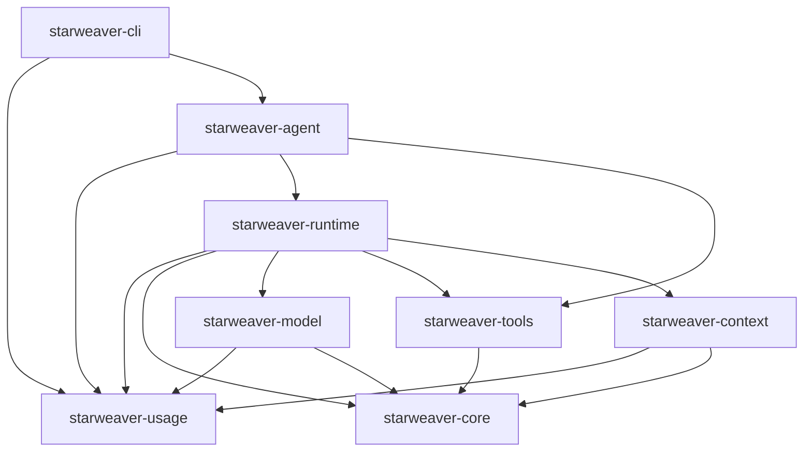

# Runtime, SDK, and Usage Boundaries

This spec records Starweaver's native boundary. It separates the agentic loop, runtime context, SDK ergonomics, and usage accounting so code uses Starweaver-native names and avoids migration concepts.

## Boundary Summary

## Agentic Loop Boundary

`starweaver-runtime` owns the agentic loop:

- run lifecycle and loop policy
- request assembly orchestration
- model invocation through `starweaver-model`
- tool execution through `starweaver-tools`
- output validation, output functions, retries, and steering guards
- capability hooks and capability bundles
- stream records, trace spans, and executor checkpoints
- usage-limit enforcement and usage snapshot event publication

The runtime should not own SDK product behavior such as first-party environment bundles, skill loading, media preprocessing policy, subagent file formats, CLI restore UI, or host-specific tool implementations.

## Context Boundary

`starweaver-context` owns neutral run and session evidence:

- agent, run, parent run, conversation, and optional logical session-affinity identifiers
- canonical model history
- typed dependencies
- state, notes, events, and message bus
- task state
- subagent history and agent registry metadata
- resumable state export/import profiles
- usage ledger entries and snapshot aggregation
- trace context and neutral provider correlation fields

Context may carry `AgentContext.session_id` as a logical affinity value, but provider wire-format routing belongs to `starweaver-model` typed `ModelSettings` and provider mappers. Durable local session ids belong to `starweaver-session`/CLI storage metadata; they are not generic model HTTP headers.

Context exports use neutral profiles:

- `ResumableExportOptions::curated()` for portable session restoration fields
- `ResumableExportOptions::full()` for full Starweaver runtime state

The context crate must not expose external project names in public symbols, module names, IDs, or tests.

## SDK Boundary

`starweaver-agent` owns ergonomic SDK composition:

- `AgentBuilder`, `AgentApp`, and `AgentSession`
- first-party tool bundles
- environment-backed tool wiring
- default request-preparation filters
- media preflight and upload seams
- skill registry helpers
- SDK-level subagent registry and delegation tools
- spec presets and host-policy materialization

The SDK may assemble runtime capabilities and toolsets, but core loop behavior remains in `starweaver-runtime`.

## Usage Boundary

`starweaver-usage` is the leaf crate for usage accounting:

- `Usage`
- `UsageSnapshot`
- `UsageSnapshotEntry`
- `UsageAgentTotal`
- `UsageLimits`
- `UsageLimitError`
- `PricingEstimate`

The optional `pricing` feature owns USD estimate helpers:

- `pricing::CostBudget`
- `pricing::ModelPricing`
- `pricing::ModelPricingDetails`
- `pricing::ModelPricingProfile`
- `pricing::ModelPricingTier`
- `pricing::known_model_pricing()`
- `pricing::known_model_pricing_details()`
- `pricing::known_model_pricing_profile()`
- `pricing::estimate_pricing_for_model()`

Pricing estimates use fixed-point micro USD through `PricingEstimate::amount_micros_usd`, avoiding floats in serialized runtime events. Built-in catalog pricing is best-effort standard direct API pricing. Cache-aware estimates assume `Usage::input_tokens` includes provider-reported cache write/read subtotals and subtract those subtotals before applying cache-specific rates. OpenAI adapters normalize cache-write subtotals from Chat Completions `usage.prompt_tokens_details.cache_write_tokens` and Responses `usage.input_tokens_details.cache_write_tokens`; cache reads come from each protocol's `cached_tokens` detail. GPT-5.6 built-in profiles charge cache writes at 125% and cache reads at 10% of the selected input rate, switching above 272,000 request input tokens to 2x input/cache rates and 1.5x output rates. Context-length tiers are request-scoped: runtime snapshots should add per-request estimates for tiered built-in profiles instead of repricing cumulative run usage.

Built-in pricing catalog ownership is release-bound: source URLs and the last
checked date live next to the catalog entries, and catalog refreshes should be
made as ordinary reviewed code changes. Applications that need contract,
regional, promotional, batch, priority/flex, tax, or enterprise billing accuracy
must provide explicit `PricingEstimate` values on usage snapshot entries or use
their own `CostBudget`; Starweaver's built-in catalog is not an invoice source.

## Usage Event Contract

Runtime emits context events with kind `usage_snapshot`. The payload is a `UsageSnapshot` where:

- `latest_usage` is the latest provider response usage for UI context-window estimates.
- `total_usage` is the cumulative usage across the run ledger.
- `estimate_pricing` is the cumulative estimated USD price when available.
- `entries[*].estimate_pricing` is the cumulative estimated USD price for a source ledger entry when available.
- `agent_usages[*].estimate_pricing` aggregates entry estimates by agent id.
- `model_estimate_pricing[*]` aggregates entry estimates by model id.

Host services can include non-model usage through
`AgentContext::update_external_usage_snapshot_entry`. External entries use
`source = "external"` and an idempotent ledger key derived from source id plus
usage id, so repeated updates replace the cumulative external entry instead of
double-counting it.

Pricing is best-effort. Absence of `estimate_pricing` means no known model price and no explicit cost budget was configured.

## Acceptance Gates

- `cargo check --workspace`
- `cargo test --workspace --no-run`
- focused `starweaver-usage` tests for usage arithmetic, serde round trips, and pricing estimates
- runtime tests for `usage_snapshot` payloads
- CLI tests for token-only and pricing-aware `/cost` output
- grep audit of `crates/` for external project names after cleanup
