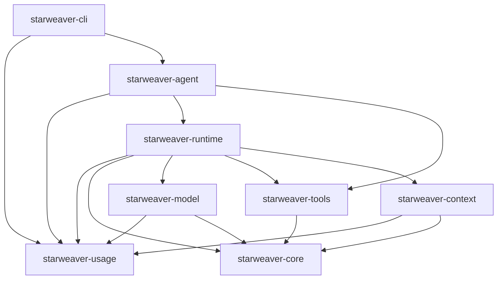

# Runtime, SDK, and Usage Boundaries

This spec records Starweaver's native boundary after the reference-project cleanup. It separates the agentic loop, runtime context, SDK ergonomics, and usage accounting so code does not encode reference-project names or compatibility concepts.

## Boundary Summary

## Agentic Loop Boundary

`starweaver-runtime` owns the agentic loop:

- run lifecycle and loop policy
- request assembly orchestration
- model invocation through `starweaver-model`
- tool execution through `starweaver-tools`
- output validation, output functions, retries, and steering guards
- capability hooks and capability bundles
- stream records, trace spans, and executor checkpoints
- usage-limit enforcement and usage snapshot event publication

The runtime should not own SDK product behavior such as first-party environment bundles, skill loading, media preprocessing policy, subagent file formats, CLI restore UI, or host-specific tool implementations.

## Context Boundary

`starweaver-context` owns neutral run and session evidence:

- agent, run, parent run, and conversation identifiers
- canonical model history
- typed dependencies
- state, notes, events, and message bus
- task state
- subagent history and agent registry metadata
- resumable state export/import profiles
- usage ledger entries and snapshot aggregation
- trace context and provider correlation fields

Context exports use neutral profiles:

- `ResumableExportOptions::curated()` for portable session restoration fields
- `ResumableExportOptions::full()` for full Starweaver runtime state

The context crate must not expose reference-project names in public symbols, module names, IDs, or tests.

## SDK Boundary

`starweaver-agent` owns ergonomic SDK composition:

- `AgentBuilder`, `AgentApp`, and `AgentSession`
- first-party tool bundles
- environment-backed tool wiring
- default request-preparation filters
- media preflight and upload seams
- skill registry helpers
- SDK-level subagent registry and delegation tools
- spec presets and host-policy materialization

The SDK may assemble runtime capabilities and toolsets, but core loop behavior remains in `starweaver-runtime`.

## Usage Boundary

`starweaver-usage` is the leaf crate for usage accounting:

- `Usage`
- `UsageSnapshot`
- `UsageSnapshotEntry`
- `UsageAgentTotal`
- `UsageLimits`
- `UsageLimitError`
- `PricingEstimate`

The optional `pricing` feature owns USD estimate helpers:

- `pricing::CostBudget`
- `pricing::ModelPricing`
- `pricing::known_model_pricing()`
- `pricing::estimate_pricing_for_model()`

Pricing estimates use fixed-point micro USD through `PricingEstimate::amount_micros_usd`, avoiding floats in serialized runtime events.

## Usage Event Contract

Runtime emits context events with kind `usage_snapshot`. The payload is a `UsageSnapshot` where:

- `latest_usage` is the latest provider response usage for UI context-window estimates.
- `total_usage` is the cumulative usage across the run ledger.
- `estimate_pricing` is the cumulative estimated USD price when available.
- `entries[*].estimate_pricing` is the cumulative estimated USD price for a source ledger entry when available.
- `agent_usages[*].estimate_pricing` aggregates entry estimates by agent id.
- `model_estimate_pricing[*]` aggregates entry estimates by model id.

Pricing is best-effort. Absence of `estimate_pricing` means no known model price and no explicit cost budget was configured.

## Acceptance Gates

- `cargo check --workspace`
- `cargo test --workspace --no-run`
- focused `starweaver-usage` tests for usage arithmetic, serde compatibility, and pricing estimates
- runtime tests for `usage_snapshot` payloads
- CLI tests for token-only and pricing-aware `/cost` output
- grep audit of `crates/` for reference-project names after cleanup
