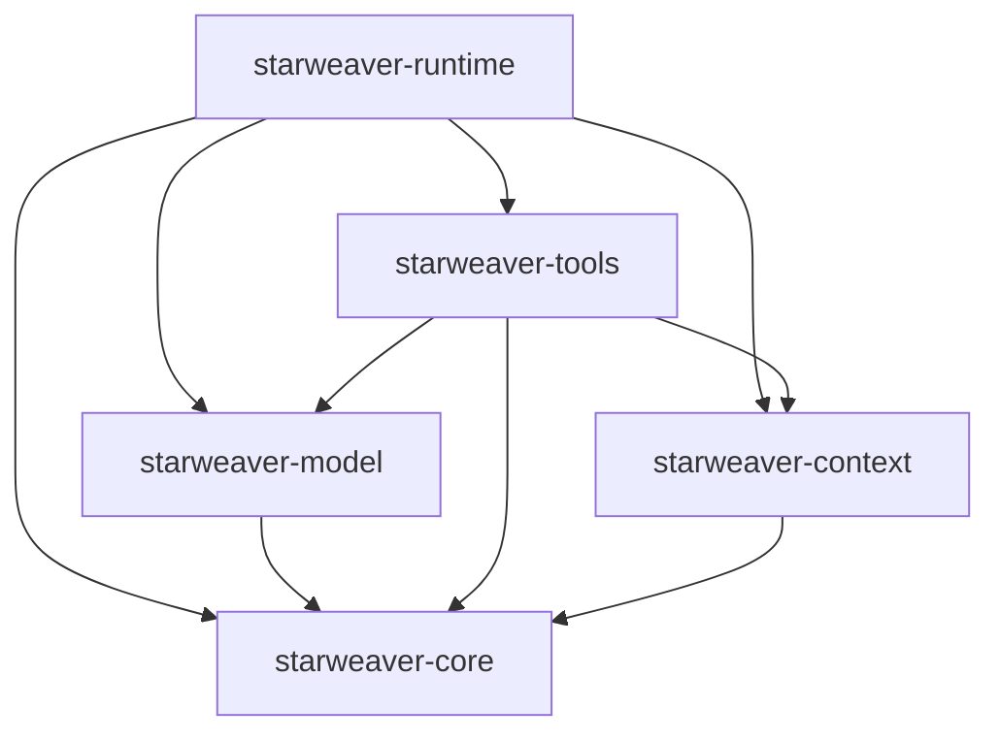
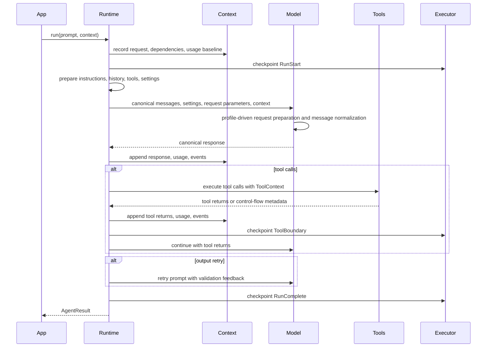

# Core Agent Foundation

The core layer is the Rust-native foundation for model-driven agent execution. It carries the concepts that Pydantic AI treats as core: reusable agents, provider abstractions, typed dependencies, tools, structured output, retries, streaming, model history, capabilities, and testing.

The core layer is designed for library authors and runtime implementers. It defines durable contracts while application tools and product policy live in SDK and operations layers.

## Crate Ownership

- `starweaver-core`: shared identifiers, metadata, usage, capability status, serializable cross-layer envelopes.
- `starweaver-model`: canonical message/request/response ASTs, model request preparation, settings, profiles, provider mappers, transport, replay fixtures, test models, request guard.
- `starweaver-tools`: tool definitions, dynamic tool execution, toolsets, MCP foundations, metadata, retry and control-flow envelopes.
- `starweaver-context`: `AgentContext`, typed dependencies, `StateStore`, `EventBus`, `MessageBus`, notes, usage, resumable state.
- `starweaver-runtime`: deterministic run loop, tool loop, output loop, hooks, budgets, stream records, checkpoints.

## Feature Coverage Contract

Core Starweaver should cover these feature families before broader SDK expansion:

| Feature family         | Core contract                                                         | Validation                                         |
| ---------------------- | --------------------------------------------------------------------- | -------------------------------------------------- |
| Agents                 | reusable runtime agent plus builder facade                            | runtime and SDK builder tests                      |
| Dependencies           | typed and named dependencies in context                               | context/tool/runtime dependency tests              |
| Model providers        | provider-neutral protocol and replay fixtures                         | `make replay-check`                                |
| Message/request AST    | typed request/response parts, request envelope, streaming part events | message AST, request preparation, and stream tests |
| Tools                  | function tools, toolsets, metadata, retries                           | `starweaver-tools` and runtime tool loop tests     |
| Output                 | schemas, typed parsing, validators, output functions                  | structured output and typed output tests           |
| Capabilities and hooks | composable runtime extensions                                         | capability bundle and hook tests                   |
| Message history        | all/new messages, processors, reinjection                             | message history tests                              |
| Streaming              | run events, part events, tool events                                  | stream tests                                       |
| Testing                | deterministic models and request guard                                | model and runtime test suites                      |
| Durability seam        | context export and checkpoints                                        | executor/context tests                             |

## Core Run Flow

## Durable Execution Preparation

The core layer emits enough evidence for durable replay and resume:

- `AgentContext.export_state()` captures conversation, history, usage, state, notes, messages, and metadata.
- `AgentStreamRecord` captures user-observable run progress.
- Executor checkpoints capture graph-level progress, tool boundaries, suspend points, and completion.
- Tool control-flow metadata captures approval and deferred execution boundaries.
- Provider replay fixtures capture request/response compatibility across protocol families.
- Prepared model request snapshots capture canonical history, normalized history, prepared parameters, provider wire request, and canonical response.

Durability belongs above the core runtime, while the runtime emits stable evidence and accepts restored context state.

## Acceptance Gates

- `make replay-check`
- `make fmt-check`
- `make check`
- `make test`
- targeted docs example checks when user-facing docs change
- feature coverage matrix updated in `memos/implementation-todo.md`
