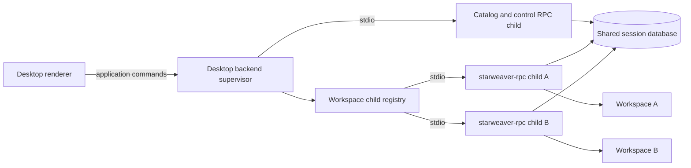

# Desktop Product and Process Boundaries

Status: accepted architecture baseline; shell and single local-child supervisor implemented; routing, updates, and SSH planned

This document defines the ownership and process model for Starweaver Desktop. The existing CLI/RPC independence rules in `../ops/00-product-boundaries.md` remain normative. SSH remote execution extends this model through `07-ssh-remote-workspaces.md` without moving execution into Desktop.

## Product Boundary

Starweaver Desktop is a Tauri 2 native product composed of two internal layers:

1. a webview shell/renderer that owns user experience through a narrow Tauri command/channel API;
2. a privileged Rust backend supervisor that owns local RPC children, SSH-carried RPC connections, workspace routing, update activation, and Desktop-local state.

Tauri 2 is the accepted default because it preserves a Rust-owned privileged boundary while keeping the renderer replaceable. A framework change requires a spec amendment and must preserve every authority, lifecycle, update, and protocol boundary in this directory.

The standalone `starweaver-rpc` binary remains a separate product and the only agent execution host used by Desktop. Desktop may ship and supervise the binary, but it must not move RPC handlers, runtime coordination, or model/tool execution into the shell process.

The Desktop product must not depend on `starweaver-cli`. The CLI must not depend on Desktop. Both independently consume shared protocol, storage, OAuth, environment, and runtime foundations through their owning crates.

## Dependency Rules

Allowed implementation dependencies:

- Desktop renderer TypeScript only to the generated manifest-filtered `DesktopHostClient`, safe bridge request/result/notification DTOs and decoders, and safe operation/notification maps derived from the IDL;
- Desktop backend to IDL-generated Rust bindings in `starweaver-rpc-core` plus narrow handwritten transport and projection helpers;
- Desktop backend to narrow product-neutral helpers needed for version parsing, signed-manifest verification, component installation, checksums, and platform paths;
- Desktop backend to a least-authority system OpenSSH process adapter and native askpass/host-trust bridge;
- `starweaver-rpc` to existing Agent SDK, storage, OAuth, environment, and envd crates;
- Desktop shell to its backend through a narrow application command/event API.

Prohibited dependencies:

- Desktop shell or frontend to `starweaver-runtime`, `starweaver-agent`, `starweaver-storage`, or SQLite;
- Desktop to CLI command handlers, TUI state, CLI config types, launcher state, or `CliRuntimeCoordinator`; a remote external process may expose only the public versioned component-install machine contract;
- CLI to Desktop or RPC implementation crates;
- RPC to Desktop or CLI implementation crates;
- frontend code reading `auth.json`, `rpc.toml`, or `starweaver.sqlite` directly;
- Desktop renderer must not import the complete generated host protocol model, raw host params/result maps, transport-neutral `HostRpcClient`, raw host codecs, or unfiltered notification unions.

If Desktop and another product need the same logic, that logic moves only when a product-neutral owner is clear. A new broad shared “desktop runtime” crate is not the default answer.

## Process Topology

The accepted initial topology is one Desktop backend supervisor with one optional least-authority catalog/control child and zero or more workspace-scoped execution RPC children. Every Desktop execution connection requires the sole IDL-first host major 1 with exact revision and schema-digest agreement. SSH adds origin-scoped remote catalog and execution connections while preserving the same supervisor/RPC boundary.

A local execution-child key is the canonical local workspace identity. A remote execution key is the composite execution-domain identity and canonical remote workspace identity defined in `07-ssh-remote-workspaces.md`. The entry records the selected runtime and configuration generation. The supervisor reuses one healthy host process/connection for multiple windows showing the same domain/workspace key and must not run two execution-authorized hosts for that key at once. Local creation is serialized by the supervisor; SSH execution additionally requires the storage-owned cross-client remote OS lock and fenced owner generation in `07-ssh-remote-workspaces.md`. Its stable database/workspace lock namespace lives under a non-overridable platform-canonical per-OS-user coordination root and is independent of config roots, database locators, and every child/process state directory. A catalog/control process may coexist because it has no run/effect authority. A runtime/config change drains or retires the old execution generation before its replacement becomes ready.

Desktop uses one local backend supervisor per user and selected Desktop data root. The selected local Starweaver config root identifies only the local execution domain; each SSH target resolves its own remote config, storage, and OAuth domain. A second application launch forwards open-workspace/session intents to the existing supervisor through a platform-authenticated single-instance channel and exits. If the instance lock is held but the owner cannot be authenticated as live, recovery must resolve stale state before another supervisor starts children. The initial public Desktop contract does not allow two unrelated Desktop supervisors to compete for process-local control of the same workspace runs.

Every local RPC child receives:

- the selected local shared database path through an explicit launch argument or environment variable;
- one canonical local workspace root;
- a Desktop-owned instance of the public versioned RPC launch envelope;
- a child-specific RPC state directory;
- an exact runtime binary version;
- stdio with stdout reserved for protocol frames and stderr captured as bounded diagnostics.

A remote RPC process receives the equivalent remote-domain values through the bounded supervised bootstrap envelope. Remote database and workspace paths are resolved and canonicalized by the remote RPC, never by the Desktop filesystem. Login-shell output is separated from strict RPC stdout by the nonce-bound bootstrap transition in `07-ssh-remote-workspaces.md`.

Desktop launch configuration is non-secret. Credentials remain in environment-specific secure stores or the shared OAuth store and are resolved by RPC. Desktop never writes RPC-private `rpc.toml` fields.

## Versioned Launch Configuration

`starweaver-rpc` owns a public, versioned launch-envelope schema for supervised hosts. The envelope covers only process bootstrap data that must exist before initialize, including mode, database identity, workspace root, state directory, profile/provider declarations, capability caps, and configuration generation. The owner publishes JSON Schema, canonical fixtures, a validation command, and a stable schema identity with each runtime release.

The detached runtime update manifest declares the launch-schema identities/ranges accepted by that binary. Desktop generates only a mutually supported envelope version and validates it before spawn. A local child receives its exact path or bytes through a non-shell-interpolated launch argument; an SSH host receives the same canonical envelope as the single bounded bootstrap frame after the RPC marker. Unknown fields and unsupported versions fail before the runtime opens the real database. `rpc.toml` remains the standalone RPC product’s human configuration and is not a Desktop integration API.

Desktop owns a global non-secret profile/configuration model and materializes an immutable versioned launch envelope for each child. The envelope has a generation and digest recorded in the child entry and target materialization.

Changing a profile, provider endpoint, tool policy, or client capability does not mutate a running child in place. The supervisor stages a new envelope, stops new admission for the affected workspace, waits for the current child to drain or obtains explicit interruption consent, and then starts one replacement generation. Existing runs retain the configuration/materialization evidence under which they started.

Child-specific state directories prevent selected profile, session pointers, subscriptions, and other product-local files from racing across workspace processes. Secrets are not copied into launch envelopes. Cross-version fixtures prove that every supported shell/runtime pair interprets the same envelope canonically.

## Why Per-Workspace Children

Per-workspace processes preserve coordination and default-authority boundaries within one execution domain:

- one provider and policy set in the execution domain is selected for one canonical repository root;
- active-run registries, configuration generations, process lifetime, and environment attachments do not mix across unrelated repositories;
- child restart and runtime upgrade can be scoped to idle workspaces;
- the canonical database still gives one unified session history within that execution domain.

A local workspace root is not an operating-system sandbox. The current native local shell runs with the local user account’s filesystem authority and can escape its initial working directory through absolute paths, parent traversal, subprocesses, or other native APIs. Process separation alone must not be described as containing a compromised run.

Public local shell-enabled Desktop profiles therefore require an enforceable sandboxed environment/process provider whose filesystem and process policies confine effects to the granted workspace/resources. When such a provider is unavailable, native local shell execution is disabled by default. A future explicit unsafe/native-shell mode may be user-enabled per workspace with a persistent warning, but it does not satisfy containment acceptance gates. Path-checked filesystem tools remain useful defense in depth and are not a substitute for shell sandboxing.

Desktop must not configure one RPC process with the user home directory solely to support multiple projects. A future single-process workspace registration protocol may replace this topology only after it provides equivalent coordination, authority, lifecycle fencing, sandbox policy, and compatibility tests.

## Shell and Backend Separation

The renderer receives safe view models and sends user intents through IDL-derived bridge request/result/notification DTOs selected by a reviewed Desktop operation-surface manifest. TypeScript implements the typed Desktop client experience, but the renderer must not construct arbitrary JSON-RPC requests, submit complete host params objects, choose authority-bearing wire metadata, or receive raw secrets. The generated TypeScript client and generated Rust server bindings share the language-neutral source defined by `../ops/09-rpc-idl-and-client-generation.md`; the Desktop manifest adds authority ownership and safe projection without redefining host wire types.

The backend supervisor owns:

- non-empty string request IDs and durable idempotency keys;
- protocol initialization and capability checks;
- child process handles and stderr diagnostics;
- local workspace canonicalization, remote canonical-identity validation, and host routing;
- subscription cursors and replay recovery;
- pending approval, deferred, and clarifying-question coordination;
- update staging and activation;
- Desktop-local preferences and window-to-session routing.

The backend decodes only generated safe bridge DTOs, constructs the complete generated Rust host params, and independently validates connection state, negotiated feature intersection, workspace routing, and authority. It must strip, construct, or override request IDs, idempotency keys, client scopes, routing identities, execution-domain bindings, and retry metadata rather than trusting renderer values. It projects and redacts host results and notifications before sending generated safe DTOs to TypeScript. Request IDs, idempotency keys, replay recovery, and transport frames never originate as free-form renderer JSON.

This split allows renderer reloads without losing child processes or active runs.

## Lifetime Semantics

Window lifetime and run lifetime are distinct.

- Closing a window removes its renderer subscription but does not interrupt a run.
- Closing the last window does not implicitly terminate active runs. The backend may remain resident according to platform conventions and user settings.
- Explicit “Stop run” maps to `run.interrupt` or the current typed control method.
- Explicit application quit initiates coordinated shutdown: stop new admission, resolve or preserve UI prompts, interrupt owned runs, wait for bounded finalization, persist cursors/state, then terminate children.
- Forced process termination relies on durable admission expiration and RPC startup reconciliation. Desktop must not claim graceful completion when the operating system killed the process.

Idle children may be retired after a configurable period only when they own no active run, pending finalizer, live environment operation, or unresolved process-local interaction.

## Storage Ownership

RPC processes open the canonical database for their execution domain through `starweaver-storage`. Local children share the selected local database; SSH-hosted processes open the remote user's selected database. Desktop does not maintain a second canonical copy, synchronize databases across domains, or add UI tables to any session database.

Desktop-local state belongs under a separate application-support directory and may include:

- window layout and navigation;
- workspace and execution-domain registry;
- non-secret SSH connection profiles, host-trust references, and remote origin bindings;
- selected local and per-target runtime channels or pinned versions;
- staged/current local and remote runtime metadata;
- per-child launch configuration;
- last acknowledged stream cursors;
- update transaction state;
- bounded crash diagnostics.

Session titles, runs, approvals, deferred calls, stream records, and continuation evidence remain in the canonical durable storage of their execution domain.

## Transport Decision

Desktop local v1 uses newline-delimited JSON-RPC over direct child-process stdio. SSH remote execution carries a supervised stdio stream over a system OpenSSH exec channel; after the login-shell bootstrap transition, it uses the same JSON-RPC framing and lifecycle contract. HTTP remains an optional integration transport and is not part of the Desktop critical path.

After local spawn or the SSH bootstrap transition, the RPC stream contract requires:

- stdout contains protocol frames only;
- each response/notification is flushed;
- stderr never carries protocol frames;
- malformed frames fail the connection without being interpreted as logs;
- the supervisor applies bounded line/frame sizes and bounded diagnostic retention;
- child process inheritance does not expose unrelated file descriptors or secrets.

## Product Naming and Packaging

The application root is `apps/starweaver-desktop/`. Its cross-platform shell and verified single local-child supervisor are built and tested, while normal startup remains `unconfigured` until the runtime update/configuration owner selects an exact runtime and public launch envelope. Desktop remains disconnected from direct storage, OAuth files, and environment effects. Its current single-instance transports carry only a fixed activation frame and never read or transmit argv or the working directory; forwarding typed workspace/session intents waits for the reviewed authenticated intent protocol.

Observable methods, metadata, bundle identifiers, and file names use Starweaver-native names. References to other desktop agent products are design comparisons only and must not appear in protocol IDs or public symbols.

## Acceptance Gates

- Architecture tooling rejects direct product dependencies among CLI, RPC, and Desktop.
- IDL tooling proves generated Rust server and TypeScript Desktop client bindings share one protocol identity and structural contract.
- Renderer boundary checks reject free-form JSON-RPC and complete host params, prevent injection of supervisor-owned fields, and prove that raw paths, credentials, and private diagnostics are absent from generated bridge results and notifications.
- The renderer has no direct storage, OAuth-file, or process authority.
- A second Desktop launch forwards to the authenticated existing supervisor and cannot create duplicate workspace children.
- Local shell-enabled release profiles use an enforceable sandbox; tests prove that absolute paths, parent traversal, symlinks, and subprocesses cannot access a sibling workspace. Native unsandboxed local shell is disabled by default.
- An explicitly granted SSH execution domain may enable native remote shell by default with full remote-account authority. It is never represented as workspace-contained unless the remote host proves an enforceable sandbox capability.
- Multiple child processes can safely read shared history and admission fencing prevents duplicate run ownership.
- Renderer restart preserves active children and rebuilds state through replay.
- Window close, explicit run stop, explicit app quit, child crash, and forced app termination have distinct tested outcomes.
- The public launch-envelope schema, validation command, runtime compatibility metadata, and N/N-1 canonical fixtures are covered by release tests.
- stdout purity, bounded stderr capture, request ordering, response flush, and shutdown barriers are covered by subprocess tests.
- SSH tests cover host-key trust, login-shell noise, nonce-bound bootstrap, remote path canonicalization, account-scoped authority, provisioning isolation, and reconnect reconciliation.
