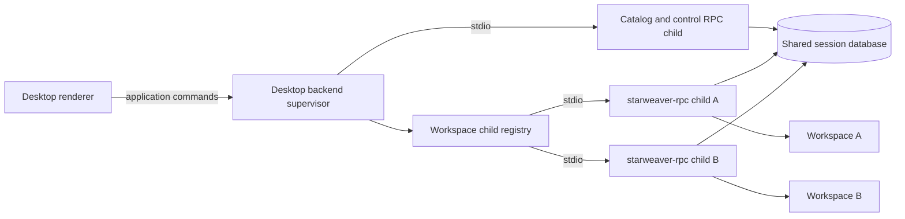

# Desktop Product and Process Boundaries

Status: accepted architecture baseline; implementation planned

This document defines the ownership and process model for Starweaver Desktop. The existing CLI/RPC independence rules in `../ops/00-product-boundaries.md` remain normative.

## Product Boundary

Starweaver Desktop is a Tauri 2 native product composed of two internal layers:

1. a webview shell/renderer that owns user experience through a narrow Tauri command/channel API;
2. a privileged Rust backend supervisor that owns RPC children, workspace routing, update activation, and Desktop-local state.

Tauri 2 is the accepted default because it preserves a Rust-owned privileged boundary while keeping the renderer replaceable. A framework change requires a spec amendment and must preserve every authority, lifecycle, update, and protocol boundary in this directory.

The standalone `starweaver-rpc` binary remains a separate product and the only agent execution host used by Desktop. Desktop may ship and supervise the binary, but it must not move RPC handlers, runtime coordination, or model/tool execution into the shell process.

The Desktop product must not depend on `starweaver-cli`. The CLI must not depend on Desktop. Both independently consume shared protocol, storage, OAuth, environment, and runtime foundations through their owning crates.

## Dependency Rules

Allowed implementation dependencies:

- Desktop backend to a generated or handwritten client over `starweaver-rpc-core` wire contracts;
- Desktop backend to narrow product-neutral helpers needed for version parsing, checksums, and platform paths;
- `starweaver-rpc` to existing Agent SDK, storage, OAuth, environment, and envd crates;
- Desktop shell to its backend through a narrow application command/event API.

Prohibited dependencies:

- Desktop shell or frontend to `starweaver-runtime`, `starweaver-agent`, `starweaver-storage`, or SQLite;
- Desktop to CLI command handlers, TUI state, CLI config types, launcher state, or `CliRuntimeCoordinator`;
- CLI to Desktop or RPC implementation crates;
- RPC to Desktop or CLI implementation crates;
- frontend code reading `auth.json`, `rpc.toml`, or `starweaver.sqlite` directly.

If Desktop and another product need the same logic, that logic moves only when a product-neutral owner is clear. A new broad shared “desktop runtime” crate is not the default answer.

## Process Topology

The accepted v1 topology is one Desktop backend supervisor with one optional least-authority catalog/control child and zero or more workspace-scoped execution RPC children.

An execution-child key is the canonical workspace identity. The entry records the selected runtime and configuration generation. The supervisor reuses one healthy child for multiple windows showing the same workspace and must not run two execution children for the same canonical workspace at once. A runtime/config change drains or retires the old generation before its replacement starts.

Desktop uses one backend supervisor per user and selected Starweaver config root. A second application launch forwards open-workspace/session intents to the existing supervisor through a platform-authenticated single-instance channel and exits. If the instance lock is held but the owner cannot be authenticated as live, recovery must resolve stale state before another supervisor starts children. Public v1 does not allow two unrelated Desktop supervisors to compete for process-local control of the same workspace runs.

Every child receives:

- the selected shared database path through an explicit launch argument or environment variable;
- one canonical workspace root;
- a Desktop-owned instance of the public versioned RPC launch envelope;
- a child-specific RPC state directory;
- an exact runtime binary version;
- stdio with stdout reserved for protocol frames and stderr captured as bounded diagnostics.

Desktop launch configuration is non-secret. Credentials remain in environment-specific secure stores or the shared OAuth store and are resolved by RPC. Desktop never writes RPC-private `rpc.toml` fields.

## Versioned Launch Configuration

`starweaver-rpc` owns a public, versioned launch-envelope schema for supervised hosts. The envelope covers only process bootstrap data that must exist before initialize, including mode, database identity, workspace root, state directory, profile/provider declarations, capability caps, and configuration generation. The owner publishes JSON Schema, canonical fixtures, a validation command, and a stable schema identity with each runtime release.

The detached runtime update manifest declares the launch-schema identities/ranges accepted by that binary. Desktop generates only a mutually supported envelope version, validates it before spawn, and passes its exact path or bytes through a non-shell-interpolated launch argument. Unknown fields and unsupported versions fail before the runtime opens the real database. `rpc.toml` remains the standalone RPC product’s human configuration and is not a Desktop integration API.

Desktop owns a global non-secret profile/configuration model and materializes an immutable versioned launch envelope for each child. The envelope has a generation and digest recorded in the child entry and target materialization.

Changing a profile, provider endpoint, tool policy, or client capability does not mutate a running child in place. The supervisor stages a new envelope, stops new admission for the affected workspace, waits for the current child to drain or obtains explicit interruption consent, and then starts one replacement generation. Existing runs retain the configuration/materialization evidence under which they started.

Child-specific state directories prevent selected profile, session pointers, subscriptions, and other product-local files from racing across workspace processes. Secrets are not copied into launch envelopes. Cross-version fixtures prove that every supported shell/runtime pair interprets the same envelope canonically.

## Why Per-Workspace Children

Per-workspace children preserve coordination and default-authority boundaries:

- one local provider and policy set is selected for one canonical repository root;
- active-run registries, configuration generations, process lifetime, and environment attachments do not mix across unrelated repositories;
- child restart and runtime upgrade can be scoped to idle workspaces;
- the shared database still gives one unified session history.

A workspace root is not an operating-system sandbox. The current native local shell runs with the user account’s filesystem authority and can escape its initial working directory through absolute paths, parent traversal, subprocesses, or other native APIs. Process separation alone must not be described as containing a compromised run.

Public shell-enabled Desktop profiles therefore require an enforceable sandboxed environment/process provider whose filesystem and process policies confine effects to the granted workspace/resources. When such a provider is unavailable, native local shell execution is disabled by default. A future explicit unsafe/native-shell mode may be user-enabled per workspace with a persistent warning, but it does not satisfy containment acceptance gates. Path-checked filesystem tools remain useful defense in depth and are not a substitute for shell sandboxing.

Desktop must not configure one RPC process with the user home directory solely to support multiple projects. A future single-process workspace registration protocol may replace this topology only after it provides equivalent coordination, authority, lifecycle fencing, sandbox policy, and compatibility tests.

## Shell and Backend Separation

The renderer receives safe view models and sends user intents. It must not construct arbitrary JSON-RPC requests or receive raw secrets.

The backend supervisor owns:

- request IDs and idempotency keys;
- protocol initialization and capability checks;
- child process handles and stderr diagnostics;
- workspace canonicalization and child routing;
- subscription cursors and replay recovery;
- pending approval, deferred, and clarifying-question coordination;
- update staging and activation;
- Desktop-local preferences and window-to-session routing.

This split allows renderer reloads without losing child processes or active runs.

## Lifetime Semantics

Window lifetime and run lifetime are distinct.

- Closing a window removes its renderer subscription but does not interrupt a run.
- Closing the last window does not implicitly terminate active runs. The backend may remain resident according to platform conventions and user settings.
- Explicit “Stop run” maps to `run.interrupt` or the current typed control method.
- Explicit application quit initiates coordinated shutdown: stop new admission, resolve or preserve UI prompts, interrupt owned runs, wait for bounded finalization, persist cursors/state, then terminate children.
- Forced process termination relies on durable admission expiration and RPC startup reconciliation. Desktop must not claim graceful completion when the operating system killed the process.

Idle children may be retired after a configurable period only when they own no active run, pending finalizer, live environment operation, or unresolved process-local interaction.

## Storage Ownership

RPC children open the shared canonical database through `starweaver-storage`. Desktop does not maintain a second copy and does not add UI tables to the session database.

Desktop-local state belongs under a separate application-support directory and may include:

- window layout and navigation;
- workspace registry;
- selected runtime channel and pinned version;
- staged/current runtime metadata;
- per-child launch configuration;
- last acknowledged stream cursors;
- update transaction state;
- bounded crash diagnostics.

Session titles, runs, approvals, deferred calls, stream records, and continuation evidence remain in shared durable storage.

## Transport Decision

Desktop v1 uses newline-delimited JSON-RPC over stdio. HTTP remains an optional integration transport and is not part of the Desktop critical path.

The child contract requires:

- stdout contains protocol frames only;
- each response/notification is flushed;
- stderr never carries protocol frames;
- malformed frames fail the connection without being interpreted as logs;
- the supervisor applies bounded line/frame sizes and bounded diagnostic retention;
- child process inheritance does not expose unrelated file descriptors or secrets.

## Product Naming and Packaging

The application root is `apps/starweaver-desktop/`. Its cross-platform shell foundation may be built and tested before Phase 0 completes, but it remains disconnected from RPC, storage, OAuth, environment effects, and runtime updates. Its current single-instance transports carry only a fixed activation frame and never read or transmit argv or the working directory; forwarding typed workspace/session intents waits for the reviewed authenticated intent protocol. Execution integration starts only after the applicable Phase 0 protocols, owners, fixtures, and security gates exist.

Observable methods, metadata, bundle identifiers, and file names use Starweaver-native names. References to other desktop agent products are design comparisons only and must not appear in protocol IDs or public symbols.

## Acceptance Gates

- Architecture tooling rejects direct product dependencies among CLI, RPC, and Desktop.
- The renderer has no direct storage, OAuth-file, or process authority.
- A second Desktop launch forwards to the authenticated existing supervisor and cannot create duplicate workspace children.
- Shell-enabled release profiles use an enforceable sandbox; tests prove that absolute paths, parent traversal, symlinks, and subprocesses cannot access a sibling workspace. Native unsandboxed shell is disabled by default and never represented as contained.
- Multiple child processes can safely read shared history and admission fencing prevents duplicate run ownership.
- Renderer restart preserves active children and rebuilds state through replay.
- Window close, explicit run stop, explicit app quit, child crash, and forced app termination have distinct tested outcomes.
- The public launch-envelope schema, validation command, runtime compatibility metadata, and N/N-1 canonical fixtures are covered by release tests.
- stdout purity, bounded stderr capture, request ordering, response flush, and shutdown barriers are covered by subprocess tests.
