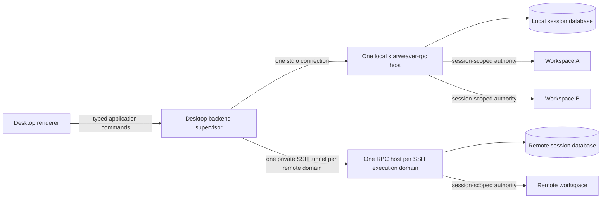

# Desktop Product and Process Boundaries

Status: accepted local-only architecture; shell, one domain host, multi-workspace routing, and configuration reload implemented; updates planned; SSH removed from Desktop scope

This document defines the ownership and process model for Starweaver Desktop. The existing CLI/RPC independence rules in `../ops/00-product-boundaries.md` remain normative. SSH remote execution extends this model through `07-ssh-remote-workspaces.md` without moving execution into Desktop.

## Product Boundary

Starweaver Desktop is a Tauri 2 native product composed of two internal layers:

1. a webview shell/renderer that owns user experience through a narrow Tauri command/channel API;
2. a privileged Rust backend supervisor that owns the local RPC host, per-remote-domain SSH RPC connections, workspace grants and routing, configuration, update activation, and Desktop-local state.

Tauri 2 is the accepted default because it preserves a Rust-owned privileged boundary while keeping the renderer replaceable. A framework change requires a spec amendment and must preserve every authority, lifecycle, update, and protocol boundary in this directory.

The standalone `starweaver-rpc` binary remains a separate product and the only agent execution host used by Desktop. Desktop may ship and supervise the binary, but it must not move RPC handlers, runtime coordination, or model/tool execution into the shell process.

The Desktop product must not depend on `starweaver-cli`. The CLI must not depend on Desktop. Desktop consumes only the generated host protocol and narrow product-neutral platform helpers; `starweaver-rpc` owns storage, provider credential resolution, environment, and runtime integration in each execution domain.

## Dependency Rules

Allowed implementation dependencies:

- Desktop renderer TypeScript only to the generated manifest-filtered `DesktopHostClient`, safe bridge request/result/notification DTOs and decoders, and safe operation/notification maps derived from the IDL;
- Desktop backend to IDL-generated Rust bindings in `starweaver-rpc-core` plus narrow handwritten transport and projection helpers;
- Desktop backend to narrow product-neutral helpers needed for version parsing, signed-manifest verification, component installation, checksums, and platform paths;
- Desktop backend to a least-authority system OpenSSH process adapter and native askpass/host-trust bridge;
- `starweaver-rpc` to existing Agent SDK, storage, provider credential, environment, and envd crates;
- Desktop shell to its backend through a narrow application command/event API.

Prohibited dependencies:

- Desktop shell or frontend to `starweaver-runtime`, `starweaver-agent`, `starweaver-storage`, or SQLite;
- Desktop to CLI command handlers, TUI state, CLI config types, launcher state, or `CliRuntimeCoordinator`; a remote external process may expose only the public versioned component-install machine contract;
- CLI to Desktop or RPC implementation crates;
- RPC to Desktop or CLI implementation crates;
- frontend code reading `auth.json`, `rpc.toml`, or `starweaver.sqlite` directly;
- Desktop renderer must not import the complete generated host protocol model, raw host params/result maps, transport-neutral `HostRpcClient`, raw host codecs, or unfiltered notification unions.

If Desktop and another product need the same logic, that logic moves only when a product-neutral owner is clear. A new broad shared “desktop runtime” crate is not the default answer.

## Process Topology

The accepted topology is one long-lived RPC host per execution domain, not one process per workspace. Desktop normally owns one local `starweaver-rpc` child. Each connected SSH target is a distinct execution domain and therefore has one remote RPC host reached through its private SSH-forwarded endpoint. One host owns that domain's persistent workspace-grant registry, sessions, concurrent runs, history queries, subscriptions, and configuration snapshots.

```mermaid
flowchart LR
    renderer[Desktop renderer]
    backend[Desktop backend supervisor]
    local_rpc[One local starweaver-rpc host]
    remote_rpc[One RPC host per SSH execution domain]
    local_db[(Local session database)]
    remote_db[(Remote session database)]
    ws1[Workspace A]
    ws2[Workspace B]
    ws3[Remote workspace]

    renderer -->|typed application commands| backend
    backend -->|one stdio connection| local_rpc
    backend -->|one private SSH tunnel per remote domain| remote_rpc
    local_rpc --> local_db
    remote_rpc --> remote_db
    local_rpc -->|session-scoped authority| ws1
    local_rpc -->|session-scoped authority| ws2
    remote_rpc -->|session-scoped authority| ws3
```

The supervisor host registry is keyed by stable execution-domain identity. The local domain has one process/connection entry; each connected remote domain has one. Each entry records runtime identity, transport state, active configuration generation, workspace grants, sessions/runs, subscriptions, cursors, and restart budget. The Desktop supervisor must not start a second local host or second connection for the same domain. Local Desktop creation is serialized by the application-owned single-instance backend, while independent local CLI/RPC processes may still share storage under per-run admission fencing and maintenance barriers. SSH additionally requires the storage-owned cross-client remote OS lock and fenced owner generation in `07-ssh-remote-workspaces.md`. The lock is keyed by stable execution-domain/database identity, not workspace, and is independent of config roots and process state directories.

A separate catalog/control process is unnecessary for Desktop: the domain host serves bounded history and configuration queries as well as execution. Authorization remains method- and connection-scoped, so a future read-only external client may connect without gaining run authority. Runtime replacement drains the one domain host; ordinary hot configuration reload does not replace it.

Desktop uses one local backend supervisor per user and selected Desktop data root. The selected local Starweaver config root identifies only the local execution domain; each SSH target resolves its own remote config, storage, and provider configuration domain. A second application launch forwards open-workspace/session intents to the existing supervisor through a platform-authenticated single-instance channel and exits. If the instance lock is held but the owner cannot be authenticated as live, recovery must resolve stale state before another supervisor starts the local domain host. The initial public Desktop contract does not allow two unrelated Desktop supervisors to compete for process-local control of the same workspace runs.

The local RPC host receives:

- the selected local canonical database identity;
- one domain-level Desktop-owned public launch envelope;
- one host state directory and one runtime-config location;
- an exact runtime binary version;
- stdio with stdout reserved for protocol frames and stderr captured as bounded diagnostics.

Workspace roots are registered after initialization and are never used as process keys or launch-envelope roots. Each session stores one registered workspace identity, and each run materializes an environment rooted at that session's workspace.

A remote RPC host receives equivalent execution-domain values through a bounded login-shell bootstrap envelope. It then listens only on an owner-private Unix-domain socket when available or an authenticated loopback endpoint otherwise. Desktop reaches that endpoint through a system-OpenSSH-managed tunnel. The same remote host canonicalizes and registers multiple remote workspace roots; the Desktop filesystem never interprets them, and bootstrap output is not reused as the JSON-RPC transport.

Desktop launch configuration is non-secret. Model/provider credentials remain in execution-domain environment or provider-owned stores and are resolved by RPC. Desktop has no provider-login API requirement, never copies credentials between domains, and never writes RPC-private `rpc.toml` fields.

## Versioned Launch Configuration

`starweaver-rpc` owns a public, versioned launch-envelope schema for supervised hosts. The envelope covers only immutable process-bootstrap data required before initialize: host mode, execution-domain/database identity, state and runtime-config locations, capability ceilings, and bootstrap configuration generation. It does not contain one workspace root or the complete mutable profile/provider/tool configuration. The owner publishes JSON Schema, canonical fixtures, a validation command, and a stable schema identity with each runtime release.

The detached runtime update manifest declares the launch-schema identities/ranges accepted by that binary. Desktop generates only a mutually supported envelope version and validates it before spawn. A local child receives its exact path or bytes through a non-shell-interpolated launch argument; an SSH host receives the same canonical envelope as the single bounded bootstrap frame after the RPC marker. Unknown fields and unsupported versions fail before the runtime opens the real database. `rpc.toml` remains the standalone RPC product’s human configuration and is not a Desktop integration API.

Desktop owns its application configuration; RPC owns its runtime configuration. Desktop may present typed safe runtime settings, but it reads and changes them only through the host configuration protocol. `config.reload` validates and atomically publishes a new immutable runtime configuration snapshot without replacing the host when all changed fields are reloadable. Existing runs retain the exact configuration/materialization generation under which they started; new admission uses the new snapshot. Bootstrap-only changes are reported as restart-required and never partially applied. The complete ownership, compare-and-swap, reload, and event contract is defined in `08-configuration-and-reload.md`.

The host state directory prevents subscriptions, cursors, operation receipts, and configuration transactions from racing across process generations. Secrets are not copied into launch envelopes or safe configuration projections. Cross-version fixtures prove that every supported shell/runtime pair interprets the same envelope and runtime configuration generation canonically.

## Workspace and Session Bootstrap

Desktop presents three workspace entry modes: open an existing folder, create an empty folder, or start without selecting a folder. The RPC host is started once for the execution domain and remains independent of those choices. The no-folder mode creates an empty managed temporary directory retained while durable sessions reference it; it does not launch an agent without a workspace.

Locally, the privileged backend obtains or creates the folder under native user intent, canonicalizes it, and registers an opaque workspace grant with the already-running local RPC host. Remotely, the existing remote host receives a typed existing/create/temporary workspace intent through the established private RPC connection, canonicalizes or safely creates the directory, and returns an opaque workspace identity. No candidate host or per-workspace process is started.

Desktop then invokes `session.create` with the backend-selected opaque workspace identity. RPC resolves that identity in its own registry, records the session/workspace binding, and owns the agent/session/run lifecycle. Renderer input cannot supply or override the authority-bearing path.

Desktop remains a thin graphical and lifecycle client. It does not construct an agent, persist canonical session evidence, or allow renderer-supplied paths to override the host workspace.

## Why One Host Per Execution Domain

One host already owns the domain's canonical database and can safely coordinate multiple sessions and concurrent runs. Keeping workspace as typed session/run authority rather than process identity provides:

- one process, protocol connection, event stream, configuration owner, and update lifecycle for Desktop;
- immediate global history without a separate catalog child;
- cheap workspace switching and multiple sessions per workspace;
- centralized admission, reconciliation, receipts, HITL, and configuration reload;
- distinct workspace grants and per-run environment providers without multiplying host processes.

A local workspace root is not an operating-system sandbox. The current native local shell runs with the local user account’s filesystem authority and can escape its initial working directory through absolute paths, parent traversal, subprocesses, or other native APIs. Process separation alone must not be described as containing a compromised run.

Public local shell-enabled Desktop profiles therefore require an enforceable sandboxed environment/process provider whose filesystem and process policies confine effects to the granted workspace/resources. When such a provider is unavailable, native local shell execution is disabled by default. A future explicit unsafe/native-shell mode may be user-enabled per workspace with a persistent warning, but it does not satisfy containment acceptance gates. Path-checked filesystem tools remain useful defense in depth and are not a substitute for shell sandboxing.

The domain host is not granted the user home directory merely because it manages multiple workspaces. Its workspace registry contains only explicitly selected or Desktop-managed roots. Every session references exactly one registered workspace; filesystem tools and environment providers receive that narrow root, and unrelated workspace handles are not injected into the run. Process sharing does not provide OS sandboxing, so the local shell policy below remains mandatory.

## Shell and Backend Separation

The renderer receives safe view models and sends user intents through IDL-derived bridge request/result/notification DTOs selected by a reviewed Desktop operation-surface manifest. TypeScript implements the typed Desktop client experience, but the renderer must not construct arbitrary JSON-RPC requests, submit complete host params objects, choose authority-bearing wire metadata, or receive raw secrets. The generated TypeScript client and generated Rust server bindings share the language-neutral source defined by `../ops/09-rpc-idl-and-client-generation.md`; the Desktop manifest adds authority ownership and safe projection without redefining host wire types.

The backend supervisor owns:

- non-empty string request IDs and durable idempotency keys;
- protocol initialization and capability checks;
- the local host process handle, per-remote-domain SSH connections, and bounded diagnostics;
- local workspace grants, remote canonical-identity validation, and session-to-workspace routing;
- subscription cursors and replay recovery;
- pending approval, deferred, and clarifying-question coordination;
- update staging and activation;
- Desktop-local preferences and window-to-session routing.

The backend decodes only generated safe bridge DTOs, constructs the complete generated Rust host params, and independently validates connection state, negotiated feature intersection, workspace routing, and authority. It must strip, construct, or override request IDs, idempotency keys, client scopes, routing identities, execution-domain bindings, and retry metadata rather than trusting renderer values. It projects and redacts host results and notifications before sending generated safe DTOs to TypeScript. Request IDs, idempotency keys, replay recovery, and transport frames never originate as free-form renderer JSON.

This split allows renderer reloads without losing the domain host or active runs.

## Lifetime Semantics

Window lifetime and run lifetime are distinct.

- Closing a window removes its renderer subscription but does not interrupt a run.
- Closing the last window does not implicitly terminate active runs. The backend may remain resident according to platform conventions and user settings.
- Explicit “Stop run” maps to `run.interrupt` or the current typed control method.
- Explicit application quit initiates coordinated shutdown: stop new admission, resolve or preserve UI prompts, interrupt owned runs, wait for bounded finalization, persist cursors/state, then terminate the local host and close remote-domain connections.
- Forced process termination relies on durable admission expiration and RPC startup reconciliation. Desktop must not claim graceful completion when the operating system killed the process.

An idle remote-domain connection may be retired after a configurable period only when it owns no active run, pending finalizer, live environment operation, unresolved process-local interaction, or required subscription. The single local host normally remains available for Desktop lifetime.

## Storage Ownership

Each execution-domain RPC host opens that domain's canonical database through `starweaver-storage`. The one local host opens the selected local database; each SSH-hosted process opens the remote user's selected database. Desktop does not maintain a second canonical copy, synchronize databases across domains, or add UI tables to any session database.

Desktop-local state belongs under a separate application-support directory and may include:

- window layout and navigation;
- workspace and execution-domain registry;
- non-secret SSH connection profiles, host-trust references, and remote origin bindings;
- selected local and per-target runtime channels or pinned versions;
- staged/current local and remote runtime metadata;
- per-domain host/runtime identity and safe configuration generation;
- last acknowledged stream cursors;
- update transaction state;
- bounded crash diagnostics.

Session titles, runs, approvals, deferred calls, stream records, and continuation evidence remain in the canonical durable storage of their execution domain.

## Transport Decision

Desktop local v1 uses newline-delimited JSON-RPC over direct child-process stdio. SSH remote execution uses a VS Code Remote-like split: a fixed SSH bootstrap/provisioning channel starts the exact execution-domain RPC build, the RPC binds an owner-private Unix-domain socket when supported or a `127.0.0.1` endpoint otherwise, every endpoint requires a random per-launch authenticator, and Desktop carries JSON-RPC only through an owner-private OpenSSH-managed local/stream-local forward. The remote listener is never bound to a non-loopback interface, and its endpoint is not exposed to the renderer. HTTP remains an optional standalone integration transport and is not part of the Desktop critical path.

After local spawn or the SSH private endpoint becomes ready, the RPC stream contract requires:

- local stdio stdout contains protocol frames only;
- remote bootstrap stdout carries only bounded nonce-marked setup frames and is not the RPC stream;
- each response/notification is flushed on its selected transport;
- stderr never carries protocol frames;
- malformed frames fail the connection without being interpreted as logs;
- the supervisor applies bounded line/frame sizes and bounded diagnostic retention;
- host process inheritance does not expose unrelated file descriptors or secrets.

## Product Naming and Packaging

The application root is `apps/starweaver-desktop/`. Its cross-platform shell and verified single local-child supervisor are built and tested, while normal startup remains `unconfigured` until the runtime update/configuration owner selects an exact runtime and public launch envelope. Desktop remains disconnected from direct storage, provider credential files, and environment effects. Its current single-instance transports carry only a fixed activation frame and never read or transmit argv or the working directory; forwarding typed workspace/session intents waits for the reviewed authenticated intent protocol.

Observable methods, metadata, bundle identifiers, and file names use Starweaver-native names. References to other desktop agent products are design comparisons only and must not appear in protocol IDs or public symbols.

## Acceptance Gates

- Architecture tooling rejects direct product dependencies among CLI, RPC, and Desktop.
- IDL tooling proves generated Rust server and TypeScript Desktop client bindings share one protocol identity and structural contract.
- Renderer boundary checks reject free-form JSON-RPC and complete host params, prevent injection of supervisor-owned fields, and prove that raw paths, credentials, and private diagnostics are absent from generated bridge results and notifications.
- The renderer has no direct storage, provider-credential-file, or process authority.
- A second Desktop launch forwards to the authenticated existing supervisor and cannot create a duplicate local domain host.
- Local shell-enabled release profiles use an enforceable sandbox; tests prove that absolute paths, parent traversal, symlinks, and subprocesses cannot access a sibling workspace. Native unsandboxed local shell is disabled by default.
- An explicitly granted SSH execution domain may enable native remote shell by default with full remote-account authority. It is never represented as workspace-contained unless the remote host proves an enforceable sandbox capability.
- One host safely manages multiple workspace grants, sessions, and concurrent runs without leaking one workspace's authority into another.
- Local per-run admission fencing prevents duplicate ownership while allowing independent compatible CLI/RPC products; separately, one OS-locked execution host owns each remote SSH execution-domain/database identity.
- Renderer restart preserves the host and active runs and rebuilds state through replay.
- Window close, explicit run stop, explicit app quit, host crash, and forced app termination have distinct tested outcomes.
- The public launch-envelope schema, validation command, runtime compatibility metadata, and N/N-1 canonical fixtures are covered by release tests.
- stdout purity, bounded stderr capture, request ordering, response flush, and shutdown barriers are covered by subprocess tests.
- SSH tests cover host-key trust, login-shell noise, nonce-bound endpoint bootstrap, Unix-socket/loopback endpoint privacy, tunnel confinement, remote path canonicalization, account-scoped authority, provisioning isolation, and reconnect reconciliation.
