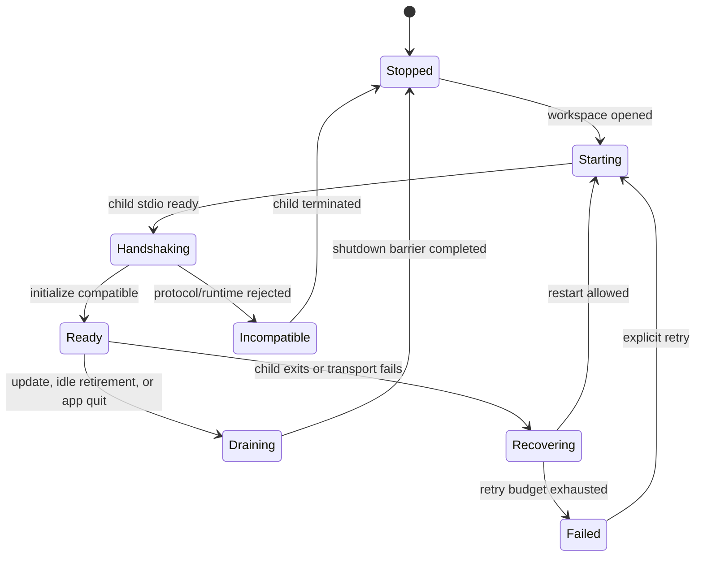

# Desktop RPC Client and Lifecycle

Status: accepted architecture baseline; protocol additions planned

This document defines how the Desktop backend consumes the Starweaver host protocol and names the additions required before a public Desktop release. `../ops/06-json-rpc-host-protocol.md` remains the normative current RPC v1 contract, while `../ops/09-rpc-idl-and-client-generation.md` defines the accepted generated Rust server and manifest-filtered TypeScript Desktop client structure. The TypeScript application owns typed client behavior, but the privileged Rust supervisor retains physical transport, request identity, routing, recovery, and authority. SSH transport adds probe, provisioning, and supervised-bootstrap states before `Handshaking` as specified in `07-ssh-remote-workspaces.md`; once accepted, the same client contract applies.

## Connection State Machine

Each workspace child follows an explicit state machine.

The supervisor must not send any JSON-RPC method except initialize before a successful handshake. A supervised SSH connection first completes its non-JSON-RPC nonce marker and launch-envelope bootstrap; that preface is not an RPC method and cannot admit runs. The supervisor must reject a host whose protocol major, required feature set, runtime identity, or storage compatibility range is incompatible with the Desktop shell.

## Initialize Contract

The IDL migration does not add fields to the closed host v1 initialize DTOs. Under v1:

- the request carries the existing client name/version and protocol name/major/revision fields;
- request `protocol.features` contains client-supported feature IDs, including supported display/interaction contract IDs;
- result `protocol.features` remains the server-supported set;
- client-required feature IDs are Desktop-local policy checked against that result; and
- both peers compute the same intersection, while omitted/empty request features select legacy-v1 mode.

Legacy-v1 mode preserves existing method admission and current notification behavior. It does not turn an old client's missing declaration into an empty authority set. A new notification or interaction variant is emitted only when its feature is explicitly present in the non-legacy negotiated intersection.

The richer public Desktop initialize contract cannot be added to the closed v1 DTOs. It requires the next host protocol major and must expose:

- server and runtime build identity;
- negotiated protocol name/major/revision plus server-supported and effective feature sets;
- effective host capabilities;
- storage schema current/read/write compatibility range and maintenance-barrier generation;
- effective workspace identity without exposing unnecessary absolute paths to the renderer;
- whether startup reconciliation changed any run state;
- update/runtime channel diagnostics safe for the client; and
- optional reconnect identity under explicit expiry and fencing rules.

Capability negotiation is per connection. RPC configuration can cap available capabilities, but it cannot claim that a client supports clarifying questions, approvals, rich tool events, or notifications merely because a server flag is enabled. Desktop rejects initialization when any locally required feature is absent. Old-client/new-host, new-client/old-host, omitted/empty feature, missing-required-feature, and reconnect fixtures are required.

## Request Discipline

The Desktop backend, not the renderer, owns wire requests. The IDL-derived Desktop operation manifest generates separate safe bridge DTOs; the backend must never deserialize renderer input as a complete host params type and must project host results/notifications before they cross the bridge.

- Every effectful operation covered by the host mutation contract uses a stable idempotency key generated before the first send and retained across retry.
- The required set includes run start/resume, session create/update/delete, approval decisions, deferred/clarification resolution, environment mutations, and OAuth login/refresh/logout state changes.
- JSON-RPC request IDs are unique per connection, generated by the backend, and are not used as durable operation identities.
- Idempotency keys, routing identities, client scopes, execution-domain bindings, and retry metadata are backend-constructed or backend-overridden fields; renderer payloads cannot inject them.
- Raw host paths, credentials, private diagnostics, and wire fields absent from the safe bridge result/notification schema never cross into TypeScript state.
- Each covered mutation returns a durable, secret-free receipt containing the operation kind, request fingerprint, idempotency key identity, state, and target/result reference.
- After response loss, the backend queries the receipt by scoped operation key before retrying. Methods outside the receipt contract are not blindly retried; the client uses explicitly documented target-state recovery or asks the user to reconcile.
- The backend never retries a covered mutation with a new idempotency key.
- UI cancellation cancels local interest first; it interrupts a run only after an explicit user intent maps to a control method.
- `run.await` is not used as the primary UI synchronization mechanism because it serializes a request path. The UI follows subscriptions and bounded status queries.

## Stream and Replay Model

A Desktop conversation is reconstructed from durable projections plus a live tail.

1. load the bounded session/run projection;
2. request replay after the last acknowledged family-aware cursor;
3. apply events idempotently by cursor and event identity;
4. subscribe from the replay boundary;
5. acknowledge the applied cursor in Desktop-local state;
6. on a gap, disconnect, child restart, or renderer restart, repeat from the last acknowledged cursor.

The UI must not treat an in-memory notification as durable until the corresponding protocol contract says it is persisted. Cursor family mismatches fail closed and trigger a bounded full projection reload, not cursor coercion.

Subscriptions are scoped by session/run and owned by a connection. Closing a window may unsubscribe that renderer while the backend retains a minimal status subscription for active runs.

## Run Control

Desktop supports these user intents through typed RPC operations:

- create or select a session;
- start a prompt;
- continue or branch from a selected run;
- steer an active run;
- interrupt an active run;
- inspect status and terminal diagnostics;
- attach to/replay a run;
- resolve approval, deferred, and clarifying-question records;
- resume a waiting run through the durable continuation path.

The backend routes control only to the child that owns the active run. A durable `Running` status alone does not prove that a newly started child can steer or interrupt a foreign owner.

## Required Continuation Preflight

Before cross-product or cross-runtime continuation, Desktop needs a typed preflight operation with one of these outcomes:

- `compatible`: preserve the source materialization;
- `switch_required`: continuation is possible only by accepting named drift;
- `blocked`: required state, workspace, profile, environment, or protocol evidence is unavailable;
- `waiting_resolution_required`: unresolved HITL must be handled first;
- `foreign_active_owner`: another process still owns the run/session admission.

The result includes typed, sanitized drift entries and the exact source/target materialization identities. The renderer never parses an error string to decide whether to use `continuationMode = switch`.

A switch requires explicit user confirmation unless a previously saved policy matches the same drift classes. Security-relevant drift, including workspace authority, model provider, tool capability, or environment attachment changes, always requires visible confirmation.

## HITL and Clarifying Questions

Approval, deferred tools, and clarifying questions are durable interaction records, not transient modal callbacks.

- A stream notification can prompt the UI, but the backend verifies the current durable record before presenting or resolving it.
- Decisions include record identity, expected revision/fence, idempotency key, and explicit decision payload.
- Duplicate windows coordinate through the backend so only one decision is submitted.
- Closing a modal or window does not deny or approve a request.
- After a decision, continuation occurs only through the typed resume/admission path.
- On reconnect, pending interactions are listed from durable state before live notifications are trusted.

Clarifying questions require a negotiated client capability. If unsupported, RPC must apply its configured fail/defer policy rather than emitting an interaction the client cannot resolve.

## Error Projection

Desktop-visible errors are structured into at least:

- user-correctable input/configuration errors;
- authentication required or expired;
- incompatible protocol/runtime/storage;
- workspace unavailable or outside authority;
- run conflict or foreign owner;
- stale fence/revision;
- update required;
- retryable transport/process failure;
- safe terminal runtime failure;
- internal diagnostic reference.

Raw provider responses, SQL text, credentials, authorization headers, unrestricted filesystem paths, and internal debug chains do not cross the renderer boundary. The backend may retain bounded local diagnostics with explicit user consent for export.

## Restart and Recovery

When a local child exits or an SSH-carried remote process/channel fails unexpectedly, the supervisor:

1. marks the child unavailable and stops sending requests;
2. records the last acknowledged cursors and uncertain mutations;
3. waits for a local child to terminate or reaps the failed local OpenSSH handle/pipes without treating that as proof of remote process death;
4. restarts or reconnects only within a bounded backoff/retry budget;
5. revalidates SSH route, host key, principal, stable execution-domain binding, and runtime probe when applicable, then performs bootstrap; a replacement becomes execution-capable only after acquiring the domain/workspace host lock, otherwise it reports a foreign live owner and uses catalog/control observation;
6. queries receipts/status for uncertain mutations;
7. replays from acknowledged cursors;
8. restores pending interactions and active-run status;
9. reports recovered, waiting, failed, or foreign-owned state to the UI.

A child must not be restarted endlessly when initialization reports an incompatible binary or storage schema.

## Graceful Shutdown

Shutdown is a barrier, not a fire-and-forget notification.

- Stop accepting new UI mutations.
- Unsubscribe renderer-only tails while retaining finalization visibility.
- Request coordinated RPC shutdown for each child.
- Wait for the configured bounded deadline.
- Persist final cursors and child outcome.
- Escalate to process termination only after the deadline.
- Surface any uncertain run outcomes on next launch and let startup reconciliation resolve them.

Update activation follows the same drain barrier and is specified in `06-runtime-updates-and-release.md`.

## Required Protocol Additions

Before public Desktop release, the host protocol must provide or explicitly standardize:

- compatible v1 client-supported semantics for request `protocol.features`, Desktop-local required-feature checks, legacy-v1 mode, and a persisted negotiated intersection for new client-opt-in notifications;
- a next-major initialize contract for runtime build, launch-envelope schema, storage compatibility, reconnect, and stable execution-domain metadata;
- a bounded supervised-stdio bootstrap that validates remote launch configuration before database open, plus a no-database identity/capability probe;
- stable execution-domain routing identity separated from mutable host-key/runtime evidence, plus a storage-owned stable database/workspace execution-host lock namespace independent of per-client state directories and a typed foreign-owner outcome;
- typed continuation preflight;
- OAuth status/login/refresh/logout methods and safe notifications;
- durable clarifying-question query/decision contracts if not represented by existing deferred records;
- scoped durable mutation receipts/idempotency for run, session, interaction, environment, and OAuth effects, plus a receipt lookup operation for uncertain outcomes;
- bounded cursor pagination for long session/run histories;
- structured incompatible/update-required errors;
- a migration/preflight mode usable by the runtime updater without starting ordinary runs.

These structural additions belong first in the host IDL and its generated `starweaver-rpc-core` boundary, with behavior implemented by `starweaver-rpc`; they do not originate in Desktop-only host wire DTOs. The Desktop operation manifest may define only safe renderer bridge projections over those host contracts.

## Acceptance Gates

- IDL-generated Rust server bindings and manifest-filtered safe TypeScript Desktop bridge/client bindings share one protocol identity, pass the RPC wire corpus, and expose no free-form renderer JSON-RPC or complete host params path.
- v1 initialize fixtures cover old-client/new-host, new-client/old-host, omitted/empty request features, missing locally required features, and the negotiated intersection; the next-major contract rejects wrong protocol names/majors, unsupported launch/storage ranges, and malformed capability declarations. Revisions remain fixture identities, not ordered minor versions.
- Retry tests prove receipt-backed idempotent mutation behavior after response loss for every covered effect class.
- Replay tests cover disconnect before response, notification gaps, duplicate delivery, cursor-family mismatch, and renderer reload.
- HITL tests cover two windows, stale decisions, reconnect, unresolved records, and explicit resume.
- Child crash and SSH disconnect tests prove bounded restart/reconnect, receipt/status recovery, and no duplicate run ownership.
- Shutdown tests prove no new admission after drain begins and classify forced termination as uncertain until reconciled.
