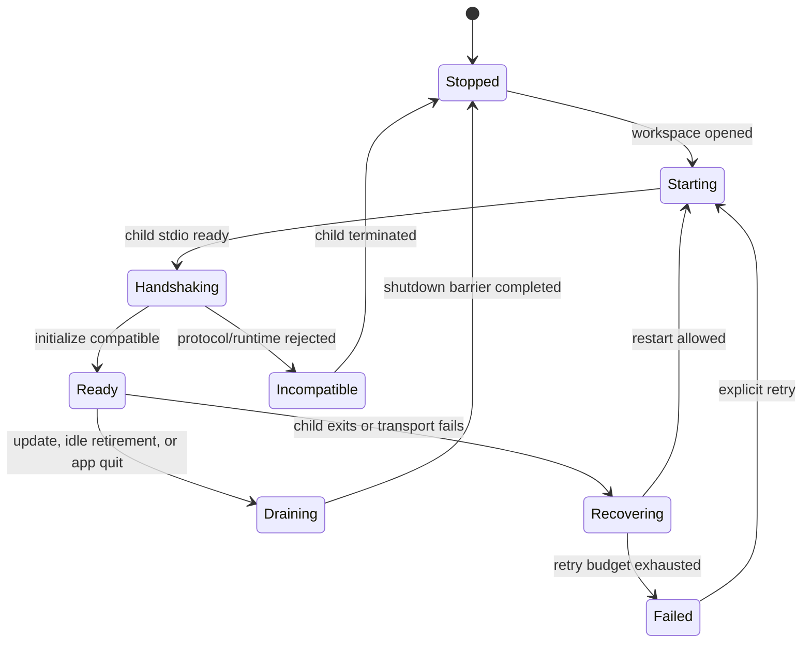

# Desktop RPC Client and Lifecycle

Status: accepted architecture baseline; protocol additions planned

This document defines how the Desktop backend consumes the Starweaver host protocol and names the additions required before a public Desktop release. `../ops/06-json-rpc-host-protocol.md` remains the normative current RPC v1 contract.

## Connection State Machine

Each workspace child follows an explicit state machine.

The supervisor must not send any method except initialize before a successful handshake. It must reject a child whose protocol major, required feature set, runtime identity, or storage compatibility range is incompatible with the Desktop shell.

## Initialize Contract

Desktop initialize requests must declare:

- client name and version;
- protocol name, major, and known non-ordered revision;
- client capabilities;
- required and optional feature IDs;
- renderer/display contract versions;
- optional reconnect identity.

The initialize result must expose:

- server and runtime build identity;
- negotiated protocol name/major/revision and feature set;
- effective host capabilities;
- storage schema current/read/write compatibility range and maintenance-barrier generation;
- effective workspace identity without exposing unnecessary absolute paths to the renderer;
- whether startup reconciliation changed any run state;
- update/runtime channel diagnostics safe for the client.

Capability negotiation is per connection. RPC configuration can cap available capabilities, but it cannot claim that a client supports clarifying questions, approvals, rich tool events, or notifications merely because a server flag is enabled.

## Request Discipline

The Desktop backend, not the renderer, owns wire requests.

- Every effectful operation covered by the host mutation contract uses a stable idempotency key generated before the first send and retained across retry.
- The required set includes run start/resume, session create/update/delete, approval decisions, deferred/clarification resolution, environment mutations, and OAuth login/refresh/logout state changes.
- JSON-RPC request IDs are unique per connection and are not used as durable operation identities.
- Each covered mutation returns a durable, secret-free receipt containing the operation kind, request fingerprint, idempotency key identity, state, and target/result reference.
- After response loss, the backend queries the receipt by scoped operation key before retrying. Methods outside the receipt contract are not blindly retried; the client uses explicitly documented target-state recovery or asks the user to reconcile.
- The backend never retries a covered mutation with a new idempotency key.
- UI cancellation cancels local interest first; it interrupts a run only after an explicit user intent maps to a control method.
- `run.await` is not used as the primary UI synchronization mechanism because it serializes a request path. The UI follows subscriptions and bounded status queries.

## Stream and Replay Model

A Desktop conversation is reconstructed from durable projections plus a live tail.

1. load the bounded session/run projection;
2. request replay after the last acknowledged family-aware cursor;
3. apply events idempotently by cursor and event identity;
4. subscribe from the replay boundary;
5. acknowledge the applied cursor in Desktop-local state;
6. on a gap, disconnect, child restart, or renderer restart, repeat from the last acknowledged cursor.

The UI must not treat an in-memory notification as durable until the corresponding protocol contract says it is persisted. Cursor family mismatches fail closed and trigger a bounded full projection reload, not cursor coercion.

Subscriptions are scoped by session/run and owned by a connection. Closing a window may unsubscribe that renderer while the backend retains a minimal status subscription for active runs.

## Run Control

Desktop supports these user intents through typed RPC operations:

- create or select a session;
- start a prompt;
- continue or branch from a selected run;
- steer an active run;
- interrupt an active run;
- inspect status and terminal diagnostics;
- attach to/replay a run;
- resolve approval, deferred, and clarifying-question records;
- resume a waiting run through the durable continuation path.

The backend routes control only to the child that owns the active run. A durable `Running` status alone does not prove that a newly started child can steer or interrupt a foreign owner.

## Required Continuation Preflight

Before cross-product or cross-runtime continuation, Desktop needs a typed preflight operation with one of these outcomes:

- `compatible`: preserve the source materialization;
- `switch_required`: continuation is possible only by accepting named drift;
- `blocked`: required state, workspace, profile, environment, or protocol evidence is unavailable;
- `waiting_resolution_required`: unresolved HITL must be handled first;
- `foreign_active_owner`: another process still owns the run/session admission.

The result includes typed, sanitized drift entries and the exact source/target materialization identities. The renderer never parses an error string to decide whether to use `continuationMode = switch`.

A switch requires explicit user confirmation unless a previously saved policy matches the same drift classes. Security-relevant drift, including workspace authority, model provider, tool capability, or environment attachment changes, always requires visible confirmation.

## HITL and Clarifying Questions

Approval, deferred tools, and clarifying questions are durable interaction records, not transient modal callbacks.

- A stream notification can prompt the UI, but the backend verifies the current durable record before presenting or resolving it.
- Decisions include record identity, expected revision/fence, idempotency key, and explicit decision payload.
- Duplicate windows coordinate through the backend so only one decision is submitted.
- Closing a modal or window does not deny or approve a request.
- After a decision, continuation occurs only through the typed resume/admission path.
- On reconnect, pending interactions are listed from durable state before live notifications are trusted.

Clarifying questions require a negotiated client capability. If unsupported, RPC must apply its configured fail/defer policy rather than emitting an interaction the client cannot resolve.

## Error Projection

Desktop-visible errors are structured into at least:

- user-correctable input/configuration errors;
- authentication required or expired;
- incompatible protocol/runtime/storage;
- workspace unavailable or outside authority;
- run conflict or foreign owner;
- stale fence/revision;
- update required;
- retryable transport/process failure;
- safe terminal runtime failure;
- internal diagnostic reference.

Raw provider responses, SQL text, credentials, authorization headers, unrestricted filesystem paths, and internal debug chains do not cross the renderer boundary. The backend may retain bounded local diagnostics with explicit user consent for export.

## Restart and Recovery

When a child exits unexpectedly, the supervisor:

1. marks the child unavailable and stops sending requests;
2. records the last acknowledged cursors and uncertain mutations;
3. waits for the old process to terminate and closes inherited pipes;
4. restarts only within a bounded backoff/retry budget;
5. performs initialize and startup reconciliation;
6. queries receipts/status for uncertain mutations;
7. replays from acknowledged cursors;
8. restores pending interactions and active-run status;
9. reports recovered, waiting, failed, or foreign-owned state to the UI.

A child must not be restarted endlessly when initialization reports an incompatible binary or storage schema.

## Graceful Shutdown

Shutdown is a barrier, not a fire-and-forget notification.

- Stop accepting new UI mutations.
- Unsubscribe renderer-only tails while retaining finalization visibility.
- Request coordinated RPC shutdown for each child.
- Wait for the configured bounded deadline.
- Persist final cursors and child outcome.
- Escalate to process termination only after the deadline.
- Surface any uncertain run outcomes on next launch and let startup reconciliation resolve them.

Update activation follows the same drain barrier and is specified in `06-runtime-updates-and-release.md`.

## Required Protocol Additions

Before public Desktop release, the host protocol must provide or explicitly standardize:

- per-connection client capability negotiation using the existing protocol name/major/revision plus required feature model;
- runtime build, launch-envelope schema, and storage compatibility metadata;
- typed continuation preflight;
- OAuth status/login/refresh/logout methods and safe notifications;
- durable clarifying-question query/decision contracts if not represented by existing deferred records;
- scoped durable mutation receipts/idempotency for run, session, interaction, environment, and OAuth effects, plus a receipt lookup operation for uncertain outcomes;
- bounded cursor pagination for long session/run histories;
- structured incompatible/update-required errors;
- a migration/preflight mode usable by the runtime updater without starting ordinary runs.

These additions belong in `starweaver-rpc-core` and `starweaver-rpc`; they do not belong in Desktop-only DTOs.

## Acceptance Gates

- A generated/current-version client passes the RPC wire corpus over stdio.
- Initialize rejects wrong protocol names/majors, absent required features, unsupported launch/storage ranges, and malformed capability declarations; revisions are fixture identities, not ordered minor versions.
- Retry tests prove receipt-backed idempotent mutation behavior after response loss for every covered effect class.
- Replay tests cover disconnect before response, notification gaps, duplicate delivery, cursor-family mismatch, and renderer reload.
- HITL tests cover two windows, stale decisions, reconnect, unresolved records, and explicit resume.
- Child crash tests prove bounded restart and no duplicate run ownership.
- Shutdown tests prove no new admission after drain begins and classify forced termination as uncertain until reconciled.
