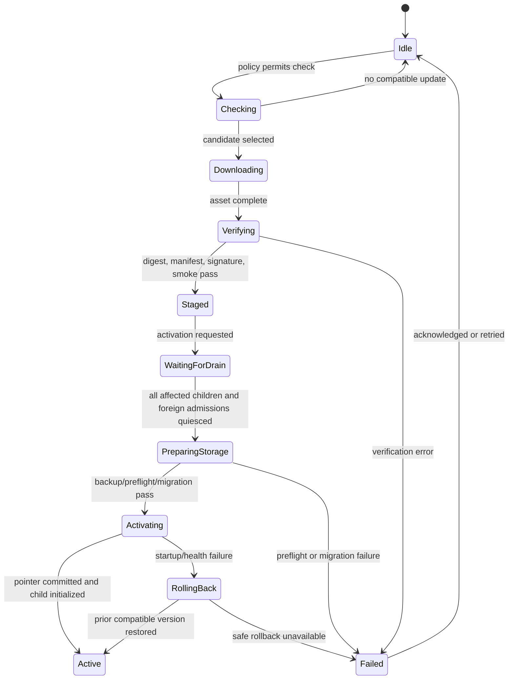

# Desktop Runtime Updates and Release

Status: accepted architecture baseline; implementation planned

The Desktop shell and the Starweaver RPC runtime have separate lifecycles. The Desktop backend supervisor owns a runtime update channel so execution can receive compatible fixes without requiring every renderer or shell change to ship in the same transaction.

This design extends the existing GitHub Release path. It does not invoke `starweaver update`, execute a downloaded shell installer, or replace a running binary in place.

## Version Identities

Desktop tracks these identities separately:

| Identity                   | Meaning                                                                     |
| -------------------------- | --------------------------------------------------------------------------- |
| Desktop shell version      | Native application/backend UI release                                       |
| Runtime version            | Exact `starweaver-rpc` build supervised by Desktop                          |
| Host protocol identity     | Protocol name, major, non-ordered revision, and feature set used over stdio |
| Display contract identity  | Display/replay payload compatibility                                        |
| Storage schema generation  | SQLite durable schema current/read/write range                              |
| Update manifest generation | Versioned updater metadata schema                                           |

A shared workspace release version may still build CLI, RPC, SDK, and Desktop artifacts together. Runtime compatibility is nevertheless checked explicitly so the shell can stage a newer or pinned RPC build safely.

## Existing Release Baseline

Current GitHub Release archives already:

- build `starweaver-rpc` for supported CLI targets;
- package it with `starweaver`, `starweaver-cli`, and `sw`;
- publish `checksums.txt` with SHA-256 hashes;
- allow a pinned `STARWEAVER_VERSION` and an explicit rollback through the CLI installer.

This is useful bootstrap evidence but is not the final Desktop updater contract:

- the CLI installer treats `rpc` as the whole CLI component;
- checksum download/entry presence is currently optional;
- binaries in one archive are replaced one by one;
- there is no Desktop/runtime compatibility manifest;
- there is no quiesced shared-database migration transaction;
- there is no versioned runtime directory or tested Desktop rollback state machine.

Desktop therefore gets a dedicated runtime component channel even when the bytes originate from the same workspace release.

## Runtime Bundle

The target release artifact is platform-specific and contains only the files needed by the Desktop execution host, for example:

```text
starweaver-runtime-vX.Y.Z-<target>.tar.gz
starweaver-runtime-vX.Y.Z-<target>.zip
```

A bundle contains:

- `starweaver-rpc` or `starweaver-rpc.exe`;
- an embedded `runtime-identity.json` that identifies and hashes the executable/files inside the extracted bundle;
- license/notices required for redistribution;
- platform signing metadata where applicable.

A detached, signed update manifest is published beside the archive. It is not embedded in the archive it hashes. The detached update manifest includes at least:

- update-manifest schema version;
- runtime semantic version and immutable build/revision identity;
- target OS/architecture/ABI;
- exact archive asset name, byte size, and SHA-256 digest;
- expected embedded identity-manifest digest;
- host protocol name, major, non-ordered revision, and feature set;
- accepted public RPC launch-envelope schema identities/ranges;
- display contract range;
- storage current/min-readable/max-readable/min-writable/max-writable generations;
- whether startup may migrate storage;
- database maintenance-barrier protocol generation;
- whether the previous supported runtime can read/write the post-migration schema;
- minimum/maximum compatible Desktop shell versions;
- release channel and publication timestamp;
- signing/provenance identity.

The embedded identity manifest contains the executable/file digests and the binary’s build, protocol, launch-schema, display, storage, and barrier identities, but never claims to hash its containing archive. Both manifests are generated from the release commit and validated against the built binary during packaging.

## Update Channels

Desktop supports a small explicit channel model:

- `stable`: published stable releases, default;
- `preview`: opted-in prereleases;
- `pinned`: an administrator or user-selected exact runtime version, with no automatic version change.

A channel is Desktop-local state. It does not change CLI update settings. Channel metadata may initially be hosted as GitHub Release assets, but the client consumes a versioned manifest rather than scraping HTML.

A feed entry becomes selectable only after every referenced manifest, asset, checksum, and signature is uploaded and the entry is atomically marked ready. GitHub's `published` or `/releases/latest` state alone is not an update commit point because the current workflow can expose a tag before packaging completes.

Candidate discovery resolves one exact version, build ID, manifest digest, asset URL, asset size, and asset digest. Download, verification, and activation retain that immutable candidate record and never resolve `latest` a second time. This prevents discovery/install time-of-check-to-time-of-use drift.

Downgrades require explicit user or managed-policy intent. Automatic update selection never chooses a lower semantic version or an artifact from a different repository/trust identity.

## Installation Layout

Runtime binaries live in versioned Desktop application-support directories, not beside a currently running executable:

```text
<desktop-data>/runtime/
  versions/
    <version>-<build-id>/
      update-manifest.json
      runtime-identity.json
      starweaver-rpc
  staged.json
  current.json
  previous.json
  update-transaction.json
```

`current.json` is a small atomic pointer/record, not a mutable executable. Existing children continue using the binary path from their launch record even after a new version is staged. Pointer, manifest, and transaction writes use a platform-specific durable atomic replace: write a same-directory temporary file, flush file contents, atomically replace the destination, and sync the parent directory where supported. Recovery never trusts a partially written JSON record.

Versioned directories avoid Windows replacement failures and make rollback deterministic. Garbage collection retains the current version, previous rollback candidate, any version used by a live child, and a bounded number of recent verified versions.

## Update State Machine



Every transition is recorded in Desktop-owned update state with the candidate, current, and previous build identities. A crash at any point resumes or rolls back from this record rather than inferring state from partial files.

One owner-only update lock serializes check-to-activation transactions for a Desktop data root. A concurrent shell instance or recovery helper may observe status but cannot stage, migrate, switch pointers, or garbage-collect versions until it acquires the same authenticated ownership lock.

## Download and Verification

Before staging:

01. resolve one exact detached update-manifest URL and expected manifest digest from channel metadata over HTTPS;
02. download and verify the detached manifest signature, digest, schema, and trust identity;
03. validate target, host-protocol major/features, launch-envelope range, and shell compatibility before archive download when possible;
04. download the exact named archive to a newly created staging directory with byte limits and timeout;
05. require and verify the detached archive size/SHA-256 entry; a missing digest is a hard failure;
06. reject path traversal, links, unexpected files, and duplicate entries during extraction;
07. verify the embedded identity-manifest digest and every declared executable/file digest;
08. validate executable build/protocol/launch identity against both manifests;
09. validate platform code signature/notarization where required;
10. run a bounded smoke initialize with a mutually supported launch envelope against an isolated temporary config/database;
11. atomically move the verified directory and detached manifest into `versions/`.

Staging directories are created with secure random names and owner-only permissions. Archive inspection happens before extraction and rejects absolute paths, parent traversal, links, duplicate entries, unexpected files, and configured compressed/uncompressed size limits.

A checksum fetched from the same GitHub Release protects transfer integrity but is not an independent signature. Public release readiness additionally requires platform code signing and a signed update manifest/provenance chain rooted in the signed Desktop updater or release service.

The renderer cannot bypass a verification failure.

## Compatibility Selection

The supervisor selects a runtime only when all are true:

- shell version is in the detached update-manifest range;
- host protocol name/major matches and required features are present; the revision is an identity, not an ordered minor version;
- the public launch-envelope schema ranges intersect;
- display contract ranges intersect;
- the selected database schema is readable and writable by the candidate;
- the candidate migration path is supported;
- the channel and trust identity match policy;
- the target matches the host platform;
- no known-bad or revoked build policy rejects it.

Initialize rechecks the binary’s self-reported identities. Detached update manifest, embedded identity manifest, and binary disagreement quarantines the bundle.

## Activation and Active Runs

Downloading and verification may occur while runs are active. Activation may not replace or terminate an active child implicitly.

- New candidate state becomes `Staged`.
- If no storage migration is possible and protocol compatibility permits mixed children, new idle workspace children may use the candidate while existing children drain.
- If a candidate may migrate shared storage, its no-run maintenance process may access the real database only to publish and observe the fenced `draining` barrier. All Desktop-owned children must drain and all eligible owners/effect claims must be gone before the process promotes the barrier to `exclusive`, creates the migration backup, migrates, or performs any other exclusive-phase write.
- An explicit “restart now” action explains which active runs would be interrupted and uses coordinated shutdown; otherwise activation waits.
- Closing a window is not consent to restart a runtime.

Mixed runtime versions against one database are allowed only when the detached update manifests and N/N-1 tests declare the schema and durable writes mutually compatible.

## Shared Storage Migration Transaction

A storage-changing activation is serialized across the Desktop supervisor and all supported local products through a product-neutral two-phase database maintenance barrier.

Desktop coordinates the operation through a dedicated `starweaver-rpc` maintenance mode that admits no runs and owns the drain intent, exclusive migration ownership, backup, migration, and integrity-check calls. The Desktop backend does not link `starweaver-storage` or manipulate SQLite/sidecar locks directly. Standalone CLI/RPC paths may use the same storage-owned primitive inside their own processes.

The barrier has two fenced phases:

- `draining`: atomically records owner, generation, target schema, expiry, and admission cutoff. Supported products reject new run/background/effect admission and unrelated mutations, while owners admitted before the cutoff may continue heartbeat, checkpoint, terminal commit, and lease release needed to drain safely.
- `exclusive`: entered only after all pre-cutoff owners and effect claims are gone. It rejects all ordinary writes and is held across backup, migration, integrity checks, and runtime pointer commit.

Every product path that can apply a pending schema migration, including ordinary CLI/RPC startup, must use these phases; migration is never a hidden side effect under an ordinary writer path. The barrier is derived from the canonical database identity and lives outside Desktop-private state so independent products can honor it without depending on Desktop. Expiry/recovery is fenced so a stale maintenance process cannot resume after a replacement owner.

01. start the candidate maintenance process and atomically publish the `draining` intent/cutoff;
02. stop new Desktop run admission and ask Desktop-owned children to drain;
03. allow pre-cutoff owners to persist heartbeat/checkpoint/terminal/release evidence;
04. inspect run admissions, background-subagent/delivery claims, and other durable effect leases, then wait while a live foreign CLI/RPC owner is active;
05. reject or require shutdown of an older local product version that does not support the maintenance barrier;
06. after every eligible owner is gone, atomically promote the fenced barrier to `exclusive`;
07. create an owner-only, integrity-checked, quota-bounded consistent SQLite backup through a storage API;
08. run candidate migration preflight against a disposable backup/snapshot;
09. let the candidate maintenance process apply/check the real database while quiesced;
10. verify migration status, integrity, and candidate self-reported compatibility;
11. atomically commit the current runtime pointer while the maintenance process still owns the exclusive barrier;
12. release the maintenance barrier and stop the maintenance process;
13. start one ordinary candidate catalog/workspace child and complete initialize/health checks;
14. reopen remaining workspace children and resume normal admission;
15. retain the backup until the rollback window expires, then delete it through an explicit retention policy.

Opening an ordinary host and hoping startup migration succeeds is not a sufficient updater API. RPC/storage must provide a bounded maintenance process with structured check/apply outcomes, no ordinary run admission, and a barrier lifetime that spans pointer commit. An ordinary child starts only after that exclusive barrier is released.

Desktop cannot force a CLI process to stop. If foreign admission, a non-participating older process, or a database/maintenance lock prevents safe migration, activation waits and presents actionable status. Checking admission leases without first publishing the fenced drain cutoff is insufficient because a CLI could otherwise admit a new run between the check and exclusive migration. Acquiring exclusivity before existing owners finalize is also prohibited because it would block their heartbeat and terminal evidence.

## Rollback Classes

Rollback depends on storage compatibility.

### No schema change

The supervisor drains candidate children, points `current.json` to the previous verified runtime, initializes it, and resumes. No database restore is needed.

### Backward-compatible schema change

Pointer rollback is allowed only when the previous detached update manifest and compatibility tests declare the current schema readable and writable.

### Incompatible schema change

Automatic binary-only rollback is prohibited. Options are:

- keep the new compatible runtime and report the shell/runtime failure;
- install a fixed forward runtime;
- restore the pre-migration backup only after all writers are stopped and the user confirms that post-migration writes, if any, will be discarded.

The updater must never launch an older binary against a schema outside its declared range.

## Shell Updates

The Tauri 2 updater, backed by platform code signing and the reviewed release feed, manages Desktop shell updates. A shell release can include a bootstrap runtime, but installation does not automatically replace a newer compatible managed runtime.

After a shell update:

1. read the existing runtime transaction and current pointer;
2. validate the managed runtime against the new shell;
3. use it when compatible;
4. otherwise activate the signed bootstrap runtime or fetch a compatible channel runtime;
5. never open storage with an incompatible bootstrap binary merely to discover the error.

Shell and runtime updates may be offered together, but remain two compatibility-checked transactions.

## CLI Relationship

CLI continues to use its launcher/install path. Desktop does not call `starweaver update` and does not replace binaries in the CLI install directory.

CLI and Desktop may install the same RPC version in different locations. Shared durable compatibility is governed by protocol/storage ranges and CI, not by requiring both products to execute the same filesystem binary.

The release process may derive both CLI and Desktop runtime bundles from the same `starweaver-rpc` build to avoid drift.

## Release and CI Changes

When implementation begins, release automation must add:

- dedicated runtime artifacts for supported Desktop targets;
- mandatory checksum entries;
- generated compatibility manifests;
- manifest/binary identity validation;
- platform signing/notarization and provenance publication;
- immutable update-channel metadata;
- current/previous runtime fixture retention;
- Desktop package artifacts and native updater metadata.

Release-event workflows remain packaging-only. Compatibility, migration, updater fault injection, and smoke validation run before the release commit is merged.

The update feed advertises only targets that the release workflow actually builds and validates. Target detection and the release matrix are generated from or checked against one registry; for example, Linux ARM64 cannot be advertised until its runtime artifact exists. Desktop launch uses the verified absolute runtime path and never falls back to `PATH`.

## Acceptance Gates

- Check, download, timeout, partial download, digest mismatch, missing digest, malformed archive, wrong target, and wrong manifest all fail safely.
- Staging never modifies the current runtime or live child executable.
- Active runs continue during download and are not interrupted by automatic activation.
- Crash injection at every update state resumes to one valid current runtime.
- Concurrent updater attempts serialize through one owner-only transaction lock and cannot corrupt staging or pointers.
- Candidate initialize failure restores the prior runtime when schema rules permit.
- Migration preflight, consistent backup, drain-to-exclusive barrier fencing, existing-owner finalization, foreign-writer blocking, admission races, interrupted migration, and integrity validation are tested.
- Older runtimes are never launched outside their declared storage range.
- Windows versioned-directory activation works without replacing an executing file.
- Stable, preview, pin, explicit downgrade, revoked build, and offline behavior have deterministic tests.
- CLI current/previous and Desktop runtime current/previous interoperability matrices pass before release.
- Public macOS/Windows bundles pass signing/notarization verification; Linux bundles pass required digest/provenance verification.
