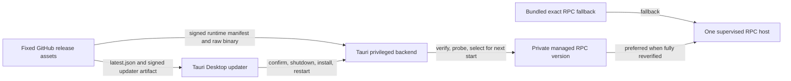

# Desktop Runtime Updates and Release

Status: first-release independent RPC updates, Tauri Desktop updates, native packaging, and release automation implemented; storage-changing runtime updates deferred

Starweaver Desktop ships one exact target-specific `starweaver-rpc` sidecar in every native package and may also install a newer compatible RPC runtime independently. The bundled sidecar is the immutable bootstrap and recovery fallback. Desktop itself updates through Tauri 2's native updater.

The initial release channel intentionally does not use Apple Developer ID/notarization or Windows Authenticode publisher signing. Those platform trust identities are separate from, and not replaced by, the mandatory free Tauri/minisign project signatures used for automatic updates. Users receive verification and single-application warning-bypass guidance in `docs/desktop-install.md`.

## Accepted First-Release Model

The shell and runtime are separate update transactions:

- every package contains the exact same-release RPC sidecar;
- a managed RPC candidate is accepted only when it has the exact current host protocol identity, exact Rust target triple, launch schema 1, storage generation 1, and a compatible Desktop semantic-version range;
- independent RPC updates cannot change storage schema or require a migration;
- installing an RPC candidate changes the selection for the next Desktop process start and never interrupts the current host;
- rollback selects the previous verified managed runtime, or the bundled sidecar when no previous managed version exists, for the next start;
- the Desktop shell uses `tauri-plugin-updater` with a fixed GitHub `latest.json` endpoint, an embedded project public key, native confirmation, coordinated RPC shutdown, installation, and restart;
- renderer IPC exposes only typed check/install/rollback intents and safe projections. It cannot provide a URL, target, path, signature, header, proxy, executable, RPC payload, or installer bytes.


```mermaid
flowchart LR
    release[Fixed GitHub release assets]
    backend[Tauri privileged backend]
    bundled[Bundled exact RPC fallback]
    managed[Private managed RPC version]
    rpc[One supervised RPC host]
    shell[Tauri Desktop updater]

    release -->|signed runtime manifest and raw binary| backend
    release -->|latest.json and signed updater artifact| shell
    backend -->|verify, probe, select for next start| managed
    bundled -->|fallback| rpc
    managed -->|preferred when fully reverified| rpc
    shell -->|confirm, shutdown, install, restart| backend
```

## Trust and Signing Boundaries

These mechanisms have distinct meanings:

| Mechanism                           | Required in the initial channel | Purpose                                                                                                   |
| ----------------------------------- | ------------------------------- | --------------------------------------------------------------------------------------------------------- |
| Tauri/minisign project signature    | Yes                             | Authorizes Desktop updater artifacts and detached RPC manifests with the project key embedded in Desktop. |
| SHA-256 and exact byte size         | Yes                             | Binds each downloaded asset to signed metadata and release checksums.                                     |
| GitHub build provenance             | Yes                             | Attests that published package/runtime assets were produced by the repository release workflow.           |
| Apple Developer ID and notarization | No                              | Would establish an Apple-recognized publisher and remove normal unsigned Gatekeeper friction.             |
| Windows Authenticode                | No                              | Would establish a Windows-recognized publisher and improve SmartScreen reputation.                        |

A checksum or GitHub attestation never substitutes for an update signature or OS publisher identity. Automatic update signature verification cannot be disabled or bypassed by the renderer or user. Platform warning bypass is documented only for an initially downloaded or manual-fallback artifact whose checksum and provenance have already been verified.

The same long-lived project key currently signs both Tauri updater artifacts and detached RPC manifests. The private key exists only in release secrets. Desktop embeds only its public key through `STARWEAVER_UPDATE_PUBLIC_KEY`. Development builds without a valid embedded key do not register the native updater plugin, remain functional with the explicitly selected development RPC or bundled RPC, and report both update channels as unconfigured.

## Version and Compatibility Identities

Desktop keeps these identities separate:

| Identity               | Current rule                                                         |
| ---------------------- | -------------------------------------------------------------------- |
| Desktop version        | Workspace semantic version used by Tauri and the updater feed.       |
| RPC runtime version    | Independently selectable semantic version.                           |
| Runtime build revision | Full lowercase release commit digest.                                |
| Rust target            | Exact full target triple, not an abbreviated architecture/OS label.  |
| Host protocol          | Exact name, major, non-ordered revision, and schema digest.          |
| Launch envelope        | Exact schema version 1.                                              |
| Storage                | Exact generation 1; no migration in the independent updater.         |
| Runtime manifest       | Strict schema version 1 with unknown fields rejected.                |
| Runtime pointer        | Strict schema version 1 with an installation ID and manifest digest. |

The release packager currently derives a runtime candidate's Desktop range as the same minor line: `>=MAJOR.MINOR.0, <MAJOR.(MINOR+1).0`. Runtime selection also requires the candidate version to be newer than the currently selected bundled or managed version. Desktop reports the ready runtime and next-start selection by version and source (`bundled` or `managed`); managed identities additionally bind the signed digest. Therefore a same-version source change or managed-binary replacement still correctly requires restart.

## Independent RPC Runtime Channel

### Fixed release assets

For each reviewed target, the release publishes:

```text
starweaver-runtime-<target>.manifest.json
starweaver-runtime-<target>.manifest.json.sig
starweaver-rpc-v<version>-<target>[.exe]
```

The signed manifest contains:

- schema version;
- runtime semantic version and immutable build revision;
- exact Rust target triple;
- compatible Desktop semantic-version range;
- exact host protocol identity;
- launch schema version;
- storage generation;
- fixed asset name and HTTPS release URL;
- exact byte size and SHA-256 digest.

The runtime is a raw executable rather than an archive. This avoids an extraction surface and unexpected-file/link/path-traversal classes. Asset and manifest URLs must remain under the fixed `Wh1isper/starweaver` GitHub release path.

### Check, install, and probe

The privileged runtime manager:

01. fetches the one target-specific manifest and `.sig` from the fixed latest-release URLs with HTTPS, redirect, timeout, and response-size bounds;
02. verifies the detached project signature before parsing the strict manifest;
03. validates every compatibility identity and rejects downgrade/equal-version candidates;
04. retains the exact verified manifest bytes as an opaque backend-owned candidate;
05. downloads only its exact raw executable with a 256 MiB bound while checking declared size and SHA-256;
06. writes into a new owner-private staging directory and applies executable/read-only permissions where supported;
07. performs a bounded initialize/shutdown probe against an isolated temporary launch envelope and database;
08. atomically moves the candidate into a private content-addressed directory and persists the signed manifest;
09. atomically replaces one `selection.json` record containing the current and previous verified pointers;
10. reports that application restart is required.

The probe never opens the canonical user database. Installation does not restart, replace, or terminate the active domain host. A normal next Desktop start resolves and fully re-verifies the pointer, signature, compatibility manifest, executable exact size, digest, and permissions before preferring the managed runtime. Local manifest, signature, selection, launch-envelope, and runtime reads are bounded from an already opened handle; runtime hashing requires the exact signed size and a 256 MiB hard maximum. The manifest's signed executable size and digest remain the supervisor's expectations through staging and the pre-spawn recheck; they are not replaced by trust derived from the resolved path. Any missing, malformed, incompatible, or unverifiable managed selection fails closed to the bundled sidecar. If a selected managed runtime still fails startup or initialize after resolution, Desktop makes one fresh-generation attempt with the bundled sidecar from the same installation.

The private layout is conceptually:

```text
<desktop-data>/runtime/
  staging/
  versions/
    <manifest-id>/
      starweaver-rpc[.exe]
      manifest.json
      manifest.sig
  selection.json
```

`selection.json` is one bounded, path-free, schema-versioned record, so current/previous state cannot be torn across two pointer-file replacements. A rollback swaps the current and previous verified pointers in one atomic replacement when both exist. Without a previous managed pointer it clears the current pointer in that same record, making the bundled sidecar the next-start selection while retaining the former managed pointer as the next rollback choice. Rollback does not claim to revert durable data because this channel forbids storage changes.

## Desktop Shell Update Channel

Desktop uses the Rust `tauri-plugin-updater` API only. The backend builds an updater with:

- fixed endpoint `https://github.com/Wh1isper/starweaver/releases/latest/download/latest.json`;
- the project public key embedded at build time;
- a 30-second metadata timeout;
- no renderer-supplied updater configuration.

Before invoking Tauri's parser, the backend fetches the fixed metadata endpoint through its bounded HTTPS client, accepts at most 256 KiB and 16 platform entries, and limits every signature string to 16 KiB. Tauri then performs its normal check, and any retained candidate must carry raw metadata exactly equal to that bounded preflight document. A successful check retains Tauri's exact candidate object in process-owned state and exposes only bounded version, release-note, timestamp, and signing-state fields. Install requires the exact retained version. The backend downloads only the candidate's canonical target/version GitHub asset through a fixed HTTPS client with limited redirects, a 30-second request and outer operation timeout, and a 1 GiB content/chunk hard bound. On Linux, the canonical asset is selected from the installed Tauri bundle type, so an AppImage accepts only the AppImage entry and a deb installation accepts only the deb entry. The backend then verifies the mandatory Tauri project signature with the embedded key before presenting a native warning that Apple/Microsoft publisher signing is absent. Only after that verification and confirmation does Desktop coordinate RPC shutdown, install the already verified bytes through Tauri, and restart the application.

If download, signature verification, native confirmation, coordinated shutdown, or installation fails, Desktop returns a stable sanitized category. It does not expose response bodies, URLs, signatures, paths, installer bytes, or raw platform failures to the renderer. Manual verified installation remains the recovery path when the updater is unavailable.

A newly installed shell still carries its exact bundled sidecar. On startup it uses an existing managed runtime only if that runtime remains fully compatible with and verifiable by the new shell; otherwise it safely falls back to its bundle.

## Packaging and Release Automation

`apps/starweaver-desktop/targets.toml` defines the supported matrix:

| Target                     | Native packages                   |
| -------------------------- | --------------------------------- |
| `x86_64-unknown-linux-gnu` | AppImage and deb                  |
| `x86_64-apple-darwin`      | DMG and Tauri app updater archive |
| `aarch64-apple-darwin`     | DMG and Tauri app updater archive |
| `x86_64-pc-windows-msvc`   | NSIS installer/updater executable |

`make desktop-package` builds unsigned current-platform installers with the exact external sidecar. `make desktop-package-updater` additionally requires `STARWEAVER_UPDATE_PUBLIC_KEY` and `TAURI_SIGNING_PRIVATE_KEY` and creates Tauri updater artifacts.

The bundle-only Tauri overlay:

- builds the exact target RPC before the frontend;
- copies it to the target-qualified `externalBin` name Tauri requires;
- packages exactly one RPC sidecar;
- uses macOS ad-hoc signing (`-`) rather than a Developer ID identity;
- keeps ordinary development and `--no-bundle` builds independent of generated sidecar files.

Premerge Desktop CI generates a throwaway project key per target and builds the same updater-ready package configuration used by release, including updater signatures, a signed runtime manifest, canonical artifact collection, and dynamic bundler public-key injection. It verifies both runtime and Desktop artifact signatures with the corresponding public key, proving that the configured private/public pair matches. It extracts package contents, verifies there is exactly one sidecar with the expected digest (after the deterministic macOS ad-hoc hardened-runtime signing transform) and Unix execute bit, and runs the independent Python host-protocol client where the target is executable on the runner. Linux packaging sets `NO_STRIP=1`, then restores the exact target RPC into the generated AppDir, repacks with a fixed digest-verified AppImage output plugin, and regenerates any updater signature over the final AppImage bytes; `linuxdeploy` otherwise patches the ELF RPATH even when stripping is disabled. CI checks both deb and updater-selected AppImage contents and runs the handshake against the AppImage sidecar. macOS builds both the Tauri `app` updater target and the user-facing DMG; Intel package contents are checked without pretending that an ARM runner executed the Intel binary. Windows executes the packaged sidecar's full stdio/replay/live/typed-error proof while the independent Windows workspace gates cover standalone HTTP authentication, request handling, and shutdown, avoiding a redundant packaged-process loopback probe that is vulnerable to transient local socket aborts.

The release-event workflow is packaging-only and has three independent publication lanes:

1. the core lane builds CLI/RPC archives, protocol artifacts, and Python distributions, uploads them with `checksums.txt`, and gates crates.io/PyPI publication;
2. the runtime lane consumes the raw RPC binaries retained by the binary matrix, creates and project-signs all four target-specific runtime manifests, verifies them against `STARWEAVER_UPDATE_PUBLIC_KEY`, attests the runtime assets, and uploads them with `runtime-checksums.txt`;
3. the Desktop lane builds updater-ready native packages with exact bundled sidecars, collects and verifies canonical installer/updater signatures, attests the Desktop assets, combines exactly four native-target records into five installer-specific Tauri `latest.json` entries (separate Linux AppImage and deb entries, two macOS architectures, and Windows NSIS), and uploads them with `desktop-checksums.txt`.

A failed Desktop target, Tauri signature, or metadata finalization keeps the Desktop lane failed but has no dependency path to core uploads, crates.io, PyPI, or the independently signed RPC runtime lane. Runtime and Desktop release assets have disjoint canonical filenames. Every lane refuses to replace an existing release asset, uploads payloads before checksum/updater metadata, and requires explicit operator cleanup or a new version after any partial upload. No lane suppresses its own failure with `continue-on-error`.

No Apple or Microsoft signing credential is required. Release maintainers must provision the free Tauri project key pair once, store the public key as the `STARWEAVER_UPDATE_PUBLIC_KEY` GitHub variable, and store the private key and optional password as `TAURI_SIGNING_PRIVATE_KEY` and `TAURI_SIGNING_PRIVATE_KEY_PASSWORD` secrets. Key rotation requires an explicit trust-transition release; silently replacing the embedded public key would strand existing clients.

## Storage Migration Boundary

Independent RPC candidates are deliberately restricted to `storageGeneration = 1`. They cannot request startup migration, claim a wider schema range, or use the canonical database during the isolated probe. A schema-changing Desktop or managed-runtime release must not be published until storage owns both:

- atomic supervised database open/create that removes the current preflight/check-open race; and
- a product-neutral coordinated maintenance barrier honored by Desktop, standalone RPC, CLI, background owners, and durable effect claims.

The later migration transaction must drain admissions, fence active owners, create and verify a consistent backup, preflight the candidate against a disposable copy, migrate under exclusive ownership, check integrity, and keep pointer commit within the barrier lifetime. Desktop must coordinate that operation through a bounded RPC/storage maintenance interface rather than linking storage or editing SQLite directly.

Until that contract exists:

- the supervised host rejects an existing out-of-date database before ordinary open;
- independent runtime manifests with any other storage generation fail verification;
- release automation must classify storage/schema changes as blocking both runtime and Desktop publication;
- rollback is binary selection only and is valid precisely because accepted candidates cannot change storage.

## Security and Recovery Invariants

- The bundled exact sidecar is always retained as fallback and is never replaced by the runtime updater.
- Managed candidates activate only on the next Desktop process start.
- The active host is never interrupted by runtime download, install, or rollback.
- Every managed selection is fully reverified on every process start.
- URLs, target, compatibility metadata, digest, signature, executable path, and pointer state remain backend-owned.
- The renderer has no generic updater plugin, HTTP client, filesystem API, shell/process API, or arbitrary RPC surface.
- Desktop shell installation requires native user confirmation and coordinated RPC shutdown.
- Tauri/runtime signature failures are not OS-warning cases and are never bypassable.
- Manual fallback packages must be checked against both `desktop-checksums.txt` and GitHub provenance before a per-application OS warning bypass.
- Desktop never calls `starweaver update`, replaces CLI-installed binaries, reads CLI-private config, or searches `PATH` for an RPC host.

## Acceptance Gates

- `make desktop` launches the complete development application with a same-build bundled RPC.
- All four native targets build real packages with exactly one verified sidecar.
- Native executable targets complete the independent protocol handshake smoke against the extracted sidecar.
- Runtime manifest signature, target, protocol, launch schema, storage generation, Desktop range, asset URL, size, digest, stale candidate, and probe failures are tested to fail closed.
- A valid RPC candidate is installed privately, selected only for the next start, and can be rolled back to previous or bundled runtime.
- Managed runtime pointer and files are reverified before every launch; invalid state falls back to bundled RPC.
- Desktop update checks use only the fixed endpoint and retain exact candidates in Rust.
- Desktop installation requires Tauri signature verification, native confirmation, coordinated shutdown, and restart.
- Release artifacts include `latest.json` with five installer-specific entries from four native targets, target-specific signed runtime manifests, raw runtime binaries, updater signatures, canonical installers, channel-specific checksums, and provenance attestations.
- Desktop publication failure does not block core assets, crates.io, PyPI, or independently signed RPC runtime assets.
- Release pages and installation docs state that macOS/Windows packages lack OS publisher signatures and explain bounded per-application handling without recommending global security disablement.
- Any schema-changing release remains blocked until the coordinated storage maintenance contract is implemented and tested.
