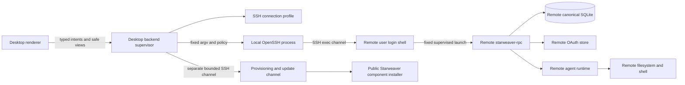
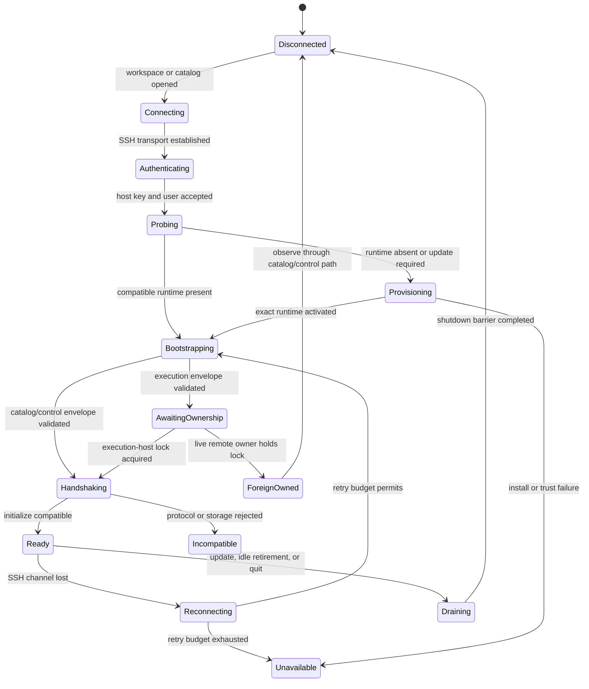

# SSH Remote Workspaces

Status: accepted design direction; protocol and installer work planned

This document extends Starweaver Desktop from local child-process execution to remote execution through SSH. The remote machine is a separate execution domain: `starweaver-rpc`, durable storage, model/provider resolution, OAuth, filesystem access, and shell processes all run as the authenticated remote user.

SSH is a process transport for the standalone RPC host. It is not an `EnvironmentProvider`, a filesystem proxy, an SFTP-backed toolset, or a way to make a local RPC process execute selected tools remotely.

The local-child rules in `01-product-and-process-boundaries.md`, the host client lifecycle in `02-rpc-client-and-lifecycle.md`, and the security rules in `05-auth-interaction-and-security.md` remain normative except where this document explicitly distinguishes local and remote execution domains.

## Decision Summary

- Desktop v1 uses the platform OpenSSH client rather than embedding a second SSH implementation.
- The privileged Desktop backend owns SSH processes, authentication prompts, host-key decisions, RPC framing, reconnect policy, and remote runtime provisioning. The renderer cannot provide arbitrary SSH options or remote commands.
- A remote workspace key is `(execution_domain_id, canonical_remote_workspace_id)`, not a path canonicalized on the Desktop machine.
- Remote RPC, SQLite storage, OAuth credentials, profiles, model requests, filesystem operations, and shell processes stay on the remote machine. Desktop does not synchronize the remote database into the local canonical database.
- One persistent SSH exec channel carries one workspace-scoped supervised RPC process. A separate bounded provisioning channel handles probe/install/update operations.
- The remote RPC is started through the remote user's login shell so the user's intended `PATH`, provider environment, and shell initialization can participate in host setup.
- Login-shell startup output is separated from RPC framing by a per-launch nonce marker and a bounded supervised bootstrap preface.
- Remote native shell is enabled by default after the user grants the SSH target. Its authority is the full authenticated remote account, not the selected workspace. Desktop must state this plainly and never represent it as workspace containment.
- Local native-shell policy is unchanged: local shell-enabled release profiles still require an enforceable sandbox, otherwise native local shell remains disabled by default.
- Desktop can bootstrap and update the remote RPC automatically through a public, versioned, non-interactive Starweaver component-install contract. The installer/update implementation must be shared with and hardened by the `starweaver`/`sw` install and update path rather than reimplemented as a Desktop-only updater.
- The first supported remote hosts are POSIX Linux and macOS systems with OpenSSH server support and a tested login shell. Windows SSH servers require a separate PowerShell/bootstrap contract before support is advertised.

## Product Scope

A remote connection profile identifies how Desktop reaches one SSH account. It contains only non-secret connection policy and references:

- Desktop-owned profile ID and display name;
- SSH host alias or hostname, port, and optional user;
- selected OpenSSH configuration source;
- host-key trust record and expected fingerprint set;
- allowed authentication methods and identity references;
- optional `ProxyJump` route;
- runtime channel, exact pin, or managed-update policy;
- connection timeouts, keepalive policy, and reconnect budget;
- whether full remote-account shell authority has been granted.

Passwords, private-key bytes, passphrases, OAuth tokens, provider API keys, and raw agent socket contents are not profile fields.

The initial scope does not include:

- mounting a remote workspace into the local filesystem;
- synchronizing local and remote SQLite databases;
- forwarding local OAuth/provider credentials to the remote process;
- exposing a general SSH terminal to the renderer;
- arbitrary user-authored remote bootstrap commands;
- SSH agent, X11, port, or socket forwarding;
- surviving a network loss through a detached remote daemon;
- Windows remote-host bootstrap;
- transparent file reveal for remote paths through local `file://` URLs.

## Execution-Domain Topology



The local OpenSSH process is the Desktop child. The remote `starweaver-rpc` process is the execution host. stdin/stdout of the SSH process become the supervised RPC byte stream after bootstrap; stderr is a bounded, scrubbed combination of OpenSSH diagnostics, login-shell diagnostics, and remote RPC diagnostics.

Desktop may maintain:

- one remote catalog/control RPC connection per connected execution domain when global remote history is needed;
- at most one execution-authorized RPC connection for each execution-domain/canonical-workspace key across all runtime/config generations;
- multiple windows over one backend-owned connection and subscription set.

A local database, a remote account on host A, and a remote account on host B are three independent execution domains. Session IDs remain canonical durable IDs, but Desktop routing and cache keys include the execution-domain identity so accidental cross-domain collisions or mutations are impossible.

## Execution-Domain Identity

A hostname is a route, not a durable identity. DNS, SSH aliases, ports, bastions, host keys, runtime builds, and platform details can change independently of the remote Starweaver data.

After first trust and supervised initialize, Desktop creates one stable local `execution_domain_id` binding anchored to the remote-owned identity tuple:

- a remote Starweaver installation/domain ID stored in the remote config root;
- stable effective remote OS principal identity (for example an installation-scoped UID digest), separate from the mutable display username;
- canonical database identity or digest.

Host-key fingerprints, route/profile identity, platform, runtime build, protocol/materialization generations, and last verification time are attached trust/runtime evidence. They do not participate in the persistent routing key. A normal runtime update therefore cannot change workspace IDs, cache partitions, or cursor origins. After an explicitly approved host-key rotation, Desktop atomically replaces the trusted transport evidence while retaining the same execution-domain binding.

RPC returns only the remote-owned identity and runtime evidence; it does not claim knowledge of the SSH transport identity. A changed principal, installation/domain ID, or canonical database identity is a new execution domain unless an explicit rebind/migration operation atomically aliases the old binding, rewrites every workspace/cache/cursor origin reference, and retires the old binding. Initial scope creates a new domain instead of performing that migration.

Cloned machines or restored home directories can duplicate the remote-owned tuple. Desktop therefore also binds it to the approved connection-profile identity and verified SSH route as trust evidence, detects the tuple appearing behind an unrelated profile/host key, and asks for an explicit new-domain or rebind decision. It never silently deduplicates by installation ID alone.

## OpenSSH Client Boundary

Desktop resolves a trusted system OpenSSH executable to an absolute local path. The renderer cannot select the executable, pass raw options, edit environment variables, or construct the destination string. Backend profile commands accept typed host-alias/hostname, user, and port fields; they reject control characters, option-like destinations, embedded credentials, and values outside their field grammar before building argv.

The backend builds argv directly and applies these defaults:

- no pseudo-terminal;
- no agent forwarding;
- no X11 forwarding;
- no local, remote, dynamic, or Unix-socket forwarding;
- clear configured forwardings before connection;
- no local command execution or configured `RemoteCommand` override;
- no shared `ControlMaster`/`ControlPersist` connection reuse in the initial implementation;
- no escape command processing on the protocol channel;
- bounded connection and authentication attempts;
- explicit server-alive interval/count policy;
- batch mode only when no interactive authentication is expected;
- a controlled known-hosts policy;
- a minimal local environment allowlist and no arbitrary `SendEnv` forwarding.

The local SSH agent may authenticate the connection, but `ForwardAgent` remains disabled. Desktop can support `ProxyJump`. V1 uses a Desktop-generated least-authority OpenSSH configuration and a restricted, non-executing importer for reviewed declarative fields such as host alias, hostname, user, port, identity/certificate reference, and `ProxyJump`. Jump-host entries are materialized into the same generated configuration.

The importer rejects executable, recursive, environment-transfer, and ownership-changing directives before invoking OpenSSH. The deny set includes `Match exec`, `KnownHostsCommand`, `ProxyCommand`, `LocalCommand`, `RemoteCommand`, `Include`, `SetEnv`, `SendEnv`, `ControlMaster`, `ControlPath`, `ControlPersist`, arbitrary `PKCS11Provider`/`SecurityKeyProvider` values, and equivalent future directives not on the allowlist. It does not call `ssh -G` on an unapproved candidate because effective-config expansion can execute `Match exec`. Mandatory command-line overrides are checked against the generated configuration before a profile becomes runnable.

Full arbitrary user-config mode is outside v1 and requires a separate local-code/environment-transfer authority design. The backend exposes only a safe configuration summary to the renderer.

## Host-Key and Authentication UX

Host-key verification is mandatory.

- A known matching key connects normally.
- An unknown key requires a native backend-owned confirmation showing algorithm, SHA-256 fingerprint, route, and account. Trust is persisted in an owner-only Desktop known-hosts store or a reviewed user-selected OpenSSH store.
- A changed or revoked key fails closed. “Continue anyway” is not an inline renderer action; replacement is a separate explicit trust-management flow.
- A host key collected without an authenticated external channel is trust-on-first-use evidence, not proof of the host's real-world identity, and the UI says so.

OpenSSH passphrase, password, hardware-key, and host-confirmation prompts use a Desktop-owned askpass bridge with an authenticated one-shot backend channel. Prompt secrets are never sent to the renderer, written to logs, retained after use, or placed in command-line arguments. If a prompt cannot be safely classified, the connection fails instead of displaying arbitrary remote text as a credential prompt.

## Remote Probe

Desktop probes a target on a short-lived SSH channel before starting an ordinary RPC host. The probe:

1. authenticates and verifies the host key;
2. enters the remote user's login shell;
3. emits a nonce-bound machine marker after shell initialization;
4. reports a bounded typed projection of OS, architecture, ABI/libc compatibility where applicable, home/config availability, installed Starweaver component identities, and supported supervised-bootstrap versions;
5. performs no database migration and admits no run;
6. exits.

Arbitrary login-shell output before the marker is treated as bounded diagnostics. It is never parsed as JSON or displayed as a trusted host response. Failure to observe the exact marker before the byte/time limit is a typed `remote_bootstrap_noise` or `remote_probe_failed` outcome.

User-controlled workspace paths, profile values, provider settings, and launch-envelope bytes never appear in the remote probe command string.

## Managed Remote Runtime

### Shared installer contract

Remote provisioning depends on a public Starweaver component-management contract, not CLI-private configuration or Desktop-specific archive logic. The `starweaver`/`sw` install and update path must support an RPC-only component with:

- exact semantic version and immutable build selection;
- component-scoped installed/current identity so RPC update decisions never use the full CLI package version;
- explicit channel or pin policy;
- target detection with an override verified against the remote probe;
- mandatory archive digest and signed manifest/provenance verification;
- a dedicated `rpc` component that does not require installing the full interactive CLI/TUI;
- owner-only versioned installation directories;
- an owner-only process lock covering check through activation;
- atomic current/previous pointers rather than in-place executable replacement, plus retention leases for exact builds selected by live Desktop hosts;
- no-interaction mode with stable typed JSON progress/result/error output;
- no shell-profile modification in managed mode;
- bounded download, extraction, and disk usage;
- an exact staged-asset input so Desktop can relay a locally verified bundle when the remote host has no release-feed egress;
- rollback when storage compatibility permits;
- no implicit database open or migration during component installation.

The implementation may be exposed by a command such as a pinned non-interactive `starweaver update rpc`, but the versioned machine contract and result schema are the integration surface. A success result identifies the component version/build, signed-manifest digest, target, installer-owned runtime selector, activation generation, previous rollback candidate, and whether storage maintenance is required. Desktop does not parse ordinary human CLI output or trust an unconstrained returned executable path.

Reusable manifest verification, target selection, locking, versioned layout, activation, and rollback logic should have one product-neutral implementation used by the launcher/CLI updater and Desktop runtime management. Desktop still does not link CLI command handlers or read CLI private configuration.

### Initial bootstrap

If the remote probe finds no compatible component manager, Desktop may perform automatic user-scoped bootstrap only after the SSH target grant is confirmed.

Desktop obtains a pinned installer/bootstrap asset through the same signed release feed used for runtime updates, verifies it locally, and sends the verified bytes over a separate SSH provisioning channel. It does not execute an unpinned `curl | sh` command. The bootstrap installs only the component manager and RPC component into an owner-only remote user directory, returns a nonce-bound typed result, and never requests `sudo`. Desktop may also relay the exact signed runtime bundle/manifest on that channel; remote access to GitHub or another release feed is not a prerequisite.

A manual recovery path remains available through `scripts/install.sh` with `STARWEAVER_COMPONENTS=rpc` and an exact `STARWEAVER_VERSION`. Before that path is advertised for remote use, checksum/signature verification must be mandatory and the `rpc` component must use the same versioned layout and lock as managed updates.

### Update and activation

Desktop can check and stage a remote RPC update while the target is connected. It runs provisioning on a separate SSH channel so installer output can never corrupt an active RPC stream.

- The candidate is an exact build resolved once from signed channel metadata.
- Existing RPC processes continue using their exact executable generation.
- Each Desktop launch record uses the exact installer-owned build selector returned by provisioning; it never depends only on a mutable `current` pointer.
- Activation may change the remote default/current pointer for CLI or unmanaged future launches, but it does not replace or terminate a running process. Concurrent Desktop clients with different compatible pins can launch their exact retained versions under the remote install lock and retention leases.
- Desktop drains affected remote children before an update requiring storage migration.
- A candidate that may migrate the remote database uses the same remote storage maintenance barrier and RPC maintenance mode specified in `06-runtime-updates-and-release.md`.
- A live remote CLI/RPC owner blocks exclusive migration just as a live local foreign owner does.
- Network loss during staging leaves the current runtime untouched. Network loss during an exclusive migration is recovered from the remote transaction record and backup; Desktop never infers success from disconnection.
- Binary-only rollback is allowed only within declared storage compatibility ranges.

Automatic update policy is per SSH target. A managed remote target may follow stable/preview, pin an exact runtime, or require explicit approval. It does not inherit the local Desktop runtime pointer or the local CLI update setting.

## Login-Shell Supervised Bootstrap

Ordinary `starweaver-rpc stdio` is not sufficient for SSH because login-shell startup files can print to stdout and because a remote host must receive a public Desktop launch envelope without putting its contents in a shell command.

RPC therefore gains a distinct supervised stdio bootstrap mode. The backend launches only a fixed reviewed command through the remote user's login shell. Probe/provisioning may use that login environment to resolve an installed component, but it records and verifies the exact build selector; an ordinary execution launch does not blindly re-resolve an arbitrary `PATH` entry. The command may contain a generated hexadecimal nonce and an installer-owned runtime selector; it contains no workspace path, profile value, provider endpoint, secret, or renderer-controlled text.

A conceptual launch is:

```text
login shell -> exact managed starweaver-rpc build -> supervised stdio bootstrap
```

The wire transition is:

1. OpenSSH starts the remote login shell with the fixed supervised launch command.
2. Desktop accepts at most the advertised pre-marker byte limit and waits for `starweaver-rpc` to emit an exact versioned marker bound to the launch nonce.
3. Bytes before the marker are retained only as bounded scrubbed bootstrap diagnostics.
4. Desktop sends one bounded, versioned launch-envelope frame on stdin.
5. RPC validates the envelope schema, digest, capabilities, mode, workspace locator shape, state paths, and runtime compatibility before opening the real database or constructing an execution environment.
6. For execution mode, RPC performs the identity-only no-migration storage preflight, resolves the stable database/workspace lock key in the global coordination root, acquires the remote execution-host lock, opens the database with automatic migration disabled, and publishes the fenced owner generation. Catalog/control mode follows its separate no-effect authorization path.
7. RPC emits one typed bootstrap acceptance or rejection frame, including `foreign_execution_host` when ownership is unavailable, and flushes it.
8. On acceptance, both sides switch the same stdin/stdout stream to strict newline-delimited JSON-RPC. No non-protocol stdout is permitted after the marker.
9. Desktop sends `initialize` and applies the normal host capability, protocol, display, storage, and materialization compatibility gates.

The nonce is a correlation delimiter that prevents accidental startup text from becoming a frame; it is not an authentication secret and does not make a compromised remote account trustworthy. SSH host-key/account authentication and verified runtime identity are the trust boundaries.

The bootstrap parser has incremental byte limits before allocation, one absolute deadline, and no generic shell-output recovery after the marker. An invalid envelope, unexpected frame, duplicate envelope, marker mismatch, or post-marker noise closes the channel.

The public launch envelope uses typed remote workspace locators rather than local path assumptions. Initial locator forms are:

- `home_relative`, with normalized path segments and no environment expansion;
- `absolute`, interpreted and canonicalized only by the remote RPC;
- a previously returned opaque canonical workspace identity.

`~`, `$HOME`, shell substitution, globbing, and command substitution are never evaluated from envelope text. RPC returns the canonical remote workspace identity and a display-safe path projection during bootstrap/initialize. The Desktop machine never calls local canonicalization on a remote path.

## Remote Storage, Profiles, and Authentication

The remote RPC resolves its database and OAuth store in the remote user's Starweaver config domain unless the supervised launch envelope selects an explicit remote path allowed by policy.

- Local CLI/Desktop history and remote history are not one SQLite database.
- A remote CLI and remote RPC can share the remote canonical database under the existing storage and admission contracts.
- Desktop obtains remote history through the remote catalog/control RPC path.
- Desktop may cache bounded safe view models and replay cursors locally, but cached data is non-authoritative, origin-scoped, and visibly stale while disconnected.
- No offline mutation, continuation, approval, or run admission is allowed against a disconnected remote domain.
- Deleting a Desktop SSH profile does not delete remote sessions, OAuth, runtime versions, or workspaces.

Remote provider credentials are resolved remotely. Login-shell environment can supply configured provider variables, and remote OAuth methods operate on the remote OAuth store. Desktop never forwards the local OAuth store or arbitrary local environment variables through SSH. Device-code and other remote-safe OAuth flows may open a validated provider URL locally while RPC persists the result remotely; v1 does not create an implicit SSH port forward for a remote loopback callback. A provider that requires such a callback returns a typed unsupported/interaction result until an explicit forwarding contract exists.

A profile with the same display name on local and remote machines is not the same materialization. Continuation preflight includes execution-domain, database, workspace, runtime, profile, environment, and authority drift.

## Remote Filesystem and Shell Authority

For the selected v1 policy, granting an SSH target grants the RPC host the authenticated remote user's native account authority. Filesystem and shell tools may therefore be enabled by default for that target.

This is intentionally different from local Desktop shell policy and must be represented accurately:

- the canonical remote workspace is an initial working root and routing identity;
- path-checked filesystem tools can remain workspace-scoped defense in depth;
- a native remote shell can use absolute paths, parent traversal, subprocesses, login-shell functions, and any resource available to the remote account;
- SSH process separation protects the local machine from direct local process execution but does not isolate repositories or secrets within the remote account;
- a dedicated remote account, container, VM, or enforceable remote environment provider is recommended when workspace containment is required;
- Desktop displays `remote account authority` rather than `sandboxed` unless the remote RPC proves a supported enforceable sandbox capability.

The connection grant screen shows the route, verified host fingerprint, authenticated user, effective workspace, filesystem mode, shell status, forwarding policy, and whether a sandbox provider is active. A root/administrator-equivalent remote principal requires an additional high-risk confirmation or may be denied by managed policy. Managed policy may also disable shell or require an enforceable remote sandbox.

A host-key change is a transport-trust event and blocks connection until separately approved; it does not by itself re-key the execution domain. An effective-principal/domain change creates a different domain, while a switch from sandboxed to account-scoped authority is security-relevant materialization drift. Each requires explicit confirmation before continuation.

## Remote Execution-Host Exclusivity

The local supervisor registry cannot prove remote process death after a network partition. The remote RPC therefore owns an execution-host exclusivity gate keyed by `(stable_database_id, canonical_workspace_identity)` and shared across Desktop clients and runtime generations.

`stable_database_id` is a storage-owned durable UUID, not a path or Desktop-supplied locator. After validating the launch envelope, RPC performs an identity-only, no-migration storage preflight to read it. Creation of a new database establishes the UUID once under the storage-owned creation barrier. Equivalent relative/absolute paths, symlinks, and later database renames must resolve to the same identity; a copied database with a duplicate UUID is rejected until an explicit import/reidentity operation resolves the collision.

All execution locks live in one owner-only, platform-canonical per-OS-user RPC/storage coordination root, for example `<platform-user-state>/starweaver/coordination/execution-locks/<stable-database-id>/<workspace-id>.lock`. The root is resolved from the authenticated OS principal by product-neutral platform logic and cannot be overridden by the launch envelope, `rpc.toml`, `STARWEAVER_CONFIG_DIR`, a database locator, or a Desktop-provided child/process state directory. It is also independent of runtime versions and launch generations, so two config roots selecting the same stable database UUID still compete on the same lock entry.

A fenced storage-owned registry in that coordination root binds each stable database UUID to its current canonical file identity. Equivalent locators resolve through the registry; an authorized database rename, restore, or atomic replacement updates the file binding under the maintenance barrier without changing the UUID or lock key. A copied database presenting the same UUID at a different live file identity fails closed.

- Before constructing an execution environment or admitting a run, supervised RPC opens the canonical lock entry with no-follow/owner checks, acquires an OS-released exclusive lock, and publishes a fenced durable owner/generation record. The remote filesystem must prove the required cross-process lock semantics; unsupported or unreliable lock storage fails closed.
- A canonical lock entry is never replaced, renamed, unlinked, or garbage-collected while the lock protocol is supported. Updaters and old/new runtimes open the same persistent entry, so an old owner cannot retain a lock on an unlinked inode while a replacement locks a new inode.
- The update manifest and bootstrap negotiation declare the database-identity and lock-protocol identities. A runtime without both required protocols cannot serve an SSH execution workspace.
- The lock is held for the entire execution-capable process lifetime. Ordinary update, reconnect, config-generation replacement, database aliases, and per-client state-directory changes cannot bypass it.
- A candidate that finds a live owner returns typed `foreign_execution_host` bootstrap evidence and exits without model, tool, environment, or run authority. Desktop may use the domain's least-authority catalog/control connection to observe durable status and mutation receipts.
- Lease expiry alone does not prove that a partitioned process or its shell effects stopped. Automatic replacement waits for OS lock release; a future force-takeover operation requires explicit remote process-tree termination and a separately fenced protocol.
- After lock acquisition, the durable generation prevents a stale owner from committing evidence if it somehow resumes after replacement. Losing execution ownership stops new admission/effects and initiates coordinated shutdown.

This preserves “at most one execution-authorized RPC host per domain/workspace key” while allowing separate catalog/control processes that cannot execute effects.

## Connection Lifecycle and Recovery

A remote child extends the normal RPC state machine with transport and provisioning states:



An SSH disconnect is not a clean RPC shutdown. The supervisor:

1. stops writes and marks all in-flight mutation outcomes uncertain;
2. records acknowledged cursors and durable idempotency identities locally;
3. terminates or reaps the local OpenSSH process within a bounded deadline;
4. reconnects only within target policy and retry budget;
5. re-probes when route, host key, principal, or runtime state may have changed;
6. starts a candidate supervised RPC process and lets it become execution-capable only after the remote workspace lock is acquired;
7. initializes and performs startup/periodic reconciliation when ownership succeeds, or falls back to the least-authority catalog/control path for receipts/status when a live foreign owner remains;
8. replays from acknowledged origin-scoped cursors;
9. reports recovered, waiting, foreign-owned, incompatible, or unavailable state.

A new SSH channel must not infer that the old remote process died merely because the local socket failed. If the old process or run admission is still live, the replacement reports a foreign/live owner and does not steal control, duplicate a mutation, or start a competing continuation.

The initial SSH profile is channel-owned, not daemon-owned. Network loss can terminate the remote RPC process and interrupt an active run. Durable admission, checkpoints, terminal evidence, and reconciliation determine the outcome after reconnect. Desktop must not promise that a run continues while the laptop sleeps or changes network. A future detached remote service requires an authenticated daemon/service lifecycle specification and is not an implicit SSH enhancement.

Closing a Desktop window does not close an active SSH connection or stop an active remote run. Explicit application quit follows the normal coordinated shutdown barrier, then closes SSH. Forced local termination or network loss remains uncertain until remote reconciliation.

## RPC and Resource Projection

The renderer continues to receive only typed safe RPC projections. A remote absolute path is never passed to local OS open/reveal APIs.

Remote file preview, diff, artifact download, and upload require explicit bounded RPC resource methods with workspace/account authorization, content limits, digest checks, and user intent. SFTP used by provisioning is not exposed as a renderer file browser and is not an agent tool.

External URLs produced remotely follow the same backend validation and user-confirmation policy as local URLs. Loopback URLs from a remote host are not useful on the Desktop machine unless a separately authorized forwarding feature exists; v1 does not create such forwarding automatically.

## Required Contract Additions

Before SSH remote workspaces can be enabled, the owning products need these additions:

### `starweaver-rpc-core` and `starweaver-rpc`

- versioned supervised-bootstrap marker and launch-envelope framing;
- pre-database launch-envelope validation;
- typed remote workspace locators and canonical workspace projection;
- stable execution-domain/storage identity projection and an identity-only, no-migration database preflight;
- no-database runtime/protocol/storage capability probe;
- explicit no-automatic-migration ordinary launch mode;
- storage-owned stable database UUID and global coordination root independent of per-client/process state directories;
- cross-version remote execution-host lock, persistent non-replaced lock entries, fenced ownership record, and typed `foreign_execution_host` bootstrap outcome;
- safe remote platform/runtime identity;
- existing Desktop prerequisites for capability negotiation, receipts, replay, pagination, HITL, and maintenance mode.

### Starweaver installer/update path

- public `rpc` component and exact-version non-interactive ensure/update operation with remote-fetch and staged-asset inputs;
- stable JSON result and error schema;
- signed manifests and mandatory digest verification;
- owner-only versioned install layout, lock, atomic activation, and rollback;
- verified bootstrap asset and manual `STARWEAVER_COMPONENTS=rpc` path;
- reusable product-neutral updater implementation rather than duplicate CLI/Desktop logic.

### Desktop backend

- connection-profile and execution-domain registry;
- system OpenSSH process adapter and safe effective-config policy;
- native host-key/authentication prompt bridge;
- probe, provision, bootstrap, RPC, reconnect, and drain state machine;
- origin-scoped history/cache/routing;
- target-specific runtime update policy and remote maintenance coordination;
- account-authority disclosure and policy controls.

No SSH, installer, runtime, storage, or OAuth authority is added to the renderer.

## Delivery Phases

### SSH Phase 0: contracts and hardening

- supervised RPC bootstrap and no-database probe;
- stable remote execution-domain/workspace identity and cross-client execution-host lock contracts;
- hardened `rpc` component installer/update contract shared with `sw`/CLI;
- host-key and askpass backend design;
- remote account-authority UI and materialization evidence;
- POSIX target/shell support matrix and fixtures.

### SSH Phase 1: one remote workspace

- one SSH profile and one remote execution child;
- automatic user-scoped RPC bootstrap/update;
- prompt, replay, steer, interrupt, HITL, filesystem, and account-scoped shell;
- disconnect/reconnect reconciliation;
- no offline history guarantee and no detached daemon.

### SSH Phase 2: remote catalog and multiple workspaces

- one least-authority catalog/control connection per remote execution domain;
- multiple workspace children with one child per canonical remote workspace;
- merged origin-scoped local/remote navigation;
- target-wide runtime drain/update coordination;
- bounded non-authoritative local cache.

### SSH Phase 3: hardening and extensions

- ProxyJump and managed SSH policy matrices;
- fault injection during probe, provisioning, update, bootstrap, active run, and migration;
- dedicated remote service/daemon evaluation;
- bounded RPC resource transfer;
- Windows remote bootstrap design if pursued.

## Acceptance Gates

- A compromised renderer cannot select an SSH executable, alter raw SSH argv/environment, send a remote command, answer credential prompts, bypass host-key policy, or access provisioning SFTP.
- Unknown, matching, changed, revoked, and explicitly rotated host keys have distinct deterministic outcomes; approved rotation updates trust evidence without changing stable execution-domain/workspace/cache/cursor identities.
- An N→N+1 runtime update preserves `execution_domain_id`, workspace IDs, cache partitions, and cursor origins while updating only runtime/materialization evidence and generations.
- Agent/X11/port forwarding, local/remote commands, PTY allocation, multiplexing, escape processing, environment transfer, config-time execution, recursive includes, known-host helpers, proxy commands, and arbitrary provider loaders are rejected by static-import and generated-config tests.
- Login-shell noise before the nonce marker is bounded and cannot be parsed as protocol; any post-marker noise fails the connection.
- Host alias/hostname, user, port, workspace, profile, and provider fuzz cases containing leading options, delimiters, credentials, control characters, quotes, newlines, substitutions, or shell metacharacters cannot alter local SSH argv or remote launch behavior.
- The launch envelope is bounded and validated before the real database opens or migrates.
- Local, host-A/user-A, host-A/user-B, and host-B domains cannot collide in routing, cursors, cache entries, or mutations.
- Remote paths are canonicalized remotely and never passed to local file APIs.
- Remote OAuth and provider secrets never cross SSH into Desktop IPC or logs.
- Account-scoped native shell is labeled and tested as full remote-user authority; no workspace containment claim is made without a proved sandbox capability.
- Exact-version automatic bootstrap/update rejects missing signatures/digests, wrong targets, downgrade violations, concurrent installs, partial downloads, interrupted activation, and incompatible storage.
- A provisioning stream cannot be confused with an RPC stream, and installer output is bounded and nonce-bound.
- Disconnect before mutation send, after send, after durable commit, during stream delivery, and during active execution recovers through receipts/status/replay without duplicate effects.
- A network partition that leaves the old remote RPC alive causes the replacement candidate to fail with `foreign_execution_host`; it cannot admit an unrelated new run or execute shell/filesystem effects until the OS-held workspace lock is released.
- Two clients using different config roots and process state directories, equivalent relative/absolute or symlink database locators, renamed database paths, and different runtime generations resolve the same stable database/workspace lock entry and cannot both acquire execution authority.
- Lock tests prove that update, cleanup, crash recovery, and database alias changes never unlink/replace the canonical lock entry while an old process may hold its inode.
- Remote update and migration obey drain/exclusive barriers and cannot silently migrate under a foreign remote CLI/RPC owner.
- POSIX Linux/macOS shell and target fixtures pass from supported local Desktop platforms; unsupported Windows remote hosts fail before provisioning.
