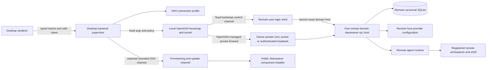
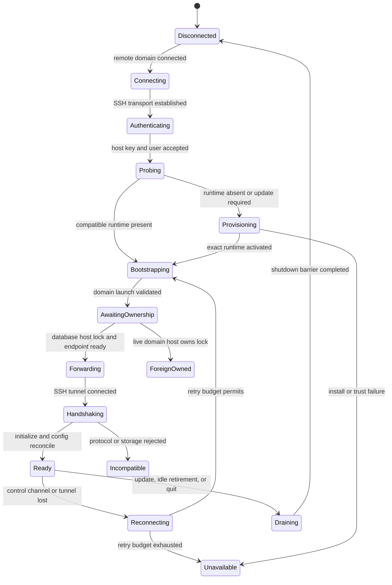

# SSH Remote Workspaces

Status: superseded design history; removed from the Starweaver Desktop roadmap

Starweaver Desktop is local-only. This document is retained as historical analysis and is not a
normative Desktop requirement, delivery phase, or implementation plan. A future remote-access
helper may reuse public Starweaver boundaries, but it must be specified and shipped as an independent
integration rather than adding SSH authority to the Desktop renderer or privileged backend.

The remainder records the superseded proposal that extended Desktop from local child-process
execution to remote execution through SSH. It must not override the local-only baseline in
`README.md`.

SSH is a process transport for the standalone RPC host. It is not an `EnvironmentProvider`, a filesystem proxy, an SFTP-backed toolset, or a way to make a local RPC process execute selected tools remotely.

The local-child rules in `01-product-and-process-boundaries.md`, the host client lifecycle in `02-rpc-client-and-lifecycle.md`, and the security rules in `05-auth-interaction-and-security.md` remain normative except where this document explicitly distinguishes local and remote execution domains.

## Decision Summary

- Desktop v1 uses the platform OpenSSH client rather than embedding a second SSH implementation.
- The privileged Desktop backend owns SSH processes, SSH authentication prompts, host-key decisions, private endpoint forwarding, RPC framing, reconnect policy, and remote runtime provisioning. The renderer cannot provide arbitrary SSH options, forwarding targets, or remote commands.
- One remote host is keyed by stable `execution_domain_id` and canonical database identity. Its individual workspaces are opaque registry entries `(execution_domain_id, canonical_remote_workspace_id)`, never paths canonicalized on the Desktop machine.
- Remote RPC, SQLite storage, host-owned provider credentials, profiles, model requests, filesystem operations, and shell processes stay on the remote machine. Desktop does not synchronize the remote database into the local canonical database.
- One fixed SSH bootstrap/control channel starts and lifetime-binds one execution-domain RPC process. That host manages multiple remote workspaces and sessions, listens only on an owner-private Unix socket or authenticated random loopback endpoint, and is reached through one OpenSSH-managed forward. A separate bounded provisioning channel handles probe/install/update operations.
- The remote RPC is started through the remote user's login shell so the user's intended `PATH`, provider environment, and shell initialization can participate in host setup.
- Login-shell startup output is separated from both endpoint metadata and RPC framing by a per-launch nonce marker and a bounded bootstrap preface. JSON-RPC never shares the login-shell stdout stream.
- Remote native shell is enabled by default after the user grants the SSH target. Its authority is the full authenticated remote account, not the selected workspace. Desktop must state this plainly and never represent it as workspace containment.
- Local native-shell policy is unchanged: local shell-enabled release profiles still require an enforceable sandbox, otherwise native local shell remains disabled by default.
- Desktop can bootstrap and update the remote RPC automatically through a public, versioned, non-interactive Starweaver component-install contract. The installer/update implementation must be shared with and hardened by the `starweaver`/`sw` install and update path rather than reimplemented as a Desktop-only updater.
- The first supported remote hosts are POSIX Linux and macOS systems with OpenSSH server support and a tested login shell. Windows SSH servers require a separate PowerShell/bootstrap contract before support is advertised.

## Product Scope

A remote connection profile identifies how Desktop reaches one SSH account. It contains only non-secret connection policy and references:

- Desktop-owned profile ID and display name;
- SSH host alias or hostname, port, and optional user;
- selected OpenSSH configuration source;
- host-key trust record and expected fingerprint set;
- allowed authentication methods and identity references;
- optional `ProxyJump` route;
- runtime channel, exact pin, or managed-update policy;
- connection timeouts, keepalive policy, and reconnect budget;
- whether full remote-account shell authority has been granted.

Passwords, private-key bytes, passphrases, model-provider credentials, endpoint authenticators, and raw agent socket contents are not profile fields.

The initial scope does not include:

- mounting a remote workspace into the local filesystem;
- synchronizing local and remote SQLite databases;
- forwarding local model-provider credentials or environment secrets to the remote process;
- exposing a general SSH terminal to the renderer;
- arbitrary user-authored remote bootstrap commands;
- SSH agent, X11, dynamic, arbitrary port, or arbitrary socket forwarding; the one backend-owned RPC endpoint forward is the only forwarding exception;
- surviving a network loss through a detached remote daemon;
- Windows remote-host bootstrap;
- transparent file reveal for remote paths through local `file://` URLs.

## Execution-Domain Topology


```mermaid
flowchart LR
    renderer[Desktop renderer]
    backend[Desktop backend supervisor]
    ssh_profile[SSH connection profile]
    ssh_exec[Local OpenSSH bootstrap and tunnel]
    login[Remote user login shell]
    endpoint[Owner-private Unix socket or authenticated loopback]
    rpc[One remote-domain starweaver-rpc host]
    db[(Remote canonical SQLite)]
    provider[Remote host provider configuration]
    runtime[Remote agent runtime]
    workspace[Registered remote workspaces and shell]
    provision[Provisioning and update channel]
    installer[Public Starweaver component installer]

    renderer -->|typed intents and safe views| backend
    backend --> ssh_profile
    backend -->|fixed argv and policy| ssh_exec
    ssh_exec -->|fixed bootstrap control channel| login
    login -->|launch exact domain host| rpc
    ssh_exec -->|OpenSSH-managed private forward| endpoint
    endpoint --> rpc
    backend -->|separate bounded SSH channel| provision
    provision --> installer
    rpc --> db
    rpc --> provider
    rpc --> runtime
    runtime --> workspace
```

The local OpenSSH bootstrap/control process and endpoint forward are Desktop-owned children. The remote `starweaver-rpc` process is the execution host. Bootstrap stdout carries only bounded nonce-marked endpoint metadata; JSON-RPC uses the separately forwarded private endpoint. Stderr is a bounded, scrubbed combination of OpenSSH diagnostics, login-shell diagnostics, and remote RPC diagnostics.

Desktop maintains at most one execution-authorized RPC connection for each remote execution domain/database across all runtime and configuration generations. That connection serves global remote history, configuration, all registered workspaces, sessions, and concurrent runs. Multiple windows share the backend-owned connection and subscription set; no catalog child or per-workspace RPC process is required.

A local database, a remote account on host A, and a remote account on host B are three independent execution domains. Session IDs remain canonical durable IDs, but Desktop routing and cache keys include the execution-domain identity so accidental cross-domain collisions or mutations are impossible.

## Execution-Domain Identity

A hostname is a route, not a durable identity. DNS, SSH aliases, ports, bastions, host keys, runtime builds, and platform details can change independently of the remote Starweaver data.

After first trust and supervised initialize, Desktop creates one stable local `execution_domain_id` binding anchored to the remote-owned identity tuple:

- a remote Starweaver installation/domain ID stored in the remote config root;
- stable effective remote OS principal identity (for example an installation-scoped UID digest), separate from the mutable display username;
- canonical database identity or digest.

Host-key fingerprints, route/profile identity, platform, runtime build, protocol/materialization generations, and last verification time are attached trust/runtime evidence. They do not participate in the persistent routing key. A normal runtime or configuration update therefore cannot change workspace IDs, cache partitions, or cursor origins. After an explicitly approved host-key rotation, Desktop atomically replaces the trusted transport evidence while retaining the same execution-domain binding.

RPC returns only the remote-owned identity and runtime evidence; it does not claim knowledge of the SSH transport identity. A changed principal, installation/domain ID, or canonical database identity is a new execution domain unless an explicit rebind/migration operation atomically aliases the old binding, rewrites every workspace/cache/cursor origin reference, and retires the old binding. Initial scope creates a new domain instead of performing that migration.

Cloned machines or restored home directories can duplicate the remote-owned tuple. Desktop therefore also binds it to the approved connection-profile identity and verified SSH route as trust evidence, detects the tuple appearing behind an unrelated profile/host key, and asks for an explicit new-domain or rebind decision. It never silently deduplicates by installation ID alone.

## OpenSSH Client Boundary

Desktop resolves a trusted system OpenSSH executable to an absolute local path. The renderer cannot select the executable, pass raw options, edit environment variables, or construct the destination string. Backend profile commands accept typed host-alias/hostname, user, and port fields; they reject control characters, option-like destinations, embedded credentials, and values outside their field grammar before building argv.

The backend builds argv directly and applies these defaults:

- no pseudo-terminal;
- no agent forwarding;
- no X11 forwarding;
- no dynamic, remote, renderer-selected, or configuration-inherited forwarding;
- clear configured forwardings before connection, then add exactly one backend-generated local or stream-local RPC endpoint forward after bootstrap;
- no local command execution or configured `RemoteCommand` override;
- no shared `ControlMaster`/`ControlPersist` connection reuse in the initial implementation;
- no escape command processing on the protocol channel;
- bounded connection and authentication attempts;
- explicit server-alive interval/count policy;
- batch mode only when no interactive authentication is expected;
- a controlled known-hosts policy;
- a minimal local environment allowlist and no arbitrary `SendEnv` forwarding.

The local SSH agent may authenticate the connection, but `ForwardAgent` remains disabled. Desktop can support `ProxyJump`. V1 uses a Desktop-generated least-authority OpenSSH configuration and a restricted, non-executing importer for reviewed declarative fields such as host alias, hostname, user, port, identity/certificate reference, and `ProxyJump`. Jump-host entries are materialized into the same generated configuration.

The importer rejects executable, recursive, environment-transfer, and ownership-changing directives before invoking OpenSSH. The deny set includes `Match exec`, `KnownHostsCommand`, `ProxyCommand`, `LocalCommand`, `RemoteCommand`, `Include`, `SetEnv`, `SendEnv`, `ControlMaster`, `ControlPath`, `ControlPersist`, arbitrary `PKCS11Provider`/`SecurityKeyProvider` values, and equivalent future directives not on the allowlist. It does not call `ssh -G` on an unapproved candidate because effective-config expansion can execute `Match exec`. Mandatory command-line overrides are checked against the generated configuration before a profile becomes runnable.

Full arbitrary user-config mode is outside v1 and requires a separate local-code/environment-transfer authority design. The backend exposes only a safe configuration summary to the renderer.

## Host-Key and Authentication UX

Host-key verification is mandatory.

- A known matching key connects normally.
- An unknown key requires a native backend-owned confirmation showing algorithm, SHA-256 fingerprint, route, and account. Trust is persisted in an owner-only Desktop known-hosts store or a reviewed user-selected OpenSSH store.
- A changed or revoked key fails closed. “Continue anyway” is not an inline renderer action; replacement is a separate explicit trust-management flow.
- A host key collected without an authenticated external channel is trust-on-first-use evidence, not proof of the host's real-world identity, and the UI says so.

OpenSSH passphrase, password, hardware-key, and host-confirmation prompts use a Desktop-owned askpass bridge with an authenticated one-shot backend channel. Prompt secrets are never sent to the renderer, written to logs, retained after use, or placed in command-line arguments. If a prompt cannot be safely classified, the connection fails instead of displaying arbitrary remote text as a credential prompt.

## Remote Probe

Desktop probes a target on a short-lived SSH channel before starting an ordinary RPC host. The probe:

1. authenticates and verifies the host key;
2. enters the remote user's login shell;
3. emits a nonce-bound machine marker after shell initialization;
4. reports a bounded typed projection of OS, architecture, ABI/libc compatibility where applicable, home/config availability, installed Starweaver component identities, and supported private-endpoint bootstrap versions;
5. performs no database migration and admits no run;
6. exits.

Arbitrary login-shell output before the marker is treated as bounded diagnostics. It is never parsed as JSON or displayed as a trusted host response. Failure to observe the exact marker before the byte/time limit is a typed `remote_bootstrap_noise` or `remote_probe_failed` outcome.

User-controlled workspace paths, profile values, provider settings, and launch-envelope bytes never appear in the remote probe command string.

## Managed Remote Runtime

### Shared installer contract

Remote provisioning depends on a public Starweaver component-management contract, not CLI-private configuration or Desktop-specific archive logic. The `starweaver`/`sw` install and update path must support an RPC-only component with:

- exact semantic version and immutable build selection;
- component-scoped installed/current identity so RPC update decisions never use the full CLI package version;
- explicit channel or pin policy;
- target detection with an override verified against the remote probe;
- mandatory archive digest and signed manifest/provenance verification;
- a dedicated `rpc` component that does not require installing the full interactive CLI/TUI;
- owner-only versioned installation directories;
- an owner-only process lock covering check through activation;
- atomic current/previous pointers rather than in-place executable replacement, plus retention leases for exact builds selected by live Desktop hosts;
- no-interaction mode with stable typed JSON progress/result/error output;
- no shell-profile modification in managed mode;
- bounded download, extraction, and disk usage;
- an exact staged-asset input so Desktop can relay a locally verified bundle when the remote host has no release-feed egress;
- rollback when storage compatibility permits;
- no implicit database open or migration during component installation.

The implementation may be exposed by a command such as a pinned non-interactive `starweaver update rpc`, but the versioned machine contract and result schema are the integration surface. A success result identifies the component version/build, signed-manifest digest, target, installer-owned runtime selector, activation generation, previous rollback candidate, and whether storage maintenance is required. Desktop does not parse ordinary human CLI output or trust an unconstrained returned executable path.

Reusable manifest verification, target selection, locking, versioned layout, activation, and rollback logic should have one product-neutral implementation used by the launcher/CLI updater and Desktop runtime management. Desktop still does not link CLI command handlers or read CLI private configuration.

### Initial bootstrap

If the remote probe finds no compatible component manager, Desktop may perform automatic user-scoped bootstrap only after the SSH target grant is confirmed.

Desktop obtains a pinned installer/bootstrap asset through the same signed release feed used for runtime updates, verifies it locally, and sends the verified bytes over a separate SSH provisioning channel. It does not execute an unpinned `curl | sh` command. The bootstrap installs only the component manager and RPC component into an owner-only remote user directory, returns a nonce-bound typed result, and never requests `sudo`. Desktop may also relay the exact signed runtime bundle/manifest on that channel; remote access to GitHub or another release feed is not a prerequisite.

A manual recovery path remains available through `scripts/install.sh` with `STARWEAVER_COMPONENTS=rpc` and an exact `STARWEAVER_VERSION`. Before that path is advertised for remote use, checksum/signature verification must be mandatory and the `rpc` component must use the same versioned layout and lock as managed updates.

### Update and activation

Desktop can check and stage a remote RPC update while the target is connected. It runs provisioning on a separate SSH channel so installer output can never corrupt an active RPC stream.

- The candidate is an exact build resolved once from signed channel metadata.
- Existing RPC processes continue using their exact executable generation.
- Each Desktop launch record uses the exact installer-owned build selector returned by provisioning; it never depends only on a mutable `current` pointer.
- Activation may change the remote default/current pointer for CLI or unmanaged future launches, but it does not replace or terminate a running process. Concurrent Desktop clients with different compatible pins can launch their exact retained versions under the remote install lock and retention leases.
- Desktop drains the affected remote domain host before an update requiring storage migration.
- A candidate that may migrate the remote database uses the same remote storage maintenance barrier and RPC maintenance mode specified in `06-runtime-updates-and-release.md`.
- A live remote CLI/RPC owner blocks exclusive migration just as a live local foreign owner does.
- Network loss during staging leaves the current runtime untouched. Network loss during an exclusive migration is recovered from the remote transaction record and backup; Desktop never infers success from disconnection.
- Binary-only rollback is allowed only within declared storage compatibility ranges.

Automatic update policy is per SSH target. A managed remote target may follow stable/preview, pin an exact runtime, or require explicit approval. It does not inherit the local Desktop runtime pointer or the local CLI update setting.

## Login-Shell Private-Endpoint Bootstrap

Remote Desktop execution does not run JSON-RPC on login-shell stdin/stdout. Login-shell startup files can print arbitrary output, while the RPC transport needs a stable private endpoint that can be reached again through an SSH tunnel after a local renderer or forwarding process restart.

The backend therefore launches only a fixed reviewed bootstrap command through the remote user's login shell. Probe/provisioning may use that login environment to resolve an installed component, but it records and verifies the exact build selector; an ordinary execution launch does not blindly re-resolve an arbitrary `PATH` entry. The command may contain a generated hexadecimal launch nonce and an installer-owned runtime selector; it contains no workspace path, profile value, provider endpoint, credential, or renderer-controlled text.

A conceptual launch is:

```text
login shell -> exact managed starweaver-rpc build -> owner-private endpoint
                                              -> SSH-managed local forward
                                              -> Desktop backend
```

The bootstrap transition is:

01. OpenSSH starts the remote login shell with the fixed bootstrap/control command.
02. Desktop accepts at most the advertised pre-marker byte limit and waits for an exact versioned marker bound to the launch nonce.
03. Bytes before the marker are retained only as bounded scrubbed bootstrap diagnostics.
04. Desktop sends one bounded, versioned domain-level launch-envelope frame on bootstrap stdin.
05. RPC validates the envelope schema, digest, capability ceilings, execution-domain/database identity, state/runtime-config locations, and runtime compatibility before opening the real database.
06. RPC performs the identity-only no-migration storage preflight, resolves the stable database-level host lock in the global coordination root, acquires it, opens the database with automatic migration disabled, and publishes the fenced owner generation. A live owner produces typed `foreign_execution_host` evidence.
07. RPC loads the last-known-good runtime configuration snapshot, creates its endpoint inside an owner-only runtime directory, and generates a random per-launch endpoint authenticator for every endpoint type. A Unix-domain socket with owner-only permissions is preferred; the fallback binds an operating-system-assigned port on `127.0.0.1` only.
08. RPC emits one typed bootstrap acceptance or rejection frame. Acceptance contains an opaque endpoint descriptor sufficient only for the backend to construct the exact OpenSSH forward.
09. The backend validates the endpoint descriptor against the selected transport policy. It creates an owner-private local stream socket when supported or an OS-assigned loopback listener otherwise, constructs exactly one OpenSSH forward, connects through it, completes the mandatory endpoint-authenticator preface, and sends `initialize` on the forwarded JSON-RPC stream.
10. After initialize, Desktop uses typed workspace register/list/remove and runtime config get/validate/update/reload methods over that one connection. No workspace path participates in process bootstrap.
11. The bootstrap/control channel remains a lifetime lease and bounded diagnostic channel. It never becomes the JSON-RPC stream. Closing it requests remote host shutdown; loss is treated as an uncertain disconnect and reconciled through the remote ownership lock and durable RPC evidence.

The launch nonce prevents accidental shell output from becoming endpoint metadata. The mandatory per-launch endpoint authenticator prevents unrelated local or remote processes from entering either forwarded endpoint form; local stream sockets additionally require current-user ownership and restrictive mode/ACL checks. Neither value is a model-provider credential or provider login mechanism. SSH host-key/account authentication and verified runtime identity establish remote trust.

The bootstrap parser has incremental byte limits before allocation, one absolute deadline, and no generic shell-output recovery after the marker. An invalid envelope, unexpected phase/frame, duplicate envelope, marker mismatch, endpoint outside the owner-private runtime root, non-loopback address, insecure local forward bind, failed endpoint authentication, or post-marker noise closes the control channel and tears down any forward.

## Remote Workspace Registry

Remote workspace selection occurs only after the domain host is initialized. Typed workspace operations support:

- `existing_home_relative`, with normalized path segments and no environment expansion;
- `existing_absolute`, interpreted and canonicalized only by the remote RPC;
- `existing_identity`, containing a previously returned opaque canonical workspace identity;
- `create_empty`, with a validated parent locator and one plain folder name; and
- `create_temporary`, which allocates below the remote user's owner-private Starweaver workspace root without accepting a Desktop-chosen path.

`~`, `$HOME`, shell substitution, globbing, and command substitution are never evaluated from request text. RPC validates or creates the directory, stores its private canonical root in the domain workspace registry, and returns only an opaque identity plus a display-safe projection. Duplicate registration is idempotent. Desktop never canonicalizes a remote path locally, and `session.create` refers only to the returned workspace ID.

## Remote Storage, Profiles, and Provider Configuration

The remote RPC resolves its database and host-owned provider configuration in the remote user's Starweaver config domain unless the supervised launch envelope selects an explicit remote path allowed by policy.

- Local CLI/Desktop history and remote history are not one SQLite database.
- A remote CLI and remote RPC can share the remote canonical database under the existing storage and admission contracts.
- Desktop obtains remote history through the same remote domain-host connection; history reads do not require an active workspace grant.
- Desktop may cache bounded safe view models and replay cursors locally, but cached data is non-authoritative, origin-scoped, and visibly stale while disconnected.
- No offline mutation, continuation, approval, or run admission is allowed against a disconnected remote domain.
- Deleting a Desktop SSH profile does not delete remote sessions, provider configuration, runtime versions, or workspaces.

Remote provider credentials are resolved remotely from the host environment or provider-owned stores. Desktop never forwards local provider credentials or arbitrary local environment variables through SSH and does not mediate provider login. Missing or invalid remote provider configuration produces a typed secret-free host error; setup occurs in the remote host environment outside the Desktop transport contract.

A profile with the same display name on local and remote machines is not the same materialization. Continuation preflight includes execution-domain, database, workspace, runtime, profile, environment, and authority drift.

## Remote Filesystem and Shell Authority

For the selected v1 policy, granting an SSH target grants the RPC host the authenticated remote user's native account authority. Filesystem and shell tools may therefore be enabled by default for that target.

This is intentionally different from local Desktop shell policy and must be represented accurately:

- the canonical remote workspace is an initial working root and routing identity;
- path-checked filesystem tools can remain workspace-scoped defense in depth;
- a native remote shell can use absolute paths, parent traversal, subprocesses, login-shell functions, and any resource available to the remote account;
- SSH process separation protects the local machine from direct local process execution but does not isolate repositories or secrets within the remote account;
- a dedicated remote account, container, VM, or enforceable remote environment provider is recommended when workspace containment is required;
- Desktop displays `remote account authority` rather than `sandboxed` unless the remote RPC proves a supported enforceable sandbox capability.

The connection grant screen shows the route, verified host fingerprint, authenticated user, effective workspace, filesystem mode, shell status, forwarding policy, and whether a sandbox provider is active. A root/administrator-equivalent remote principal requires an additional high-risk confirmation or may be denied by managed policy. Managed policy may also disable shell or require an enforceable remote sandbox.

A host-key change is a transport-trust event and blocks connection until separately approved; it does not by itself re-key the execution domain. An effective-principal/domain change creates a different domain, while a switch from sandboxed to account-scoped authority is security-relevant materialization drift. Each requires explicit confirmation before continuation.

## Remote Execution-Host Exclusivity

The local supervisor registry cannot prove remote process death after a network partition. The remote RPC therefore owns one execution-host exclusivity gate keyed by stable execution-domain/database identity and shared across Desktop clients and runtime generations. It is not keyed per workspace because the one domain host owns all workspace registries, sessions, and runs.

`stable_database_id` is a storage-owned durable UUID, not a path or Desktop-supplied locator. After validating the launch envelope, RPC performs an identity-only, no-migration storage preflight to read it. Creation of a new database establishes the UUID once under the storage-owned creation barrier. Equivalent relative/absolute paths, symlinks, and later database renames must resolve to the same identity; a copied database with a duplicate UUID is rejected until an explicit import/reidentity operation resolves the collision.

All execution locks live in one owner-only, platform-canonical per-OS-user RPC/storage coordination root, for example `<platform-user-state>/starweaver/coordination/execution-locks/<stable-database-id>.lock`. The root is resolved from the authenticated OS principal by product-neutral platform logic and cannot be overridden by the launch envelope, runtime config, `STARWEAVER_CONFIG_DIR`, a database locator, or a Desktop-provided process state directory. It is also independent of runtime versions and launch generations, so two config roots selecting the same stable database UUID still compete on the same lock entry.

A fenced storage-owned registry in that coordination root binds each stable database UUID to its current canonical file identity. Equivalent locators resolve through the registry; an authorized database rename, restore, or atomic replacement updates the file binding under the maintenance barrier without changing the UUID or lock key. A copied database presenting the same UUID at a different live file identity fails closed.

- Before constructing an execution environment or admitting a run, supervised RPC opens the canonical lock entry with no-follow/owner checks, acquires an OS-released exclusive lock, and publishes a fenced durable owner/generation record. The remote filesystem must prove the required cross-process lock semantics; unsupported or unreliable lock storage fails closed.
- A canonical lock entry is never replaced, renamed, unlinked, or garbage-collected while the lock protocol is supported. Updaters and old/new runtimes open the same persistent entry, so an old owner cannot retain a lock on an unlinked inode while a replacement locks a new inode.
- The update manifest and bootstrap negotiation declare the database-identity and lock-protocol identities. A runtime without both required protocols cannot serve an SSH execution domain.
- The lock is held for the entire execution-capable process lifetime. Ordinary update, reconnect, config-generation replacement, database aliases, and per-client state-directory changes cannot bypass it.
- A candidate that finds a live owner returns typed `foreign_execution_host` bootstrap evidence and exits without model, tool, environment, or run authority. Initial scope reports the domain as foreign-owned; a future authenticated attach protocol may connect to the existing endpoint without creating a catalog process.
- Lease expiry alone does not prove that a partitioned process or its shell effects stopped. Automatic replacement waits for OS lock release; a future force-takeover operation requires explicit remote process-tree termination and a separately fenced protocol.
- After lock acquisition, the durable generation prevents a stale owner from committing evidence if it somehow resumes after replacement. Losing execution ownership stops new admission/effects and initiates coordinated shutdown.

This preserves at most one execution-authorized RPC host per execution-domain/database identity while that host manages any number of registered workspaces and sessions.

## Connection Lifecycle and Recovery

A remote domain host extends the normal RPC state machine with transport and provisioning states:


```mermaid
stateDiagram-v2
    [*] --> Disconnected
    Disconnected --> Connecting: remote domain connected
    Connecting --> Authenticating: SSH transport established
    Authenticating --> Probing: host key and user accepted
    Probing --> Provisioning: runtime absent or update required
    Probing --> Bootstrapping: compatible runtime present
    Provisioning --> Bootstrapping: exact runtime activated
    Bootstrapping --> AwaitingOwnership: domain launch validated
    AwaitingOwnership --> Forwarding: database host lock and endpoint ready
    AwaitingOwnership --> ForeignOwned: live domain host owns lock
    Forwarding --> Handshaking: SSH tunnel connected
    Handshaking --> Ready: initialize and config reconcile
    Ready --> Reconnecting: control channel or tunnel lost
    Ready --> Draining: update, idle retirement, or quit
    Reconnecting --> Bootstrapping: retry budget permits
    Reconnecting --> Unavailable: retry budget exhausted
    Draining --> Disconnected: shutdown barrier completed
    Provisioning --> Unavailable: install or trust failure
    Handshaking --> Incompatible: protocol or storage rejected
```

An SSH disconnect is not a clean RPC shutdown. The supervisor:

1. stops writes and marks all in-flight mutation outcomes uncertain;
2. records acknowledged cursors and durable idempotency identities locally;
3. terminates or reaps the local OpenSSH process within a bounded deadline;
4. reconnects only within target policy and retry budget;
5. re-probes when route, host key, principal, or runtime state may have changed;
6. starts a candidate domain host, lets it become execution-capable only after the remote database-level host lock is acquired, and validates its owner-private endpoint descriptor;
7. creates the exact SSH forward, initializes through that tunnel, reconciles runtime configuration and workspace registry state, and performs startup/periodic run reconciliation when ownership succeeds; a live foreign owner remains a typed unavailable/attach-required outcome;
8. replays from acknowledged origin-scoped cursors;
9. reports recovered, waiting, foreign-owned, incompatible, or unavailable state.

A replacement control channel or tunnel must not infer that the old remote process died merely because the local forwarded endpoint failed. If the old process or run admission is still live, the replacement reports a foreign/live owner and does not steal control, duplicate a mutation, or start a competing continuation.

The initial SSH profile is channel-owned, not daemon-owned. Network loss can terminate the remote RPC process and interrupt an active run. Durable admission, checkpoints, terminal evidence, and reconciliation determine the outcome after reconnect. Desktop must not promise that a run continues while the laptop sleeps or changes network. A future detached remote service requires an authenticated daemon/service lifecycle specification and is not an implicit SSH enhancement.

Closing a Desktop window does not close an active SSH connection or stop an active remote run. Explicit application quit follows the normal coordinated shutdown barrier, then closes SSH. Forced local termination or network loss remains uncertain until remote reconciliation.

## RPC and Resource Projection

The renderer continues to receive only typed safe RPC projections. A remote absolute path is never passed to local OS open/reveal APIs.

Remote file preview, diff, artifact download, and upload require explicit bounded RPC resource methods with workspace/account authorization, content limits, digest checks, and user intent. SFTP used by provisioning is not exposed as a renderer file browser and is not an agent tool.

External URLs produced remotely follow the same backend validation and user-confirmation policy as local URLs. The RPC tunnel forwards only the generated private RPC endpoint; it never turns arbitrary remote loopback URLs into local URLs. Any other forwarding feature requires a separate explicit authority design.

## Required Contract Additions

Before SSH remote workspaces can be enabled, the owning products need these additions:

### `starweaver-rpc-core` and `starweaver-rpc`

- versioned domain-host/private-endpoint bootstrap marker and launch-envelope framing;
- pre-database domain launch validation, mandatory per-launch endpoint authentication, owner-private Unix-socket binding, authenticated loopback fallback, and typed endpoint descriptors;
- typed post-initialize remote workspace register/list/remove intents, canonical workspace projection, and `session.create.workspaceId` binding;
- typed remote runtime config get/validate/update/reload with active/desired revisions and safe change notification;
- stable execution-domain/storage identity projection and an identity-only, no-migration database preflight;
- no-database runtime/protocol/storage capability probe;
- explicit no-automatic-migration ordinary launch mode;
- storage-owned stable database UUID and global coordination root independent of per-client/process state directories;
- cross-version database-level remote execution-host lock, persistent non-replaced lock entry, fenced ownership record, and typed `foreign_execution_host` bootstrap outcome;
- safe remote platform/runtime identity;
- existing Desktop prerequisites for capability negotiation, receipts, replay, pagination, HITL, and maintenance mode.

### Starweaver installer/update path

- public `rpc` component and exact-version non-interactive ensure/update operation with remote-fetch and staged-asset inputs;
- stable JSON result and error schema;
- signed manifests and mandatory digest verification;
- owner-only versioned install layout, lock, atomic activation, and rollback;
- verified bootstrap asset and manual `STARWEAVER_COMPONENTS=rpc` path;
- reusable product-neutral updater implementation rather than duplicate CLI/Desktop logic.

### Desktop backend

- connection-profile and execution-domain registry;
- system OpenSSH process adapter and safe effective-config policy;
- native host-key/authentication prompt bridge;
- probe, provision, endpoint bootstrap, exact OpenSSH forwarding, RPC, reconnect, and drain state machine;
- origin-scoped history/cache/routing;
- target-specific runtime update policy and remote maintenance coordination;
- account-authority disclosure and policy controls.

No SSH, installer, runtime, storage, or provider-credential authority is added to the renderer.

## Delivery Phases

### SSH Phase 0: contracts and hardening

- private-endpoint RPC bootstrap, tunnel contract, and no-database probe;
- stable remote execution-domain/database host identity, workspace registry, and cross-client execution-host lock contracts;
- hardened `rpc` component installer/update contract shared with `sw`/CLI;
- host-key and askpass backend design;
- remote account-authority UI and materialization evidence;
- POSIX target/shell support matrix and fixtures.

### SSH Phase 1: one remote domain host

- one SSH profile and one remote-domain RPC host;
- automatic user-scoped RPC bootstrap/update and owner-private endpoint forwarding;
- multiple remote workspace registrations and sessions over the same connection;
- prompt, replay, steer, interrupt, HITL, filesystem, and account-scoped shell;
- remote runtime config inspect/update/reload and reconnect reconciliation;
- no offline history guarantee and no detached daemon.

### SSH Phase 2: multi-domain navigation

- one host connection for each connected remote execution domain;
- merged origin-scoped local/remote navigation;
- target-wide runtime drain/update and configuration reconciliation;
- bounded non-authoritative local cache.

### SSH Phase 3: hardening and extensions

- ProxyJump and managed SSH policy matrices;
- fault injection during probe, provisioning, update, bootstrap, active run, and migration;
- dedicated remote service/daemon evaluation;
- bounded RPC resource transfer;
- Windows remote bootstrap design if pursued.

## Acceptance Gates

- A compromised renderer cannot select an SSH executable, alter raw SSH argv/environment, send a remote command, answer credential prompts, bypass host-key policy, or access provisioning SFTP.
- Unknown, matching, changed, revoked, and explicitly rotated host keys have distinct deterministic outcomes; approved rotation updates trust evidence without changing stable execution-domain/workspace/cache/cursor identities.
- An N→N+1 runtime update preserves `execution_domain_id`, workspace IDs, cache partitions, and cursor origins while updating only runtime/materialization evidence and generations.
- Agent/X11/dynamic/arbitrary forwarding, renderer-authored local/remote commands, PTY allocation, multiplexing, escape processing, environment transfer, config-time execution, recursive includes, known-host helpers, proxy commands, and arbitrary provider loaders are rejected by static-import and generated-config tests; only the exact backend-owned private RPC endpoint forward is admitted.
- Login-shell noise before the nonce marker is bounded and cannot be parsed as endpoint metadata or protocol; JSON-RPC is accepted only through the exact SSH-forwarded private endpoint.
- Host alias/hostname, user, port, workspace, profile, and provider fuzz cases containing leading options, delimiters, credentials, control characters, quotes, newlines, substitutions, or shell metacharacters cannot alter local SSH argv or remote launch behavior.
- The launch envelope is bounded and validated before the real database opens or migrates.
- Local, host-A/user-A, host-A/user-B, and host-B domains cannot collide in routing, cursors, cache entries, or mutations.
- Remote paths are canonicalized remotely and never passed to local file APIs.
- Remote model-provider credentials and secrets never cross into Desktop IPC or logs.
- Account-scoped native shell is labeled and tested as full remote-user authority; no workspace containment claim is made without a proved sandbox capability.
- Exact-version automatic bootstrap/update rejects missing signatures/digests, wrong targets, downgrade violations, concurrent installs, partial downloads, interrupted activation, and incompatible storage.
- Bootstrap/provisioning output cannot be confused with the separately tunneled RPC stream, and installer output is bounded and nonce-bound.
- Disconnect before mutation send, after send, after durable commit, during stream delivery, and during active execution recovers through receipts/status/replay without duplicate effects.
- A network partition that leaves the old remote RPC alive causes the replacement candidate to fail with `foreign_execution_host`; it cannot register workspaces, admit runs, reload configuration, or execute effects until the OS-held database host lock is released.
- Two clients using different config roots and process state directories, equivalent relative/absolute or symlink database locators, renamed database paths, and different runtime generations resolve the same stable database-level host lock entry and cannot both acquire execution authority.
- Lock tests prove that update, config reload, cleanup, crash recovery, and database alias changes never unlink/replace the canonical lock entry while an old process may hold its inode.
- Remote update and migration obey drain/exclusive barriers and cannot silently migrate under a foreign remote CLI/RPC owner.
- POSIX Linux/macOS shell and target fixtures pass from supported local Desktop platforms; unsupported Windows remote hosts fail before provisioning.
