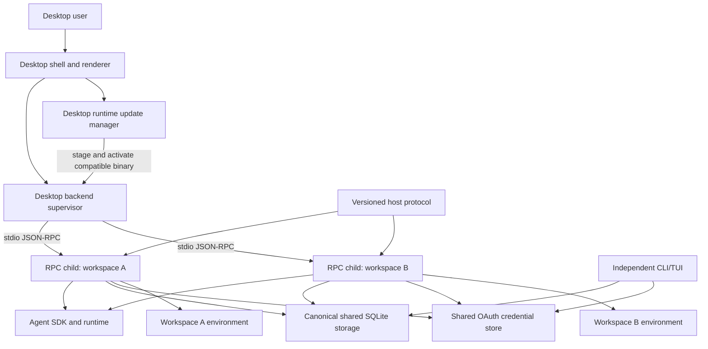

# Starweaver Desktop

Status: accepted architecture baseline; cross-platform shell foundation implemented; RPC integration gated

Starweaver Desktop is a native local client for the standalone Starweaver RPC host. It provides a Codex App-like graphical experience without embedding a second agent runtime, copying durable history, or turning the CLI into a backend service.

The Desktop product consumes the same versioned host protocol, durable session records, stream contracts, and canonical SQLite storage used by the independent CLI and RPC products. The Desktop shell owns windows, client-side state, RPC child supervision, runtime updates, and platform integration. `starweaver-rpc` remains the only Desktop execution backend.

## Decision Summary

- Desktop is a separate product surface, not a mode of `starweaver-cli`.
- Tauri 2 is the default native shell and privileged backend framework; changing it requires an explicit spec amendment after an implementation spike.
- The UI never links `starweaver-runtime`, invokes CLI coordination, or reads SQLite directly.
- Desktop v1 uses JSON-RPC over child-process stdio.
- One Desktop backend supervisor manages an optional least-authority catalog/control child and at most one execution RPC child for each canonical workspace root.
- RPC children share the canonical session database but receive distinct workspace roots, child state directories, and versioned public launch envelopes.
- Closing a window does not implicitly terminate an active run. Explicit application quit performs coordinated RPC shutdown.
- Desktop uses RPC replay cursors to recover UI state after a renderer, window, or child-process restart.
- Existing CLI history is opened in place. Copy/import is used only for an explicitly selected non-canonical legacy or custom database.
- Cross-product continuation must perform typed materialization preflight; incompatible history is never silently resumed under a different runtime binding.
- RPC gains OAuth and client-capability protocol support instead of exposing credentials to the UI.
- The Desktop supervisor owns a runtime update channel for `starweaver-rpc`. A runtime can be updated independently of the shell only when protocol and storage compatibility gates pass.
- CLI, RPC, and Desktop remain independent products. Shared behavior belongs in the existing product-neutral crates.

## Readiness Baseline

The existing repository provides enough foundation to begin Desktop specification and a constrained internal pilot. It is not yet ready for a public Desktop release:

- CLI and RPC resolve the same canonical database by default;
- both products use `starweaver-storage` migrations and session/stream adapters;
- current-version subprocess tests cover CLI-to-RPC and RPC-to-CLI history and continuation;
- RPC provides typed initialize, session/run control, stream replay/subscription, HITL, environment attachment, startup reconciliation, and bounded shutdown;
- release archives already contain `starweaver-rpc` and publish SHA-256 checksums.

The Desktop release gate still requires OAuth parity, custom database discovery, a public versioned RPC launch envelope, typed continuation preflight, explicit client capability negotiation, receipt-backed mutation recovery, enforceable shell sandboxing, cross-version storage tests, and a transactional runtime updater. It also requires periodic ordinary-run lease reconciliation, typed clarification answers, correct `run.resume` authorization, generation-safe subscriptions, bounded stdio framing, non-blocking state I/O, safe live error projection, and storage-backed pagination. These are planned requirements, not descriptions of current implementation.

## Foundation Implementation Evidence

The repository now contains a non-executing Desktop foundation under `apps/starweaver-desktop/`:

- Tauri 2 Rust shell plus React/TypeScript/Vite renderer in the shared Cargo and pnpm workspaces;
- Linux x86_64, macOS x86_64/ARM64, and Windows x64 target registry and native CI build matrix;
- pnpm 11 lockfile, package-age/trust verification, exotic-transitive blocking, and explicit `esbuild` lifecycle approval;
- application-owned single-instance transports that carry only a fixed activation frame: authenticated session D-Bus on Linux, an advisory-lock-elected private current-user peer-checked socket on macOS, and a peer-verified local named pipe discovered through a random rendezvous in private per-user application data on Windows;
- single-instance activation that focuses the primary window without reading or transmitting secondary process arguments or working directory;
- process-owned activation generation that survives renderer reloads;
- generated `get_desktop_status`, `subscribe_desktop_activation`, and token-scoped `unsubscribe_desktop_activation` permissions with a typed backend-to-renderer channel and no general event-listener permission;
- explicit production CSP, frozen IPC prototype, no opener/filesystem/shell/process/HTTP plugin, and a renderer bridge import boundary;
- architecture checks that prevent Desktop from linking CLI, RPC host, agent, runtime, or storage implementations;
- frontend, Rust, target-registry, security-boundary, current-platform no-bundle build commands, and a native macOS primary/secondary process smoke.

The managed runtime remains explicitly `not_configured`. This scaffold does not weaken Phase 0: it must not locate a binary through `PATH`, read private CLI configuration, emit `rpc.toml`, open storage, or launch `starweaver-rpc` until the public launch-envelope, negotiation, authorization, and compatibility prerequisites are implemented.

## Product Shape

## Ownership Map

| Concern                                                                   | Owner                                              |
| ------------------------------------------------------------------------- | -------------------------------------------------- |
| Windows, navigation, renderer state, notifications, shortcuts             | Desktop shell                                      |
| Workspace-to-child routing, process lifecycle, restart, update activation | Desktop backend supervisor                         |
| Runtime download, verification, version selection, rollback state         | Desktop runtime update manager                     |
| JSON-RPC methods, notifications, authorization, live subscriptions        | `starweaver-rpc` and `starweaver-rpc-core`         |
| Agent/model/tool execution                                                | `starweaver-agent` and `starweaver-runtime`        |
| Session/run/replay contracts                                              | `starweaver-session` and `starweaver-stream`       |
| SQLite schema, migrations, atomic evidence operations                     | `starweaver-storage`                               |
| OAuth credential storage and provider construction                        | `starweaver-oauth` and `starweaver-oauth-provider` |
| Local and envd-backed workspace authority                                 | `starweaver-environment` and envd crates           |
| CLI commands and TUI coordination                                         | `starweaver-cli` only                              |

No Desktop crate should become a shared protocol or storage owner. Reusable protocol DTOs remain in `starweaver-rpc-core`; reusable storage and runtime contracts remain in their existing owning crates.

## Spec Map

- `01-product-and-process-boundaries.md` — product ownership, process topology, launch configuration, workspace/sandbox boundaries, and lifecycle.
- `02-rpc-client-and-lifecycle.md` — Desktop client contract, connection state machine, replay, HITL, and required RPC additions.
- `03-cli-migration-and-compatibility.md` — shared history, custom database discovery, profile migration, continuation preflight, and version skew.
- `04-workspaces-sessions-and-runs.md` — workspace routing, session presentation, active-run ownership, and multi-window behavior.
- `05-auth-interaction-and-security.md` — OAuth, approvals, clarifying questions, capability negotiation, and local security.
- `06-runtime-updates-and-release.md` — update channels, runtime bundles, compatibility manifests, transactional activation, and rollback.

## Non-Goals

The first Desktop implementation does not:

- replace or wrap the CLI/TUI;
- expose SQLite records directly to frontend code;
- use a broad home-directory workspace root;
- attach to the in-memory control channel of an already running CLI process;
- require HTTP, WebSocket, a daemon, or a cloud account;
- promise transparent continuation when materialization evidence differs;
- connect the shell foundation to an RPC runtime before the Phase 0 launch, negotiation, authorization, and compatibility contracts are implemented.

## Delivery Phases

### Phase 0: protocol and release prerequisites

- RPC OAuth parity and safe auth methods;
- client capability negotiation and typed clarification answers;
- public versioned RPC launch-envelope schema and compatibility fixtures;
- receipt-backed idempotency and uncertain-outcome recovery for effectful RPC mutations;
- enforceable shell sandbox provider, with native unsandboxed shell disabled by default;
- continuation preflight;
- periodic ordinary-run admission reconciliation and corrected `run.resume` authorization;
- generation-safe subscriptions, bounded stdio framing, non-blocking state I/O, safe live errors, and bounded pagination;
- runtime/storage compatibility metadata and a cross-product two-phase database maintenance barrier;
- dedicated, verified runtime update artifact;
- current/previous CLI and RPC interoperability matrix.

### Phase 1: single-workspace Desktop

- one workspace window, one execution RPC child, and the least-authority catalog/control path when needed;
- canonical session history and replay;
- prompt, steer, interrupt, approval, deferred, and clarifying-question flows;
- runtime staging and restart-safe activation;
- history-only behavior for unavailable workspaces.

### Phase 2: multi-workspace supervisor

- one execution child per canonical workspace;
- shared database with workspace-scoped coordination and sandboxed shell/effect authority where enabled;
- multi-window routing and notifications;
- safe child reuse, idle retirement, and crash recovery.

### Phase 3: release hardening

- platform signing/notarization;
- stable/preview channels and pinning;
- N/N-1 compatibility gates;
- updater fault injection and rollback tests;
- installer, auto-update, and recovery documentation.

## Acceptance Direction

Desktop implementation may begin after Phase 0 contracts have named owners and fixtures. A public Desktop release additionally requires:

- no direct Desktop UI dependency on runtime, storage implementation, or CLI crates;
- no direct CLI/RPC/Desktop product dependency cycle;
- shell-enabled profiles use an enforceable sandbox, while native unsandboxed shell is disabled by default and never described as contained;
- stdio protocol corpus coverage using the shipped runtime binary;
- bidirectional CLI/Desktop history and continuation tests;
- current/previous runtime and storage compatibility tests;
- updater download, verification, activation, crash, and rollback tests;
- platform packaging and code-signing checks;
- user-facing migration, update, recovery, and data-location documentation.
