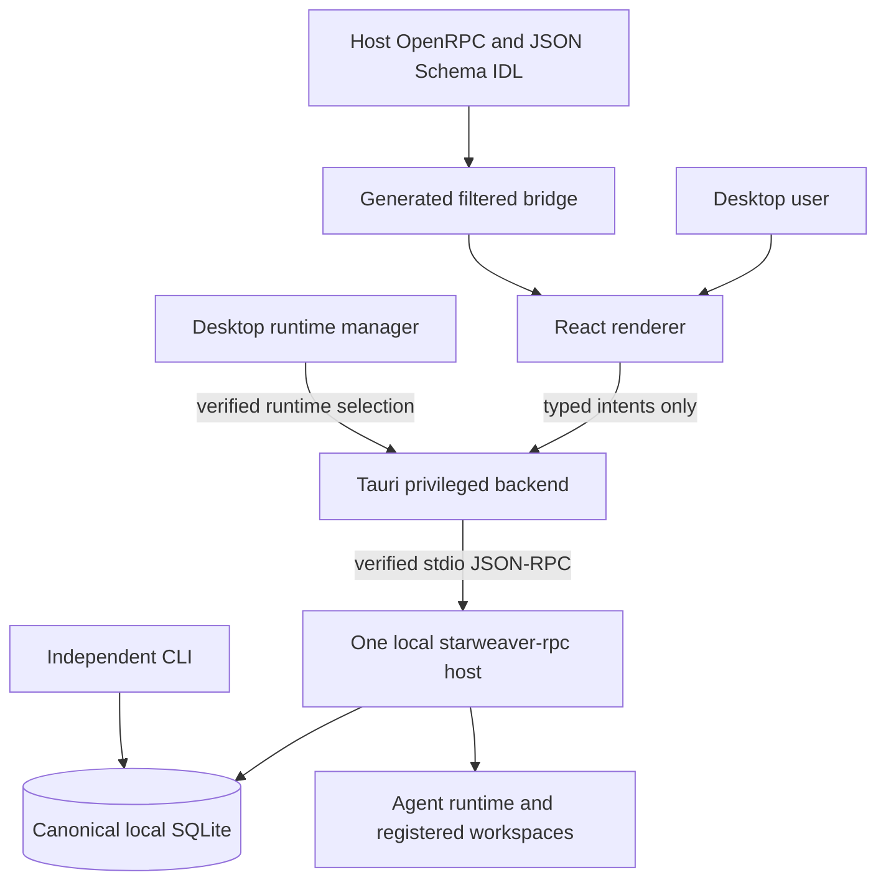

# Starweaver Desktop

Status: local-only product implementation in progress; Local Alpha, durable interaction, and typed settings implemented

Starweaver Desktop is a native local client for one standalone Starweaver RPC host. It provides a Codex App-like graphical experience without embedding another agent runtime, copying durable history, or turning the CLI into a backend service.

The Desktop product consumes the same versioned host protocol, durable session records, stream contracts, and canonical SQLite storage used by the independent CLI and RPC products. The Tauri shell owns windows, client-side state, native folder grants, local RPC process supervision, runtime updates, and platform integration. `starweaver-rpc` remains the only Desktop execution backend.

SSH is not part of the Desktop product roadmap. Remote access may later be delivered as an independent helper or integration over public Starweaver boundaries. It must not add SSH process, credential, forwarding, or remote-shell authority to the Desktop renderer or privileged backend without a new explicit architecture decision. `07-ssh-remote-workspaces.md` is retained only as superseded design history.

## Decision Summary

- Desktop is a separate product surface, not a mode of `starweaver-cli`.
- Tauri 2 is the native shell and privileged backend framework.
- The UI never links `starweaver-runtime`, invokes CLI coordination, reads SQLite, parses CLI-private configuration, or handles provider credentials.
- Desktop execution requires the sole IDL-first `starweaver.host` major-1 contract with exact revision and schema-digest admission plus manifest-filtered generated bridge bindings.
- One Desktop backend supervisor manages exactly one long-lived local RPC host over child-process stdio. It never starts one process per workspace.
- The local host owns the canonical session database, workspace registry, sessions, concurrent runs, history, and immutable runtime-configuration snapshots. Sessions bind to opaque registered workspace IDs.
- Closing a window does not implicitly terminate an active run. Explicit application quit performs coordinated RPC shutdown.
- Desktop uses scope- and view-bound RPC replay cursors to recover UI state after renderer, window, host, or application restart.
- Existing CLI history remains in the canonical local database. Copy/import is reserved for an explicitly selected non-canonical legacy or custom database; Desktop does not merge stores.
- Model/provider credentials remain host-local configuration. Desktop needs only capability negotiation and safe provider-unavailable errors.
- Native local shell remains disabled until an enforceable sandbox exists. Folder selection is not a shell sandbox.
- The Desktop supervisor owns compatibility-gated updates for `starweaver-rpc`; update activation must pass protocol and storage compatibility gates.
- The host OpenRPC/JSON Schema IDL is the only wire-structure source. Generated Rust and filtered TypeScript surfaces must not become competing definitions.
- RPC gaps discovered while implementing Desktop are fixed in the owning IDL, RPC, or product-neutral layer rather than patched around in the UI.

## Current Readiness

The repository provides the foundation for a local internal alpha:

- CLI and RPC resolve the same canonical database by default;
- both products use `starweaver-storage` migrations and session/stream adapters;
- current-version subprocess tests cover CLI-to-RPC and RPC-to-CLI history and continuation;
- RPC provides typed initialize, workspace/session/run control, stream replay/subscription, HITL, environment attachment, startup reconciliation, periodic ordinary-run lease reconciliation, and bounded shutdown;
- release archives already contain `starweaver-rpc` and publish SHA-256 checksums;
- the sole host major, generated clients, safe Desktop bridge, launch envelope, workspace registry, configuration snapshots, mutation receipts, continuation preflight, durable events, bounded framing, and safe public errors are implemented;
- the local host owns one process-lifetime execution-domain lock and manages multiple workspaces, sessions, runs, and native windows without spawning another host;
- normal source-tree launch selects the adjacent same-build `starweaver-rpc`, creates a private deterministic launch envelope for the canonical local database, and starts the consistency-verified child automatically;
- supervised startup path-preflights an existing database and refuses one observed to be out of date before storage open; D10 replaces this guard with a storage-owned atomic open/create and coordinated maintenance barrier that removes the remaining check/open race;
- a polished first-start runtime gate reports safe lifecycle state and offers fixed retry without accepting paths or arbitrary RPC;
- a reconnect-safe Interaction Inbox discovers durable approvals, typed clarifying questions, and deferred work, combines them with live events, presents bounded complete review details, and recovers interaction mutations and explicit run continuation without duplicating effects;
- profile readiness and selection are materialized from the host catalog for future runs without projecting credentials or claiming network readiness;
- the Settings drawer edits only the typed safe runtime projection through host validation and exact mutation recovery, while restart-required activation remains owned by D10; and
- Desktop theme, density, and close behavior live in a fixed backend-owned versioned private file with revision fencing, atomic replacement, exact retry, and no renderer storage authority;
- the main window opens backend-routed conversation windows with a separate least-authority role; same-window subscriptions replace safely while different windows can replay the same run independently; interaction IDs and workspace projections remain bound to the routed session; and
- session history loads incrementally from opaque page tokens, unavailable workspace sessions remain visible as history-only, current-host run controllability is projected separately from durable active status, and hydration epochs prevent stale same-session snapshots from reopening run submission;
- `session.get` now performs storage-bounded recent-run reads and `run.list` supplies opaque-cursor keyset pages for explicit older-history loading without exposing host cursors to the renderer; and
- the dogfood shell now has follow-at-bottom semantics, an explicit jump-to-latest control, modal focus containment and restoration, visibility-aware polling/subscriptions, operation-specific progress, safe diagnostic categories, responsive minimum-window layouts, and dark-theme foreground tokens.

Public release still requires user-guided D9 visual acceptance, update activation and rollback, local installer sidecar bundling, cross-version compatibility tests, and platform release hardening.

## Implemented Shell and Supervisor Evidence

The repository contains the following under `apps/starweaver-desktop/`:

- Tauri 2 Rust shell plus React, TypeScript, and Vite renderer in the shared Cargo and pnpm workspaces;
- Linux x86_64, macOS x86_64/ARM64, and Windows x64 target registry and native CI matrix;
- supply-chain-verified pnpm 11 lockfile policy and explicit lifecycle-script approval;
- fixed-data, current-user single-instance activation transports on Linux, macOS, and Windows;
- process-owned activation generation that survives renderer reloads;
- generated least-authority command permissions and application-owned typed IPC channels;
- production CSP, frozen IPC prototype, no broad filesystem, shell, process, opener, HTTP, storage, credential, or updater plugin;
- architecture checks preventing Desktop from linking CLI, RPC host, agent, runtime, or storage implementations;
- generated strict client codecs, exhaustive typed results/errors/notifications, and launch-envelope codecs;
- a manifest-filtered renderer operation surface that keeps lifecycle, transport, routing, idempotency, cursor, subscription, configuration authorization, and diagnostics in Rust;
- an absolute-path, SHA-256-verified local stdio supervisor with immutable per-child staging, environment allowlisting, bounded framing, exact initialize admission, generation-fenced recovery, durable event acknowledgement, idempotent mutation recovery, Unix process groups, Windows Job Objects, and coordinated process-tree shutdown;
- Desktop-owned adjacent-runtime selection and private atomic launch-envelope publication without `PATH`, SQLite, `rpc.toml`, or CLI-config access;
- backend-owned open/create/managed workspace grants, storage-bounded session/run history recovery, prompt/steer/interrupt controls, and a responsive accessible conversation shell with session-scoped drafts and explicit input bounds;
- RPC-owned host-local Codex OAuth materialization with fixed credential destination and no Desktop credential API;
- safe `transcript_changed` assistant-text events committed atomically with canonical replay evidence, excluding reasoning, native payloads, arbitrary metadata, and provider message IDs; fresh renderer views replay each visible run from origin while internal host-tail recovery resumes from acknowledged cursors;
- prepare-once renderer recovery for workspace registration, session creation, run start, steering, interruption, approval decisions, clarification answers, deferred completion/failure, and run resumption, including startup reconciliation and an explicit user retry for unresolved execution or acknowledgement;
- durable paginated interaction discovery with approval authority and storage-side kind/state filtering before keyset limits, plus live reduction, typed one-to-four-question answers, bounded complete approval/deferred detail projection, and explicit recovery of the decision-to-resume crash gap;
- host-catalog profile readiness and new-run default selection, typed safe runtime-config validation/update/source reload, and honest restart-required staging that does not claim D10 activation;
- backend-owned versioned Desktop preferences for theme, density, and close/background behavior, persisted with private atomic revision-fenced exact mutation semantics rather than renderer local storage; and
- frontend, Rust, target-registry, generated-protocol, security-boundary, build, and subprocess-supervisor validation.

The adjacent sidecar is an intentional Local Alpha bootstrap, not the final updater. It inherits origin trust from the developer build boundary; its runtime-computed digest protects immutable staging and time-of-check/time-of-use consistency but is not an independent trust root. Installer bundling is completed with release packaging. A build-produced signed identity, transactional version selection, activation, and rollback remain owned by the update and release milestones, before this branch is release-ready.

## Target Product Shape

The start surface offers **Open folder**, **Create workspace**, and **Start without a folder**. Every choice grants and registers a concrete root with the already-running local host before creating a session. The no-folder path uses an empty retained managed workspace; it is not another execution mode.

One RPC host owns all registered workspaces, agents, sessions, concurrent runs, tools, durable evidence, and runtime configuration. Desktop owns graphical interaction, native folder grants, safe host lifecycle, local application preferences, event projection, and runtime updates.

```mermaid
flowchart TD
    user[Desktop user]
    renderer[React renderer]
    backend[Tauri privileged backend]
    updater[Desktop runtime manager]
    rpc[One local starweaver-rpc host]
    idl[Host OpenRPC and JSON Schema IDL]
    bridge[Generated filtered bridge]
    store[(Canonical local SQLite)]
    runtime[Agent runtime and registered workspaces]
    cli[Independent CLI]

    user --> renderer
    idl --> bridge
    bridge --> renderer
    renderer -->|typed intents only| backend
    backend -->|verified stdio JSON-RPC| rpc
    updater -->|verified runtime selection| backend
    rpc --> store
    rpc --> runtime
    cli --> store
```

## Ownership Map

| Concern                                                         | Owner                                        |
| --------------------------------------------------------------- | -------------------------------------------- |
| Windows, navigation, renderer state, notifications, shortcuts   | Desktop shell                                |
| Local host lifecycle, native grants, routing, recovery          | Desktop privileged backend                   |
| Runtime download, verification, selection, activation, rollback | Desktop runtime manager                      |
| Host wire structure and generated bindings                      | Host OpenRPC/JSON Schema IDL and generators  |
| RPC behavior, workspace registry, config reload, subscriptions  | `starweaver-rpc` and `starweaver-rpc-core`   |
| Agent/model/tool execution                                      | `starweaver-agent` and `starweaver-runtime`  |
| Session/run/replay and safe transcript contracts                | `starweaver-session` and `starweaver-stream` |
| SQLite schema, migrations, atomic evidence                      | `starweaver-storage`                         |
| Provider credential storage and construction                    | RPC execution domain and provider crates     |
| Workspace authority and environments                            | `starweaver-environment` and envd crates     |
| CLI commands and TUI coordination                               | `starweaver-cli` only                        |

No Desktop crate becomes a shared protocol, runtime, or storage owner.

## Spec Map

- `01-product-and-process-boundaries.md` — shell/supervisor ownership, local process topology, workspace boundaries, and lifecycle. SSH sections are superseded by this local-only baseline.
- `02-rpc-client-and-lifecycle.md` — client contract, connection state machine, replay, HITL, and RPC additions. Remote transport material is superseded.
- `03-cli-migration-and-compatibility.md` — shared local history, custom database discovery, profile compatibility, continuation preflight, and version skew.
- `04-workspaces-sessions-and-runs.md` — workspace routing, session presentation, active-run ownership, and multi-window behavior.
- `05-auth-interaction-and-security.md` — renderer isolation, provider boundaries, approvals, clarifications, capabilities, and local transport security. Remote sections are superseded.
- `06-runtime-updates-and-release.md` — local runtime bundles, compatibility manifests, transactional activation, and rollback. Managed-SSH sections are superseded.
- `07-ssh-remote-workspaces.md` — superseded design history; not part of Desktop scope.
- `08-configuration-and-reload.md` — local Desktop/bootstrap/runtime configuration ownership, typed editing, atomic reload, and immutable run snapshots. SSH sections are superseded.

## Delivery Sequence

01. **Local runtime and first start** — adjacent same-build host selection, launch envelope, lifecycle gate, safe retry.
02. **Start center and workspaces** — open, create, and retained no-folder workspaces with native grants.
03. **Sessions and history** — create, select, paginate, restore, and surface unavailable-workspace history safely.
04. **Conversation loop** — prompt, streaming output, steer, interrupt, retry, and real provider E2E while retaining deterministic tests.
05. **Human interaction** — approvals, clarifying questions, deferred work, and clear authority presentation.
06. **Dogfood UX** — multi-workspace navigation, loading/empty/error states, keyboard and accessibility polish.
07. **Configuration** — typed safe local runtime settings with validation, activation, and restart-required presentation.
08. **Recovery** — renderer/host/application restart replay, pending mutation recovery, and active-run reconciliation.
09. **Quality** — observability, bounded diagnostics, performance, cross-platform behavior, and user-guided visual review.
10. **Updates** — verified versioned runtime selection, transactional activation, rollback, and compatibility gates.
11. **Safe tools** — user-friendly filesystem/HITL experience; native shell remains disabled without a sandbox.
12. **Packaging and release** — installer sidecar bundling, signing/notarization hooks, release checks, and recovery documentation.

The sequence favors one complete, understandable local product over speculative infrastructure. Each milestone may refine the host protocol, but changes belong to the correct architectural owner and require generated-contract and boundary validation.

## Acceptance Direction

A public local Desktop release requires:

- no direct Desktop dependency on runtime, storage implementation, or CLI product crates;
- no CLI/RPC/Desktop product dependency cycle;
- exact host protocol admission and safe manifest-filtered renderer operations;
- local native shell disabled unless an enforceable sandbox is active;
- bidirectional CLI/Desktop history and continuation tests;
- current/previous runtime and storage compatibility tests;
- updater download, verification, activation, crash, and rollback tests;
- platform packaging and code-signing checks;
- user-facing data-location, update, recovery, and migration documentation.
