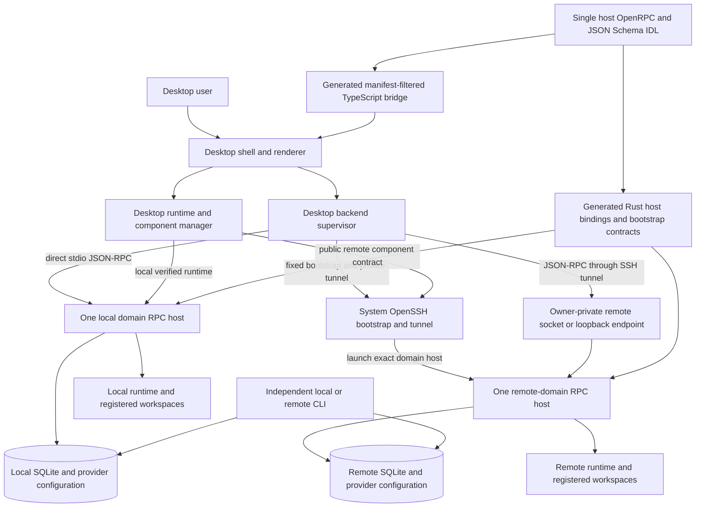

# Starweaver Desktop

Status: accepted architecture baseline; shell, generated local client, and local supervisor implemented; runtime activation and broader product phases gated

Starweaver Desktop is a native client for local and SSH-hosted standalone Starweaver RPC hosts. It provides a Codex App-like graphical experience without embedding a second agent runtime, copying durable history between execution domains, or turning the CLI into a backend service.

The Desktop product consumes the same versioned host protocol, durable session records, stream contracts, and canonical SQLite storage used by the independent CLI and RPC products. The Desktop shell owns windows, client-side state, local and SSH RPC process supervision, runtime updates, and platform integration. `starweaver-rpc` remains the only Desktop execution backend.

## Decision Summary

- Desktop is a separate product surface, not a mode of `starweaver-cli`.
- Tauri 2 is the default native shell and privileged backend framework; changing it requires an explicit spec amendment after an implementation spike.
- The UI never links `starweaver-runtime`, invokes CLI coordination, or reads SQLite directly.
- Desktop execution requires the sole IDL-first `starweaver.host` major-1 contract with exact revision/schema-digest admission and manifest-filtered TypeScript bridge/client bindings. Its privileged Rust supervisor carries JSON-RPC to one local domain host over child-process stdio. Remotely, system OpenSSH bootstraps one RPC host per SSH execution domain; it listens only on an owner-private Unix socket or loopback endpoint, every endpoint requires a random per-launch authenticator, and Desktop reaches it only through an owner-private SSH-managed tunnel.
- One Desktop backend supervisor manages exactly one local RPC host plus at most one host connection for each connected remote execution domain. It never starts one process per workspace.
- Each domain host owns its canonical session database, workspace registry, sessions, concurrent runs, history, and runtime configuration snapshots. Sessions bind to opaque registered workspace IDs.
- Closing a window does not implicitly terminate an active run. Explicit application quit performs coordinated RPC shutdown.
- Desktop uses origin-scoped RPC replay cursors to recover UI state after a renderer, window, local host, or SSH connection restart.
- Existing CLI history is opened in place within its local or remote execution domain. Copy/import is used only for an explicitly selected non-canonical legacy or custom database; Desktop does not merge domains.
- Cross-product continuation must perform typed materialization preflight; incompatible history is never silently resumed under a different runtime binding.
- Model/provider credentials are RPC-host configuration in the execution domain, not a Desktop product API or a Desktop-to-RPC transport requirement. Desktop needs only client-capability negotiation and safe provider-unavailable errors.
- The Desktop supervisor owns a runtime update channel for `starweaver-rpc`. A runtime can be updated independently of the shell only when protocol and storage compatibility gates pass.
- SSH targets are separate execution domains: their RPC, storage, provider configuration, model requests, filesystem, and shell remain remote. Desktop uses a hardened public Starweaver component-update contract to provision the remote RPC through the remote user's login shell.
- Remote native shell uses the authenticated remote account's full authority by default and is never represented as workspace-contained. Local native shell remains disabled by default without an enforceable sandbox.
- The sole `protocol/host/` OpenRPC/JSON Schema source generates the Rust server boundary and safe, manifest-filtered TypeScript Desktop bindings; neither generated language surface is a separate protocol source.
- CLI, RPC, and Desktop remain independent products. Shared behavior belongs in the existing product-neutral crates.

## Readiness Baseline

The existing repository provides enough foundation to begin Desktop specification and a constrained internal pilot. It is not yet ready for a public Desktop release:

- CLI and RPC resolve the same canonical database by default;
- both products use `starweaver-storage` migrations and session/stream adapters;
- current-version subprocess tests cover CLI-to-RPC and RPC-to-CLI history and continuation;
- RPC provides typed initialize, session/run control, stream replay/subscription, HITL, environment attachment, startup reconciliation, and bounded shutdown;
- release archives already contain `starweaver-rpc` and publish SHA-256 checksums.

The repository now implements the sole IDL-first host major, generated Rust server/client and safe Desktop boundaries, a domain-only public launch envelope, exact compatibility negotiation, typed workspace registry and session binding, immutable runtime-config snapshots and typed reload operations, receipt-backed mutations, continuation preflight, atomic state/outbox/event publication, scope/view-bound cursors, feature/authorization-consistent replay/live delivery, bounded stdio framing, typed safe error projection, and the verified single-child Desktop supervisor. The local host owns one process-lifetime execution-domain lock and manages multiple registered workspaces, sessions, and runs. Public release additionally requires workspace-picker and session UI flows, periodic ordinary-run lease reconciliation, an enforceable local shell sandbox before enabling local native shell, cross-version storage/runtime tests, a transactional runtime updater and activation owner, complete application flows, and platform release hardening.

SSH release readiness additionally requires the system-OpenSSH process boundary, host-key/askpass mediation, static configuration allowlisting, stable remote execution-domain identity, login-shell endpoint bootstrap, owner-private Unix-socket or authenticated loopback tunneling, cross-client execution-host exclusivity, origin-scoped history, partition reconciliation, and the hardened exact-version RPC component installer/update contract in `07-ssh-remote-workspaces.md`. These are planned requirements, not descriptions of current implementation.

## Foundation and Local Supervisor Implementation Evidence

The repository now contains the Desktop shell and an inactive-until-configured local supervisor under `apps/starweaver-desktop/`:

- Tauri 2 Rust shell plus React/TypeScript/Vite renderer in the shared Cargo and pnpm workspaces;
- Linux x86_64, macOS x86_64/ARM64, and Windows x64 target registry and native CI build matrix;
- pnpm 11 lockfile, package-age/trust verification, exotic-transitive blocking, and explicit `esbuild` lifecycle approval;
- application-owned single-instance transports that carry only a fixed activation frame: authenticated session D-Bus on Linux, an advisory-lock-elected private current-user peer-checked socket on macOS, and a peer-verified local named pipe discovered through a random rendezvous in private per-user application data on Windows;
- single-instance activation that focuses the primary window without reading or transmitting secondary process arguments or working directory;
- process-owned activation generation that survives renderer reloads;
- generated `get_desktop_status`, `subscribe_desktop_activation`, and token-scoped `unsubscribe_desktop_activation` permissions with a typed backend-to-renderer channel and no general event-listener permission;
- explicit production CSP, frozen IPC prototype, no opener/filesystem/shell/process/HTTP plugin, and a renderer bridge import boundary;
- architecture checks that prevent Desktop from linking CLI, RPC host, agent, runtime, or storage implementations;
- generated Rust client codecs with inseparable response correlation, exhaustive typed results/errors/notifications, and strict launch-envelope codecs;
- a 35-operation renderer manifest whose generated closed DTOs and projectors keep lifecycle, transport, routing, idempotency, cursor, subscription, configuration authorization, and diagnostic authority in Rust;
- an absolute-path, SHA-256-verified local stdio child supervisor with app-local immutable per-child staging on a blocking worker, an environment allowlist, bounded framing and diagnostics, exact initialize compatibility admission, generation-fenced lifecycle, persisted application-acknowledged replay-to-live recovery, contiguous subscription sequencing, durable logical-operation/idempotency plus private privileged-field bindings, host-verifiable HMAC config grants, Unix process groups, Windows Job Objects, and coordinated process-tree shutdown;
- frontend, Rust, target-registry, generated-protocol, security-boundary, current-platform no-bundle build commands, and subprocess supervisor coverage.

The managed runtime remains `unconfigured` in normal application startup until the runtime updater/configuration owner is implemented. The supervisor never locates a binary through `PATH`, reads private CLI configuration, emits `rpc.toml`, opens storage itself, or launches an unverified fallback. Future SSH startup uses the separately specified probe, exact managed runtime selector, and login-shell bootstrap rather than an unverified `PATH` fallback.

## Target Product Shape

The Desktop experience begins with **Open folder**, **Create workspace**, or **Start without a folder**. Every choice registers a concrete workspace with the already-running domain host before creating a session. The no-folder path uses an empty managed temporary workspace retained while referenced by durable sessions; it is not a separate execution mode. One RPC host owns all registered workspaces, agents, sessions, concurrent runs, tools, durable evidence, and runtime configuration for its execution domain. Desktop owns the graphical experience, native folder grants, safe host lifecycle, Desktop configuration, and event projection.

The host IDL, generated bindings, domain-level launch, persistent workspace registry, session/workspace binding, typed configuration get/validate/update/reload/activate/discard surface, and verified single-child supervisor are implemented. Workspace UI, updater-owned runtime activation, complete renderer product flows, and SSH execution remain later phases.

```mermaid
flowchart TD
    user[Desktop user]
    shell[Desktop shell and renderer]
    supervisor[Desktop backend supervisor]
    updater[Desktop runtime and component manager]
    local_rpc[One local domain RPC host]
    ssh[System OpenSSH bootstrap and tunnel]
    remote_endpoint[Owner-private remote socket or loopback endpoint]
    remote_rpc[One remote-domain RPC host]
    host_idl[Single host OpenRPC and JSON Schema IDL]
    ts_client[Generated manifest-filtered TypeScript bridge]
    rpc_core[Generated Rust host bindings and bootstrap contracts]
    local_store[(Local SQLite and provider configuration)]
    remote_store[(Remote SQLite and provider configuration)]
    local_runtime[Local runtime and registered workspaces]
    remote_runtime[Remote runtime and registered workspaces]
    cli[Independent local or remote CLI]

    user --> shell
    host_idl --> ts_client
    host_idl --> rpc_core
    ts_client --> shell
    shell --> supervisor
    shell --> updater
    supervisor -->|direct stdio JSON-RPC| local_rpc
    supervisor -->|fixed bootstrap and private tunnel| ssh
    ssh -->|launch exact domain host| remote_rpc
    supervisor -->|JSON-RPC through SSH tunnel| remote_endpoint
    remote_endpoint --> remote_rpc
    updater -->|local verified runtime| local_rpc
    updater -->|public remote component contract| ssh
    rpc_core --> local_rpc
    rpc_core --> remote_rpc
    local_rpc --> local_store
    local_rpc --> local_runtime
    remote_rpc --> remote_store
    remote_rpc --> remote_runtime
    cli --> local_store
    cli --> remote_store
```

## Target Ownership Map

| Concern                                                                    | Owner                                                  |
| -------------------------------------------------------------------------- | ------------------------------------------------------ |
| Windows, navigation, renderer state, notifications, shortcuts              | Desktop shell                                          |
| Domain-host lifecycle, workspace grants/routing, restart, activation       | Desktop backend supervisor                             |
| Runtime download, verification, version selection, rollback state          | Desktop runtime update manager                         |
| Host method/notification/error wire structure and generated bindings       | host OpenRPC/JSON Schema IDL and repository generators |
| JSON-RPC server behavior, workspace registry, config reload, subscriptions | `starweaver-rpc` and `starweaver-rpc-core`             |
| Agent/model/tool execution                                                 | `starweaver-agent` and `starweaver-runtime`            |
| Session/run/replay contracts                                               | `starweaver-session` and `starweaver-stream`           |
| SQLite schema, migrations, atomic evidence operations                      | `starweaver-storage`                                   |
| Provider credential storage and construction; no Desktop auth surface      | RPC execution domain and existing provider crates      |
| Local and envd-backed workspace authority                                  | `starweaver-environment` and envd crates               |
| SSH process transport, host trust, remote routing, and prompt mediation    | Desktop backend supervisor                             |
| Public RPC component install/update contract and shared updater mechanics  | Starweaver installer/update path                       |
| CLI commands and TUI coordination                                          | `starweaver-cli` only                                  |

No Desktop crate should become a shared protocol or storage owner. Under the accepted target, the repository-level `protocol/host/` IDL owns reusable wire structure; generated Rust bindings live in `starweaver-rpc-core`, IDL-derived safe TypeScript bindings are consumed by Desktop, and reusable storage and runtime contracts remain in their existing owning crates. Current handwritten DTOs are behavioral inventory only and are removed by the atomic replacement; they do not define the Desktop bridge or an alternate client path.

## Spec Map

- `01-product-and-process-boundaries.md` — product ownership, process topology, launch configuration, workspace/sandbox boundaries, and lifecycle.
- `02-rpc-client-and-lifecycle.md` — Desktop client contract, connection state machine, replay, HITL, and required RPC additions.
- `03-cli-migration-and-compatibility.md` — shared history, custom database discovery, profile migration, continuation preflight, and version skew.
- `04-workspaces-sessions-and-runs.md` — workspace routing, session presentation, active-run ownership, and multi-window behavior.
- `05-auth-interaction-and-security.md` — renderer isolation, provider-boundary rules, approvals, clarifying questions, capability negotiation, and transport security.
- `06-runtime-updates-and-release.md` — update channels, runtime bundles, compatibility manifests, transactional activation, and rollback.
- `07-ssh-remote-workspaces.md` — SSH execution domains, login-shell RPC bootstrap, remote authority, provisioning, updates, and reconnect.
- `08-configuration-and-reload.md` — Desktop and runtime configuration ownership, typed editing, atomic reload, generations, and restart-required changes.

## Non-Goals

The first Desktop implementation does not:

- replace or wrap the CLI/TUI;
- expose SQLite records directly to frontend code;
- use a broad home-directory workspace root;
- attach to the in-memory control channel of an already running CLI process;
- require a public HTTP/WebSocket endpoint, a permanently running daemon, or a cloud account;
- synchronize remote session databases into the local canonical database;
- promise transparent continuation when materialization evidence differs;
- activate an RPC runtime without an updater-owned verified runtime selection and exact public launch envelope.

## Delivery Phases

### Phase 0: protocol and release prerequisites

- canonical `protocol/host/` OpenRPC/JSON Schema IDL plus generated Rust server and manifest-filtered safe Desktop bridge/client parity; complete external TypeScript bindings remain caller-selected on-demand output and never enter the renderer;
- client capability negotiation and typed clarification answers;
- domain-level public RPC launch-envelope schema, typed workspace registry/session binding, and compatibility fixtures;
- typed runtime config get/validate/update/reload/activate/discard operations with atomic generations, activation fencing, and safe notifications;
- receipt-backed idempotency and uncertain-outcome recovery for effectful RPC mutations;
- enforceable local shell sandbox provider, with native unsandboxed local shell disabled by default;
- continuation preflight;
- periodic ordinary-run admission reconciliation and corrected `run.resume` authorization;
- generation-safe subscriptions, bounded stdio framing, non-blocking state I/O, safe live errors, and bounded pagination;
- runtime/storage compatibility metadata and a cross-product two-phase database maintenance barrier;
- dedicated, verified runtime update artifact;
- current/previous CLI and RPC interoperability matrix.

### Phase 1: local Desktop product

- start one verified local domain RPC host for Desktop lifetime;
- a start surface with **Open folder**, **Create workspace**, and **Start without a folder**;
- backend-owned folder grants, empty-folder creation, and retained managed temporary workspaces;
- multiple registered workspaces and multiple sessions on the same host;
- `session.create.workspaceId` binding so RPC owns each agent/session/run lifecycle under the selected workspace;
- canonical global history and replay without a separate catalog child;
- prompt, steer, interrupt, approval, deferred, and clarifying-question flows;
- Desktop config get/validate/update/reload and safe runtime config get/validate/update/reload/activate/discard UI;
- runtime staging and restart-safe activation;
- history-only behavior for unavailable workspaces.

### Phase 2: multi-workspace and remote-domain UX

- workspace switcher, recent workspaces, multi-window routing, and notifications over the same local host;
- one RPC host for each connected SSH execution domain, each managing multiple remote workspaces/sessions;
- sandboxed local shell/effect authority where enabled;
- domain-host reconnect, configuration reconciliation, and crash recovery.

### Phase 3: release hardening

- platform signing/notarization;
- stable/preview channels and pinning;
- N/N-1 compatibility gates;
- updater fault injection and rollback tests;
- installer, auto-update, and recovery documentation.

### Parallel SSH track after Phase 0

This track may proceed alongside local Phases 1–3; it is not deferred until after local release hardening.

- system OpenSSH transport with backend-owned host-key and authentication prompts;
- stable remote execution-domain identity separated from mutable host-key/runtime evidence and remotely canonicalized workspaces;
- login-shell endpoint bootstrap, owner-private socket or authenticated loopback tunneling, cross-client execution-domain/database host locks, and partition/reconnect reconciliation;
- hardened public RPC component bootstrap/update contract shared with `sw`/CLI;
- remote domain-host history/config routing and explicit full-account shell authority.

## Acceptance Direction

Desktop implementation may begin after Phase 0 contracts have named owners and fixtures. A public Desktop release additionally requires:

- no direct Desktop UI dependency on runtime, storage implementation, or CLI crates;
- no direct CLI/RPC/Desktop product dependency cycle;
- local shell-enabled profiles use an enforceable sandbox, while native unsandboxed local shell is disabled by default;
- remote account-scoped shell is clearly distinguished from a sandbox and enabled only for an explicitly granted SSH execution domain;
- local stdio and SSH-tunneled private-endpoint protocol corpus coverage using the shipped runtime binary;
- bidirectional CLI/Desktop history and continuation tests;
- current/previous runtime and storage compatibility tests;
- updater download, verification, activation, crash, and rollback tests;
- platform packaging and code-signing checks;
- user-facing migration, update, recovery, and data-location documentation.
