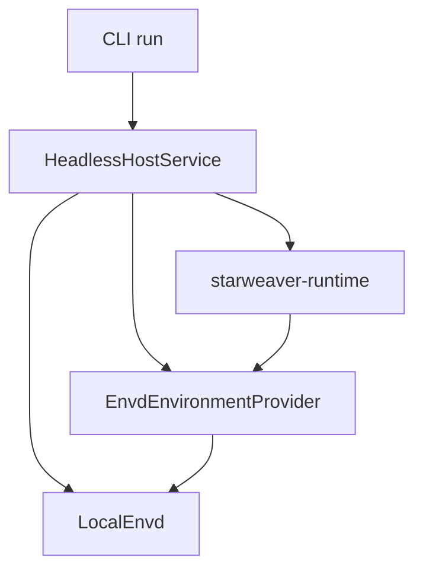
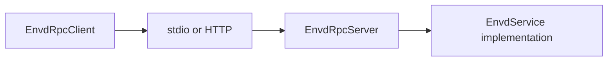

# Envd Implementations and Modes

Envd is one service interface with multiple implementations, state stores, and
transports. The same behavior should be available through direct in-process
calls and RPC calls.

## Mode Matrix

| Mode                   | Service implementation             | Transport             | Primary use                                                                                             |
| ---------------------- | ---------------------------------- | --------------------- | ------------------------------------------------------------------------------------------------------- |
| CLI local ephemeral    | `LocalEnvd`                        | direct function calls | single local run, tests, fast CLI path                                                                  |
| Stdio daemon           | `LocalEnvd`                        | JSON-RPC over stdio   | host-launched envd process                                                                              |
| HTTP daemon            | `LocalEnvd`                        | JSON-RPC over HTTP    | local automation or service clients                                                                     |
| Remote client          | `EnvdRpcClient`                    | stdio/http            | runtime adapter over envd, including Starweaver `EnvironmentProvider`                                   |
| Durable implementation | implementation-owned `EnvdService` | direct or RPC         | remote workspace, sandbox, data-analysis, or service-backed environments with their own state lifecycle |

The direct CLI ephemeral mode is a `LocalEnvd` state-store and transport
configuration, not a separate environment abstraction.

## LocalEnvd Ephemeral Mode

This mode is the first implementation target.

Properties:

- one `LocalEnvd` service instance
- one implicit environment
- one default mount
- ephemeral memory state store
- current local/virtual provider backend during the initial behavior-preserving
  refactor
- later memory file tree or standalone local file backend
- operation/effect records stored in the same ephemeral store
- optional fake or local command/process support according to policy
- no RPC transport
- no daemon process



This lets CLI use the envd architecture without paying RPC overhead. The
in-memory part is the state store, not the envd implementation.

## Implementation-Owned State Lifecycle

Durable state is not a required `LocalEnvd` mode for the current local CLI
scenario. Instead, durability belongs to envd implementations that need to own
environment lifecycle across process boundaries.

Such implementations still expose the same `EnvdService` interface, but they
can load and unload their own state behind that interface:

- `open_environment` can load or reconnect an implementation-owned environment.
- file, command, process, and shell methods mutate implementation-owned state.
- `environment_state` and `export_snapshot` expose portable descriptors,
  versions, operations, effects, resources, and process snapshots.
- an explicit unload or close method should be added to `EnvdService` only when
  a concrete implementation needs a public lifecycle contract.

Examples include remote workspace envd, sandbox envd, data-analysis envd, and
API-backed envd. Their storage may be SQLite, a service database, a remote
workspace backend, or another implementation-specific store.

## RPC Server Mode

The RPC server wraps any `EnvdService`.



Server responsibilities:

- JSON-RPC parsing and response framing
- method dispatch to `EnvdService`
- request size and response size limits
- transport-specific lifecycle
- structured error mapping
- diagnostics on stderr for stdio mode

Server does not own environment semantics. The service implementation owns
semantics.

## RPC Client Mode

The RPC client lives in `starweaver-envd-client`. It implements the same service
trait by sending envd RPC calls and must not depend on Starweaver Agent SDK
crates.

```text
EnvdRpcClient: EnvdService
  initialize -> JSON-RPC initialize
  file_read -> JSON-RPC file.read
  process_start -> JSON-RPC process.start
```

This lets runtime adapters depend on `Arc<dyn EnvdService>` and work with either
direct or remote mode.

## Provider Adapter Mode

For Starweaver, `EnvdEnvironmentProvider` adapts `EnvdService` to the existing
`EnvironmentProvider` and `ProcessShellProvider` traits.

```text
EnvironmentProvider method
  -> EnvdEnvironmentProvider
    -> EnvdService method
      -> LocalEnvd / EnvdRpcClient
```

This is the final link that lets current tools use envd without runtime changes.

## Implementation Stack

Current implementation stack:

- `EnvdService` trait and DTOs live in `starweaver-envd-core`.
- `LocalEnvd` provides the local ephemeral service implementation in
  `starweaver-envd`.
- `EnvdEnvironmentProvider` adapts `Arc<dyn EnvdService>` to Starweaver's SDK
  environment provider traits.
- CLI direct mode uses `LocalEnvd` in process without new user-facing provider
  modes.
- `EnvdRpcClient` exposes stdio/http envd endpoints through the same service
  trait.
- `starweaver-envd` exposes stdio/http daemon transports over any
  `EnvdService`.

Remaining backend work is tracked in `05-api-backlog.md` when it requires new
public methods or protocol fields. Implementation-owned state lifecycle should
be added only after a concrete envd implementation needs
load/unload/reconnect semantics.

## Why Not Start With RPC

RPC is a transport. Starting with the service trait gives:

- easier tests
- direct CLI mode
- no daemon requirement for simple runs
- same semantics in direct and remote modes
- cleaner boundary for `EnvironmentProvider`

After the trait is stable, stdio/http become wrappers rather than the core.

## Future Backends

Future `EnvdService` implementations can include:

- sandboxed local envd
- remote workspace envd
- data-analysis envd
- API-backed envd
- composite envd that routes mounts to child services

All must pass the same service and provider conformance tests for advertised
capabilities.
