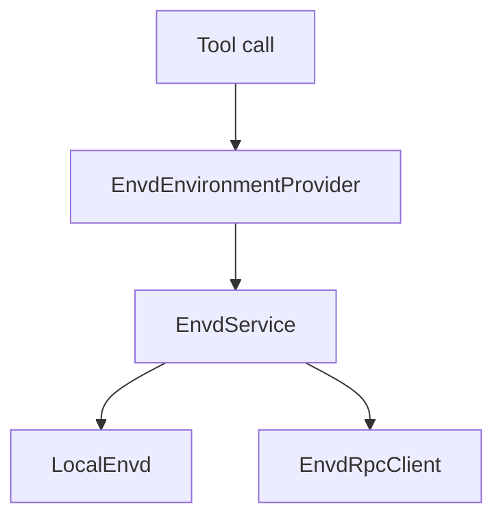
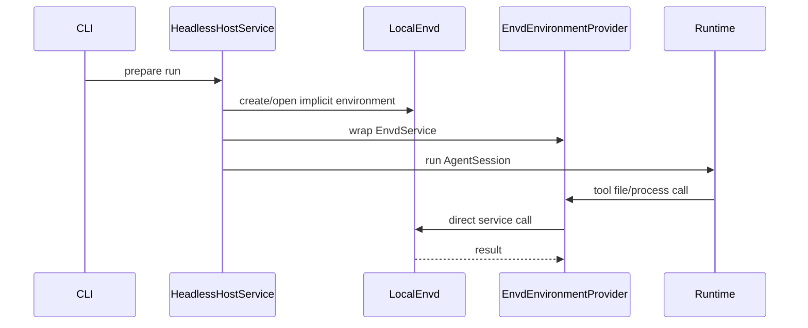
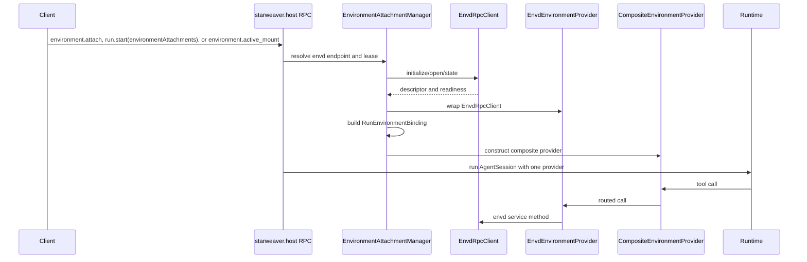
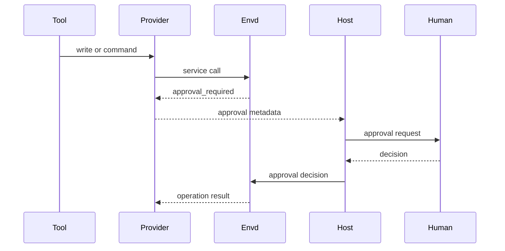
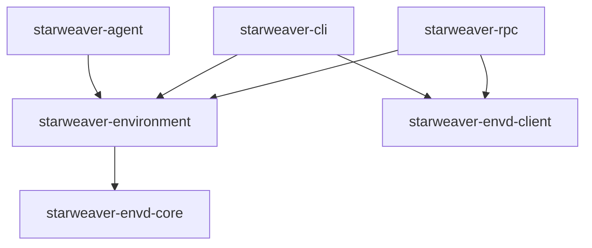

# Reference Provider and Host Integration

This page describes Starweaver as one envd consumer. It is a reference
integration, not a requirement that envd only work with Starweaver.

Envd becomes useful to Starweaver through two integration points:

1. `EnvironmentProvider` adapts envd service calls for tools.
2. Host services and RPC select or open envd environments for runs.

## EnvironmentProvider Adapter

`EnvdEnvironmentProvider` wraps `Arc<dyn EnvdService>`. Other runtimes can build
their own adapter over the same service interface.



Method mapping:

Scratch is owned by the concrete environment behind the attachment. The adapter
returns its provider-visible path unchanged so ordinary file operations and the
same provider's shell can share it.

| `EnvironmentProvider` method | `EnvdService` method        |
| ---------------------------- | --------------------------- |
| `read_text`                  | `file_read`                 |
| `read_bytes`                 | `file_read` with byte range |
| `write_text`                 | `file_write`                |
| `create_dir`                 | file mutation method        |
| `delete_path`                | file mutation method        |
| `move_path`                  | file mutation method        |
| `copy_path`                  | file mutation method        |
| `write_scratch_file`         | `file_write_scratch`        |
| `stat`                       | `file_stat`                 |
| `list`                       | `file_list`                 |
| `glob`                       | `file_glob`                 |
| `grep`                       | `file_grep`                 |
| `run_shell`                  | `command_run`               |
| `export_state`               | `export_snapshot`           |

`ProcessShellProvider` mapping:

| `ProcessShellProvider` method | `EnvdService` method |
| ----------------------------- | -------------------- |
| `start_process`               | `process_start`      |
| `wait_process`                | `process_wait`       |
| `list_processes`              | `process_list`       |
| `input_process`               | `process_input`      |
| `signal_process`              | `process_signal`     |
| `kill_process`                | `process_kill`       |

## CLI Direct Mode

CLI direct mode should construct `LocalEnvd` and wrap it with
`EnvdEnvironmentProvider`.



This is the desired special case: no RPC, one env, direct code path.

## RPC Host Mode

Host RPC can select one or more envd environments and pass them into run
preparation. The dynamic host-control contract is defined in
`../ops/06-json-rpc-host-protocol.md` as the Environment Attachment Manager.
This page only records how Starweaver uses envd after the host has selected an
attachment.



Host RPC remains the agent-control plane. Envd RPC is the environment
data/effect plane. The attachment manager owns literal endpoint validation,
liveness/readiness probes, lease scope, run materialization, and active-run
mount mutations. Named endpoint aliases and host-launched envd daemons are
future host capabilities. Envd owns environment state and operation effects
behind the selected service boundary.

## Run Environment Reference

Run params should reference envd without embedding envd file, process, or mount
DTOs in the host-control protocol.

```json
{
  "environmentAttachments": [
    {
      "id": "local",
      "kind": "local",
      "default": true
    },
    {
      "id": "data",
      "kind": "envd",
      "endpointRef": "http://127.0.0.1:8766/rpc",
      "authToken": "request-only bearer token",
      "environmentId": "dataset",
      "mode": "read_only"
    }
  ]
}
```

In multi-environment runs, `id` is also the agent-facing mount identity. The SDK
composite provider exposes each attachment at `/environment/{id}` and chooses
one attachment as the default for unqualified relative paths. Exactly one
attachment should set `default: true`; if omitted for a single attachment, that
attachment is the default. `local` is reserved for the host's configured local
Starweaver environment. Envd attachments must use non-reserved ids such as
`data`, `review`, or `scratch`.

TUI materializes envd attachments from named config profiles instead of
envd-specific command-line flags:

```toml
[envd_profiles.data]
endpoint = "http://127.0.0.1:8766/rpc"
auth_token_env = "STARWEAVER_DATA_ENVD_TOKEN"
environment_id = "dataset"
mode = "read_only"
```

TUI startup materializes the reserved `local` mount plus each enabled envd
profile into normal `EnvironmentAttachmentRef` values before run start.
`auth_token_env` values are resolved by the host; direct token values are
request-only and must not appear in session, replay, stream, or model context
payloads. The local mount remains the default unless one enabled envd profile
explicitly sets `default = true`.

```json
{
  "environmentAttachments": [
    {
      "id": "local",
      "kind": "local",
      "default": true
    },
    {
      "id": "data",
      "kind": "envd",
      "endpointRef": "http://127.0.0.1:8770/rpc",
      "authToken": "request-only bearer token",
      "environmentId": "dataset",
      "mode": "read_only"
    }
  ]
}
```

The same attachment can also be prepared through `environment.attach` and then
referenced from `run.start` by `attachmentLeaseId`. That lease id is a
Starweaver host-control handle and is not part of the envd protocol.

CLI direct mode can omit endpoint:

```json
{
  "environment": {
    "kind": "envd",
    "environmentId": "env_cli_default",
    "store": "ephemeral"
  }
}
```

## Active-Run Mounting

Active-run mounting is a host-control feature exposed by
`environment.active_mount`, `environment.active_unmount`, and
`environment.active_list` when the host advertises
`environment.active_mounts`. It does not add envd RPC methods.

Envd integration rules:

- An active mount can wrap an inline envd source or a host
  `attachmentLeaseId`. The host validates lease ownership, mode narrowing,
  endpoint policy, and readiness before updating the active run binding.
- The active run still receives one SDK `EnvironmentProvider`, usually a
  composite provider. Envd remains one child provider behind that boundary.
- Binding mutation, `bindingVersion`, default mount selection, lifecycle replay
  events, idempotency, and active-list results are owned by the host protocol in
  `../ops/06-json-rpc-host-protocol.md`.
- Active unmount releases the run's use of a lease-backed envd mount only after
  the durable `environment_unmounted` lifecycle record is appended. The lease
  itself remains a Starweaver host-control object, not an envd object.
- Envd endpoint refs and bearer tokens are request-only host inputs. Replay
  records, display projections, AGUI events, model-visible context, and error
  data must use redacted endpoint summaries or mount ids instead of credentials.

## Session and Replay Metadata

Session/run records store environment refs:

```json
{
  "environment": {
    "kind": "envd",
    "environmentId": "env_123",
    "endpointAlias": "data",
    "redactedEndpointRef": "http://127.0.0.1:8766/rpc",
    "startStateVersion": "sv_10",
    "endStateVersion": "sv_15",
    "operationIds": ["op_1", "op_2"]
  }
}
```

Session storage does not store full envd state. Durable user-visible records
store endpoint aliases or redacted endpoint refs only. Raw literal endpoints,
launch arguments, and bearer material can exist only in the protected host
attachment store for live leases and must not appear in replay, display,
model-visible context, diagnostics, or exported session data.

## Approval and Policy Flow

Envd can deny, allow, or request approval. Host HITL handles user-facing
approval.



The first slice can map approval-required to deferred/approval records through
existing HITL paths after the adapter is in place.

## Dependency Boundary

Allowed dependency direction:



CLI/TUI and RPC independently own their provider resolution, attachment state, and active-run bindings. They can reuse `EnvironmentProvider` factories and `EnvdRpcClient`, but neither product depends on or calls the other.

Forbidden dependencies:

- `starweaver-runtime` must not depend on envd RPC DTOs.
- `starweaver-rpc-core` must not depend on envd file/process DTOs.
- `starweaver-storage` must not persist the full envd state schema.
- `starweaver-cli` and `starweaver-rpc` must not depend on each other.

`starweaver-storage` can store refs. Envd owns environment state.
