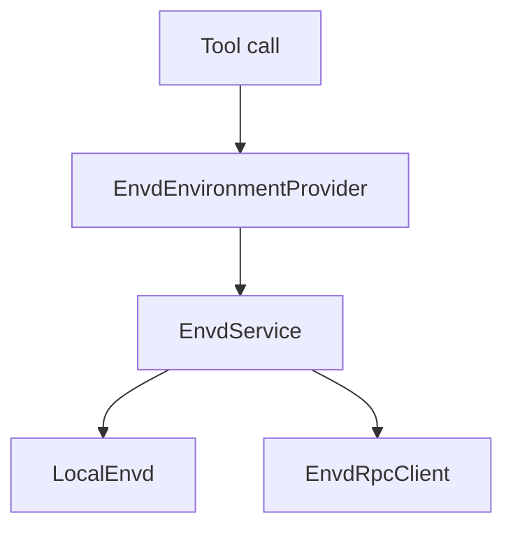
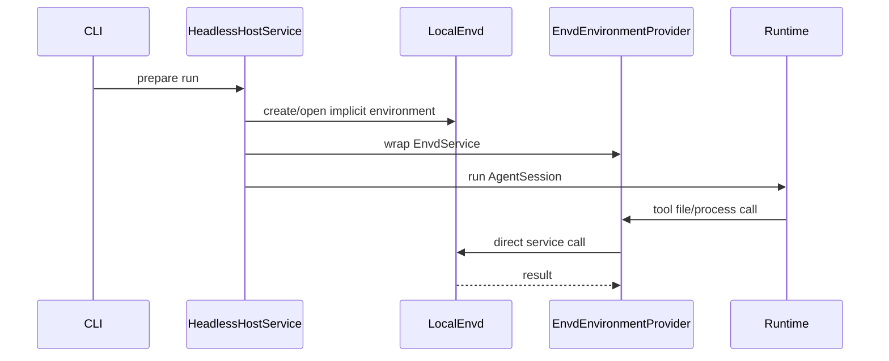
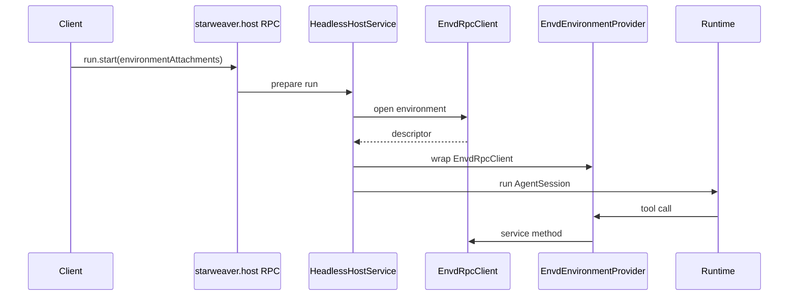
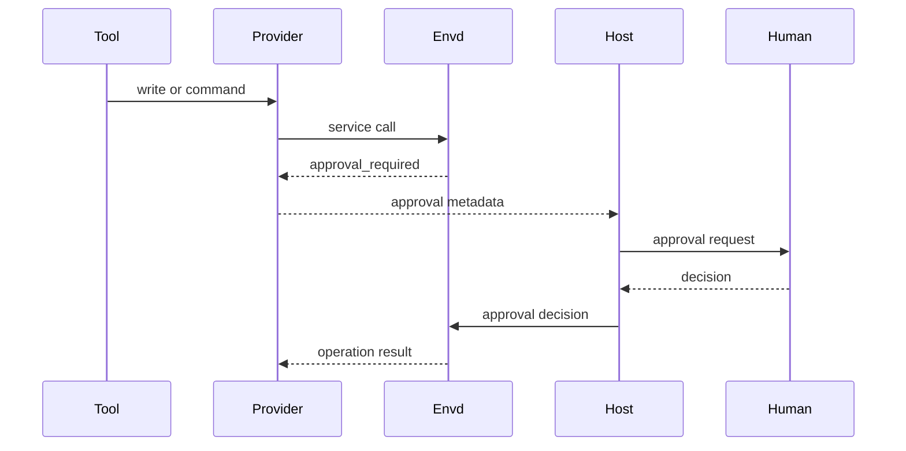

# Reference Provider and Host Integration

This page describes Starweaver as one envd consumer. It is a reference
integration, not a requirement that envd only work with Starweaver.

Envd becomes useful to Starweaver through two integration points:

1. `EnvironmentProvider` adapts envd service calls for tools.
2. Host services and RPC select or open envd environments for runs.

## EnvironmentProvider Adapter

`EnvdEnvironmentProvider` wraps `Arc<dyn EnvdService>`. Other runtimes can build
their own adapter over the same service interface.



Method mapping:

| `EnvironmentProvider` method | `EnvdService` method        |
| ---------------------------- | --------------------------- |
| `read_text`                  | `file_read`                 |
| `read_bytes`                 | `file_read` with byte range |
| `write_text`                 | `file_write`                |
| `create_dir`                 | file mutation method        |
| `delete_path`                | file mutation method        |
| `move_path`                  | file mutation method        |
| `copy_path`                  | file mutation method        |
| `write_tmp_file`             | scratch/tmp write method    |
| `stat`                       | `file_stat`                 |
| `list`                       | `file_list`                 |
| `glob`                       | `file_glob`                 |
| `grep`                       | `file_grep`                 |
| `run_shell`                  | `command_run`               |
| `export_state`               | `export_snapshot`           |

`ProcessShellProvider` mapping:

| `ProcessShellProvider` method | `EnvdService` method |
| ----------------------------- | -------------------- |
| `start_process`               | `process_start`      |
| `wait_process`                | `process_wait`       |
| `list_processes`              | `process_list`       |
| `input_process`               | `process_input`      |
| `signal_process`              | `process_signal`     |
| `kill_process`                | `process_kill`       |

## CLI Direct Mode

CLI direct mode should construct `LocalEnvd` and wrap it with
`EnvdEnvironmentProvider`.



This is the desired special case: no RPC, one env, direct code path.

## RPC Host Mode

Host RPC can select an envd environment and pass it into run preparation. The
current host runtime has one active `EnvironmentProvider`, so remote envd HTTP
attachments are resolved as that active provider. Multiple simultaneous
environment refs require a composite or multi-mount SDK provider and should
return `UNSUPPORTED_FEATURE` until that provider exists.



Host RPC remains the agent-control plane. Envd RPC is the environment
data/effect plane.

## Run Environment Reference

Run params should reference envd without embedding envd file, process, or mount
DTOs in the host-control protocol.

```json
{
  "environmentAttachments": [{
    "id": "workspace",
    "kind": "envd",
    "endpointRef": "http://127.0.0.1:8766/rpc",
    "environmentId": "env_cli_default",
    "mode": "read_write"
  }]
}
```

CLI direct mode can omit endpoint:

```json
{
  "environment": {
    "kind": "envd",
    "environmentId": "env_cli_default",
    "store": "ephemeral"
  }
}
```

## Session and Replay Metadata

Session/run records store environment refs:

```json
{
  "environment": {
    "kind": "envd",
    "environmentId": "env_123",
    "endpointRef": "local-envd",
    "startStateVersion": "sv_10",
    "endStateVersion": "sv_15",
    "operationIds": ["op_1", "op_2"]
  }
}
```

Session storage does not store full envd state.

## Approval and Policy Flow

Envd can deny, allow, or request approval. Host HITL handles user-facing
approval.



The first slice can map approval-required to deferred/approval records through
existing HITL paths after the adapter is in place.

## Dependency Boundary

Allowed:

```text
starweaver-agent -> starweaver-environment
starweaver-environment -> starweaver-envd-core
starweaver-rpc -> host service -> envd service/client
starweaver-cli -> host service -> envd service
```

Avoid:

```text
starweaver-runtime -> envd RPC DTOs
starweaver-rpc-core -> envd file/process DTOs
starweaver-storage -> full envd state schema
```

`starweaver-storage` can store refs. Envd owns environment state.
