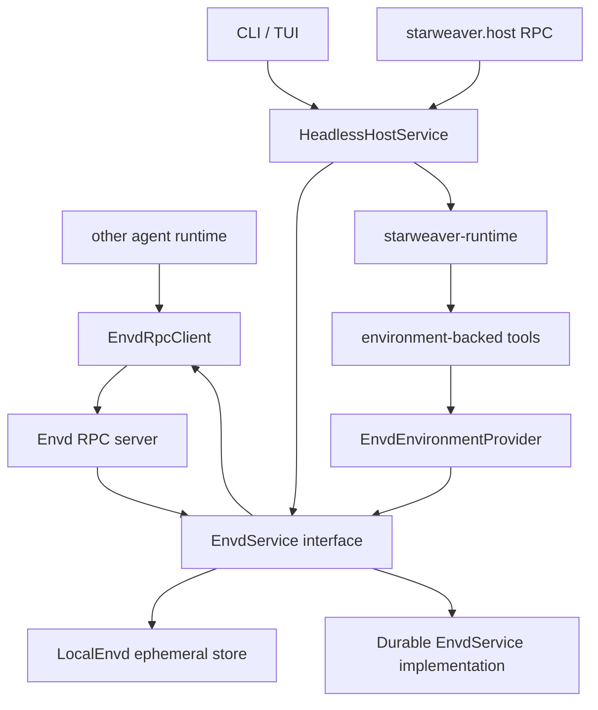

# Envd Service Architecture

Envd is a standalone environment service and protocol. It defines the interface
that owns environment state, implements that interface in process for direct
local flows, and exposes the same interface over RPC for stdio/http clients.

Starweaver can consume envd through `EnvdEnvironmentProvider`, but envd is not
owned by the Starweaver Agent SDK layer. Other agent runtimes can implement
their own envd adapters.

```text
Envd service interface
  -> LocalEnvd with ephemeral local state
  -> other EnvdService implementations with owned state lifecycle
  -> stdio/http RPC server over the same interface
  -> envd client implementation
```

CLI mode can use `LocalEnvd` directly in process with an ephemeral memory state
store. That is a product optimization over the same service interface, not a
separate environment architecture or separate envd implementation.

For the Starweaver SDK environment layer, read `../environment/README.md`.

## Reading Order

1. `01-service-interface-and-state.md` — envd service trait, Environment state,
   mount state, process state, operation/effect records, and capability model.
2. `02-implementations-and-modes.md` — local ephemeral mode,
   implementation-owned state lifecycle, RPC server mode, RPC client mode, and
   future sandbox/composite backends.
3. `03-rpc-protocol.md` — JSON-RPC method groups, stdio/http transports,
   request/response envelopes, errors, streaming, and idempotency.
4. `04-provider-and-host-integration.md` — reference Starweaver integration:
   how `EnvironmentProvider`, host RPC, CLI/TUI/external hosts, sessions, streams, and
   approvals can use envd without making envd Starweaver-only.
5. `05-api-backlog.md` — unfinished envd API work that should wait for a
   concrete implementation or call site.

## Core Decision

The envd service interface is the canonical operation boundary for envd-backed
environments. In Starweaver, `EnvironmentProvider` becomes the SDK/tool adapter
over that boundary when envd is selected.

Recommended Starweaver dependency direction:

```text
starweaver-runtime
  -> tools
    -> EnvironmentProvider
      -> EnvdEnvironmentProvider
        -> EnvdService
          -> LocalEnvd / EnvdRpcClient

starweaver-rpc
  -> HeadlessHostService
    -> EnvdService or EnvdRpcClient
    -> AgentSession
```

Avoid these directions:

```text
starweaver-runtime -> envd protocol DTOs
starweaver-rpc handler -> local provider methods directly
EnvironmentProvider as the envd state owner
```

## System Shape



## Ownership Rules

- Envd owns environment state, mount state, operation/effect records, command
  and background process state when advertised, resource refs, and policy
  decisions.
- `starweaver-environment` owns the SDK-facing `EnvironmentProvider` adapter and
  shared environment DTOs only where they are useful to tools.
- `starweaver-runtime` stays provider-neutral and does not import envd protocol
  transport types.
- `starweaver-rpc` owns agent host-control: sessions, runs, stream replay,
  steering, HITL, model selection, and the environment attachment manager that
  resolves host refs into run environment bindings.
- Envd RPC owns environment data/effect methods over stdio/http.
- CLI can use `LocalEnvd` directly for one local environment to avoid RPC
  overhead. Ephemeral memory is a state-store choice, not a separate service
  implementation.
- Durable state is owned by envd implementations that need it. It is not a
  required `LocalEnvd` mode for the current local CLI scenario.

## Planned Crate Shape

| Crate                    | Responsibility                                                                                                                                                                      |
| ------------------------ | ----------------------------------------------------------------------------------------------------------------------------------------------------------------------------------- |
| `starweaver-envd-core`   | runtime-neutral `EnvdService` trait, state DTOs, capability DTOs, error types                                                                                                       |
| `starweaver-envd-client` | stdio/http client crate, `EnvdRpcClient`, transport profiles, typed client helpers                                                                                                  |
| `starweaver-envd`        | `LocalEnvd`, ephemeral memory state store, current-provider backend bridge, later local mount backends, RPC server, daemon binary, command modes, health endpoints, and diagnostics |
| `starweaver-environment` | `EnvironmentProvider` adapter over `starweaver-envd-core`, local/virtual SDK providers                                                                                              |
| `starweaver-rpc-core`    | host-control JSON-RPC only                                                                                                                                                          |
| `starweaver-rpc`         | host-control process that can attach envd environments                                                                                                                              |

Envd semantics should not be owned by the SDK environment crate. If early
implementation staging uses an existing crate before the new crate is added, the
module must stay envd-namespaced, avoid SDK-only types, and carry an explicit
extraction gate.

The initial `LocalEnvd` path is a refactor of existing behavior: it may use the
current Starweaver local/virtual providers as its backend so file, shell,
context, process, provider-owned scratch, and export-state behavior do not change.
Envd client and daemon transports wrap the same service interface. Durable
state and public load/unload semantics belong to concrete envd implementations
that need them, not to the current local CLI scenario.

## Acceptance Criteria

- Specs define envd service interface, state model, implementations, RPC
  protocol, provider adapter, host integration, and unfinished API backlog.
- CLI single-env mode uses in-process envd service calls.
- Stdio/http envd modes expose the same service behavior.
- Starweaver `EnvironmentProvider` can be backed by envd without changing
  runtime/tool APIs.
- Host RPC selects envd environments and records refs, but does not own file or
  shell data methods.
- Validation commands are explicit for implementation batches that change code.
