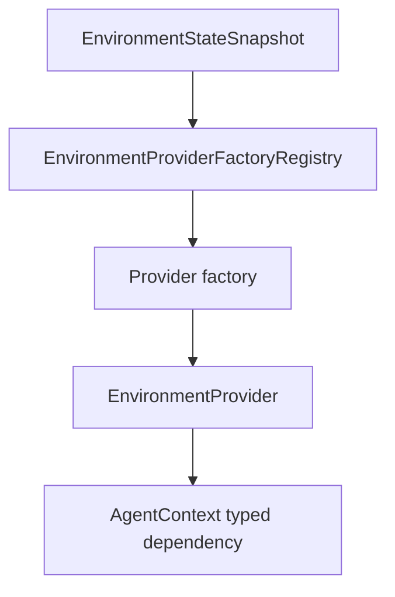

# SDK Provider Contract

The SDK provider contract is the boundary between Starweaver tools and concrete
environment implementations. It should be small, capability-driven, and easy to
adapt to direct, sandboxed, or remote environment services.

## Current Baseline

`starweaver-environment` already owns the initial environment surface:

- `EnvironmentProvider` for file-oriented environment operations and state
  export.
- `ProcessShellProvider` for process and shell operations.
- local and virtual provider foundations.
- file and shell policies.
- resource references.
- environment state snapshots.
- one provider-owned scratch area shared by ordinary file operations and shell
  execution.

The next architecture step is not to make the runtime depend on a richer
backend. The step is to make provider identity, descriptors, capabilities, and
resolution explicit so multiple implementations can sit behind the same SDK
surface.

## Target Interfaces

The first stable shape should separate the base provider from optional
capabilities.

```rust
#[async_trait]
pub trait EnvironmentProvider: Send + Sync {
    fn id(&self) -> &EnvironmentProviderId;
    fn describe(&self) -> EnvironmentDescriptor;
    fn capabilities(&self) -> EnvironmentCapabilities;

    async fn read_text(&self, request: FileReadRequest) -> EnvironmentResult<FileReadResult>;
    async fn write_text(&self, request: FileWriteRequest) -> EnvironmentResult<FileWriteResult>;
    async fn list(&self, request: FileListRequest) -> EnvironmentResult<FileListResult>;
    async fn stat(&self, request: FileStatRequest) -> EnvironmentResult<FileStatResult>;
    async fn write_scratch_file(
        &self,
        filename: &str,
        content: &[u8],
    ) -> EnvironmentResult<String>;
    async fn export_state(&self) -> EnvironmentResult<EnvironmentStateSnapshot>;
}
```

Optional extension traits can cover:

- structured edits
- glob and grep
- one-shot commands
- background process lifecycle
- resources
- policy and approval hooks

The base trait should stay focused until call sites prove the need for broader
methods.

## Scratch Ownership and Lifetime

`write_scratch_file` is the only public scratch-specific operation. It is not a
second file operator: the returned provider-visible path must work with the
provider's ordinary file methods, and a shell launched by that provider must
receive the same scoped directory through `TMPDIR`, `TMP`, and `TEMP` unless the
caller explicitly overrides those variables.

Scratch is ephemeral provider-instance state:

- Local providers first create an exclusive `tempfile::TempDir` beneath the
  operating-system temporary directory. If that creation fails, they fall back
  to an exclusive child of `<workspace>/.starweaver/tmp`.
- Workspace fallback initialization creates `.starweaver/tmp/.gitignore` with
  `*` when the file is absent, preserves an existing regular ignore file, and
  rejects symlinked management directories or a non-regular ignore path. The
  shared tmp root and ignore file are not owned by one provider instance.
- Construction and scratch base/namespace configuration are fallible rather
  than silently disabling isolation. If both primary and fallback creation fail,
  construction reports both failures.
- Local provider clones share one resource owner. On final release that owner
  terminates and reaps retained background process groups before releasing only
  its exclusive scratch directory through RAII. A workspace fallback leaves the
  shared `.starweaver/tmp` root and ignore file in place for later instances.
- Construction performs no startup or stale-directory cleanup and must not scan,
  infer ownership of, or remove sibling instance directories. Crash-recovery
  reclamation requires a separate explicit ownership/liveness contract.
- Local scratch paths are physical absolute provider-visible paths. There is no
  `.starweaver/scratch` alias in a local workspace, including when the physical
  directory uses the `.starweaver/tmp` fallback.
- Virtual providers use the logical `.starweaver/scratch` root because their
  entire filesystem is virtual.
- A namespace is one validated path segment beneath the provider-owned root.
  It scopes generated output names but does not turn separately constructed
  providers into one durable session store.
- Configured local allowed roots and effective roots are distinct. Scratch is
  effective runtime authority, is visible to shell review/routing, and is never
  persisted in `allowed_paths` state.
- A composite writes scratch through its default shell mount when present,
  otherwise through its default file mount. Relative results are qualified under
  `/environment/{mount_id}`. Absolute results retain an owner route for their
  provider-owned scratch scope, so ordinary file operations do not depend on
  synchronous shell review context and remain deterministic even when mount
  authorities overlap.
  The route is recorded once for the mount's stable absolute provider-owned
  scratch scope, not for each file. A later result must remain inside that scope
  or fail closed; reserved Composite namespaces and non-canonical scope paths are
  rejected. The route therefore survives ordinary file mutations without a
  second filesystem index or mutation transaction, is bounded by the number of
  mounts, and is released with the composite.

The CLI/TUI and standalone RPC local providers normally place their exclusive
managed scratch directory beneath the operating-system temp directory. They use
`<workspace>/.starweaver/tmp/<instance-id>` only when OS-temp creation fails.
Any separate CLI grant for user-selected files in the system temp root remains
ordinary file authority and is never interpreted as ownership of that root.

## Descriptor

Every provider should describe itself without exposing transport internals.

```json
{
  "providerId": "env_cli_default",
  "kind": "envd",
  "displayName": "CLI environment",
  "capabilities": {
    "files": ["read", "write", "list", "stat", "glob", "grep"],
    "command": ["run"],
    "process": ["start", "wait", "input", "signal", "kill"]
  },
  "stateRef": {
    "kind": "envd",
    "environmentId": "env_cli_default"
  }
}
```

Provider descriptors can be stored in session/run metadata. Live handles stay in
typed dependencies.

## State Snapshot

The SDK state snapshot is a portable summary, not necessarily the provider's
full internal state.

```json
{
  "providerId": "env_cli_default",
  "kind": "envd",
  "stateVersion": "sv_42",
  "policyRevision": "pol_7",
  "resourceRefs": [],
  "processRefs": [],
  "metadata": {}
}
```

For envd-backed providers, this snapshot is derived from envd state. Envd still
owns its richer environment state, operation/effect records, mounts, and process
records.

## Capability Rules

- Tools must check advertised capabilities before invoking optional methods.
- Missing features return typed `unsupported_feature` errors, not transport
  failures.
- Policy denial and approval-required decisions must be typed and auditable.
- Provider state export must avoid embedding full file contents, process output,
  or daemon-private records unless a provider explicitly advertises that
  behavior.

## Restore Boundary

`EnvironmentProviderFactoryRegistry` is the SDK restore boundary.



The registry maps provider state refs to provider factories. Local providers can
restore from trusted host policy. Envd-backed providers can reconnect to direct
service instances or remote envd endpoints by environment id.
