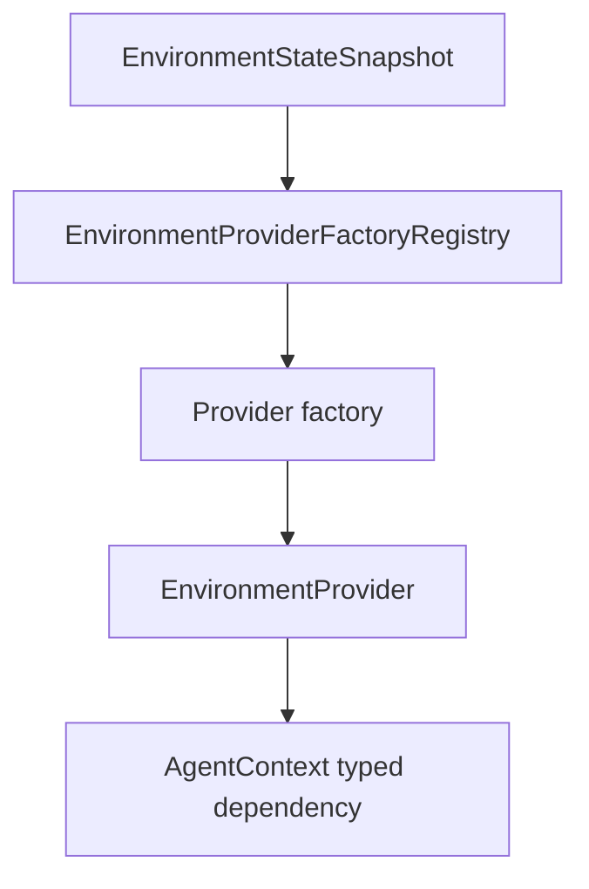

# SDK Provider Contract

The SDK provider contract is the boundary between Starweaver tools and concrete
environment implementations. It should be small, capability-driven, and easy to
adapt to direct, sandboxed, or remote environment services.

## Current Baseline

`starweaver-environment` already owns the initial environment surface:

- `EnvironmentProvider` for file-oriented environment operations and state
  export.
- `ProcessShellProvider` for process and shell operations.
- local and virtual provider foundations.
- file and shell policies.
- resource references.
- environment state snapshots.

The next architecture step is not to make the runtime depend on a richer
backend. The step is to make provider identity, descriptors, capabilities, and
resolution explicit so multiple implementations can sit behind the same SDK
surface.

## Target Interfaces

The first stable shape should separate the base provider from optional
capabilities.

```rust
#[async_trait]
pub trait EnvironmentProvider: Send + Sync {
    fn id(&self) -> &EnvironmentProviderId;
    fn describe(&self) -> EnvironmentDescriptor;
    fn capabilities(&self) -> EnvironmentCapabilities;

    async fn read_text(&self, request: FileReadRequest) -> EnvironmentResult<FileReadResult>;
    async fn write_text(&self, request: FileWriteRequest) -> EnvironmentResult<FileWriteResult>;
    async fn list(&self, request: FileListRequest) -> EnvironmentResult<FileListResult>;
    async fn stat(&self, request: FileStatRequest) -> EnvironmentResult<FileStatResult>;
    async fn export_state(&self) -> EnvironmentResult<EnvironmentStateSnapshot>;
}
```

Optional extension traits can cover:

- structured edits
- glob and grep
- one-shot commands
- background process lifecycle
- resources
- scratch storage
- policy and approval hooks

The base trait should stay focused until call sites prove the need for broader
methods.

## Descriptor

Every provider should describe itself without exposing transport internals.

```json
{
  "providerId": "env_cli_default",
  "kind": "envd",
  "displayName": "CLI environment",
  "capabilities": {
    "files": ["read", "write", "list", "stat", "glob", "grep"],
    "command": ["run"],
    "process": ["start", "wait", "input", "signal", "kill"]
  },
  "stateRef": {
    "kind": "envd",
    "environmentId": "env_cli_default"
  }
}
```

Provider descriptors can be stored in session/run metadata. Live handles stay in
typed dependencies.

## State Snapshot

The SDK state snapshot is a portable summary, not necessarily the provider's
full internal state.

```json
{
  "providerId": "env_cli_default",
  "kind": "envd",
  "stateVersion": "sv_42",
  "policyRevision": "pol_7",
  "resourceRefs": [],
  "processRefs": [],
  "metadata": {}
}
```

For envd-backed providers, this snapshot is derived from envd state. Envd still
owns its richer environment state, operation/effect records, mounts, and process
records.

## Capability Rules

- Tools must check advertised capabilities before invoking optional methods.
- Missing features return typed `unsupported_feature` errors, not transport
  failures.
- Policy denial and approval-required decisions must be typed and auditable.
- Provider state export must avoid embedding full file contents, process output,
  or daemon-private records unless a provider explicitly advertises that
  behavior.

## Restore Boundary

`EnvironmentProviderFactoryRegistry` is the SDK restore boundary.



The registry maps provider state refs to provider factories. Local providers can
restore from trusted host policy. Envd-backed providers can reconnect to direct
service instances or remote envd endpoints by environment id.
