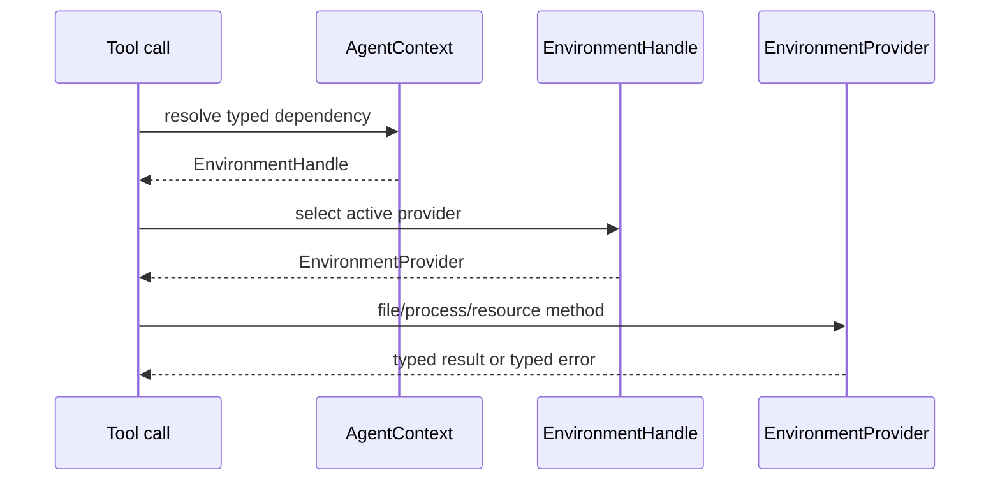
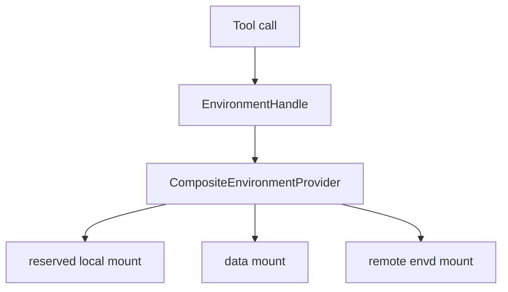
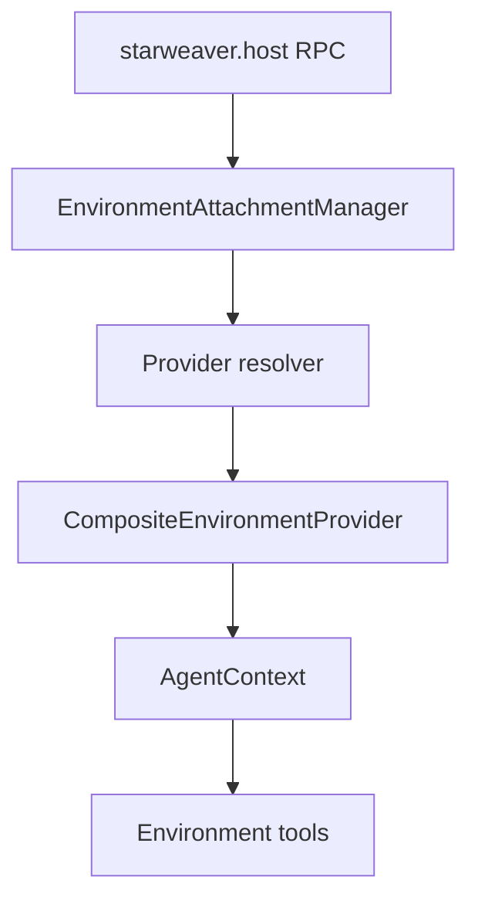
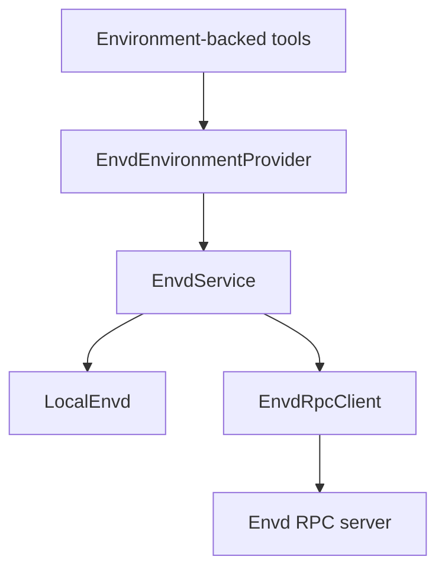
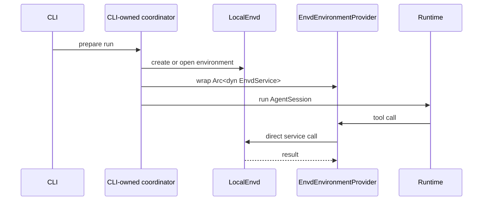
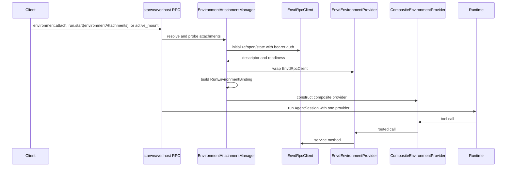
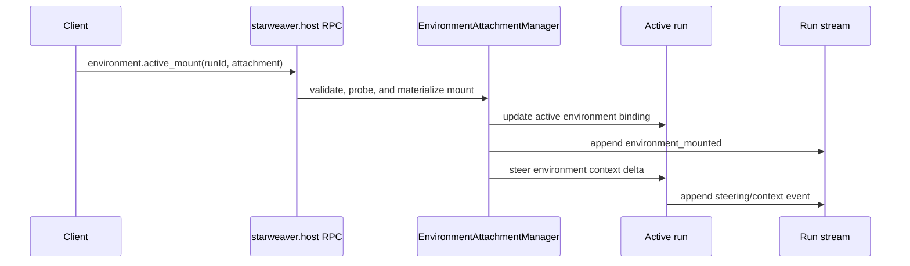
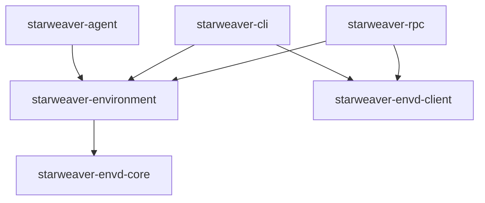

# Tool Binding and Envd Adapter

The Agent SDK environment layer turns provider capabilities into first-party
tools. Envd integration should enter at this adapter boundary, not inside the
runtime and not inside host RPC method handlers.

## Tool Binding

Environment-backed tools resolve the active environment through `AgentContext`.



The runtime still executes a normal tool call. It does not need to know whether
the provider is local, virtual, sandboxed, or envd-backed.

## Multi-Environment Routing

The SDK should support multiple mounted environments by attaching one composite
provider to `AgentContext`, not by teaching runtime tools or models about
multiple providers.



Target shape:

```rust
pub struct EnvironmentMount {
    pub id: String,
    pub agent_root: String,
    pub mode: EnvironmentAttachmentAccessMode,
    pub provider: DynEnvironmentProvider,
    pub is_default: bool,
    pub default_for_shell: bool,
}

pub struct CompositeEnvironmentProvider {
    mounts: Vec<EnvironmentMount>,
    process_routes: Mutex<BTreeMap<String, String>>,
    scratch_routes: Mutex<BTreeMap<String, ScratchRoute>>,
}
```

Routing rules:

- Exactly one mount is the default mount. Unqualified relative paths and `/`
  route to that mount for backward-compatible tools and prompts.
- At most one ready, command-capable mount is the shell default. If no mount is
  shell-capable, `defaultShellMountId` is absent/null and shell tools are
  unavailable. If no shell default is explicitly requested and the default mount
  is shell-capable, the shell default follows the default mount.
- `local` is a reserved mount id for the host's configured local Starweaver
  environment. It may be the default mount, and product entry points should use
  `local` instead of aliases such as `workspace` when they expose the local
  workspace alongside remote or envd-backed mounts.
- Remote, envd-backed, virtual, or sandbox mounts must not use the reserved
  `local` id.
- Every mounted environment is also exposed under
  `/environment/{environment_identity}`.
  `environment_identity` is the host attachment id after strict slug
  validation, not necessarily the provider's internal environment id.
- Valid non-reserved identities are ASCII slugs such as `data-1`, `review_copy`,
  or `scratch`. They must not contain `/`, be empty, be `.` or `..`, or use
  reserved names owned by the composite provider.
- `/environment` is a reserved virtual namespace owned by the composite
  provider. It does not need to exist in any child provider. This avoids
  ambiguity when two environments expose the same physical directory and avoids
  stealing `/mnt` from POSIX-like environments.
- File operations route by normalized logical path.
  `/environment/{id}/...` routes to that environment with the prefix stripped.
  Other paths route to the default mount.
- Tool results should preserve agent-facing logical paths. A child provider path
  such as `/src/lib.rs` from mount `data` is returned as
  `/environment/data/src/lib.rs`.
- When the same physical directory is attached through multiple environments,
  the logical namespace remains authoritative. The host is responsible for
  making that aliasing intentional; the agent should not infer physical
  identity from paths.
- Cross-mount `move` and `copy` should be explicit provider-level operations:
  read from source mount, write to destination mount, then delete source for
  moves only when both sides succeed and policy allows it.
- Foreground shell routes by `cwd`: `cwd="/environment/{id}/path"` executes
  through that environment with `cwd="/path"` inside the child provider. If
  `cwd` is absent or not under `/environment/{id}`, use the mount marked
  `default_for_shell`.
- Background shell start uses the same `cwd` routing. The composite provider
  records `returned_process_id -> mount_id` and returns a composite id such as
  `local:process_123`.
- `shell_wait`, `shell_input`, `shell_signal`, and `shell_kill` route by the
  composite process id. The model only sees one process handle namespace.
- `shell_status` returns snapshots from all process-capable mounts with
  composite process ids.
- Environment context rendering preserves the current default-environment file
  tree behavior. Non-default mounts are summarized only by id, root,
  capabilities, and readiness; their file trees are not rendered into the model
  context by default.

This keeps shell as an optional command/process capability. Interactive
terminal state is not part of the SDK routing contract.

### Local process resource contract

The local provider treats one invocation and its descendants as one resource:

- Foreground and background shell and structured-program calls share one
  configurable concurrency allowance. Exhaustion rejects a new invocation
  rather than creating an unbounded queue.
- Each invocation starts in an isolated Unix process group or Windows Job
  Object. Unix timeout/kill performs group TERM followed by KILL after a short
  grace period; Windows kill terminates the Job Object. Arbitrary process
  signals are explicitly Unix-only. Unix containment is process-group scoped:
  an arbitrary shell command can deliberately create a new session or process
  group, so untrusted shell authority still requires an external sandbox.
- Completion closes out remaining in-group descendants before joining
  stdout/stderr readers. Reader joins have a fixed deadline; an escaped process
  that retains an inherited pipe can cause output loss but cannot indefinitely
  hold the provider's blocking worker or execution permit.
- Readers drain both streams continuously while retaining a configurable byte
  prefix. Snapshots and foreground output metadata expose total bytes, captured
  bytes, truncation, and any drain timeout independently for stdout and stderr.
- Child leaders are waited/reaped, execution permits are released on terminal
  state, and only a configurable number of completed background snapshots are
  retained. Evicted process ids return `NotFound`.

Example model-facing context:

```xml
<environment-mounts>
  <default mount="local" root="/" />
  <mount id="local" root="/environment/local" files="read_write" command="run" process="background" />
  <mount id="data" root="/environment/data" files="read_only" command="none" process="none" />
</environment-mounts>
<default-environment-context>
  <!-- Existing workspace file tree and shell context stay here. -->
</default-environment-context>
<shell-routing>
  shell_exec without cwd runs in the default mount.
  Use cwd="/environment/local/..." or cwd="/environment/data/..." to choose a mounted environment explicitly.
  Commands can run only in mounts that advertise command capability.
</shell-routing>
```

Non-default environments can still be explored explicitly with file tools, for
example `ls(path="/environment/data")` or `view(file_path="/environment/data/README.md")`.

## Host Attachment Manager Boundary

The host-control protocol can dynamically prepare environment attachments before
a run. That manager belongs above the SDK provider layer.



Boundary rules:

- The manager validates host-control refs, literal endpoint refs, readiness
  policy, idempotency, and lease scope.
- The manager materializes one host-side `RunEnvironmentBinding`, then passes
  one SDK-facing `EnvironmentProvider` to the Agent SDK. For multi-environment
  runs, that provider is a composite provider.
- The SDK environment layer owns path, shell, process, and context routing after
  the binding is constructed.
- The SDK layer should not know whether a child provider came from an inline
  `run.start` attachment, an `environment.attach` lease, or TUI
  `[envd_profiles.*]` config.
- Active-run mount/unmount is the host feature advertised as
  `environment.active_mounts`. It updates the runtime environment handle for
  future tool calls and injects environment context as an append-only steering
  message captured at the moment the mount changes.
- Named endpoint aliases and host-launched envd daemons are future manager
  capabilities. The first manager slice accepts literal `http://...` envd
  endpoints with request-only bearer tokens.

## Envd Adapter

`EnvdEnvironmentProvider` adapts `EnvdService` to the SDK provider traits.



The adapter should depend on `Arc<dyn EnvdService>`. That keeps direct CLI mode
and remote RPC mode on the same semantic path. It should not require a mandatory
dependency on `starweaver-envd-client`; callers that choose remote envd can
construct an `EnvdRpcClient` and pass it as the service implementation.

Scratch stays provider-owned across this adapter. `file_write_scratch` returns a
provider-visible path that the same attachment must accept through ordinary file
operations. A composite qualifies relative results under the owning mount and
records one stable absolute scratch scope per owning mount. Later results must
remain within that scope. This keeps file routing reliable when an envd adapter
has no synchronous shell review context or when multiple mounts have overlapping
authorities without creating per-file routing state.

## Method Mapping

| SDK provider method  | Envd service method         |
| -------------------- | --------------------------- |
| `read_text`          | `file_read`                 |
| `read_bytes`         | `file_read` with byte range |
| `write_text`         | `file_write`                |
| `create_dir`         | file mutation method        |
| `delete_path`        | file mutation method        |
| `move_path`          | file mutation method        |
| `copy_path`          | file mutation method        |
| `write_scratch_file` | `file_write_scratch`        |
| `stat`               | `file_stat`                 |
| `list`               | `file_list`                 |
| `glob`               | `file_glob`                 |
| `grep`               | `file_grep`                 |
| `run_shell`          | `command_run`               |
| `export_state`       | `export_snapshot`           |

Process mapping:

| SDK process method | Envd service method |
| ------------------ | ------------------- |
| `start_process`    | `process_start`     |
| `wait_process`     | `process_wait`      |
| `list_processes`   | `process_list`      |
| `input_process`    | `process_input`     |
| `signal_process`   | `process_signal`    |
| `kill_process`     | `process_kill`      |

## Direct CLI Mode

CLI direct mode should be an optimization over the same envd service interface.



This keeps simple headless runs daemon-free while avoiding a second environment
architecture.

## Host RPC Mode

Host RPC remains the agent-control plane. Envd RPC remains the environment
data/effect plane.



`starweaver-rpc-core` should carry environment attachment refs, not envd
file/process DTOs. Host RPC can select or validate envd endpoints before a run,
then the SDK environment layer binds the selected provider into `AgentContext`.

## Environment Ref

Run parameters should reference the environment without embedding daemon
internals.

```json
{
  "environment": {
    "kind": "envd",
    "endpointRef": "http://127.0.0.1:8766/rpc",
    "authToken": "request-only bearer token",
    "environmentId": "env_123",
    "mode": "read_write"
  }
}
```

`authToken` is accepted only on inbound host-control requests. It must not be
serialized into run metadata, lease-list results, replay streams, or model
visible environment context.

TUI uses config-backed envd profiles instead of envd-specific argv:

```toml
[envd_profiles.data]
endpoint = "http://127.0.0.1:8766/rpc"
auth_token_env = "STARWEAVER_DATA_ENVD_TOKEN"
environment_id = "dataset"
mode = "read_only"
```

The host resolves the reserved local mount plus each enabled profile into normal
`EnvironmentAttachmentRef` values before run start. The reserved `local` mount
is the default unless one enabled envd profile explicitly sets `default = true`.
Profile names and mount ids are safe metadata; token values are not.

RPC startup follows the same run materialization contract. If
`environmentAttachments` is omitted, the host starts with the reserved local
environment only. If an explicit list is present, clients include
`{"id": "local", "kind": "local"}` when local workspace access should be
available next to envd-backed mounts.

## Active-Run Mounting Design

Active-run environment mounting extends host-control semantics without turning
envd into the agent-control plane. The complete wire contract lives in
`../ops/06-json-rpc-host-protocol.md`; this section defines the SDK/provider
binding behavior that contract relies on.



Design rules:

- Active mount is a host-control operation over an existing run. It can consume
  an inline attachment source or an existing `attachmentLeaseId`, but the active
  run still sees one SDK `EnvironmentProvider`.
- The host owns a run-local `RunEnvironmentBinding` with `bindingVersion`,
  `mounts`, `defaultMountId`, `defaultShellMountId`, readiness summaries, and
  safe lease refs. The SDK environment layer receives one updatable provider
  handle backed by the current binding snapshot.
- Active mount, active unmount, and default updates are serialized by one
  per-run environment mutation lock. Successful mutations increment
  `bindingVersion` exactly once; stale `expectedBindingVersion` values fail
  without mutating the binding.
- `defaultForShell` on host-control attachment refs maps to the SDK
  `default_for_shell` flag. Active mutations must recompute and validate
  `defaultShellMountId` with the same rules as run materialization.
- Runtime environment binding updates affect future tool calls only. Tool calls
  already executing complete against the binding they started with.
- Same-id active mount requires `replace: true`. Replacement probes the new
  source before the mutation lock, then atomically swaps the mount under the
  lock. Remote sources cannot replace the reserved `local` mount.
- Unmounting the current default requires `newDefaultMountId`. The active
  binding must always keep one ready default mount; attempts that would leave no
  default fail and preserve the old binding.
- Unmounting the current shell default requires `newDefaultShellMountId` when
  another shell-capable mount should handle future shell calls. If no
  shell-capable mount remains, `defaultShellMountId` becomes null and shell
  tools become unavailable for implicit-cwd calls.
- The first implementation rejects unmounting a mount that owns live background
  processes. Later protocol revisions can add an explicit wait, detach, or
  terminate policy without changing the provider boundary.
- Lease-backed active mounts inherit the same scope and mode rules as
  run-start materialization. Session-scoped leases must belong to the run's
  session, connection-scoped leases must belong to the calling connection, and
  read-only leases cannot be widened by active mount.
- Context injection is append-only. The host renders the current mount summary
  after the binding update and sends it through the same steering path as
  `run.steer`; it does not rewrite the original system prompt, earlier context,
  or replay history.
- The injected context describes the mount state at that instant. Later
  mount/unmount changes append new steering/context events instead of mutating
  older ones.
- Active unmount follows the same rule: update future routing first, then append
  an `environment_unmounted` event and a steering message that says the mount is
  no longer available.
- Every run stream starts with an `environment_info` event that summarizes the
  materialized environment binding before model/tool work begins. Active mount
  and unmount operations append `environment_mounted` and
  `environment_unmounted` events after the binding update and before any
  steering context injection.
- Environment lifecycle records should become typed replay events owned by the
  shared stream contract. While the enum variant is being introduced, host RPC
  may carry the stable payload as raw replay data, but native replay, display
  projection, and AGUI projection must all preserve the lifecycle item.
- `environment.active_list` reads the current host binding and returns
  `bindingVersion`, default ids, safe mount summaries, and the latest lifecycle
  cursor. It must not call envd for secrets or expose endpoint credentials.
- Secrets such as envd bearer tokens stay in the manager's in-memory source
  record and are never included in the steering text, stream payload, active
  mutation results, or error data.

Direct mode can use an in-process ref:

```json
{
  "environment": {
    "kind": "envd",
    "environmentId": "env_cli_default",
    "store": "ephemeral"
  }
}
```

## Boundary Rules

Allowed dependency direction:



CLI/TUI and RPC independently own their environment attachment or mount state. They may reuse product-neutral resolver and provider factories, but neither calls the other product or a shared product host service.

Forbidden dependencies:

- `starweaver-runtime` must not depend on envd RPC DTOs.
- `starweaver-rpc-core` must not depend on envd file/process DTOs.
- `starweaver-storage` must not persist the full envd state schema.
- `starweaver-cli` and `starweaver-rpc` must not depend on each other.

Session storage can keep environment refs and SDK provider snapshots. Envd owns
full envd state.
