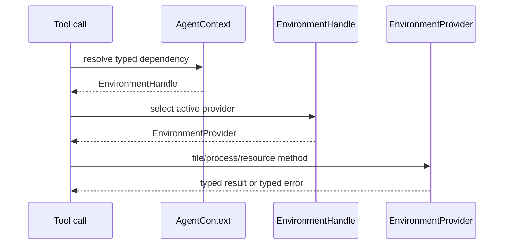
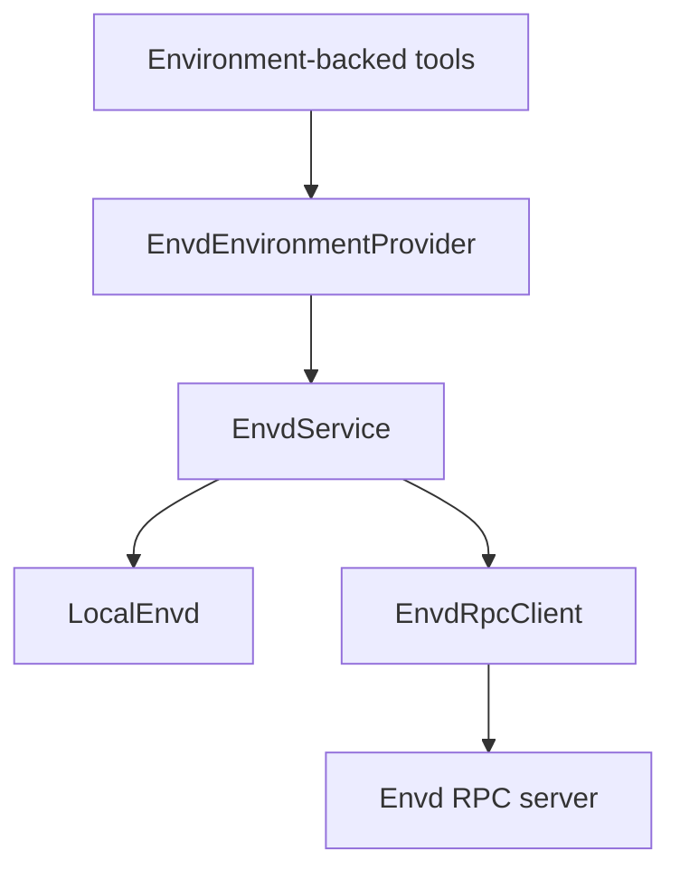
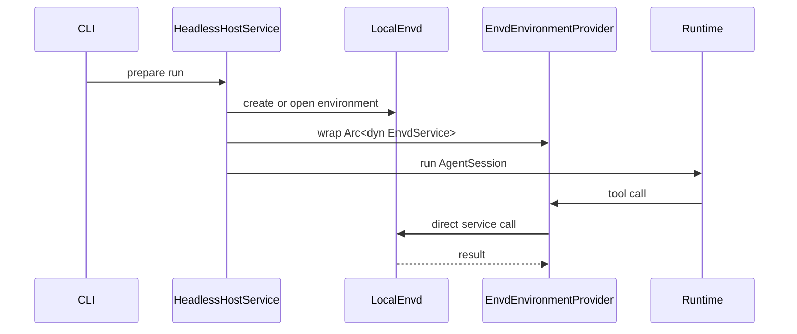
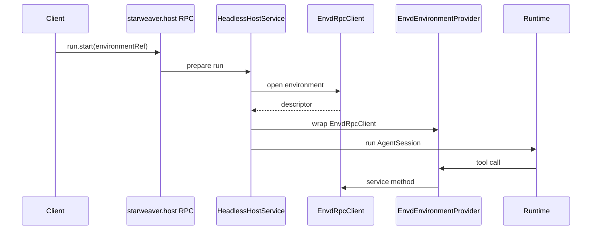

# Tool Binding and Envd Adapter

The Agent SDK environment layer turns provider capabilities into first-party
tools. Envd integration should enter at this adapter boundary, not inside the
runtime and not inside host RPC method handlers.

## Tool Binding

Environment-backed tools resolve the active environment through `AgentContext`.



The runtime still executes a normal tool call. It does not need to know whether
the provider is local, virtual, sandboxed, or envd-backed.

## Envd Adapter

`EnvdEnvironmentProvider` adapts `EnvdService` to the SDK provider traits.



The adapter should depend on `Arc<dyn EnvdService>`. That keeps direct CLI mode
and remote RPC mode on the same semantic path. It should not require a mandatory
dependency on `starweaver-envd-client`; callers that choose remote envd can
construct an `EnvdRpcClient` and pass it as the service implementation.

## Method Mapping

| SDK provider method | Envd service method         |
| ------------------- | --------------------------- |
| `read_text`         | `file_read`                 |
| `read_bytes`        | `file_read` with byte range |
| `write_text`        | `file_write`                |
| `create_dir`        | file mutation method        |
| `delete_path`       | file mutation method        |
| `move_path`         | file mutation method        |
| `copy_path`         | file mutation method        |
| `write_tmp_file`    | scratch/tmp write method    |
| `stat`              | `file_stat`                 |
| `list`              | `file_list`                 |
| `glob`              | `file_glob`                 |
| `grep`              | `file_grep`                 |
| `run_shell`         | `command_run`               |
| `export_state`      | `export_snapshot`           |

Process mapping:

| SDK process method | Envd service method |
| ------------------ | ------------------- |
| `start_process`    | `process_start`     |
| `wait_process`     | `process_wait`      |
| `list_processes`   | `process_list`      |
| `input_process`    | `process_input`     |
| `signal_process`   | `process_signal`    |
| `kill_process`     | `process_kill`      |

## Direct CLI Mode

CLI direct mode should be an optimization over the same envd service interface.



This keeps simple headless runs daemon-free while avoiding a second environment
architecture.

## Host RPC Mode

Host RPC remains the agent-control plane. Envd RPC remains the environment
data/effect plane.



`starweaver-rpc-core` should carry environment attachment refs, not envd
file/process DTOs. Host RPC can select or validate envd endpoints before a run,
then the SDK environment layer binds the selected provider into `AgentContext`.

## Environment Ref

Run parameters should reference the environment without embedding daemon
internals.

```json
{
  "environment": {
    "kind": "envd",
    "endpointRef": "local-envd",
    "environmentId": "env_123",
    "mode": "read_write"
  }
}
```

Direct mode can use an in-process ref:

```json
{
  "environment": {
    "kind": "envd",
    "environmentId": "env_cli_default",
    "store": "ephemeral"
  }
}
```

## Boundary Rules

Allowed:

```text
starweaver-agent -> starweaver-environment
starweaver-environment -> starweaver-envd-core
starweaver-rpc -> host service -> environment resolver
starweaver-cli -> host service -> environment resolver
```

Avoid:

```text
starweaver-runtime -> envd RPC DTOs
starweaver-rpc-core -> envd file/process DTOs
starweaver-storage -> full envd state schema
```

Session storage can keep environment refs and SDK provider snapshots. Envd owns
full envd state.
