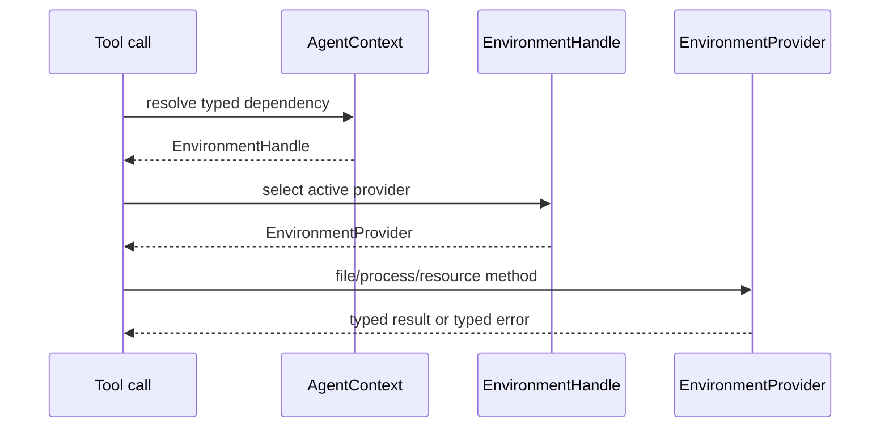
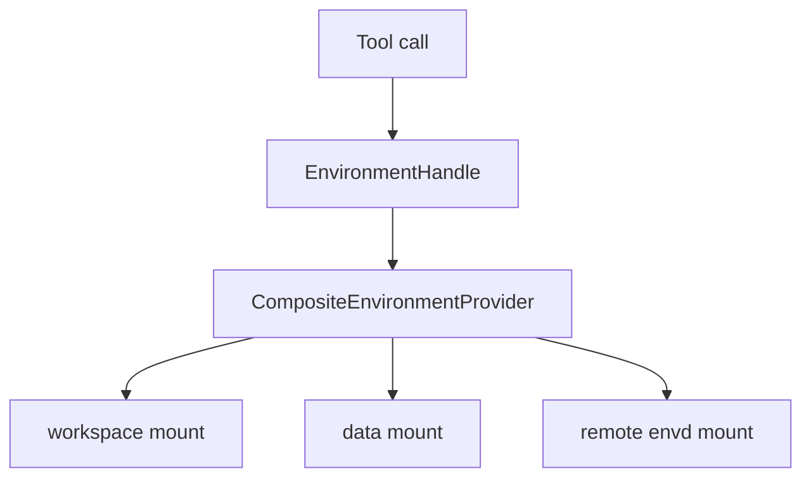
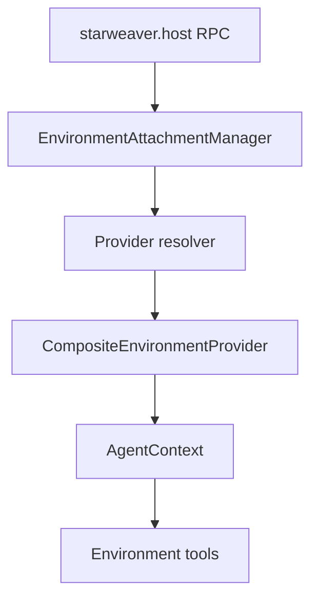
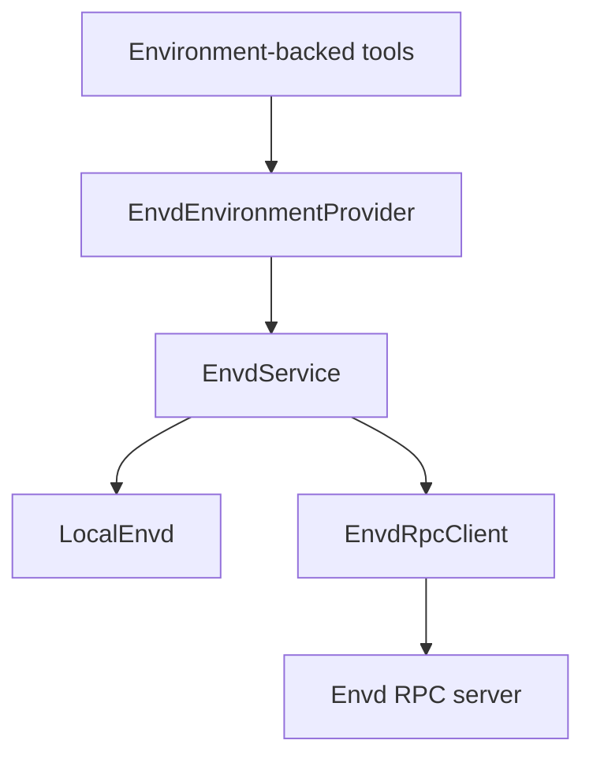
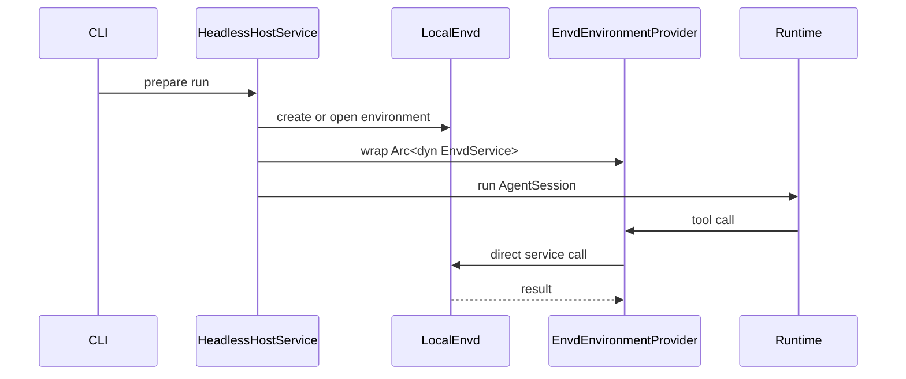
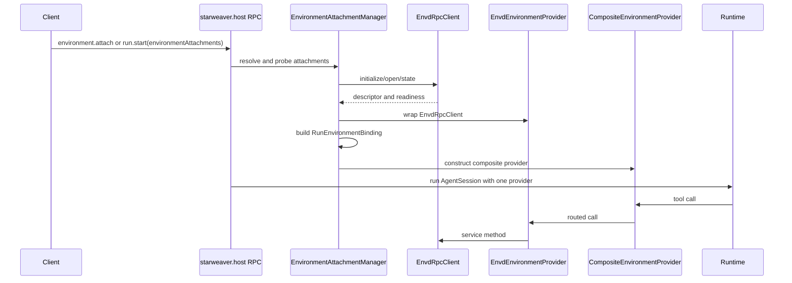

# Tool Binding and Envd Adapter

The Agent SDK environment layer turns provider capabilities into first-party
tools. Envd integration should enter at this adapter boundary, not inside the
runtime and not inside host RPC method handlers.

## Tool Binding

Environment-backed tools resolve the active environment through `AgentContext`.



The runtime still executes a normal tool call. It does not need to know whether
the provider is local, virtual, sandboxed, or envd-backed.

## Multi-Environment Routing

The SDK should support multiple mounted environments by attaching one composite
provider to `AgentContext`, not by teaching runtime tools or models about
multiple providers.



Target shape:

```rust
pub struct EnvironmentMount {
    pub id: String,
    pub agent_root: String,
    pub mode: EnvironmentAttachmentAccessMode,
    pub provider: DynEnvironmentProvider,
    pub is_default: bool,
    pub default_for_shell: bool,
}

pub struct CompositeEnvironmentProvider {
    mounts: Vec<EnvironmentMount>,
    process_routes: Mutex<BTreeMap<String, String>>,
}
```

Routing rules:

- Exactly one mount is the default mount. Unqualified relative paths and `/`
  route to that mount for backward-compatible tools and prompts.
- Every mounted environment is also exposed under
  `/environment/{environment_identity}`.
  `environment_identity` is the host attachment id after strict slug
  validation, not necessarily the provider's internal environment id.
- Valid identities are ASCII slugs such as `workspace`, `data-1`, or
  `review_copy`. They must not contain `/`, be empty, be `.` or `..`, or use
  reserved names owned by the composite provider.
- `/environment` is a reserved virtual namespace owned by the composite
  provider. It does not need to exist in any child provider. This avoids
  ambiguity when two environments expose the same physical directory and avoids
  stealing `/mnt` from POSIX-like environments.
- File operations route by normalized logical path.
  `/environment/{id}/...` routes to that environment with the prefix stripped.
  Other paths route to the default mount.
- Tool results should preserve agent-facing logical paths. A child provider path
  such as `/src/lib.rs` from mount `data` is returned as
  `/environment/data/src/lib.rs`.
- When the same physical directory is attached through multiple environments,
  the logical namespace remains authoritative. The host is responsible for
  making that aliasing intentional; the agent should not infer physical
  identity from paths.
- Cross-mount `move` and `copy` should be explicit provider-level operations:
  read from source mount, write to destination mount, then delete source for
  moves only when both sides succeed and policy allows it.
- Foreground shell routes by `cwd`: `cwd="/environment/{id}/path"` executes
  through that environment with `cwd="/path"` inside the child provider. If
  `cwd` is absent or not under `/environment/{id}`, use the mount marked
  `default_for_shell`.
- Background shell start uses the same `cwd` routing. The composite provider
  records `returned_process_id -> mount_id` and returns a composite id such as
  `workspace:process_123`.
- `shell_wait`, `shell_input`, `shell_signal`, and `shell_kill` route by the
  composite process id. The model only sees one process handle namespace.
- `shell_status` returns snapshots from all process-capable mounts with
  composite process ids.
- Environment context rendering preserves the current default-environment file
  tree behavior. Non-default mounts are summarized only by id, root,
  capabilities, and readiness; their file trees are not rendered into the model
  context by default.

This keeps shell as an optional command/process capability. Interactive
terminal state is not part of the SDK routing contract.

Example model-facing context:

```xml
<environment-mounts>
  <default mount="workspace" root="/" />
  <mount id="workspace" root="/environment/workspace" files="read_write" command="run" process="background" />
  <mount id="data" root="/environment/data" files="read_only" command="none" process="none" />
</environment-mounts>
<default-environment-context>
  <!-- Existing workspace file tree and shell context stay here. -->
</default-environment-context>
<shell-routing>
  shell_exec without cwd runs in the default mount.
  Use cwd="/environment/workspace/..." or cwd="/environment/data/..." to choose a mounted environment explicitly.
  Commands can run only in mounts that advertise command capability.
</shell-routing>
```

Non-default environments can still be explored explicitly with file tools, for
example `ls(path="/environment/data")` or `view(file_path="/environment/data/README.md")`.

## Host Attachment Manager Boundary

The host-control protocol can dynamically prepare environment attachments before
a run. That manager belongs above the SDK provider layer.



Boundary rules:

- The manager validates host-control refs, literal endpoint refs, readiness
  policy, idempotency, and lease scope.
- The manager materializes one host-side `RunEnvironmentBinding`, then passes
  one SDK-facing `EnvironmentProvider` to the Agent SDK. For multi-environment
  runs, that provider is a composite provider.
- The SDK environment layer owns path, shell, process, and context routing after
  the binding is constructed.
- The SDK layer should not know whether a child provider came from an inline
  `run.start` attachment, an `environment.attach` lease, or direct CLI config.
- Active-run mount/unmount is a future host feature because it must update the
  runtime environment handle and reinject environment context. The first
  manager slice materializes attachments before run start.
- Named endpoint aliases and host-launched envd daemons are future manager
  capabilities. The first manager slice accepts literal `http://...` envd
  endpoints.

## Envd Adapter

`EnvdEnvironmentProvider` adapts `EnvdService` to the SDK provider traits.



The adapter should depend on `Arc<dyn EnvdService>`. That keeps direct CLI mode
and remote RPC mode on the same semantic path. It should not require a mandatory
dependency on `starweaver-envd-client`; callers that choose remote envd can
construct an `EnvdRpcClient` and pass it as the service implementation.

## Method Mapping

| SDK provider method | Envd service method         |
| ------------------- | --------------------------- |
| `read_text`         | `file_read`                 |
| `read_bytes`        | `file_read` with byte range |
| `write_text`        | `file_write`                |
| `create_dir`        | file mutation method        |
| `delete_path`       | file mutation method        |
| `move_path`         | file mutation method        |
| `copy_path`         | file mutation method        |
| `write_tmp_file`    | scratch/tmp write method    |
| `stat`              | `file_stat`                 |
| `list`              | `file_list`                 |
| `glob`              | `file_glob`                 |
| `grep`              | `file_grep`                 |
| `run_shell`         | `command_run`               |
| `export_state`      | `export_snapshot`           |

Process mapping:

| SDK process method | Envd service method |
| ------------------ | ------------------- |
| `start_process`    | `process_start`     |
| `wait_process`     | `process_wait`      |
| `list_processes`   | `process_list`      |
| `input_process`    | `process_input`     |
| `signal_process`   | `process_signal`    |
| `kill_process`     | `process_kill`      |

## Direct CLI Mode

CLI direct mode should be an optimization over the same envd service interface.



This keeps simple headless runs daemon-free while avoiding a second environment
architecture.

## Host RPC Mode

Host RPC remains the agent-control plane. Envd RPC remains the environment
data/effect plane.



`starweaver-rpc-core` should carry environment attachment refs, not envd
file/process DTOs. Host RPC can select or validate envd endpoints before a run,
then the SDK environment layer binds the selected provider into `AgentContext`.

## Environment Ref

Run parameters should reference the environment without embedding daemon
internals.

```json
{
  "environment": {
    "kind": "envd",
    "endpointRef": "http://127.0.0.1:8766/rpc",
    "environmentId": "env_123",
    "mode": "read_write"
  }
}
```

Direct mode can use an in-process ref:

```json
{
  "environment": {
    "kind": "envd",
    "environmentId": "env_cli_default",
    "store": "ephemeral"
  }
}
```

## Boundary Rules

Allowed:

```text
starweaver-agent -> starweaver-environment
starweaver-environment -> starweaver-envd-core
starweaver-rpc -> host service -> environment resolver
starweaver-cli -> host service -> environment resolver
```

Avoid:

```text
starweaver-runtime -> envd RPC DTOs
starweaver-rpc-core -> envd file/process DTOs
starweaver-storage -> full envd state schema
```

Session storage can keep environment refs and SDK provider snapshots. Envd owns
full envd state.
