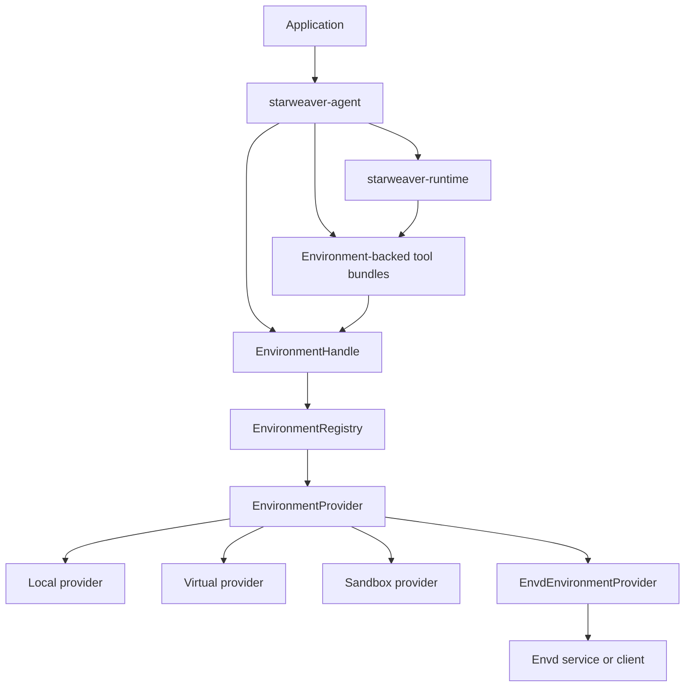

# Agent SDK Environment Layer

This spec defines Starweaver's Agent SDK environment layer. It is the
application-facing boundary that lets agents and tools use files, commands,
processes, resources, policies, and environment state without binding
`starweaver-runtime` to a concrete execution backend.

This is not the envd protocol spec. Envd is a standalone environment service
and protocol that can be used by Starweaver or by other agent runtimes. The
Starweaver environment layer can adapt envd through `EnvdEnvironmentProvider`,
but it should also support local, virtual, sandbox, and composite providers.

## Reading Order

1. `01-sdk-provider-contract.md` — `EnvironmentProvider`, process/shell
   extension traits, provider descriptors, state snapshots, and capability
   contracts.
2. `02-tool-binding-and-envd-adapter.md` — how Agent SDK tool bundles bind to an
   active environment, and how envd is adapted into that SDK layer.

Read `../envd/README.md` for the runtime-neutral envd service and protocol.
Read `../envd/05-api-backlog.md` for unfinished envd API work.

## Layer Boundary

The runtime sees normal tools and typed context. It should not import provider
implementation details, envd transport DTOs, mount internals, or file/process
RPC methods.

## Ownership Rules

- `starweaver-environment` owns SDK-facing provider contracts, provider
  descriptors, capability contracts, environment state snapshots, policy types,
  resource references, and provider adapters.
- `starweaver-agent` owns ergonomic binding: `AgentBuilder`, `AgentApp`,
  first-party tool bundles, presets, and active environment handles in
  `AgentContext`.
- `starweaver-runtime` owns the agent loop and tool execution, but stays
  provider-neutral.
- `starweaver-rpc` owns host-control: sessions, runs, stream replay, steering,
  HITL, model selection, and the environment attachment manager that resolves
  host refs into run environment bindings.
- `spec/envd` owns envd service methods, RPC transports, daemon lifecycle, envd
  state, mounts, operation/effect records, and envd protocol errors.

## Provider Families

Provider families behind the SDK layer:

- virtual provider for deterministic tests
- local provider for direct workspace access
- sandbox provider for local OS/container/microVM execution policy
- envd-backed provider for direct or remote envd service calls
- composite provider for routing file, command, resource, or media operations
  to specialized providers

Each family should expose advertised capabilities through the same SDK-facing
provider contracts. Envd is one provider implementation path, not the only
environment model Starweaver can expose.

## Key Decision

Keep two separate specs:

- `spec/environment/` describes the Starweaver Agent SDK layer.
- `spec/envd/` describes the standalone envd service/protocol.

This lets Starweaver keep a clean `EnvironmentProvider` abstraction while envd
can be reused by other agent runtimes.
