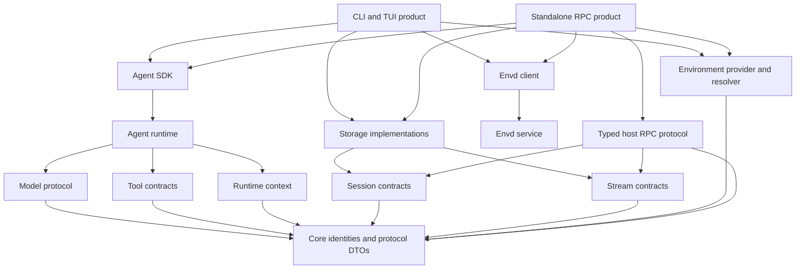

# Product and Process Boundaries

Status: accepted

This document is the normative ownership and dependency decision for the Starweaver CLI/TUI, JSON-RPC host, and envd products.

## Decision

`starweaver-cli` and `starweaver-rpc` are independent product surfaces.

- Neither product is a frontend, adapter, subprocess implementation detail, or required dependency of the other.
- TUI is part of the CLI product and executes through CLI-owned application coordination. It does not speak the Starweaver host JSON-RPC protocol unless a future optional remote-client mode is designed separately.
- The RPC product owns its own protocol dispatch, transports, application coordination, configuration projection, authorization, and lifecycle.
- CLI/TUI and RPC may share lower-level library contracts and implementations. Shared code must be product-neutral and must not encode CLI commands, TUI state, RPC methods, or transport behavior.
- CLI/TUI and RPC can each connect to envd independently through `starweaver-environment`, `starweaver-envd-core`, and `starweaver-envd-client`.
- Packaging may distribute CLI and RPC binaries together. Packaging does not imply a runtime or crate dependency between them.
- The planned Desktop product is an RPC protocol client and process supervisor specified in `../desktop/`. Shipping and supervising an exact RPC binary does not make RPC a CLI implementation detail or permit Desktop to link RPC implementation/runtime/storage crates into its renderer.

## Product Shape



Arrows mean "depends on". Product edges do not point at each other.

## Shared Abstractions

The products may share:

- Starweaver identity, metadata, trace, cancellation, and protocol DTOs;
- model, tool, context, runtime, and Agent SDK contracts;
- session records and atomic storage domain operations;
- stream, replay, display, and projection contracts;
- environment provider, environment binding, and envd client abstractions;
- reusable run-lifecycle helpers that do not expose a product command or transport model;
- test fixtures and conformance suites.

A shared abstraction is acceptable only when both products can consume it without importing the other product crate.

## Product-Owned Responsibilities

### CLI and TUI

`starweaver-cli` owns:

- command-line argument parsing and launcher integration;
- interactive terminal state, rendering, and input handling;
- CLI/TUI configuration projection and client-local state;
- shell-friendly output modes;
- CLI-owned active-run coordination and TUI steering;
- local UX for approvals, sessions, replay, install, and update.

It may embed the Agent SDK and connect directly to local or remote envd providers. It does not expose or implement the Starweaver host protocol as part of its normative boundary.

### Standalone RPC

`starweaver-rpc` owns:

- Starweaver host-protocol method dispatch;
- stdio and authenticated HTTP transports;
- RPC-specific configuration and client state;
- RPC-owned active-run coordination, subscriptions, idempotency, and authorization;
- typed request/result/error mapping;
- RPC process startup and shutdown.

It may embed the Agent SDK and connect directly to local or remote envd providers. It must not depend on `starweaver-cli`.

The RPC binary remains independently runnable even when a Desktop release bundles and supervises it. Desktop communicates through the versioned host protocol and process lifecycle only; RPC does not import Desktop state or APIs.

### RPC Core

`starweaver-rpc-core` owns only product-neutral host-protocol contracts:

- JSON-RPC envelopes and framing helpers;
- typed method params, results, errors, notifications, and feature negotiation;
- replay and stream payload projection required by the host protocol;
- protocol conformance fixtures.

It does not own CLI configuration, TUI state, process orchestration, storage implementations, or runtime coordination.

### Envd

Envd is an independent environment effect/data-plane service. CLI/TUI and RPC resolve and connect to envd independently. They may use the same resolver and provider adapters, but environment attachment state is product-owned unless represented by a shared, product-neutral run binding.

## Forbidden Dependencies

The workspace architecture gate must reject:

```text
starweaver-rpc -> starweaver-cli
starweaver-cli -> starweaver-rpc
starweaver-cli -> RPC method handlers
starweaver-rpc -> CLI command/config/TUI modules
starweaver-environment -> either product crate
starweaver-storage -> either product crate
```

`starweaver-cli` may depend on `starweaver-rpc-core` only if it explicitly implements an optional protocol client or uses product-neutral projection helpers. It must not use that dependency to host RPC methods in the CLI process.

## Migration Rules

1. Freeze new code in `starweaver-cli::rpc` and `starweaver-cli::runtime_coordinator` except fixes required for extraction.
2. Move typed host protocol definitions to `starweaver-rpc-core`.
3. Move RPC dispatch, transport, coordinator, subscription, and authorization code to `starweaver-rpc`.
4. Move product-neutral environment resolution to `starweaver-environment` or a lower shared library; keep CLI and RPC binding state separate.
5. Move durable SQLite behavior to `starweaver-storage`; keep client-local presentation state in each product.
6. Remove the `starweaver-rpc -> starweaver-cli` dependency.
7. Remove RPC commands and server adapters from the CLI product surface unless retained temporarily as a deprecated launcher that executes the standalone binary without linking its implementation.

## Acceptance Gates

- `cargo metadata` proves there is no dependency edge in either direction between `starweaver-cli` and `starweaver-rpc`.
- CLI/TUI tests run without linking `starweaver-rpc`.
- RPC tests run without linking `starweaver-cli`.
- Both products can create an agent run against local environment providers.
- Both products can independently connect to an envd endpoint through shared environment/envd abstractions.
- Storage contract tests pass for both product paths.
- RPC protocol conformance tests do not invoke CLI commands or CLI configuration types.
- CLI/TUI behavior tests do not invoke RPC handlers.
