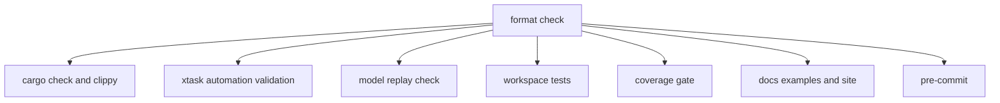

# CI Readiness and Coverage Gates

CI must prove that Starweaver's core provider contracts, SDK examples, and test coverage stay healthy. Replay fixtures are a first-class gate because provider correctness underpins the runtime, SDK, MCP, durable service, and CLI layers.

## Required CI Steps



CI commands:

```bash
cargo fmt --all -- --check
cargo check --workspace --all-targets --all-features --locked
cargo clippy --workspace --all-targets --all-features --locked -- -D warnings
cargo test -p starweaver-model --test fixture_schema --test replay --test replay_tooling --test request_parameters --test stream_replay --locked
cargo test --workspace --all-targets --all-features --locked
make coverage-ci
make scripts-check
make docs-check
mdbook build
```

Local aggregate:

```bash
make ci
```

Focused gates:

```bash
make replay-check
make coverage-ci
make scripts-check
make docs-check
```

Replay fixture recording helpers:

```bash
make record-model-cassette ARGS="request.json --provider openai_chat --output cassette.json"
make scrub-model-cassette ARGS="cassette.json --output cassette.scrubbed.json"
make import-model-cassette ARGS="cassette.scrubbed.json"
make scripts-check
```

## Replay Readiness

Provider replay coverage is accepted when:

- every implemented provider family has text response fixtures
- every implemented provider family with tools has tool call and tool return history fixtures
- native provider tools have request-only fixtures
- settings, profiles, request parameters, and output schema mapping have focused tests
- fixture coverage appears in `spec/alignment/05-models-output-provider-alignment.md`
- unmigrated replay categories are explicitly listed

## Feature Coverage

`spec/capabilities.toml` exclusively owns release-level capability implementation status, and `spec/capability-status.md` is its generated human-readable view. Domain specs own contracts and evidence descriptions. Alignment specs own evidence review and remaining gap analysis for:

- agent framework docs features
- provider behavior tests
- first-party SDK modules and tests
- Starweaver specs
- current evidence against the generated capability status
- active implementation batch scope

## Release Gate

Before a release candidate:

- all CI gates pass
- coverage gate passes
- script smoke tests pass
- docs examples pass
- generated capability status is current and every registered capability has evidence
- non-normative feature and SDK maps reference registry capability IDs instead of duplicating status
- replay matrix includes supported provider families and known gaps
- specs reflect all public crate boundaries
