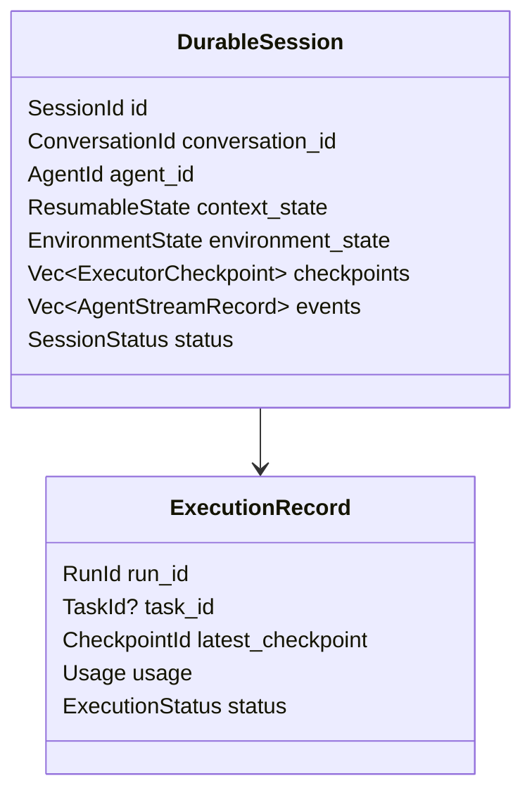
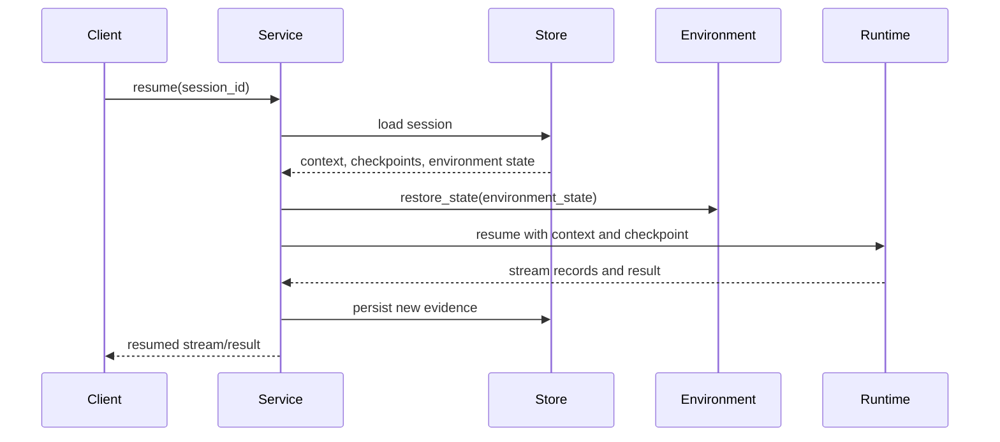

# Durable Service Runtime

The durable service runtime persists and resumes Starweaver executions. It builds on the core runtime's checkpoint and context evidence, plus the SDK's environment provider contracts.

## Service Responsibilities

- Manage durable sessions.
- Persist `AgentContext` state and executor checkpoints.
- Persist stream events for replay.
- Handle interruption, cancellation, approval, and deferred tool calls.
- Restore typed dependencies and environment providers through application configuration.
- Resume from checkpoints when supported by the runtime state.
- Serve SSE and AGUI-compatible event streams.
- Provide storage adapters.

## Durable Session Shape

## Resume Flow

## Interruption and Approval

Suspend reasons:

- user approval required
- deferred tool call
- cancellation requested
- provider retry exhaustion needing operator action
- environment resource wait
- durable service shutdown

Every suspend record includes enough metadata for UI, CLI, or API clients to present action choices and resume safely.

## Storage Contracts

Storage adapters should support:

- create session
- load session
- append event
- append checkpoint
- update context state
- update environment state
- update execution status
- list executions
- compact or archive session evidence

SQLite should be the first local storage target. PostgreSQL should be the production storage target after schema stabilizes.

## Environment Provider Integration

Environment providers export state at checkpoint boundaries. The service stores this state alongside context and asks providers to restore or reconnect during resume.

Provider state can include:

- workspace identifier
- file snapshot reference
- background process handles
- shell output cursors
- resource references
- sandbox/container id
- policy revision

## Acceptance Gates

- checkpoint serialization tests
- session persistence tests
- stream replay tests
- approval/deferred resume tests
- environment state restore tests
- storage adapter contract tests
- SSE stream tests
- CLI session inspect tests after CLI integration
