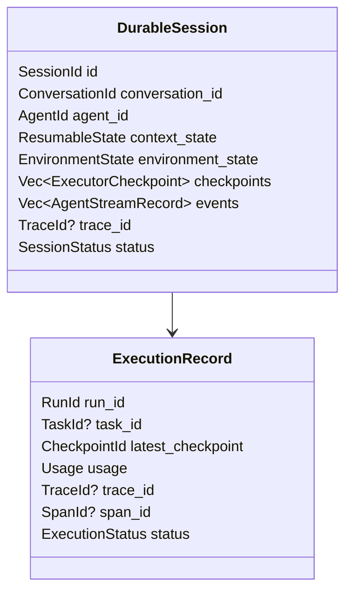
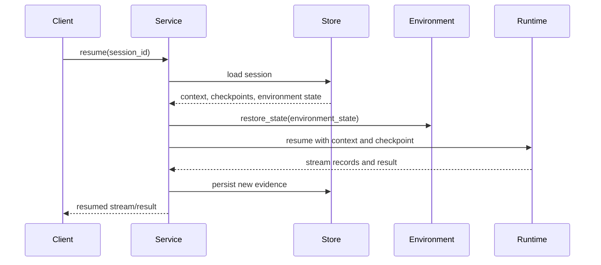
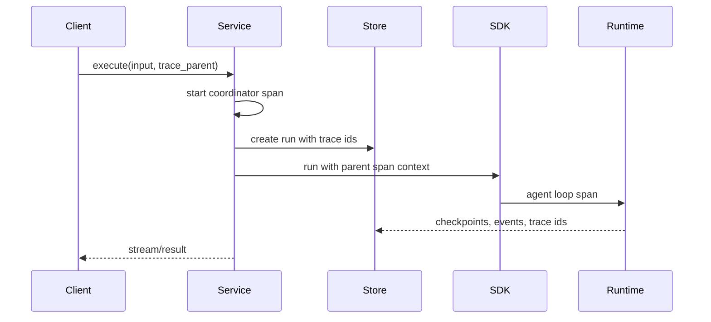

# Durable Service Runtime

The durable service runtime persists and resumes Starweaver executions. It builds on the core runtime's checkpoint, context, event, trace, and usage evidence, plus the SDK's environment provider contracts. ya-claw's session service is the reference shape for this layer.

## Service Responsibilities

- Manage durable sessions through a `SessionStore` contract.
- Persist `AgentContext` state and executor checkpoints.
- Persist stream events for replay.
- Persist trace correlation ids for external observability systems.
- Handle interruption, cancellation, approval, and deferred tool calls.
- Restore typed dependencies and environment providers through application configuration.
- Resume from checkpoints when supported by the runtime state.
- Serve SSE event streams from persisted runtime evidence.
- Provide storage adapters.

## SessionStore Contract

`SessionStore` is the service storage boundary. It should support local SQLite, production PostgreSQL, and application-defined stores while preserving the same logical operations.

Required operations:

- create session
- load session
- append turn or run
- append stream event
- append checkpoint
- update context state
- update environment state
- update execution status
- attach trace identifiers
- list session turns
- get compact run trace
- compact or archive session evidence

The store owns persistence concerns. The core runtime owns deterministic state transitions and checkpoint emission. The SDK/service layer maps them together.

## Durable Session Shape

## Checkpoint Reload and Stream Persistence

A durable service stores three related evidence streams:

- session state: exported `AgentContext` plus environment state references
- execution checkpoints: safe runtime boundaries with resume evidence, message cursor, stream cursor, trace context, usage, approvals, deferred calls, and environment refs
- stream records: delivery-oriented records for SSE/UI replay, persisted incrementally as events are observed

Reload starts from `resume_snapshot(session_id, run_id)`: load the session, load the latest checkpoint, and replay stream records after the checkpoint stream cursor. The runtime can continue from checkpoint state when the node is resumable, while clients can reconnect from stream cursor without duplicating already delivered events.

Stores should make stream append idempotent by run id and sequence. Checkpoint append remains append-only so operators can inspect the exact boundary history.

## Resume Flow

## Interruption and Approval

Suspend reasons:

- user approval required
- deferred tool call
- cancellation requested
- provider retry exhaustion needing operator action
- environment resource wait
- durable service shutdown

Every suspend record includes enough metadata for UI, CLI, or API clients to present action choices and resume safely.

## Run Trace Projection

A compact run trace projection should expose model boundaries, tool calls, tool results, approval/deferred records, checkpoint ids, and child run references. This projection supports session tools and UI inspection. Full nested timing and span metadata live in the OpenTelemetry backend.

Trace projection shape:

- run id
- parent run id
- trace id
- span id
- item type
- model provider or tool name
- tool call id
- checkpoint id
- content preview
- truncation flag
- timestamp

SQLite should be the first local storage target. PostgreSQL should be the production storage target after schema stabilizes.

## Observability Integration

The service runtime may create a coordinator span when an execution request begins. That span becomes the parent for the SDK agent loop span. Model requests, tool executions, and subagent runs become nested child spans through the trace context carried by `AgentContext`.

Langfuse is the recommended backend through OTLP export. Other collectors can receive the same OpenTelemetry spans.

## Environment Provider Integration

Environment providers export state at checkpoint boundaries. The service stores this state alongside context and asks providers to restore or reconnect during resume.

Provider state can include:

- workspace identifier
- file snapshot reference
- background process handles
- shell output cursors
- resource references
- sandbox/container id
- policy revision

## Acceptance Gates

- checkpoint serialization tests
- session persistence tests
- stream replay tests
- approval/deferred resume tests
- environment state restore tests
- storage adapter contract tests
- SSE stream tests
- compact run trace projection tests
- trace id persistence tests
- CLI session inspect tests after CLI integration
