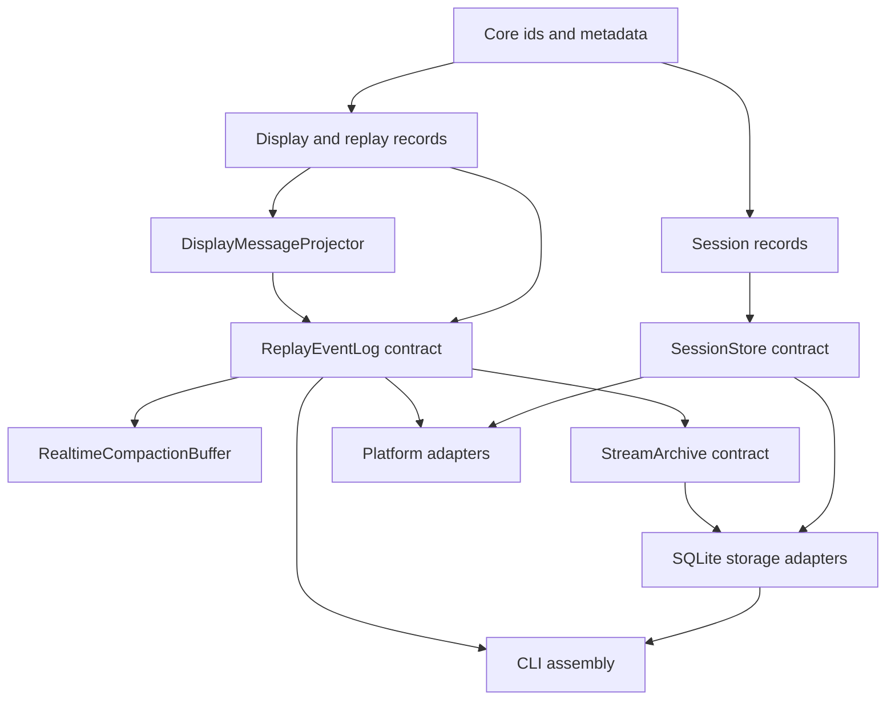

# Shared Session and Stream Components

Starweaver's operational products are built from reusable foundations upward. `starweaver-cli`, SDK applications, service hosts, and future platform adapters compose the same session storage contracts and the same display/replay stream contracts.

## Goal

Build reusable session and stream contracts that let local CLI, service hosts, and future adapters share one durable execution model.

Key properties:

- one serializable input model for user, API, schedule, service, and tool submissions
- one reusable `SessionStore` contract for sessions, runs, checkpoints, state, approvals, deferred calls, and resume snapshots
- one renderer-neutral display protocol for terminal, service transports, logs, and external protocols
- one replay event-log abstraction for live tail, resume, compaction, and future queue-backed delivery
- one transport-envelope abstraction for SSE, JSONL, WebSocket, and external protocol adapters
- product-owned control surfaces for host coordination, with JSON-RPC stdio as the complete local runtime API and CLI commands as a shell-friendly subset over the same shared session and stream contracts
- shared local configuration under `~/.starweaver/config.toml`, with frontend-specific client state under `~/.starweaver/tui` and `~/.starweaver/desktop`
- renderer-specific formatting and frontend state at the product edge
- storage, stream-log, and transport adapters selected by host configuration

## Recommended Split

| Area                      | Crate                 | Primary contract                     | Owns                                                                                                                                                  | Concrete adapters                                                                                      |
| ------------------------- | --------------------- | ------------------------------------ | ----------------------------------------------------------------------------------------------------------------------------------------------------- | ------------------------------------------------------------------------------------------------------ |
| Session state             | `starweaver-session`  | `SessionStore`                       | `InputPart`, session/run records, checkpoint refs, context/env state refs, approvals, deferred records, resume snapshots, compact session/run traces  | in-memory test store; SQLite adapter in `starweaver-storage`; PostgreSQL planned                       |
| Display and replay stream | `starweaver-stream`   | `ReplayEventLog` / `ReplayTransport` | `DisplayMessage`, display projector traits, replay events, replay cursors/scopes, realtime compaction buffers, stream archives, protocol envelopes    | in-memory event log, JSONL adapters, service transports, future queue-backed event-log adapter         |
| Shared persistence        | `starweaver-storage`  | SQLite adapters                      | migration registry, migration status, `SessionStore`, `StreamArchive`, `ReplayEventLog` adapters                                                      | SQLite database file or memory database                                                                |
| Terminal product          | `starweaver-cli`      | command assembly                     | CLI config, frontend state roots, local defaults, argv parsing, JSON-RPC stdio runtime API, CLI command subset, TUI terminal client, approval prompts | local store path, active-run registry, JSON-RPC stdin/stdout, JSON stdout, JSONL/display-jsonl streams |
| Platform adapters         | future platform crate | external protocol adapters           | A2A, AGUI, hosted orchestration, remote transports                                                                                                    | selected by platform host                                                                              |

Boundary invariants:

- `SessionStore` stores session state, run state, checkpoint references, context/environment state references, approval/deferred records, resume snapshots, compact trace projections, and stream cursor references.
- `SessionStore` exposes stable cursor references for stream replay while stream archive and replay contracts stay in `starweaver-stream`.
- `starweaver-stream` owns display protocol records, replay event-log semantics, stream archives, realtime compaction, and protocol envelope abstractions.
- Memory, service transports, JSONL, WebSocket, and queue integrations are adapters over `starweaver-stream` contracts.
- JSON-RPC stdio is the complete local host-control surface for sessions, runs, replay, cancellation, steering, approvals, deferred calls, profiles, config, diagnostics, and client model selection; CLI commands are shell-friendly subsets that map onto the same handlers.
- Model profiles and provider settings live in shared config; the selected profile for TUI/Desktop is frontend state, not shared config.
- `starweaver-storage` keeps concrete SQLite persistence reusable and product-neutral.
- Runtime checkpoint and stream record types stay in `starweaver-runtime`; they are the upstream durable evidence persisted by session and stream components rather than a separate contract crate.

## Shared Storage Direction

`starweaver-storage` owns the shared SQLite migration registry, migration status reporting, `SessionStore` adapter, `StreamArchive` adapter, and `ReplayEventLog` adapter. The active schema is limited to foundation records:

- `session_records`
- `run_records`
- `checkpoints`
- `stream_records`
- `approvals`
- `deferred_tools`
- `replay_events`
- `replay_snapshots`

This split keeps session/stream contracts in `starweaver-session` and `starweaver-stream`, while concrete persistence lives in the storage crate. During CLI convergence, `starweaver-cli` exposes `LocalSessionStore` and `LocalStreamArchive` adapters over its local store so runtime-facing code depends on shared contracts before the final storage adapter swap. CLI and future hosts select adapters through configuration and keep product behavior at the edge.

## Bottom-up Build Order



Implementation sequence:

01. shared ids and serializable session records
02. `SessionStore` trait and in-memory contract tests
03. display-message records and replay protocol records
04. `ReplayEventLog`, `ReplayTransport`, and realtime compaction contract tests
05. CLI display-message restore contract, headless JSONL transport, renderer assembly, and Starweaver `DisplayMessage` protocol
06. CLI JSON-RPC stdio runtime surface that exposes complete session management, run orchestration, replay, profile/config/diagnostics, client model selection, cancellation, steering, approvals, and deferred calls over the same contracts
07. launcher dispatch, `sw` alias install behavior, GitHub installer, and update path
08. SQLite session store, replay event log, stream archive adapter, and migrations in `starweaver-storage`
09. CLI local storage convergence onto shared storage adapters
10. platform adapter specs over the shared session/stream/storage contracts

## Shared Session Records

Owner: `starweaver-session`.

`InputPart` provides one structured submission shape for user prompts, API requests, schedules, tools, and service calls.

| Kind      | Purpose                                |
| --------- | -------------------------------------- |
| `text`    | natural language prompt text           |
| `url`     | URL reference                          |
| `file`    | provider-scoped file reference         |
| `binary`  | resource reference or upload token     |
| `mode`    | execution mode or planning hint        |
| `command` | slash-command or product command input |

Durable records:

- `SessionRecord`
- `RunRecord`
- `RunStatus`
- `ExecutionStatus`
- `SessionResumeSnapshot`
- `CompactRunTrace`
- `CompactSessionTrace`
- `ApprovalRecord`
- `DeferredToolRecord`
- `EnvironmentStateRef`
- `CheckpointRef`
- `StreamCursorRef`

## SessionStore Contract

Responsibilities:

- create and load sessions
- list sessions by status, profile, workspace, and updated time
- append and load runs
- append runtime checkpoints or checkpoint refs
- save context state and environment state
- update run and session status
- attach trace identifiers
- append approval and deferred tool records
- load resume snapshots
- return compact run and session trace projections
- store stream cursor refs for display replay and raw evidence replay
- compact or archive session evidence

## Shared Stream Records

Owner: `starweaver-stream`.

Stream records describe observable execution output and replay behavior:

- `DisplayMessage`
- `DisplayMessageKind`
- `DisplayVisibility`
- `ReplayCursor`
- `ReplayScope`
- `ReplayEvent`
- `ReplaySnapshot`
- `ReplayEnvelope`
- `StreamArchiveRecord`
- `StreamTerminalMarker`

`DisplayMessageProjector` transforms runtime stream records, lifecycle events, checkpoint events, tool events, subagent events, approval events, and terminal results into stable display messages. Display messages are product-facing semantic events and the Starweaver wire protocol.

JSON-RPC host-control responses, CLI command responses, and stream outputs should embed `DisplayMessage`, `ReplayCursor`, `ReplaySnapshot`, approval records, deferred records, and run status values from these shared crates so Desktop, TUI, shell commands, and service transports consume the same durable evidence. JSON-RPC carries the full method set; CLI commands expose a shell-friendly subset. RPC model-selection methods operate at the product edge by reading shared profiles and writing frontend state, leaving session and stream contracts renderer-neutral.

## Acceptance Gates

```bash
cargo test -p starweaver-session --locked
cargo test -p starweaver-stream --locked
cargo test -p starweaver-storage --locked
cargo test -p starweaver-cli --locked
make docs-check
```
