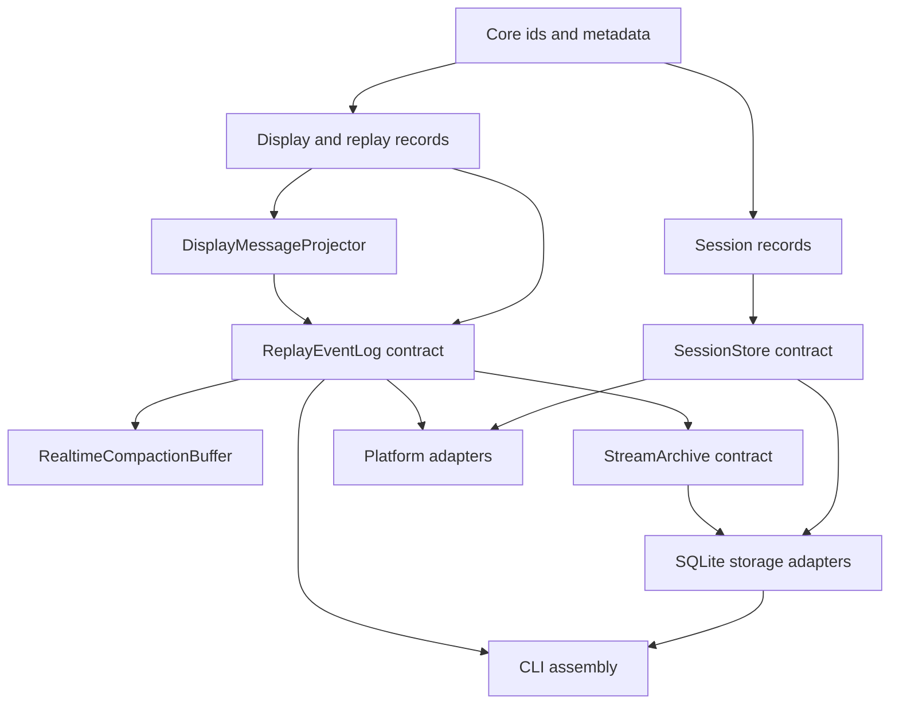

# Shared Session and Stream Components

Starweaver's operational products are built from reusable foundations upward. `starweaver-cli`, SDK applications, service hosts, and future platform adapters compose the same session storage contracts and the same display/replay stream contracts.

## Goal

Build reusable session and stream contracts that let local CLI, service hosts, and future adapters share one durable execution model.

Key properties:

- one serializable input model for user, API, schedule, service, and tool submissions
- one reusable `SessionStore` contract for sessions, runs, checkpoints, state, approvals, deferred calls, and resume snapshots
- one optional `SessionSearchProvider` contract for paginated metadata/text discovery without changing durable truth
- one narrow agent session query/control composition over canonical stores, optional search, and product-owned coordinators
- one renderer-neutral display protocol for terminal, service transports, logs, and external protocols
- one replay event-log abstraction for live tail, resume, compaction, and future queue-backed delivery
- one transport-envelope abstraction for SSE, JSONL, WebSocket, and external protocol adapters
- independent product-owned control surfaces: CLI/TUI and standalone RPC reuse lower-level session, stream, storage, runtime, and environment contracts without sharing handlers or coordinators
- product-owned configuration and client state, with reusable configuration primitives only where they remain product-neutral
- renderer-specific formatting and frontend state at the product edge
- storage, stream-log, and transport adapters selected by host configuration

## Recommended Split

| Area                        | Crate                 | Primary contract                                 | Owns                                                                                                                                                                                                    | Concrete adapters                                                                                                                                 |
| --------------------------- | --------------------- | ------------------------------------------------ | ------------------------------------------------------------------------------------------------------------------------------------------------------------------------------------------------------- | ------------------------------------------------------------------------------------------------------------------------------------------------- |
| Session state and discovery | `starweaver-session`  | `SessionStore`; proposed `SessionSearchProvider` | `InputPart`, session/run records, checkpoint refs, context/env state refs, approvals, deferred records, resume snapshots, compact session/run traces, and product-neutral search query/result contracts | in-memory test store; SQLite store and planned local search provider in `starweaver-storage`; external search providers in applications/platforms |
| Display and replay stream   | `starweaver-stream`   | `ReplayEventLog` / `ReplayTransport`             | `DisplayMessage`, display projector traits, replay events, replay cursors/scopes, realtime compaction buffers, stream archives, protocol envelopes                                                      | in-memory event log, JSONL adapters, service transports, future queue-backed event-log adapter                                                    |
| Shared persistence          | `starweaver-storage`  | SQLite adapters                                  | migration registry, migration status, `SessionStore`, `StreamArchive`, `ReplayEventLog` adapters                                                                                                        | SQLite database file or memory database                                                                                                           |
| Agent session tools         | `starweaver-agent`    | `AgentSessionQuery`; `AgentSessionControl`       | prompt-safe query/control tools over narrow host-injected capabilities; no product coordinator or storage implementation                                                                                | CLI query adapter; RPC query/control adapter in their owning products                                                                             |
| Host protocol core          | `starweaver-rpc-core` | typed JSON-RPC protocol contracts                | frame parsing, typed params/results/errors/events, feature negotiation, replay cursor/result helpers, and protocol projections                                                                          | consumed by the standalone RPC product and protocol clients                                                                                       |
| Terminal product            | `starweaver-cli`      | command and TUI coordination                     | CLI config, TUI state, local defaults, argv parsing, CLI commands, TUI terminal interface, approval prompts, and CLI-owned active-run state                                                             | local store selection, JSON stdout, JSONL/display-jsonl streams, direct environment/envd connections                                              |
| Local RPC product           | `starweaver-rpc`      | standalone host protocol                         | RPC config, authorization, typed method handlers, RPC-owned active-run coordination, subscriptions, idempotency, and transport lifecycle                                                                | JSON-RPC stdin/stdout with live notifications, authenticated HTTP `POST /rpc`, active-run registry, and stream replay                             |
| Platform adapters           | future platform crate | external protocol adapters                       | A2A, AGUI, hosted orchestration, remote transports                                                                                                                                                      | selected by platform host                                                                                                                         |

Boundary invariants:

- `SessionStore` stores session state, run state, checkpoint references, context/environment state references, approval/deferred records, resume snapshots, compact trace projections, and stream cursor references.
- `SessionStore` exposes stable cursor references for stream replay while stream archive and replay contracts stay in `starweaver-stream`.
- The proposed `SessionSearchProvider` is an optional read capability beside `SessionStore`; hits are minimal discovery projections and callers reload canonical records before replay, resume, or mutation.
- `AgentSessionQuery` and `AgentSessionControl` are host capability facades, not store extensions: they add authorization, redaction, idempotency, lifecycle CRUD, and active-run coordination over lower contracts.
- CLI installs only the query facade for its model; RPC may install grant-gated control. Neither facade gives a tool direct store/coordinator access or routes through the other product.
- `starweaver-stream` owns display protocol records, replay event-log semantics, stream archives, realtime compaction, and protocol envelope abstractions.
- Memory, service transports, JSONL, WebSocket, and queue integrations are adapters over `starweaver-stream` contracts.
- The JSON-RPC host protocol is the control surface of the independent `starweaver-rpc` product. CLI commands and TUI interactions do not map onto RPC handlers.
- CLI/TUI and RPC may parse common model/provider primitives but own their configuration projection and selected-profile state independently.
- `starweaver-cli` and `starweaver-rpc` have no dependency edge in either direction and each can resolve envd-backed providers directly.
- `starweaver-storage` keeps concrete SQLite persistence reusable and product-neutral.
- Runtime checkpoint records stay in `starweaver-runtime`. Typed raw stream events, records, source attribution, and sinks live in `starweaver-stream`; runtime emits and compatibility-re-exports those nominal types without owning a second protocol definition.

## Shared Storage Direction

`starweaver-storage` owns the shared SQLite migration registry, migration status reporting, `SessionStore` adapter, `StreamArchive` adapter, and `ReplayEventLog` adapter. The active schema contains canonical session/run rows plus namespaced evidence records:

- `session_records`
- `run_records`
- `stream_records`
- `checkpoint_records`
- `run_context_records`
- `run_environment_records`
- `approval_records`
- `deferred_tool_records`
- `replay_events`
- `display_message_records`
- `replay_snapshot_records`

Older unnamespaced checkpoint/HITL/snapshot tables and the legacy CLI display table are migration inputs, not a second product-owned schema. Migrations backfill typed canonical rows and reject same-identity/different-payload conflicts. The display archive and typed replay-event log intentionally use separate tables and live buses: they are distinct cursor families with independent monotonic sequences.

This split keeps session/stream contracts in `starweaver-session` and `starweaver-stream`, while concrete persistence lives in the storage crate. Product-local adapters are thin composition layers only: CLI keeps JSON blobs, retention policy, summaries, and project state above `SqliteStorage`; RPC independently selects the same shared adapters through RPC-owned configuration.

## Bottom-up Build Order



Implementation sequence:

01. shared ids and serializable session records
02. `SessionStore` trait and in-memory contract tests
03. display-message records and replay protocol records
04. `ReplayEventLog`, `ReplayTransport`, and realtime compaction contract tests
05. CLI display-message restore contract, headless JSONL transport, renderer assembly, and Starweaver `DisplayMessage` protocol
06. standalone Starweaver RPC product with typed stdio/HTTP protocol handlers over shared lower-level contracts
07. launcher dispatch, `sw` alias install behavior, GitHub installer, and update path
08. SQLite session store, replay event log, stream archive adapter, and migrations in `starweaver-storage`
09. CLI and RPC storage convergence onto shared storage adapters without product-to-product dependencies
10. platform adapter specs over the shared session/stream/storage contracts

## Shared Session Records

Owner: `starweaver-session`.

`InputPart` provides one structured submission shape for user prompts, API requests, schedules, tools, and service calls.

| Canonical kind  | Purpose                                        |
| --------------- | ---------------------------------------------- |
| `cache_point`   | provider-neutral prompt-cache boundary         |
| `text`          | natural language prompt text                   |
| `image_url`     | image URL                                      |
| `file_url`      | generic file URL with explicit media type      |
| `inline_binary` | inline bytes with explicit media type          |
| `resource_ref`  | typed resource URI plus model-visible metadata |
| `data_url`      | inline data URL with explicit media type       |

Previous `url`, `file`, `binary`, `mode`, and `command` values remain read-only compatibility evidence. Product modes and commands must be handled at the submitting product edge and are never treated as canonical model content.

Durable records:

- `SessionRecord`
- `RunRecord`
- `RunStatus`
- `ExecutionStatus`
- `SessionResumeSnapshot`
- `CompactRunTrace`
- `CompactSessionTrace`
- `ApprovalRecord`
- `DeferredToolRecord`
- `EnvironmentStateRef`
- `CheckpointRef`
- `StreamCursorRef`

## SessionStore Contract

Responsibilities:

- create and load sessions
- list sessions by status, profile, workspace, and updated time
- append and load runs
- append runtime checkpoints or checkpoint refs
- save context state and environment state
- update run and session status
- attach trace identifiers
- append approval and deferred tool records
- load resume snapshots
- return compact run and session trace projections
- store family-aware stream cursor refs for raw runtime evidence, display replay, and typed replay-event replay
- compact or archive session evidence

## Shared Stream Records

Owner: `starweaver-stream`.

Stream records describe observable execution output and replay behavior:

- `DisplayMessage`
- `DisplayMessageKind`
- `DisplayVisibility`
- `ReplayCursor`
- `ReplayCursorFamily`
- `ReplayScope`
- `ReplayEvent`
- `ReplaySnapshot`
- `ReplayEnvelope`
- `StreamArchiveRecord`
- `StreamTerminalMarker`

`DisplayMessageProjector` transforms runtime stream records, lifecycle events, checkpoint events, tool events, subagent events, approval events, and terminal results into stable display messages. Display messages are product-facing semantic events and the Starweaver wire protocol.

A replay cursor is valid only for an exact `(family, scope)`. Display and replay-event sequences are independent: when RPC wraps a display message in a replay event, the outer `ReplayEvent.sequence` belongs to `replay_event` while the nested `DisplayMessage.sequence` remains in `display`. RPC owns its product replay-event projection and persistence; the agent/runtime projection owns product-neutral display archive persistence.

JSON-RPC responses, CLI command responses, and stream outputs should embed `DisplayMessage`, `ReplayCursor`, `ReplaySnapshot`, approval records, deferred records, and run status values from shared crates so independent products consume the same durable evidence. Sharing evidence does not imply sharing handlers or coordinators. RPC model-selection methods write RPC-owned client state; TUI selection writes CLI-owned state. Session and stream contracts remain renderer-neutral.

## Session Discovery and Agent Management Direction

Historical session discovery is specified in `07-session-search.md`. Shared query, hit, capability, cursor, coverage, scope, and error types belong in `starweaver-session` without extending `SessionStore`. The planned local SQLite/filesystem implementation belongs in `starweaver-storage`; CLI and RPC compose it independently, while stateless/object-storage hosts can install an external index provider behind the same read contract.

Search projections are not durable truth. Ordinary list/load/resume paths remain available without a search provider, and a selected hit is reloaded from `SessionStore` before use. Filesystem mirrors are best-effort until an authoritative offload manifest records a locator, digest, projection version, and lifecycle policy.

Agent-facing query/control is separately specified in `08-agent-session-management.md`. It composes canonical state, optional search, display-safe replay, host-derived resource authority, and product-owned active-run coordination. The query facade is available to CLI and RPC agents; the control facade is RPC-only by product policy and uses composite namespace/session/run identity, typed mutations, revisions, idempotency receipts, admission fencing, and cooperative interruption.

## Acceptance Gates

```bash
cargo test -p starweaver-session --locked
cargo test -p starweaver-stream --locked
cargo test -p starweaver-storage --locked
cargo test -p starweaver-cli --locked
cargo test -p starweaver-rpc --locked
make capability-check
make docs-check
```
