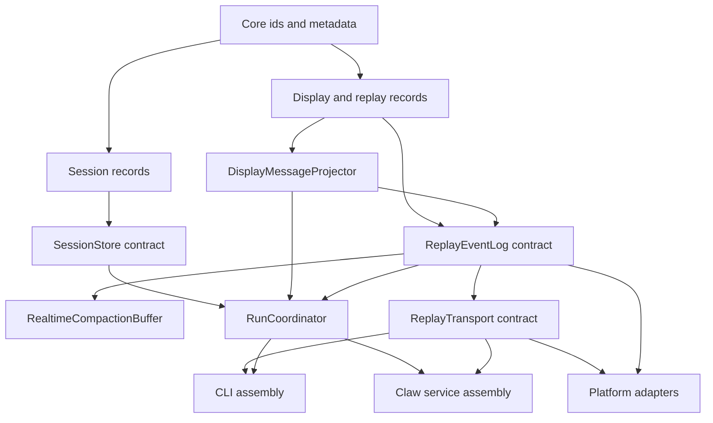

# Shared Session and Stream Components

Starweaver's operational products are built from reusable foundations upward. `starweaver-cli`, `starweaver-claw`, and future platform adapters should compose the same session storage contracts and the same display/replay stream contracts.

This spec defines the shared contracts to establish before CLI product assembly and before deeper Claw service orchestration.

## Goal

Build reusable session and stream contracts that let local CLI, single-node Claw, hosted Claw, and future adapters share the same durable execution model.

Key properties:

- one serializable input model for user/API/bridge/schedule submissions
- one reusable `SessionStore` contract for sessions, runs, checkpoints, state, approvals, deferred calls, and resume snapshots
- one renderer-neutral display protocol for terminal, web UI, SSE, logs, and external protocols
- one replay event-log abstraction for live tail, resume, compaction, and future Redis Stream or queue-backed delivery
- one transport-envelope abstraction for SSE, JSONL, WebSocket, and external protocol adapters
- renderer-specific formatting at the product edge
- storage, stream-log, and transport adapters selected by host configuration

## Recommended Split

The clean split is storage state and observable stream protocol:

| Area                      | Candidate crate      | Primary contract                     | Owns                                                                                                                                                 | Concrete adapters                                                              |
| ------------------------- | -------------------- | ------------------------------------ | ---------------------------------------------------------------------------------------------------------------------------------------------------- | ------------------------------------------------------------------------------ |
| Session state             | `starweaver-session` | `SessionStore`                       | `InputPart`, session/run records, checkpoint refs, context/env state refs, approvals, deferred records, resume snapshots, compact session/run traces | in-memory test store, SQLite/PostgreSQL store in `starweaver-claw`             |
| Display and replay stream | `starweaver-stream`  | `ReplayEventLog` / `ReplayTransport` | `DisplayMessage`, display projector traits, replay events, replay cursors/scopes, realtime compaction buffers, stream archives, protocol envelopes   | in-memory event log, SSE/JSONL adapters, future Redis Stream event-log adapter |
| Durable orchestration     | `starweaver-claw`    | `RunCoordinator`                     | runtime execution lifecycle, store/stream wiring, concrete service APIs, workspace binding, adapter composition                                      | SQLite, PostgreSQL, SSE, Redis Stream, service bus                             |
| Terminal product          | `starweaver-cli`     | command assembly                     | CLI config, local defaults, argv parsing, renderer selection, approval prompts                                                                       | local store path, in-memory tail, service SSE client, JSONL stdout             |

`starweaver-session` persists durable state. `starweaver-stream` defines what product surfaces see and how clients replay or tail it. `starweaver-claw` can store both families in one database while preserving separate trait boundaries.

Boundary invariants:

- `SessionStore` stores session state, run state, checkpoint references, context/environment state references, approval/deferred records, resume snapshots, compact trace projections, and stream cursor references.
- `SessionStore` exposes stable cursor references for stream replay without owning display-message projection, replay event-log behavior, live-tail subscriptions, realtime compaction, or transport envelopes.
- `starweaver-stream` owns display protocol records, replay event-log semantics, stream archives, realtime compaction, and protocol envelope abstractions.
- Memory, Redis Stream, SSE, JSONL, WebSocket, and service bus integrations are adapters over `starweaver-stream` contracts.
- Claw can colocate session tables and stream archive tables in one database while keeping `SessionStore`, `StreamArchive`, `ReplayEventLog`, and `ReplayTransport` as separate contracts.

## Bottom-up Build Order



Implementation sequence should follow the diagram:

1. shared ids and serializable session records
2. `SessionStore` trait and in-memory contract tests
3. display-message records and replay protocol records
4. `ReplayEventLog`, `ReplayTransport`, and realtime compaction contract tests
5. SQLite session store and stream archive adapter in Claw
6. run coordinator wiring over session and stream contracts
7. CLI command/config/rendering assembly
8. service SSE/API assembly
9. Redis Stream or distributed replay event-log adapter

## Recommended Crate Split

| Crate                 | Role                                              | Owns                                                                                                                             | Depends on                                   |
| --------------------- | ------------------------------------------------- | -------------------------------------------------------------------------------------------------------------------------------- | -------------------------------------------- |
| `starweaver-core`     | shared identifiers and metadata                   | ids, metadata, usage, trace context                                                                                              | foundation crates only                       |
| `starweaver-runtime`  | deterministic agent loop                          | run state, stream records, checkpoints                                                                                           | model, tools, context                        |
| `starweaver-agent`    | SDK app composition                               | `AgentSpec`, `AgentApp`, sessions, tool bundles                                                                                  | runtime, environment, tools                  |
| `starweaver-session`  | shared durable session contracts                  | input parts, session store traits, session/run records, resume snapshots, approvals, deferred records, compact trace projections | core, runtime, context, environment          |
| `starweaver-stream`   | shared display/replay stream contracts            | display messages, replay event logs, replay transports, realtime compaction buffers, protocol envelopes                          | core, runtime                                |
| `starweaver-claw`     | durable orchestration and storage/stream adapters | SQLite/PostgreSQL adapters, coordinator, service APIs, SSE, Redis Stream, workspace binding                                      | session, stream, agent, runtime, environment |
| `starweaver-cli`      | terminal product                                  | argv parsing, CLI config, local profile discovery, renderers, approval prompts                                                   | session, stream, claw, agent, environment    |
| `starweaver-platform` | external protocol adapters                        | A2A, AGUI, hosted orchestration                                                                                                  | stream, session, claw                        |

Concrete database connections, HTTP servers, terminal styling, model clients, and environment provider factories live in product crates.

## Shared Session Records

Owner: `starweaver-session`.

### InputPart

CLI, service API, bridge adapters, schedules, and tools should submit user input through one structured shape.

| Kind      | Purpose                                |
| --------- | -------------------------------------- |
| `text`    | natural language prompt text           |
| `url`     | URL reference                          |
| `file`    | provider-scoped file reference         |
| `binary`  | resource reference or upload token     |
| `mode`    | execution mode or planning hint        |
| `command` | slash-command or product command input |

The execution input mapper converts input parts into SDK prompt inputs. The original input parts stay durable for replay, Agency-style observation, bridge provenance, and UI reconstruction.

### Session and Run Records

`starweaver-session` should define durable records used by stores and coordinators:

- `SessionRecord`
- `RunRecord`
- `RunStatus`
- `ExecutionStatus`
- `SessionResumeSnapshot`
- `CompactRunTrace`
- `CompactSessionTrace`
- `ApprovalRecord`
- `DeferredToolRecord`
- `EnvironmentStateRef`
- `CheckpointRef`
- `StreamCursorRef`

`StreamCursorRef` stores stable references to stream replay positions without importing stream delivery behavior into the session store.

## SessionStore Contract

Owner: `starweaver-session` trait and record types. Concrete adapters live in `starweaver-claw` or host crates.

Responsibilities:

- create and load sessions
- list sessions by status, profile, workspace, and updated time
- append and load runs
- append runtime checkpoints or checkpoint refs
- save context state and environment state
- update run and session status
- attach trace identifiers
- append approval and deferred tool records
- load resume snapshots
- return compact run and session trace projections
- store stream cursor refs for display replay and raw evidence replay
- compact or archive session evidence

The store owns durable session state. Raw runtime stream records and display messages are stream artifacts handled by `starweaver-stream` contracts and persisted by concrete archive adapters when needed.

The first shared contract implementation should be in-memory. SQLite should be the first persistent adapter. PostgreSQL can follow after schema stability.

## Shared Stream Records

Owner: `starweaver-stream`.

Stream records describe observable execution output and replay behavior:

- `DisplayMessage`
- `DisplayMessageKind`
- `DisplayVisibility`
- `ReplayCursor`
- `ReplayScope`
- `ReplayEvent`
- `ReplaySnapshot`
- `ReplayEnvelope`
- `StreamArchiveRecord`
- `StreamTerminalMarker`

### DisplayMessageProjector

Owner: `starweaver-stream` trait and default projector; `starweaver-claw` wires it into execution.

Responsibilities:

- transform runtime stream records, lifecycle events, checkpoint events, tool events, subagent events, approval events, and terminal results into stable display messages
- preserve agent id, agent name, run id, session id, sequence, timestamp, and trace correlation
- feed display messages into the replay event log and compaction buffer
- keep enough structure for terminal, web UI, logs, SSE, and future AGUI/A2A adapters

Display messages are product-facing semantic events. They sit between raw runtime events and renderer-specific formatting.

Suggested message family:

| Kind                   | Purpose                                      |
| ---------------------- | -------------------------------------------- |
| `run_queued`           | run accepted and waiting for execution       |
| `run_started`          | execution started                            |
| `assistant_text_start` | assistant text block started                 |
| `assistant_text_delta` | assistant streaming text delta               |
| `assistant_text_end`   | assistant text block completed               |
| `tool_call_start`      | tool call started with tool name and call id |
| `tool_call_delta`      | streaming tool call args or partial evidence |
| `tool_call_end`        | tool call arguments completed                |
| `tool_result`          | tool result or error preview                 |
| `approval_requested`   | approval prompt with action metadata         |
| `approval_resolved`    | approval decision recorded                   |
| `checkpoint`           | checkpoint emitted at runtime boundary       |
| `subagent_started`     | child agent or delegated task started        |
| `subagent_completed`   | child agent or delegated task completed      |
| `compaction_started`   | history/context compaction started           |
| `compaction_completed` | compaction completed with token evidence     |
| `run_completed`        | run completed successfully                   |
| `run_failed`           | run failed with code and message             |
| `run_cancelled`        | run cancelled or interrupted                 |

Suggested Rust shape:

```rust
pub struct DisplayMessage {
    pub sequence: usize,
    pub session_id: SessionId,
    pub run_id: RunId,
    pub agent_id: Option<String>,
    pub agent_name: Option<String>,
    pub timestamp_ms: i64,
    pub trace_id: Option<String>,
    pub span_id: Option<String>,
    pub kind: DisplayMessageKind,
    pub payload: serde_json::Value,
    pub preview: Option<String>,
    pub visibility: DisplayVisibility,
}
```

`payload` is the canonical structured projection. `preview` is a small renderer-friendly summary for compact lists, logs, and diagnostics.

## Replay Event Log Contract

Owner: `starweaver-stream` trait and record types. Adapters can be memory-backed, Redis Stream-backed, service-bus-backed, or archived through a concrete storage adapter.

`ReplayEventLog` is the reusable protocol substrate under SSE, CLI live output, web UI live tail, and future distributed transport.

Responsibilities:

- append ordered events with monotonic sequence ids
- expose replay after a cursor
- expose live tail subscription after replay
- publish terminal events
- preserve per-session and per-run channels
- track subscriber counts and last delivered cursors when useful
- support compact snapshots for resume and read views
- support idempotent append by `(scope, sequence)`

Suggested scopes:

| Scope                  | Use                                         |
| ---------------------- | ------------------------------------------- |
| `run:{run_id}`         | run-local live stream and replay            |
| `session:{session_id}` | session active-run stream and notifications |
| `notifications`        | service-level notifications                 |
| `agent:{agent_id}`     | future agent-specific routing               |

Suggested trait shape:

```rust
#[async_trait]
pub trait ReplayEventLog: Send + Sync {
    async fn append(&self, scope: ReplayScope, event: ReplayEvent) -> Result<(), ReplayError>;
    async fn replay_after(
        &self,
        scope: &ReplayScope,
        cursor: Option<ReplayCursor>,
        limit: Option<usize>,
    ) -> Result<Vec<ReplayEvent>, ReplayError>;
    async fn subscribe(
        &self,
        scope: ReplayScope,
        cursor: Option<ReplayCursor>,
    ) -> Result<ReplaySubscription, ReplayError>;
    async fn compact_snapshot(
        &self,
        scope: &ReplayScope,
    ) -> Result<ReplaySnapshot, ReplayError>;
}
```

The initial `InMemoryReplayEventLog` should mirror ya-claw's event buffer: replayable per-run buffers, session-to-latest-run routing, compact replay snapshots, steering/control queues, termination signals, and live subscriber counts.

A future `RedisStreamReplayEventLog` can map:

- scope to Redis stream key
- sequence to stream id or explicit sequence field
- replay-after-cursor to `XRANGE` / `XREAD`
- live tail to blocking `XREAD`
- compaction snapshots to side keys keyed by run/session

## Replay Transport Contract

Owner: `starweaver-stream` transport traits and protocol envelopes. Product crates provide concrete protocol adapters.

Responsibilities:

- turn replay events into SSE, JSONL, WebSocket, or external protocol envelopes
- support replay-after-cursor followed by live tail
- keep transport cursor semantics stable across memory and Redis-backed logs
- carry heartbeat and terminal markers
- map display messages into product protocol frames

SSE envelope:

```json
{
  "id": "42",
  "event": "display_message",
  "data": {
    "sequence": 42,
    "kind": "assistant_text_delta",
    "payload": {"delta": "hello"}
  }
}
```

CLI JSONL envelope:

```json
{"sequence":42,"kind":"assistant_text_delta","payload":{"delta":"hello"}}
```

The transport contract should treat cursor replay and live tail as one operation:

1. read replay events after cursor
2. deliver replay in sequence order
3. attach live subscription
4. continue from the latest delivered sequence
5. send terminal marker when the run reaches a terminal status

## Realtime Compaction Buffer

Owner: `starweaver-stream`.

Responsibilities:

- maintain live per-run display messages
- compact repetitive deltas for replay snapshots
- merge text deltas by message id
- merge tool-call deltas by tool call id
- retain terminal lifecycle events
- expose `snapshot()` for durable message views
- expose `tail_after(cursor)` for CLI and SSE reconnect
- flush compact snapshots at commit and best-effort checkpoint boundaries

Reference behavior from ya-claw's AGUI replay buffer:

- live events keep streaming responsiveness
- compact replay folds `TEXT_MESSAGE_CHUNK` fragments into one message item
- tool-call chunks merge into one tool call item
- terminal `RUN_FINISHED` or `RUN_ERROR` remains explicit

Starweaver should keep this as a protocol-neutral compaction buffer over `DisplayMessage`.

## Stream Archive Contract

Owner: `starweaver-stream` trait and record types. Concrete adapters can store archive rows in the same SQLite/PostgreSQL database as the session store.

Responsibilities:

- append raw runtime stream records for replay and debugging
- append projected display messages for read views and reconnect
- append compact replay snapshots
- replay raw runtime records after a cursor when runtime continuity checks need them
- replay display messages after a cursor for client reconnects
- expose cursor ranges for `SessionStore` compact trace projections

This contract gives durable stream history to stores and services while keeping session state separate from display/replay semantics.

## Concrete Adapters

### InMemorySessionStore

The first session implementation should support deterministic tests and local single-process runs.

Expected behavior:

- create/load/list sessions
- append/load runs
- checkpoint refs and resume snapshots
- approval/deferred records
- compact trace projections
- cursor refs for raw and display streams

### InMemoryReplayEventLog and InMemoryStreamArchive

The first stream implementations should support deterministic tests and local single-process runs.

Expected behavior:

- ordered append
- replay after cursor
- live tail subscription in tests
- dynamic compaction snapshots
- terminal event delivery
- idempotent append by sequence

### SQLiteSessionStore and SQLiteStreamArchive

The first persistent store should use SQLite with JSON payload columns and stable indexes.

Initial session tables:

| Table                | Purpose                                                                                        |
| -------------------- | ---------------------------------------------------------------------------------------------- |
| `sessions`           | session metadata, status, context state, environment state, trace context, head pointers       |
| `runs`               | run metadata, input parts, status, output preview, trace context, timestamps, restore pointers |
| `checkpoints`        | append-only runtime checkpoints keyed by session and run                                       |
| `approvals`          | approval/deferred records, requested action, decision, timestamps                              |
| `environment_states` | exported environment snapshots and provider binding metadata                                   |

Initial stream archive tables:

| Table              | Purpose                                                        |
| ------------------ | -------------------------------------------------------------- |
| `stream_records`   | raw runtime stream records keyed by session, run, and sequence |
| `display_messages` | projected display messages keyed by session, run, and sequence |
| `replay_snapshots` | compact replay snapshots keyed by scope and revision           |

### RedisStreamReplayEventLog

This adapter can follow after memory and SQLite contracts stabilize.

Expected mapping:

- one stream per replay scope
- live tail through blocking read
- replay after cursor through range reads
- compact snapshots in side keys
- terminal event marker as a normal replay event
- service instance id and heartbeat metadata in event payloads

## Run Coordinator Position

Owner: `starweaver-claw`.

The coordinator should consume both shared contracts:

- load session and run records from `SessionStore`
- append checkpoints and state refs to `SessionStore`
- project runtime records into display messages through `DisplayMessageProjector`
- append raw runtime records and display messages through `StreamArchive`
- append live replay events to `ReplayEventLog`
- update compact snapshots through `RealtimeCompactionBuffer`
- persist terminal session state through `SessionStore`
- publish terminal stream markers through `ReplayEventLog`

Execution ownership stays in Claw. Session storage and stream protocols stay reusable.

## Renderer Layer

Owner: `starweaver-cli` for terminal renderers; Claw web client owns web rendering.

Responsibilities:

- render display messages into terminal text, status bars, tables, JSON, or web components
- keep style, color, width, terminal interactivity, and progress affordances outside storage
- support deterministic plain output for tests
- support JSONL output for tooling and debugging

CLI renderers should consume `DisplayMessage` or compact replay snapshots.

Renderer variants:

- `PlainRenderer`: deterministic text for tests and simple terminals
- `JsonRenderer`: one JSON object per display message
- `InteractiveRenderer`: streaming terminal UI with status line, tool blocks, approvals, and subagent nesting
- `TraceRenderer`: compact trace tables for session inspect

## Implementation Sequence

01. Add `starweaver-session` shared record types: `InputPart`, session/run records, control records, compact projections, checkpoint refs, and stream cursor refs.
02. Move or mirror the `SessionStore` contract into `starweaver-session`, keeping current `starweaver-claw` compatibility through re-exports or adapters.
03. Add deterministic in-memory `SessionStore` contract tests.
04. Add `starweaver-stream` display/replay record types: `DisplayMessage`, replay cursors/scopes, replay events, replay snapshots, replay envelopes, and stream archive records.
05. Add `ReplayEventLog`, `ReplayTransport`, `StreamArchive`, `ReplaySubscription`, `ReplaySnapshot`, and `RealtimeCompactionBuffer` traits/types in `starweaver-stream`.
06. Add deterministic in-memory `ReplayEventLog` and `StreamArchive` contract tests.
07. Add SQLite `SessionStore` and `StreamArchive` in `starweaver-claw`.
08. Add Claw run coordinator wiring over `SessionStore`, `StreamArchive`, `ReplayEventLog`, projector, and compaction buffer.
09. Add CLI assembly over shared session store and stream transport contracts: config, command parsing, profile resolution, environment resolution, and renderer selection.
10. Add SSE/JSONL transport adapters over the replay protocol.
11. Add Redis Stream replay event-log adapter after memory and SQLite contracts stabilize.

## Acceptance Gates

- `starweaver-session` record serialization tests
- `SessionStore` contract tests shared by memory and SQLite adapters
- `starweaver-stream` display/replay record serialization tests
- `StreamArchive` contract tests for raw records, display messages, snapshots, and cursor ranges
- `ReplayEventLog` contract tests for ordered append, replay-after-cursor, live tail, terminal event, and idempotency
- realtime compaction tests for text deltas, tool-call deltas, terminal events, and checkpoint flushes
- display-message projector tests for text, tools, approvals, checkpoints, subagents, and terminal run states
- transport envelope tests for SSE and JSONL cursor semantics
- CLI renderer tests over fixed display messages and replay snapshots
- service/SSE tests showing display-message replay and live tail
- Redis Stream adapter contract tests when the adapter lands
