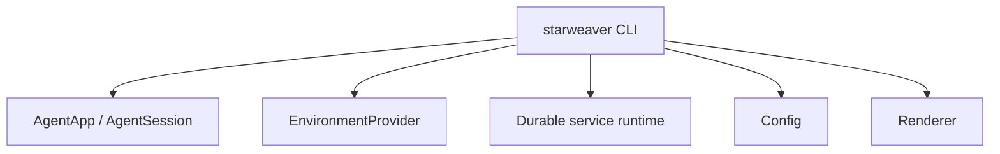

# CLI Product

The CLI Product is a user-facing application over the SDK, environment providers, and durable service runtime. It validates local developer workflows and provides a concrete product surface for sessions, approvals, diagnostics, and replay inspection.

## Product Scope

- local prompt runs
- model and provider profile configuration
- project/global config
- environment provider binding
- filesystem and shell tool bundles
- session create/list/resume/inspect
- approval prompts
- stream rendering
- replay and diagnostics commands
- docs and examples for local usage

## CLI Layering

## Commands

Initial command families:

- `starweaver run`
- `starweaver session list`
- `starweaver session resume`
- `starweaver session inspect`
- `starweaver config get/set`
- `starweaver tools list`
- `starweaver replay check`
- `starweaver diagnostics`

## Approval UX

The CLI should present approvals for:

- shell execution
- file writes and edits
- network access
- destructive actions
- long-running background processes
- deferred tool calls

Approval decisions become structured events and resume inputs.

## Diagnostics

Diagnostics should expose:

- selected model and provider profile
- active tool bundles
- environment provider summary
- latest replay check status
- session state summary
- checkpoint summary
- usage summary
- CI-equivalent local command hints

## Acceptance Gates

- command parsing tests
- config tests
- deterministic local run tests
- approval prompt tests
- session inspect tests
- replay-check command test
- environment binding tests
