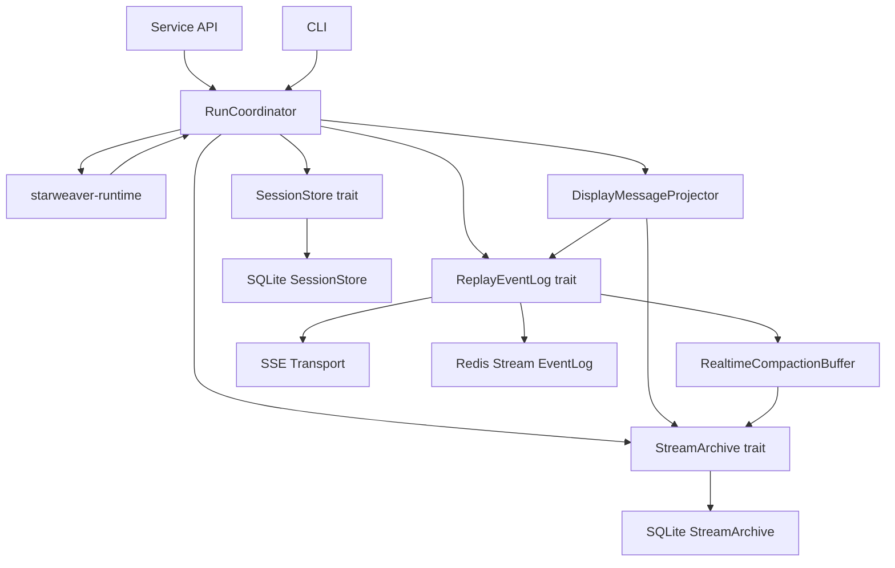
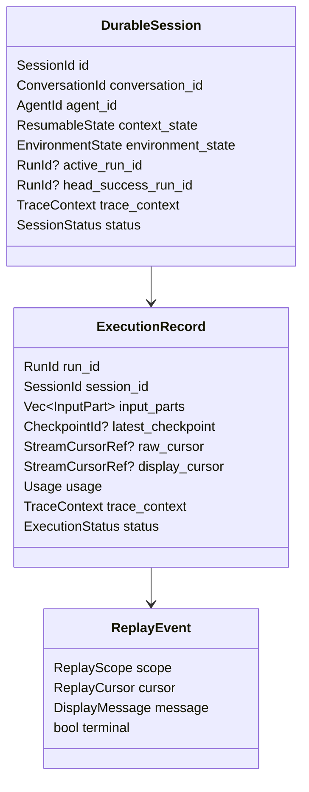

# Durable Service Runtime

The durable service runtime persists and resumes Starweaver executions. It builds on the core runtime's checkpoint, context, event, trace, and usage evidence, plus the SDK's environment provider contracts.

The runtime must compose the shared foundations in `02-shared-execution-components.md`: `SessionStore` from `starweaver-session`, and `ReplayEventLog`, `StreamArchive`, replay transport envelopes, realtime compaction, and display-message projection from `starweaver-stream`. `starweaver-claw` owns durable orchestration and concrete storage/stream/transport adapters.

## Service Responsibilities

- Manage durable sessions through the shared `SessionStore` contract.
- Persist `AgentContext` state and executor checkpoints.
- Persist raw stream records through a `StreamArchive` implementation.
- Persist display messages and compact replay snapshots through stream archive contracts.
- Publish live replay events through `ReplayEventLog`.
- Serve replay transports with replay-after-cursor and live tail.
- Persist trace correlation ids for external observability systems.
- Handle interruption, cancellation, approval, and deferred tool calls.
- Restore typed dependencies and environment providers through application configuration.
- Resume from checkpoints when supported by the runtime state.
- Provide concrete session store, stream archive, event-log, and transport adapters.

## Shared Component Position

The service API and CLI share session storage, stream replay, display projection, and coordinator contracts. Service-specific code owns HTTP/SSE transport and auth. CLI-specific code owns terminal configuration and rendering.

## SessionStore Contract

The `SessionStore` trait belongs in `starweaver-session`. `starweaver-claw` provides concrete adapters such as SQLite and PostgreSQL.

Required operations:

- create and load sessions
- list sessions by status, profile, workspace, and updated time
- append and load runs
- append runtime checkpoints or checkpoint refs
- update context state
- update environment state
- update execution status
- attach trace identifiers
- append approval and deferred tool records
- store stream cursor refs for raw and display stream positions
- load resume snapshots
- get compact run and session trace projections
- compact or archive session evidence

The store owns durable session state. The core runtime owns deterministic state transitions and checkpoint emission. The Claw coordinator maps runtime evidence into session records and stream events.

## StreamArchive Contract

The `StreamArchive` trait belongs in `starweaver-stream`. `starweaver-claw` can store archive rows in SQLite/PostgreSQL next to session tables.

Required operations:

- append raw runtime stream records
- append projected display messages
- append compact replay snapshots
- replay raw stream records after a cursor
- replay display messages after a cursor
- load compact snapshots for read views
- expose cursor ranges for compact traces
- make appends idempotent by scope and sequence

Stream archive persistence supports debugging, client reconnect, replay, and runtime continuity checks. It carries display/replay semantics while `SessionStore` carries durable session state.

## ReplayEventLog and Transport Contract

`ReplayEventLog` and `ReplayTransport` belong in `starweaver-stream`. They are the common substrate for SSE, CLI live output, web UI live tail, and future distributed transports.

Responsibilities:

- append ordered replay events with monotonic sequence ids
- replay after a cursor
- attach live tail after replay
- publish terminal markers
- keep per-session and per-run scopes
- support compact snapshots for resume and read views
- support idempotent append by scope and sequence

The initial single-node implementation can be memory-backed. A Redis Stream adapter can later provide distributed replay with the same trait.

Transport adapters convert replay events into protocol frames:

- SSE for Claw service clients
- JSONL for CLI and automation
- WebSocket or external protocol adapters in platform layers

## Durable Session Shape

## RunCoordinator

The coordinator is the per-run owner for durable execution.

Responsibilities:

- load session and run state
- resolve profile, model, tool bundles, host adapters, MCP servers, and workspace binding
- assemble SDK runtime through `AgentSpec`, `AgentApp`, and `AgentSession`
- attach environment and process providers
- attach `SessionStoreExecutor` for checkpoint persistence
- stream runtime records into `StreamArchive`
- project runtime records into display messages
- append display messages into `StreamArchive`
- append live events into `ReplayEventLog`
- update compaction snapshots through `RealtimeCompactionBuffer`
- update run status and stream cursor refs in `SessionStore`
- persist terminal session state and compact projections

The coordinator owns execution lifecycle. Session storage and stream protocols stay reusable across CLI, service, and future adapters.

## Raw Evidence, Display Projection, and Replay

The runtime stores three related evidence families:

- session state: exported `AgentContext`, environment state refs, checkpoint refs, run status, approvals, deferred calls, trace context, and usage
- stream archive: raw `AgentStreamRecord` rows, projected `DisplayMessage` rows, and compact replay snapshots
- replay log: ordered `ReplayEvent` records for reconnect, live tail, terminal markers, and distributed transport adapters

Display projection gives product surfaces a stable semantic feed while preserving raw runtime evidence for replay, debugging, and future migrations.

## Checkpoint Reload and Resume

Reload starts from `resume_snapshot(session_id, run_id)`: load the session, load the latest checkpoint, replay raw stream records from `StreamArchive` after the checkpoint stream cursor, and replay display messages after the client cursor.

The resume path should:

1. load context state and environment state from `SessionStore`
2. restore provider bindings through configured factories
3. hydrate runtime state from the latest checkpoint when the execution node is resumable
4. replay raw stream records through `StreamArchive` for runtime continuity checks
5. replay display messages through `StreamArchive` or `ReplayEventLog` for client reconnects
6. rebuild compact replay snapshots when needed
7. continue execution through the coordinator

Session stores, stream archives, and replay logs should make append idempotent by scope and sequence where the contract supports replay. Checkpoint append remains append-only so operators can inspect the boundary history.

## Event Delivery Model

### CLI

The CLI consumes display messages through the shared stream replay protocol and renders them through a selected renderer. CLI JSONL output should emit one display message per line.

### Service SSE

SSE serves replay events containing display messages. Each SSE event id is the replay cursor. Reconnect uses `Last-Event-ID`, replays after that cursor, then tails live messages.

### JSON API

Session and run GET endpoints return compact projections plus optional raw evidence, display messages, or replay snapshots based on query flags.

### Redis Stream

A Redis-backed event log should preserve the same replay contract:

- stream key derived from replay scope
- cursor mapped to Redis stream id or a stable sequence field
- replay through range reads
- live tail through blocking reads
- terminal marker as a normal replay event
- compact snapshots in side keys or durable stream archive rows

## Interruption and Approval

Suspend reasons:

- user approval required
- deferred tool call
- cancellation requested
- provider retry exhaustion needing operator action
- environment resource wait
- durable service shutdown

Every suspend record includes enough metadata for CLI, web UI, API clients, and bridge adapters to present the action and resume safely.

Approval records should include:

- approval id
- session id and run id
- requested action kind
- tool name and tool call id when available
- prompt text
- structured action payload
- requester agent id and agent name
- status and decision
- created and resolved timestamps

## Run Trace Projection

A compact run trace projection should expose:

- run id
- parent run id
- trace id and span id
- model boundaries
- tool calls and tool results
- approval/deferred records
- checkpoint ids
- replay cursor ranges
- child run or subagent references
- content preview and truncation flag
- timestamps

Full nested timing and span metadata live in the OpenTelemetry backend. Compact projections support CLI `session inspect`, service APIs, and session tools.

## Storage Adapter Direction

SQLite should be the first persistent store target. PostgreSQL should be the production storage target after schema stabilizes.

Initial session tables:

- `sessions`
- `runs`
- `checkpoints`
- `approvals`
- `environment_states`

Initial stream archive tables:

- `stream_records`
- `display_messages`
- `replay_snapshots`

JSON text columns are acceptable for the first implementation when indexes and uniqueness constraints are stable.

## Observability Integration

The service runtime may create a coordinator span when an execution request begins. That span becomes the parent for the SDK agent loop span. Model requests, tool executions, subagent runs, checkpoints, display projection, storage appends, stream archive appends, replay log appends, and SSE delivery become nested or correlated spans through the trace context carried by `AgentContext` and run records.

Langfuse is the recommended backend through OTLP export. Other collectors can receive the same OpenTelemetry spans.

## Acceptance Gates

- shared `SessionStore` contract tests
- shared `StreamArchive` contract tests
- shared `ReplayEventLog` contract tests
- checkpoint serialization tests
- session persistence tests
- raw stream archive replay tests
- display-message projection and replay tests
- compaction snapshot tests
- approval/deferred resume tests
- environment state restore tests
- SQLite migration and idempotency tests
- SSE replay and live-tail tests
- Redis Stream adapter contract tests when implemented
- compact run trace projection tests
- trace id persistence tests
- CLI session inspect tests over shared display projections
