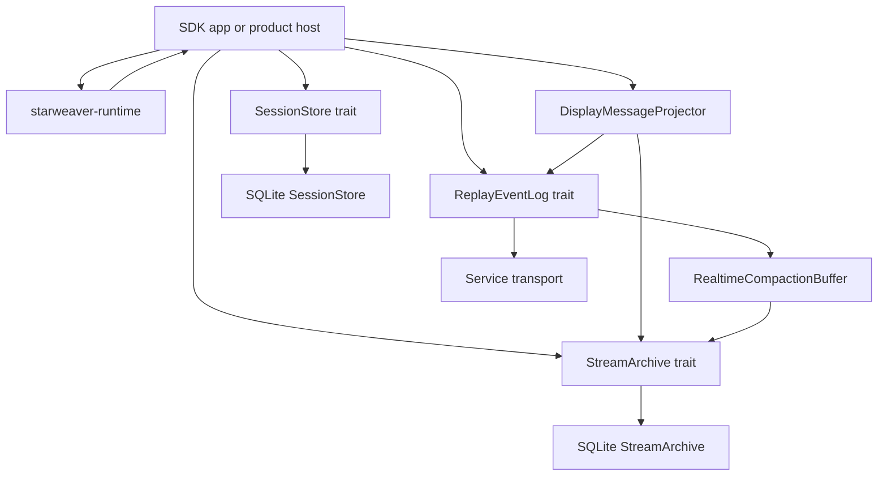
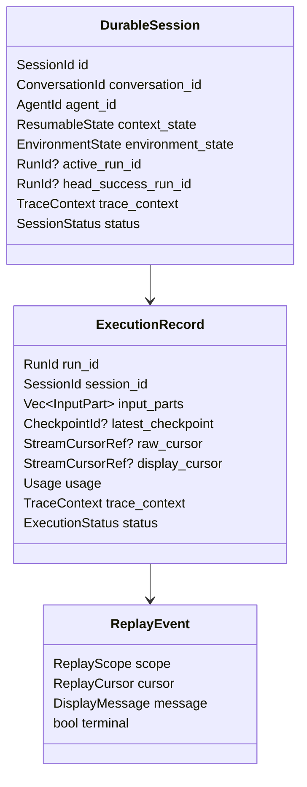

# Durable Service Runtime

The durable service runtime spec records product-neutral contracts for persisting and resuming Starweaver executions. Runtime implementation currently focuses on shared foundation crates; concrete service products can graduate later from these contracts.

## Foundation Responsibilities

- Manage durable sessions through the shared `SessionStore` contract.
- Persist `AgentContext` state and executor checkpoints.
- Persist raw stream records through a `StreamArchive` implementation.
- Persist display messages and compact replay snapshots through stream archive contracts.
- Publish live replay events through `ReplayEventLog`.
- Serve replay transports with replay-after-cursor and live tail.
- Persist trace correlation ids for external observability systems.
- Handle interruption, cancellation, approval, deferred tool calls, and idempotent control receipts.
- Enforce composite namespace/session/run identity, host-derived resource authority, and fenced active-run admission for service control.
- Restore typed dependencies and environment providers through application configuration.
- Resume from checkpoints when supported by the runtime state.
- Provide concrete session store, stream archive, event-log, and transport adapters.

## Shared Component Position



The CLI and future service adapters share session storage, stream replay, display projection, and executor checkpoint contracts. Service-specific code owns HTTP/SSE/WebSocket transport and auth. CLI-specific code owns terminal configuration and rendering.

## Current Implementation Status

Current landed durable foundations:

- `starweaver-context` checkpointable run state, versioned checkpoint records, and executor callback contracts
- `starweaver-session` records, `SessionStore` traits, and the session-store executor adapter
- `starweaver-stream` typed raw records, display messages, replay event log contracts, transports, compaction, UI adapters, and stream archive contracts
- `starweaver-storage` SQLite migrations, `SqliteSessionStore`, `SqliteReplayEventLog`, `SqliteStreamArchive`, and migration status reporting
- `starweaver-runtime` checkpoint and raw stream emission, direct executor behavior, compatibility re-exports, and collection-based `AgentStreamResult`
- `starweaver-agent` app/session helpers and SDK facade
- `starweaver-cli` local `SessionStore` and `StreamArchive` adapters over CLI persistence while product storage converges on the shared storage crate

Current foundation gaps:

- wider docs examples for SQLite-backed durable sessions
- service-host examples after platform ownership is defined
- OpenTelemetry exporter adapters and redaction policies
- distributed replay event-log adapter after local contracts stabilize

## SessionStore Contract

The `SessionStore` trait belongs in `starweaver-session`. `starweaver-storage` provides the current SQLite adapter and migration registry.

Required operations:

- create and load sessions
- list sessions by status, profile, workspace, and updated time
- append and load runs
- append runtime checkpoints or checkpoint refs
- update context state
- update environment state
- update execution status
- attach trace identifiers
- append approval and deferred tool records
- store stream cursor refs for raw and display stream positions
- load resume snapshots
- get compact run and session trace projections
- compact or archive session evidence

The store owns durable session state. `starweaver-context` owns checkpointable run state, versioned checkpoint/resume records, and the executor callback contract. The core runtime owns deterministic state transitions, checkpoint emission, direct executor behavior, raw stream emission, and collection-based `AgentStreamResult`, while preserving compatibility re-exports for the lower-owned checkpoint contracts. `starweaver-stream` owns typed raw events, records, source attribution, and sinks that runtime consumes and compatibility-re-exports. Runtime checkpoint records and stream-owned protocol records are upstream durable evidence consumed by session stores, stream archives, replay logs, and product hosts. Starweaver does not introduce a separate runtime-contract/evidence crate.

## StreamArchive Contract

The `StreamArchive` trait belongs in `starweaver-stream`. `starweaver-storage` provides the current SQLite archive adapter.

Required operations:

- append raw runtime stream records
- append projected display messages
- append compact replay snapshots
- replay raw stream records after a cursor
- replay display messages after a cursor
- load compact snapshots for read views
- expose cursor ranges for compact traces
- make appends idempotent by scope and sequence

Stream archive persistence supports debugging, client reconnect, replay, and runtime continuity checks. It carries display/replay semantics while `SessionStore` carries durable session state.

## ReplayEventLog and Transport Contract

`ReplayEventLog` and `ReplayTransport` belong in `starweaver-stream`. They are the common substrate for CLI live output, service live tail, and future distributed transports.

Responsibilities:

- append ordered replay events with monotonic sequence ids
- replay after a cursor
- attach live tail after replay
- publish terminal markers
- keep per-session and per-run scopes
- support compact snapshots for resume and read views
- support idempotent append by scope and sequence

Transport adapters convert replay events into protocol frames:

- JSONL for CLI and automation
- SSE or WebSocket for service clients
- external protocol adapters in platform layers

## Durable Session Shape



## Host Coordinator Shape

A product host coordinator owns per-run durable execution:

- load session and run state
- resolve profile, model, tool bundles, host adapters, MCP servers, and workspace binding
- assemble SDK runtime through `AgentSpec`, `AgentApp`, and `AgentSession`
- attach environment and process providers
- attach `SessionStoreExecutor` for checkpoint persistence
- stream runtime records into `StreamArchive`
- project runtime records into display messages
- append display messages into `StreamArchive`
- append live events into `ReplayEventLog`
- update compaction snapshots through `RealtimeCompactionBuffer`
- update run status and stream cursor refs in `SessionStore`
- persist terminal session state and compact projections
- expose narrow query/control application operations to host adapters without giving model tools direct store or coordinator access
- own run task/finalizer handles and remove terminal controls from the active registry after durable finalization

## Durable Run Admission and Control

Service-hosted run creation uses a durable admission/control record rather than treating a `running` row or process-local handle as sufficient ownership.

Required evidence includes:

- namespace, session id, and run id;
- owner/principal and initiating run/tool-call provenance;
- host instance id, lease expiry/heartbeat, and fencing generation;
- idempotency key, normalized command digest, and durable receipt;
- active control status plus queued steer/interruption event ids;
- terminal outcome, cleanup status, and reconciliation reason.

The initial session model permits at most one non-terminal admitted run per session. Admission, active pointer update, and durable run creation are one atomic domain operation. A coordinator applies controls only when its host lease and fencing generation still match; an older worker or delayed retry cannot steer, interrupt, or finalize a newer owner.

A durable control inbox/outbox or equivalent transactional record accepts steering/interruption before applying it through the current `AgentControlHandle`. Receipts distinguish accepted, delivered/observed when available, terminal, stale owner, and failed. Process-local handles remain execution adapters, not durable truth.

Startup reconciliation scans non-terminal runs, validates host leases, and either restores a supported checkpoint under a new fenced owner or writes an explicit interrupted/failed terminal state. It never leaves an orphan `running` row indefinitely and never silently reruns side-effecting work from the original prompt.

These service guarantees are prerequisites for grant-gated agent session control in `08-agent-session-management.md` and durable RPC async-subagent continuations in `../sdk/06-async-subagent-execution.md`.

## Raw Evidence, Display Projection, and Replay

The runtime stores three related evidence families:

- session state: exported `AgentContext`, environment state refs, checkpoint refs, run status, approvals, deferred calls, trace context, and usage
- stream archive: raw `AgentStreamRecord` rows, projected `DisplayMessage` rows, and compact replay snapshots
- replay log: ordered `ReplayEvent` records for reconnect, live tail, terminal markers, and distributed transport adapters

Display projection gives product surfaces a stable semantic feed while preserving raw runtime evidence for replay, debugging, and future migrations.

## Checkpoint Reload and Resume

Reload starts from `resume_snapshot(session_id, run_id)`: load the session, load the latest checkpoint, replay raw stream records from `StreamArchive` after the checkpoint stream cursor, and replay display messages after the client cursor.

The resume path should:

1. load context state and environment state from `SessionStore`
2. restore provider bindings through configured factories
3. hydrate runtime state from the latest checkpoint when the execution node is resumable
4. replay raw stream records through `StreamArchive` for runtime continuity checks
5. replay display messages through `StreamArchive` or `ReplayEventLog` for client reconnects
6. rebuild compact replay snapshots when needed
7. continue execution through the host coordinator

Session stores, stream archives, and replay logs should make append idempotent by scope and sequence where the contract supports replay. Checkpoint append remains append-only so operators can inspect boundary history.

## Acceptance Gates

```bash
cargo test -p starweaver-session --locked
cargo test -p starweaver-stream --locked
cargo test -p starweaver-storage --locked
cargo test -p starweaver-runtime --locked
cargo test -p starweaver-agent --locked
```
